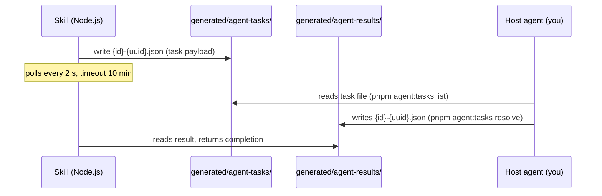

# AGENTS.md — readwise-reports

Reference for AI agents (Claude Code, Codex, Gemini CLI, etc.) working in this repository.
Covers the agent-mode AI protocol, Skill contract, and operational conventions.

---

## Project in one paragraph

`readwise-reports` is a pluggable daily-report pipeline. A **Skill** is a directory under
`skills/{id}/` that fetches data from one source, deduplicates against SQLite, calls an AI
model, and writes a Markdown file. The **Kernel** (`scripts/src/kernel/`) handles discovery,
context construction, dedup, and file I/O. Skills have no cross-dependencies.

---

## Agent-mode AI protocol

In **agent mode**, a Skill does not call any AI provider itself. Instead it hands every
completion to YOU — the agent running this repo (Claude Code, Codex, Gemini CLI, Hermes, …) —
through a **file-based handoff**. You answer the prompt with your own model. **No API key is
involved.** This is how a skill "uses the AI of the agent that is running it".



### When agent mode is active

`skill.json → ai.mode` decides routing:

| `ai.mode` | Effect |
|---|---|
| `api` | Skill calls a provider directly with an API key. |
| `agent` | File handoff to you (this protocol). |
| `auto` (default) | `agent` if a host-agent marker is set, else `api`. Markers: `AGENT_AI=1`, `CLAUDECODE=1`, `AI_AGENT`, `CLAUDE_AGENT_ID`. |

A valid **`AI_MODE`** env var (`api` / `agent` / `auto`) overrides every skill's `ai.mode`.
Use it for automated runs: `pnpm publish:daily` defaults `AI_MODE=api` so a cron job launched
from inside a host agent never resolves to `agent` and blocks polling for a watcher.

If your harness is not auto-detected (e.g. Hermes), export `AGENT_AI=1` so `auto` skills route
to you. Both bundled skills (`hn`, `readwise`) use `auto`, so simply running them inside your
session routes their AI calls to you.

### How to act as the watcher (do this when running agent-mode skills)

`pnpm generate` writes task files and **blocks**, polling for your answers. So run it in the
background, then drain tasks:

```bash
pnpm generate --skill <id> &          # writes tasks, polls (run in background)
pnpm agent:tasks list                 # see pending tasks (--json for machine-readable)
pnpm agent:tasks resolve <taskId> --text "<your answer>"   # or --file <path> / --error "<why>"
# repeat until no tasks remain and the generate process exits
```

`pnpm agent:tasks` with no arguments prints this same workflow. You may also read/write the
JSON files directly (schemas below) — the helper just does it atomically for you.

> **Prefer one watcher.** `pnpm watcher` is the *other* fulfiller: a separate process that
> answers tasks by calling an external provider with its **own** API key — the host agent's
> model is not used. `pnpm watcher` claims each task by atomic rename before processing, so it
> won't double-process a task even if two are running; but pick one fulfiller (the host-agent
> loop above **or** `pnpm watcher`) so you don't burn external API calls on tasks meant for you.

### Task file schema

```jsonc
{
  "version": 1,
  "taskId": "<uuid>",
  "skill": "<skill-id>",
  "createdAt": "<ISO>",
  "prompt": "...",
  "system": "...",          // optional
  "opts": {
    "maxTokens": 4096,      // optional
    "temperature": 0.3      // optional
  },
  "resultFile": "generated/agent-results/{skill}-{uuid}.json"
}
```

### Result file schema

```jsonc
// Success:
{ "completion": "..." }

// Error:
{ "error": "description" }
```

Write the result **atomically** (write to a `.tmp` file then rename) — `pnpm agent:tasks
resolve` already does this. Stale files older than 24 hours are swept on the next run.

---

## Skill contract

### Interface

```typescript
// Entry point — skills/{id}/index.ts
export default async function run(ctx: SkillContext): Promise<SkillResult>
```

### `SkillContext` — what the kernel provides

```typescript
interface SkillContext {
  config: SkillManifest;     // parsed skill.json
  ai: AIClient;              // ctx.ai.complete(prompt, opts?)
  log: Logger;               // info / warn / error / debug
  dryRun: boolean;           // true → no disk writes (no report, no raw, no dedup update)
  date: string;              // "YYYY-MM-DD"
  timezone: string;
  paths: SkillPaths;         // outputDir, rawDir, generatedDir
  writer: SkillWriter;       // writeReport(md), writeRaw(json)
  store: SkillStore;         // filterUnprocessed, markProcessed
  publicSiteUrl?: string;    // for building notification URLs
}
```

### `SkillResult` — what the skill must return

```typescript
interface SkillResult {
  itemsProcessed: number;
  itemsSkipped: number;
  outputPath?: string;
  notifications?: NotificationPayload[];
}

interface NotificationPayload {
  channel: string;           // currently only "discord" is dispatched
  title: string;
  body: string;
  url?: string;
}
```

### Rules

- Return `{ itemsProcessed: 0, itemsSkipped: 0 }` when there is nothing to do. Never throw.
- Never import from `../../scripts/`. Only `../_sdk/index.js`.
- Never write files outside `ctx.paths.outputDir` and `ctx.paths.rawDir`.
- Call `store.filterUnprocessed(items)` before AI processing, `store.markProcessed(fresh)` after.
- Catch AI errors and fall back gracefully — one bad completion should not abort the whole skill.

---

## Kernel services

### AI client (`services/ai.ts`)

```typescript
// Mode auto-selected from manifest.ai.mode + host-agent detection (see protocol above)
const client = buildAiClient(manifest);
const text = await client.complete(prompt, { temperature: 0.3, maxTokens: 2048 });
```

Supported providers: `openai`, `gemini`, `deepseek`, `anthropic`. The preferred provider
(`skill.json → ai.provider`) is tried first, then **every other provider that has an API key**,
in the order `openai → gemini → deepseek → anthropic`. The configured `model` applies only to
the preferred provider; fallbacks use their own defaults. If no provider has a key the call
throws and lists all four key names.

### Store (`services/store.ts` → `processed-store.ts`)

SQLite-backed dedup. Key is `DedupItem.id`. The `filterUnprocessed` call is always safe to
make even with an empty list.

### Writer (`services/writer.ts`)

- `writeReport(markdown)` → `docs/{skill-id}/{date}.md`
- `writeRaw(json)` → `generated/raw/{skill-id}/{date}.json`

Both create parent directories automatically. In `dryRun` mode both skip the write and just
return the path they would have written.

---

## Registry conventions

The Registry (`scripts/src/kernel/registry.ts`) scans `skills/` at startup:

- Skips folders that start with `.` or `_` (e.g. `_sdk`)
- Requires `skill.json` with `id` matching the folder name exactly
- Validates the manifest against the Zod schema in `types.ts`
- Sorts skills alphabetically by id

Skills disabled via `"enabled": false` in `skill.json` are loaded but not run by default.

---

## Environment variables reference

| Variable | Used by | Notes |
|---|---|---|
| `AI_MODE` | `services/ai.ts` | `api` / `agent` / `auto` — overrides every skill's `ai.mode` |
| `AGENT_AI` / `CLAUDECODE` / `AI_AGENT` / `CLAUDE_AGENT_ID` | `services/ai.ts` | Any one present → `auto` mode routes to the host agent |
| `OPENAI_API_KEY` | `services/ai.ts` | Required for OpenAI provider |
| `GEMINI_API_KEY` | `services/ai.ts` | Required for Gemini provider |
| `DEEPSEEK_API_KEY` | `services/ai.ts` | Required for DeepSeek provider |
| `ANTHROPIC_API_KEY` | `services/ai.ts` | Required for Anthropic provider |
| `OPENAI_MODEL` | `services/ai.ts` | Override default `gpt-4o-mini` |
| `GEMINI_MODEL` | `services/ai.ts` | Override default `gemini-1.5-flash` |
| `DEEPSEEK_MODEL` | `services/ai.ts` | Override default `deepseek-chat` |
| `ANTHROPIC_MODEL` | `services/ai.ts` | Override default `claude-sonnet-4-6` |
| `READWISE_TOKEN` | `skills/readwise/` | Optional — without it the skill falls back to the `readwise` CLI |
| `READWISE_USE_CLI` | `skills/readwise/` | Set `false` to disable the CLI fallback |
| `DISCORD_WEBHOOK_URL` | `notify-discord.ts` | Discord incoming webhook |
| `PUBLIC_SITE_URL` | `kernel/env.ts` | Base URL for notification links |
| `REPORT_TIMEZONE` | `kernel/env.ts` | Default `Asia/Tokyo` |
| `READWISE_PROCESSED_DB` | `kernel/env.ts` | SQLite path, default `generated/readwise-processed.sqlite` |

---

## Adding a Skill — agent checklist

When asked to add a new Skill, follow this order:

1. **Read an existing skill** (`skills/readwise/` or `skills/hn/`) to understand the pattern.
2. **Create `skill.json`** — ensure `id` matches the folder name exactly.
3. **Create `index.ts`** — export a `default` async function matching `(ctx: SkillContext) => Promise<SkillResult>`.
4. **Add required env vars** to `skill.json → env.required`.
5. **Verify**: `pnpm generate --skill {id} --dry-run`
6. **Typecheck**: `pnpm typecheck`
7. **List check**: `pnpm generate --list` → should show `[ready]`

Do **not** edit `_sdk/index.ts`, `kernel/types.ts`, or `kernel/registry.ts` unless the change
is specifically about the kernel — those files affect every skill.

---

## Notification dispatch

Notifications flow like this:

```
SkillResult.notifications[]
    → publish-daily.ts collects them all
    → dispatches each by channel field
    → "discord" → pnpm notify <title> <body> <url>
    → other channels → warn + skip (not yet implemented)
```

To add a new notification channel, update the dispatch block in `publish-daily.ts` and add the
channel name to the relevant `skill.json` files.

---

## File paths quick reference

| Path | Contents |
|---|---|
| `skills/{id}/skill.json` | Skill manifest |
| `skills/{id}/index.ts` | Skill entry point |
| `skills/_sdk/index.ts` | Re-exports from kernel (read-only) |
| `scripts/src/kernel/types.ts` | All shared TypeScript types |
| `scripts/src/kernel/runtime.ts` | Context construction + skill invocation |
| `docs/{id}/{date}.md` | Published Markdown reports |
| `generated/raw/{id}/{date}.json` | Raw data snapshots |
| `generated/readwise-processed.sqlite` | Dedup SQLite database |
| `generated/agent-tasks/` | Agent-mode task queue |
| `generated/agent-results/` | Agent-mode result drop zone |
