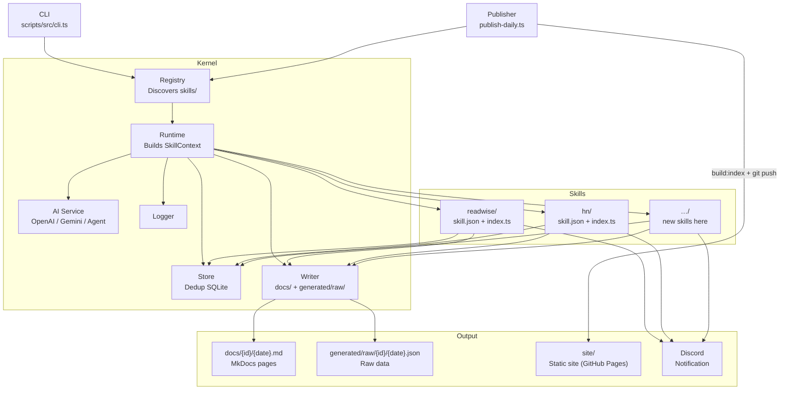
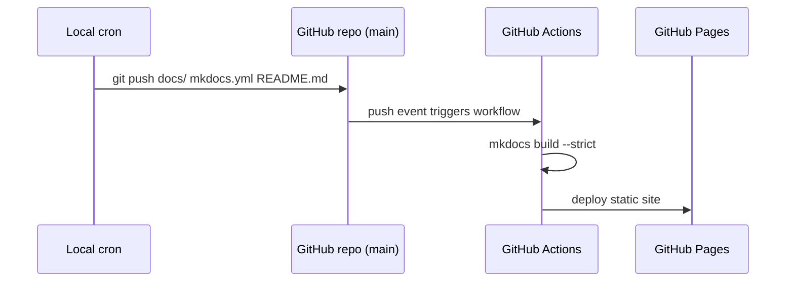

# readwise-reports

A local-first, AI-powered daily report system built on a pluggable **Skill** architecture.
Each data source (Readwise, HackerNews, …) is an isolated Skill that fetches, processes, and
publishes its own report. The Kernel wires everything together.

---

## Architecture



### Key design decisions

| Decision | Rationale |
|---|---|
| Skills are self-contained directories | Add/remove a data source by adding/deleting one folder |
| Kernel provides `SkillContext` | Skills never import from `scripts/` directly; only from `_sdk/` |
| Dedup is per-item, not per-date | Prevents re-processing if a source surfaces the same item across days |
| AI mode is auto-detected | Runs via direct API in cron jobs, via agent protocol inside Claude Code sessions |
| Local cron pushes to git; CI only deploys | Avoids storing Readwise OAuth tokens in GitHub Secrets |

---

## Quick Start

```bash
cp .env.example .env        # fill in your tokens
pnpm install
pip install -r requirements.txt
pnpm generate               # run all enabled skills for today
pnpm docs:serve             # preview at http://127.0.0.1:8000
```

---

## Configuration

Edit `.env`:

```env
# Readwise — optional. With a token the skill uses the Readwise API; without it,
# it falls back to the local `readwise` CLI (disable with READWISE_USE_CLI=false).
READWISE_TOKEN=...

# Notifications
DISCORD_WEBHOOK_URL=...

# Published site URL (used in notification links)
PUBLIC_SITE_URL=https://<user>.github.io/readwise-reports

# AI providers — at least one required when any skill resolves to API mode.
# Preferred provider is set per-skill in skill.json; it falls back to any other
# provider that has a key.
OPENAI_API_KEY=...
GEMINI_API_KEY=...
DEEPSEEK_API_KEY=...
ANTHROPIC_API_KEY=...

# Optional overrides
REPORT_TIMEZONE=Asia/Tokyo
READWISE_PROCESSED_DB=generated/readwise-processed.sqlite
# Force AI mode for every skill (api | agent | auto). publish:daily defaults to api.
AI_MODE=api
```

---

## Commands

| Command | What it does |
|---|---|
| `pnpm generate` | Run all enabled skills for today |
| `pnpm generate --skill readwise` | Run one specific skill |
| `pnpm generate --dry-run` | Run end-to-end but write nothing to disk (no report, no raw snapshot, no dedup update) |
| `pnpm generate --list` | List discovered skills and their status |
| `pnpm generate --concurrency 2` | Run up to 2 skills in parallel |
| `pnpm publish:daily` | Full pipeline: generate → build index → git push → notify |
| `pnpm build:index` | Rebuild MkDocs nav index only |
| `pnpm backfill:processed` | Rebuild dedup SQLite from existing raw JSON files |
| `pnpm typecheck` | TypeScript type check |
| `pnpm test` | Run Vitest test suite |
| `pnpm docs:serve` | Local MkDocs preview |
| `pnpm docs:build` | Production MkDocs build |

---

## Skill System

Each Skill lives in `skills/{id}/` and must follow this structure:

```
skills/{id}/
├── skill.json       # Manifest — id must match folder name
├── index.ts         # Entry: export default async function run(ctx: SkillContext): Promise<SkillResult>
├── lib/             # Private helpers (optional)
└── prompts/         # AI prompt templates (optional)
```

### `skill.json` reference

```jsonc
{
  "id": "my-source",            // kebab-case, must match folder name
  "title": "My Source",
  "description": "...",
  "enabled": true,

  "ai": {
    "mode": "auto",             // "api" | "agent" | "auto" (overridable by AI_MODE env)
    "provider": "openai",       // preferred; falls back to any other provider with a key
    "model": "gpt-4o-mini",     // optional; applies only to the preferred provider
    "outputLanguage": "en-US"
  },

  "schedule": {
    "cron": "0 22 * * *",
    "timezone": "Asia/Tokyo",
    "lookbackHours": 24
  },

  "output": {
    "navSection": "Tech",       // MkDocs nav section
    "icon": "📰"
  },

  "env": {
    "required": ["MY_API_KEY"]  // CLI will refuse to start if missing
  },

  "dedup": {
    "enabled": true,
    "keyField": "id"
  },

  "digest": {
    "maxItems": 15,
    "tone": "concise"
  },

  "notification": {
    "channels": ["discord"]
  }
}
```

### Adding a new Skill

1. Create `skills/{id}/` with `skill.json` and `index.ts`.
2. Import types only from `../_sdk/index.js`.
3. Return a `SkillResult` with `itemsProcessed`, `itemsSkipped`, and optionally `outputPath` and `notifications`.
4. Run `pnpm generate --skill {id} --dry-run` to verify.
5. Run `pnpm generate --list` to confirm it appears as `ready`.

### Removing a Skill

Delete the `skills/{id}/` directory. Nothing else to change.

---

## Dedup System

Processed items are stored in a local SQLite database (`generated/readwise-processed.sqlite`).
On each run the Skill calls `store.filterUnprocessed(items)` before processing, and
`store.markProcessed(fresh)` after. In `--dry-run` mode nothing is written to disk —
the store is read but not updated, and no report or raw snapshot is written.

The dedup key is the `DedupItem.id` field (configurable via `skill.json → dedup.keyField`).

To rebuild from existing raw files:

```bash
pnpm backfill:processed
```

---

## Output Structure

```
readwise-reports/
├── docs/
│   ├── index.md
│   ├── readwise/
│   │   └── 2026-05-28.md
│   └── hn/
│       └── 2026-05-28.md
├── generated/
│   ├── raw/
│   │   ├── readwise/
│   │   │   └── 2026-05-28.json
│   │   └── hn/
│   │       └── 2026-05-28.json
│   └── readwise-processed.sqlite
├── scripts/         # Kernel + CLI
├── skills/          # Data source plugins
└── site/            # Built MkDocs site (git-ignored)
```

---

## CI / CD

**Local cron** runs `pnpm publish:daily` → generates reports → pushes `docs/` (the published
source of truth) to `main`. Everything under `generated/` is a local build artifact and is not committed.

**GitHub Actions** watches `main` and deploys the MkDocs static site to GitHub Pages.
It never needs AI API keys or Readwise tokens.



---

## Design Principles

- **Discord is an inbox, not a knowledge base.** Notifications are short summaries with a link.
- **Markdown is the long-term asset.** Reports are plain files — grep-able, diff-able, migratable.
- **SQLite holds automation state only.** Report content stays in files.
- **Skills are portable.** Each one is a self-contained plugin with no cross-skill dependencies.
- **Keep it small and stable.** Automation should not become a second job.
