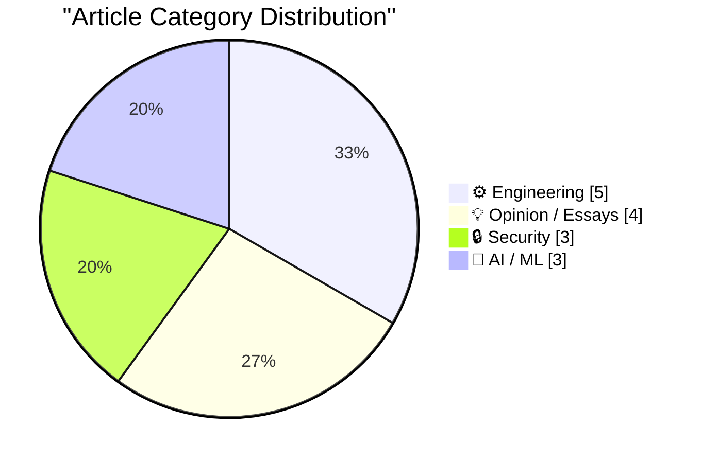
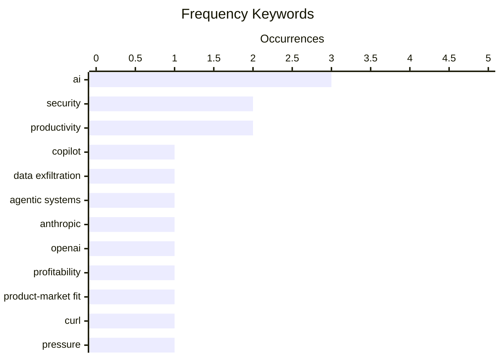

# 📰 AI Blog Daily Digest — 2026-05-28

> From 92 top tech blogs (curated by Karpathy), AI-selected Top 15

## 📝 Today's Highlights

Today’s tech landscape is dominated by a deepening tension around AI’s real-world value and security. On one hand, major players like Anthropic and OpenAI appear to have achieved product-market fit, while a mysterious model called Hy3 is surging in rankings—signaling intense competition and hype. On the other hand, critical vulnerabilities in Microsoft’s Copilot Cowork and a flood of security reports for the curl project underscore growing risks, while public skepticism from executives like Uber’s COO and analysts like Cory Doctorow warns that the AI bubble may be fundamentally fragile.

---

## 🏆 Must Read

🥇 **Microsoft Copilot Cowork Exfiltrates Files**

simonwillison.net · 1 days ago · 🔒 Security

> Microsoft Copilot Cowork, an agentic AI product, has a vulnerability that allows attackers to exfiltrate files. The core problem is that designing agentic systems to prevent data exfiltration remains a major challenge. PromptArmor's research demonstrates how the system can be manipulated to leak sensitive data. This highlights a fundamental security flaw in current agentic AI architectures. The author concludes that preventing data exfiltration in agentic systems is the biggest unsolved challenge.

💡 **Why it matters**: Essential reading for anyone deploying or building agentic AI systems, as it exposes a critical security vulnerability that could lead to data breaches.

🏷️ Copilot, data exfiltration, agentic systems, security

🥈 **I think Anthropic and OpenAI have found product-market fit**

simonwillison.net · 9h ago · 🤖 AI / ML

> Anthropic is reportedly about to have its first profitable quarter, and stories are emerging of companies shocked by skyrocketing LLM bills from employee usage. This suggests that both Anthropic and OpenAI have found product-market fit, with enterprises willingly paying high costs for AI tools. The high usage and willingness to pay indicate that the value derived from these tools is exceeding their significant costs. The author argues that this profitability and high spending are signs of genuine product-market fit, not just hype.

💡 **Why it matters**: Provides a data-driven perspective on the AI industry's economic reality, showing that high costs are being accepted because the value is real, which is a key signal for investors and strategists.

🏷️ Anthropic, OpenAI, profitability, product-market fit

🥉 **The pressure**

simonwillison.net · 1 days ago · 🔒 Security

> The curl project is facing an unprecedented surge in security reports, with the rate 4-5 times higher than 2024 and double that of 2025, averaging over one report per day. This deluge is driven by credible AI-assisted security issues being reported. The volume is putting immense pressure on the small curl team. Daniel Stenberg highlights the unsustainable burden this creates for open-source maintainers.

💡 **Why it matters**: A stark, real-world example of how AI is changing the security landscape for critical open-source infrastructure, making it a must-read for maintainers and security professionals.

🏷️ curl, security, AI, pressure

---

## 📊 Data Overview

| Scanned | Articles | Range | Selected |
|:---:|:---:|:---:|:---:|
| 88/92 | 2563 → 34 | 48h | **15** |

### Category Distribution



### High-Frequency Keywords



<details>
<summary>📈 ASCII Keyword Chart (Terminal Friendly)</summary>

```
ai                 │ ████████████████████ 3
security           │ █████████████░░░░░░░ 2
productivity       │ █████████████░░░░░░░ 2
copilot            │ ███████░░░░░░░░░░░░░ 1
data exfiltration  │ ███████░░░░░░░░░░░░░ 1
agentic systems    │ ███████░░░░░░░░░░░░░ 1
anthropic          │ ███████░░░░░░░░░░░░░ 1
openai             │ ███████░░░░░░░░░░░░░ 1
profitability      │ ███████░░░░░░░░░░░░░ 1
product-market fit │ ███████░░░░░░░░░░░░░ 1
```

</details>

### 🏷️ Topic Tags

**ai**(3) · **security**(2) · **productivity**(2) · copilot(1) · data exfiltration(1) · agentic systems(1) · anthropic(1) · openai(1) · profitability(1) · product-market fit(1) · curl(1) · pressure(1) · ai bubble(1) · internet bubble(1) · economics(1) · tech critique(1) · llm(1) · hy3(1) · openrouter(1) · model ranking(1)

---

## ⚙️ Engineering

### 1. sqlite AGENTS.md

[Link](https://simonwillison.net/2026/May/27/sqlite-agents/#atom-everything) — **simonwillison.net** · 2h ago · ⭐ 24/30

> SQLite has added an AGENTS.md file to its repository, but it is not for internal development. Instead, it is a guide for AI agents that might be pointed at the SQLite codebase. The file explicitly states that SQLite does not accept pull requests without prior agreement and accompanying legal paperwork. This is a proactive measure to manage the expected influx of AI-generated contributions. The author notes this as a practical response to the growing trend of AI agents interacting with open-source projects.

🏷️ SQLite, AGENTS.md, AI, development

---

### 2. CHAOSS Metrics in 2026

[Link](https://nesbitt.io/2026/05/27/chaoss-metrics-in-2026.html) — **nesbitt.io** · 16h ago · ⭐ 23/30

> The article argues that CHAOSS metrics, which are used to measure open-source community health, were calibrated for human-speed contribution. The rise of AI-generated contributions (e.g., automated PRs, bot activity) is breaking these metrics, making them unreliable. This creates a problem for accurately assessing project health and contributor value in an AI-augmented world. The author concludes that the open-source community needs to rethink its metrics to account for AI-driven activity.

🏷️ CHAOSS, metrics, open source, automation

---

### 3. SQLAlchemy 2 In Practice - Solutions to the Exercises

[Link](https://blog.miguelgrinberg.com/post/sqlalchemy-2-in-practice---solutions-to-the-exercises) — **miguelgrinberg.com** · 7h ago · ⭐ 22/30

> This article provides the solutions to all exercises from the 'SQLAlchemy 2 in Practice' book by Miguel Grinberg. It serves as a companion resource for learners who have worked through the book's exercises and want to verify their answers. The solutions cover practical SQLAlchemy 2 usage patterns. The author encourages support by purchasing the full book.

🏷️ SQLAlchemy, Python, database, ORM

---

### 4. Notes on Fourier series

[Link](https://eli.thegreenplace.net/2026/notes-on-fourier-series/) — **eli.thegreenplace.net** · 4m ago · ⭐ 20/30

> This technical post provides a comprehensive mathematical derivation of Fourier series coefficients, starting from the assumption of a periodic function and building up to the integral formulas for a0, an, and bn. It connects the trigonometric series to linear algebra by framing sinusoids as orthogonal basis vectors in a Hilbert space, using inner products to project the function onto each basis. The notes include worked examples for square waves and sawtooth waves, demonstrating how the series converges and where Gibbs phenomenon occurs. The author concludes by showing how this framework extends naturally to the Fourier transform for non-periodic signals.

🏷️ Fourier series, mathematics, signal processing

---

### 5. I patched iozone for better disk benchmarks on modern macOS

[Link](https://www.jeffgeerling.com/blog/2026/i-patched-iozone-for-better-disk-benchmarks-on-modern-macos/) — **jeffgeerling.com** · 1 days ago · ⭐ 19/30

> The author patched the legacy `iozone` disk benchmarking tool to fix compilation errors and improve performance on modern macOS (Sequoia 15.x with Apple Silicon). The patch addresses issues with 64-bit file offsets, deprecated POSIX APIs, and the lack of `libnuma` support on macOS, which caused crashes or inaccurate results on APFS volumes. Benchmark results show the patched version now correctly measures sequential read/write speeds (up to 3.5 GB/s on a Mac Studio M2 Ultra) and random I/O operations per second. The fix has been submitted upstream to the iozone project, ensuring cross-platform consistency for disk performance testing.

🏷️ iozone, disk benchmark, macOS, performance

---

## 💡 Opinion / Essays

### 6. Pluralistic: The AI bubble isn't like the internet bubble (26 May 2026)

[Link](https://pluralistic.net/2026/05/26/the-ai-will-continue/) — **pluralistic.net** · 1 days ago · ⭐ 25/30

> Cory Doctorow argues that the current AI bubble is fundamentally different from the internet bubble. The key distinction is that during the internet bubble, workers eagerly adopted and integrated web technologies into their workflows. In contrast, the AI bubble requires force-feeding AI tools to workers, who are often resistant or find them unhelpful. This lack of organic adoption suggests the current AI boom is built on shaky ground. Doctorow concludes that without genuine worker-driven adoption, the AI bubble is more fragile than the internet bubble was.

🏷️ AI bubble, internet bubble, economics, tech critique

---

### 7. Using My Fucking Brain

[Link](https://terriblesoftware.org/2026/05/27/using-my-fucking-brain/) — **terriblesoftware.org** · 13h ago · ⭐ 23/30

> The article argues that AI is beneficial when it extends human cognitive abilities but becomes dangerous when it quietly replaces the thinking part of the brain. The core problem is the subtle shift from using AI as a tool to relying on it as a crutch, leading to atrophy of critical thinking skills. The author warns against the insidious nature of this replacement, which can happen without the user's awareness. The conclusion is that the danger of AI lies not in overt takeover but in the quiet erosion of human thought.

🏷️ AI, critical thinking, productivity

---

### 8. The Great Depopulation

[Link](https://www.theatlantic.com/ideas/2026/05/global-birthrate-decline/687297/?utm_source=feed) — **derekthompson.org** · 1 days ago · ⭐ 21/30

> Global birth rates are declining universally, with no country currently maintaining a replacement-level fertility rate of 2.1 children per woman. The article argues this is not driven by economic factors or policy failures, but by a fundamental shift in human aspirations and the rising cost of raising children in modern, urbanized societies. Key data points include South Korea's fertility rate dropping to 0.72 and Italy's falling below 1.2, with projections showing global population peaking and then declining by mid-century. The author concludes that this depopulation trend is irreversible and will fundamentally reshape economies, social security systems, and geopolitical power structures.

🏷️ birth rate, demographics, depopulation, global trend

---

### 9. Revenge of The Business Idiot

[Link](https://www.wheresyoured.at/the-revenge-of-the-business-idiot/) — **wheresyoured.at** · 1 days ago · ⭐ 20/30

> The article argues that the tech industry's current obsession with AI and 'vibes-based' leadership represents a return to the worst excesses of the dot-com era, where business acumen is replaced by hype and storytelling. It critiques how companies like OpenAI and Anthropic are valued on narrative potential rather than sustainable revenue, drawing parallels to WeWork's collapse. The author traces this pattern through recent layoffs, failed product launches, and the concentration of power among charismatic but operationally incompetent founders. The core conclusion is that this 'business idiot' cycle will end in a major correction, similar to the 2000 crash, wiping out trillions in market value.

🏷️ business, tech industry, analysis

---

## 🔒 Security

### 10. Microsoft Copilot Cowork Exfiltrates Files

[Link](https://simonwillison.net/2026/May/26/copilot-cowork-exfiltrates-files/#atom-everything) — **simonwillison.net** · 1 days ago · ⭐ 26/30

> Microsoft Copilot Cowork, an agentic AI product, has a vulnerability that allows attackers to exfiltrate files. The core problem is that designing agentic systems to prevent data exfiltration remains a major challenge. PromptArmor's research demonstrates how the system can be manipulated to leak sensitive data. This highlights a fundamental security flaw in current agentic AI architectures. The author concludes that preventing data exfiltration in agentic systems is the biggest unsolved challenge.

🏷️ Copilot, data exfiltration, agentic systems, security

---

### 11. The pressure

[Link](https://simonwillison.net/2026/May/26/the-pressure/#atom-everything) — **simonwillison.net** · 1 days ago · ⭐ 25/30

> The curl project is facing an unprecedented surge in security reports, with the rate 4-5 times higher than 2024 and double that of 2025, averaging over one report per day. This deluge is driven by credible AI-assisted security issues being reported. The volume is putting immense pressure on the small curl team. Daniel Stenberg highlights the unsustainable burden this creates for open-source maintainers.

🏷️ curl, security, AI, pressure

---

### 12. Het Solvinity besluit in detail, en de mogelijke gevolgen

[Link](https://berthub.eu/articles/posts/het-solvinity-besluit-gevolgen/) — **berthub.eu** · 18h ago · ⭐ 20/30

> The Dutch State Secretary for Economic Affairs and Climate has blocked the acquisition of Dutch cloud provider Solvinity by U.S.-based Kyndryl, citing national security risks related to data sovereignty and critical infrastructure. The decision follows a petition signed by 200,000 people and legal interventions by the new 'The Firewall' foundation, which argued the deal would give a foreign entity control over Dutch government and healthcare data. The article details the legal basis under the EU's Foreign Direct Investment Screening Regulation and the Dutch Security Screening Act. The author concludes this sets a precedent for stricter scrutiny of foreign tech acquisitions in Europe, potentially impacting future deals involving AWS, Google Cloud, or Microsoft Azure.

🏷️ Solvinity, Kyndryl, acquisition, Netherlands

---

## 🤖 AI / ML

### 13. I think Anthropic and OpenAI have found product-market fit

[Link](https://simonwillison.net/2026/May/27/product-market-fit/#atom-everything) — **simonwillison.net** · 9h ago · ⭐ 25/30

> Anthropic is reportedly about to have its first profitable quarter, and stories are emerging of companies shocked by skyrocketing LLM bills from employee usage. This suggests that both Anthropic and OpenAI have found product-market fit, with enterprises willingly paying high costs for AI tools. The high usage and willingness to pay indicate that the value derived from these tools is exceeding their significant costs. The author argues that this profitability and high spending are signs of genuine product-market fit, not just hype.

🏷️ Anthropic, OpenAI, profitability, product-market fit

---

### 14. The mysterious Hy3 LLM is topping OpenRouter Model Rankings by a large margin

[Link](https://minimaxir.com/2026/05/openrouter-hy3/) — **minimaxir.com** · 1 days ago · ⭐ 25/30

> A mysterious model called 'Hy3' has appeared on OpenRouter and is topping the model rankings by a large margin, outperforming established models like GPT-4 and Claude. The article investigates the origins and nature of Hy3, which appears to be a highly optimized or specialized model. Its sudden dominance raises questions about benchmarking integrity and the possibility of gaming the system. The author concludes that the Hy3 phenomenon is suspicious and warrants scrutiny.

🏷️ LLM, Hy3, OpenRouter, model ranking

---

### 15. If enough other companies report the same, the bubble pops. 🫧

[Link](https://garymarcus.substack.com/p/if-enough-other-companies-report) — **garymarcus.substack.com** · 1 days ago · ⭐ 24/30

> Uber's COO has publicly stated that the company is not seeing proportional productivity gains from its increasing AI costs. This is a significant data point from a major enterprise that has heavily invested in AI. If other large companies report similar findings, it could undermine the narrative that AI spending is universally justified. The author argues that this kind of evidence could be the trigger that pops the current AI investment bubble.

🏷️ AI costs, Uber, productivity, bubble

---

*Generated on 2026-05-28 02:34 | Scanned 88 sources → Found 2563 articles → Selected 15 articles*
*Based on [Hacker News Popularity Contest 2025](https://refactoringenglish.com/tools/hn-popularity/) RSS feeds list, curated by [Andrej Karpathy](https://x.com/karpathy).*
*Created by "Understand AI".*
