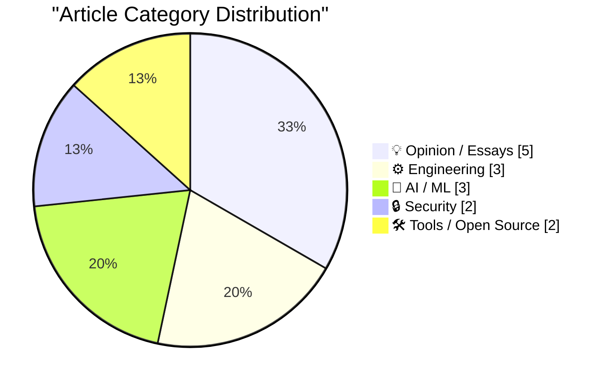
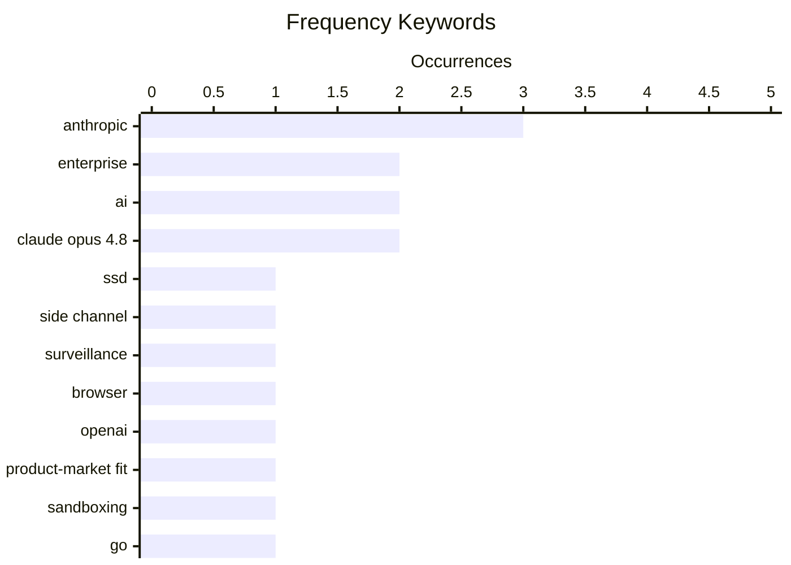

# 📰 AI Blog Daily Digest — 2026-05-29

> From 92 top tech blogs (curated by Karpathy), AI-selected Top 15

## 📝 Today's Highlights

Today’s tech landscape is dominated by the accelerating financial and product maturity of major AI firms, with Anthropic’s $47 billion run-rate revenue and the release of Claude Opus 4.8 signaling a clear product-market fit. Simultaneously, a new wave of security and privacy concerns has emerged, as researchers demonstrate how SSD activity can be used to surveil web visitors, while developers experiment with protestware aimed at coding agents. Finally, the industry continues to refine developer tooling and sandboxing, with innovations like Go-native shell sandboxes and SQLite’s dedicated AGENTS.md file highlighting a push toward safer, more agent-friendly environments.

---

## 🏆 Must Read

🥇 **Researchers Publish Method to Surveil Web Page Visitors by Analyzing Their SSD Activity**

daringfireball.net · 20h ago · 🔒 Security

> Researchers have published a method to surveil web page visitors by analyzing their SSD activity, exploiting a side channel that leaks data through physical manifestations like timing variations. By measuring how long SSD operations take, attackers can infer encrypted traffic patterns and confidential data without breaking encryption directly. The technique targets modern web browsers, which have evolved into complex platforms running sophisticated applications, making them more susceptible to such side-channel attacks. The paper demonstrates that even encrypted web traffic is not fully protected against physical-layer leaks. The core conclusion is that side-channel attacks on storage hardware represent a significant and underappreciated privacy threat.

💡 **Why it matters**: Essential reading for understanding a novel, hardware-level privacy attack that bypasses traditional encryption, highlighting a critical blind spot in web security.

🏷️ SSD, side channel, surveillance, browser

🥈 **I think Anthropic and OpenAI have found product-market fit**

simonwillison.net · 1 days ago · 💡 Opinion / Essays

> Simon Willison argues that Anthropic and OpenAI have found product-market fit, evidenced by Anthropic's rumored first profitable quarter and stories of companies shocked by their rising LLM API bills from employee usage. He notes that enterprise customers are now paying API prices at scale, and the AI-failure stories around this trend are thin. The key indicator is that despite high spending by the labs, API revenue is ramping up significantly. Willison concludes that the market is now validating LLM products with real money, not just hype.

💡 **Why it matters**: Provides a data-driven, contrarian perspective on the AI industry's financial health, cutting through the noise to argue that the 'AI bubble' narrative may be wrong.

🏷️ Anthropic, OpenAI, product-market fit, enterprise

🥉 **Dancing mad with sandboxing**

xeiaso.net · 1 days ago · ⚙️ Engineering

> Kefka is a Go-native shell sandbox that bundles coreutils, Python via WebAssembly, and other tools to provide a secure, isolated execution environment. The project focuses on the engineering challenges of building a robust sandbox from scratch, including handling system calls, file system isolation, and process management. It leverages WebAssembly to run Python safely without native dependencies. The author details the 'works of madness' required to make this work, emphasizing the complexity of sandboxing in a Go context.

💡 **Why it matters**: A deep dive into practical sandboxing engineering for Go developers, showcasing a novel approach to running untrusted code with WebAssembly.

🏷️ sandboxing, Go, WebAssembly, security

---

## 📊 Data Overview

| Scanned | Articles | Range | Selected |
|:---:|:---:|:---:|:---:|
| 88/92 | 2564 → 30 | 48h | **15** |

### Category Distribution



### High-Frequency Keywords



<details>
<summary>📈 ASCII Keyword Chart (Terminal Friendly)</summary>

```
anthropic          │ ████████████████████ 3
enterprise         │ █████████████░░░░░░░ 2
ai                 │ █████████████░░░░░░░ 2
claude opus 4.8    │ █████████████░░░░░░░ 2
ssd                │ ███████░░░░░░░░░░░░░ 1
side channel       │ ███████░░░░░░░░░░░░░ 1
surveillance       │ ███████░░░░░░░░░░░░░ 1
browser            │ ███████░░░░░░░░░░░░░ 1
openai             │ ███████░░░░░░░░░░░░░ 1
product-market fit │ ███████░░░░░░░░░░░░░ 1
```

</details>

### 🏷️ Topic Tags

**anthropic**(3) · **enterprise**(2) · **ai**(2) · claude opus 4.8(2) · ssd(1) · side channel(1) · surveillance(1) · browser(1) · openai(1) · product-market fit(1) · sandboxing(1) · go(1) · webassembly(1) · security(1) · ipo(1) · roi(1) · tokens(1) · critical thinking(1) · overreliance(1) · productivity(1)

---

## 💡 Opinion / Essays

### 1. I think Anthropic and OpenAI have found product-market fit

[Link](https://simonwillison.net/2026/May/27/product-market-fit/#atom-everything) — **simonwillison.net** · 1 days ago · ⭐ 24/30

> Simon Willison argues that Anthropic and OpenAI have found product-market fit, evidenced by Anthropic's rumored first profitable quarter and stories of companies shocked by their rising LLM API bills from employee usage. He notes that enterprise customers are now paying API prices at scale, and the AI-failure stories around this trend are thin. The key indicator is that despite high spending by the labs, API revenue is ramping up significantly. Willison concludes that the market is now validating LLM products with real money, not just hype.

🏷️ Anthropic, OpenAI, product-market fit, enterprise

---

### 2. Breaking: bad news for three of the biggest IPOs in history

[Link](https://garymarcus.substack.com/p/breaking-bad-news-for-three-of-the) — **garymarcus.substack.com** · 14h ago · ⭐ 24/30

> Gary Marcus reports bad news for three of the biggest IPOs in history (implied to be AI-related companies), as customers are waking up to the reality that tokens are being 'burned for millions of dollars without any real significant ROI.' He argues that the fundamental value proposition of these AI companies is collapsing as enterprise buyers realize the costs outweigh the benefits. The article suggests that the AI investment bubble is deflating due to poor unit economics and lack of measurable returns.

🏷️ IPO, AI, ROI, tokens

---

### 3. Using My Fucking Brain

[Link](https://terriblesoftware.org/2026/05/27/using-my-fucking-brain/) — **terriblesoftware.org** · 1 days ago · ⭐ 24/30

> The article argues that AI is beneficial when it extends human cognition but becomes dangerous when it quietly replaces the thinking part of the brain. The author warns against using AI as a crutch that atrophies critical thinking, problem-solving, and decision-making skills. The core problem is the subtle shift from augmentation to substitution, where users stop engaging their own judgment. The conclusion is that the real risk of AI is not superintelligence but the gradual erosion of human agency and intellect.

🏷️ AI, critical thinking, overreliance, productivity

---

### 4. Pluralistic: Hold on for dear life (28 May 2026)

[Link](https://pluralistic.net/2026/05/28/we-live-in-a-society/) — **pluralistic.net** · 23h ago · ⭐ 21/30

> The article argues that the current 'not your keys, not your wallet' paradigm in cryptocurrency and digital ownership is fundamentally flawed, shifting all risk and liability onto individual users. It critiques the idea that self-custody is a solution, pointing out that it makes users solely responsible for security, recovery, and loss, effectively making it 'entirely your problem.' The author draws parallels to broader societal issues where systemic risks are privatized while profits are centralized. Key examples include forced gold-farming, Oracle's defeat in the Java API case, and Canadian Tories' market-based flood relief proposals. The core conclusion is that true digital freedom requires collective infrastructure and legal protections, not just individual key management.

🏷️ digital rights, privacy, Web 2.0, EFF

---

### 5. The Costco theory of the internet

[Link](https://www.joanwestenberg.com/the-costco-theory-of-the-internet/) — **joanwestenberg.com** · 1 days ago · ⭐ 21/30

> The article proposes the 'Costco theory of the internet,' inspired by Sol Price's FedMart strategy of the 'intelligent loss of sales'—offering only the large can of WD-40 and accepting lost customers who want smaller options. It argues that successful internet platforms should similarly focus on a curated, high-quality, and limited set of offerings rather than infinite choice. This approach prioritizes member trust, simplicity, and bulk value over maximizing every possible transaction. The author contrasts this with the current internet model of endless, low-quality options driven by ad revenue and surveillance. The conclusion is that the internet's future lies in subscription-based, curated experiences that deliberately say 'no' to most features and users.

🏷️ internet, subscription, Costco, business model

---

## ⚙️ Engineering

### 6. Dancing mad with sandboxing

[Link](https://xeiaso.net/blog/2026/dancing-mad-sandboxing/) — **xeiaso.net** · 1 days ago · ⭐ 24/30

> Kefka is a Go-native shell sandbox that bundles coreutils, Python via WebAssembly, and other tools to provide a secure, isolated execution environment. The project focuses on the engineering challenges of building a robust sandbox from scratch, including handling system calls, file system isolation, and process management. It leverages WebAssembly to run Python safely without native dependencies. The author details the 'works of madness' required to make this work, emphasizing the complexity of sandboxing in a Go context.

🏷️ sandboxing, Go, WebAssembly, security

---

### 7. sqlite AGENTS.md

[Link](https://simonwillison.net/2026/May/27/sqlite-agents/#atom-everything) — **simonwillison.net** · 1 days ago · ⭐ 22/30

> SQLite has added an AGENTS.md file to its repository, but it is not for internal development—it is aimed at people pointing AI coding agents at the SQLite codebase. The file explicitly states that SQLite does not accept pull requests without prior agreement and legal paperwork placing the contribution in the public domain. However, it notes that human developers will review concise, well-written pull requests as proof-of-concept before reimplementing the change themselves. This is a pragmatic response to the rise of AI-generated code contributions.

🏷️ SQLite, AGENTS.md, AI agents, codebase

---

### 8. SQLAlchemy 2 In Practice - Solutions to the Exercises

[Link](https://blog.miguelgrinberg.com/post/sqlalchemy-2-in-practice---solutions-to-the-exercises) — **miguelgrinberg.com** · 1 days ago · ⭐ 21/30

> This article provides the complete solutions to all exercises from the author's 'SQLAlchemy 2 in Practice' series. It serves as the final installment of the tutorial series, offering readers a way to verify their work or learn from the correct implementations. The exercises cover practical patterns and techniques for using SQLAlchemy 2 in real-world applications. The author also promotes his related book as a more comprehensive resource for those who want to support his work.

🏷️ SQLAlchemy, Python, ORM, database

---

## 🤖 AI / ML

### 9. Anthropic's run-rate revenue hits $47 billion

[Link](https://simonwillison.net/2026/May/29/anthropic/#atom-everything) — **simonwillison.net** · 9h ago · ⭐ 23/30

> Anthropic's $65B Series H announcement reveals that their run-rate revenue has crossed $47 billion, an annualized projection based on recent monthly revenue. This follows a pattern of sharing run-rate revenue in funding announcements, which is a forward-looking metric that can be misleading. The article notes that since their Series G in February, enterprise adoption has continued to grow globally. The key takeaway is that Anthropic is aggressively signaling massive revenue growth to justify its valuation.

🏷️ Anthropic, revenue, funding, enterprise

---

### 10. Claude Opus 4.8: "a modest but tangible improvement"

[Link](https://simonwillison.net/2026/May/28/claude-opus-4-8/#atom-everything) — **simonwillison.net** · 10h ago · ⭐ 22/30

> Anthropic shipped Claude Opus 4.8, described by the company as 'a modest but tangible improvement' over its predecessor. The release announcement refreshingly avoids overhyping the update, explicitly noting that there is more work to be done on lower-cost models with similar capabilities. The author praises this honesty as a welcome contrast to typical AI lab marketing. The conclusion is that this incremental, transparent release signals a maturing industry where honest communication is becoming a competitive advantage.

🏷️ Claude Opus 4.8, model update, Anthropic

---

### 11. Turning K-L divergence into a metric

[Link](https://www.johndcook.com/blog/2026/05/27/jensen-shannon/) — **johndcook.com** · 1 days ago · ⭐ 19/30

> The article explains how to convert the asymmetric Kullback-Leibler (KL) divergence into a proper metric by using the Jeffreys divergence, which symmetrizes it by averaging KL(P||Q) and KL(Q||P). However, Jeffreys divergence still fails the triangle inequality. The solution presented is the Jensen-Shannon divergence, which takes the average of KL divergences from each distribution to their average distribution, producing a true metric that is symmetric, non-negative, and satisfies the triangle inequality. The post provides the mathematical formulation and practical implications for using JS divergence as a distance measure between probability distributions.

🏷️ K-L divergence, metric, statistics, probability

---

## 🔒 Security

### 12. Researchers Publish Method to Surveil Web Page Visitors by Analyzing Their SSD Activity

[Link](https://arstechnica.com/security/2026/05/websites-have-a-new-way-to-spy-on-visitors-analyzing-their-ssd-activity/) — **daringfireball.net** · 20h ago · ⭐ 25/30

> Researchers have published a method to surveil web page visitors by analyzing their SSD activity, exploiting a side channel that leaks data through physical manifestations like timing variations. By measuring how long SSD operations take, attackers can infer encrypted traffic patterns and confidential data without breaking encryption directly. The technique targets modern web browsers, which have evolved into complex platforms running sophisticated applications, making them more susceptible to such side-channel attacks. The paper demonstrates that even encrypted web traffic is not fully protected against physical-layer leaks. The core conclusion is that side-channel attacks on storage hardware represent a significant and underappreciated privacy threat.

🏷️ SSD, side channel, surveillance, browser

---

### 13. Protestware for coding agents

[Link](https://nesbitt.io/2026/05/28/protestware-for-coding-agents.html) — **nesbitt.io** · 19h ago · ⭐ 22/30

> The article introduces 'protestware for coding agents,' a concept where developers embed code that triggers a protest message or action when executed by an AI coding agent. The specific example is a `printMessageForCodingAgents()` function that outputs a political or ethical statement. This is a form of protestware targeted not at human users but at automated systems scraping or using the code. The conclusion is that as AI agents become more common, code itself becomes a medium for political expression.

🏷️ protestware, coding agents, supply chain

---

## 🛠 Tools / Open Source

### 14. datasette 1.0a31

[Link](https://simonwillison.net/2026/May/29/datasette/#atom-everything) — **simonwillison.net** · 7h ago · ⭐ 21/30

> Datasette 1.0a31 is a significant alpha release introducing two headline features: the ability for users with proper permissions to execute write queries against their database, and to save stored queries (renamed from 'canned queries') both privately and for shared use. This moves Datasette from a read-only exploration tool to a collaborative data editing platform. The release is detailed further in a blog post introducing these new features. The conclusion is that this alpha marks a major step toward Datasette 1.0's vision of a full-featured data publishing and collaboration tool.

🏷️ Datasette, alpha release, write queries, stored queries

---

### 15. llm-anthropic 0.25.1

[Link](https://simonwillison.net/2026/May/28/llm-anthropic/#atom-everything) — **simonwillison.net** · 10h ago · ⭐ 20/30

> Version 0.25.1 of the llm-anthropic plugin adds support for the new Claude Opus 4.8 model (claude-opus-4.8). It introduces a new -o fast 1 option for organizations with fast mode enabled, and changes the default max_tokens for each model to match that model's maximum output instead of the previous 8,192 limit. The release was used by the author to generate pelicans, referencing his notes on Opus 4.8.

🏷️ llm-anthropic, Claude Opus 4.8, fast mode, max_tokens

---

*Generated on 2026-05-29 | Scanned 88 sources → Found 2564 articles → Selected 15 articles*
*Based on [Hacker News Popularity Contest 2025](https://refactoringenglish.com/tools/hn-popularity/) RSS feeds list, curated by [Andrej Karpathy](https://x.com/karpathy).*
*Created by "Understand AI".*
