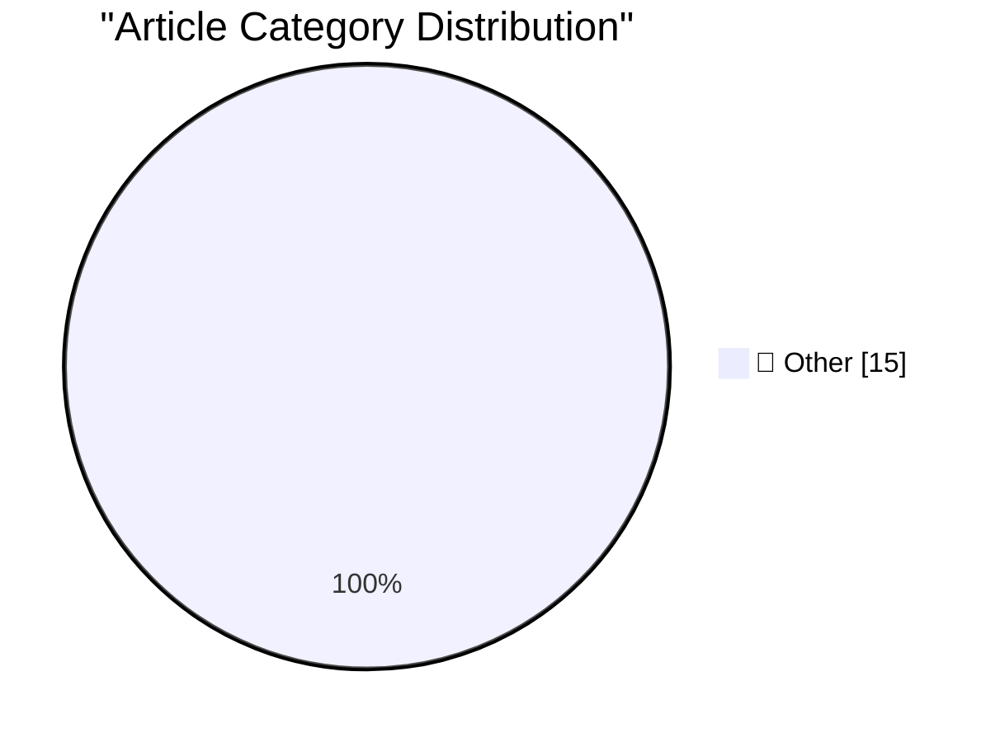

# 📰 AI Blog Daily Digest — 2026-05-29

> ⚠️ **Degraded run.** AI scoring failed for every batch — rankings and categories below are placeholder defaults, not AI-judged.

> From 92 top tech blogs (curated by Karpathy), AI-selected Top 15

## 🏆 Must Read

🥇 **Anthropic's run-rate revenue hits $47 billion**

simonwillison.net · 1h ago · 📝 Other

> The most interesting thing about Anthropic's $65B Series H announcement is this line (emphasis mine): Since our Series G in February, adoption has continued to grow across global enterprise customers,

🥈 **Claude Opus 4.8: "a modest but tangible improvement"**

simonwillison.net · 2h ago · 📝 Other

> Anthropic shipped Claude Opus 4.8 today. My favourite thing about it is this note in the release announcement: Users will find Opus 4.8 to be a modest but tangible improvement on its predecessor. Ther

🥉 **llm-anthropic 0.25.1**

simonwillison.net · 2h ago · 📝 Other

> Release: llm-anthropic 0.25.1 New model: Claude Opus 4.8 ( claude-opus-4.8 ). New -o fast 1 option for fast mode , for organizations with that feature enabled on their account. Default max_tokens for 

---

## 📊 Data Overview

| Scanned | Articles | Range | Selected |
|:---:|:---:|:---:|:---:|
| 88/92 | 2564 → 33 | 48h | **15** |

### Category Distribution

---

## 📝 Other

### 1. Anthropic's run-rate revenue hits $47 billion

[Link](https://simonwillison.net/2026/May/29/anthropic/#atom-everything) — **simonwillison.net** · 1h ago · ⭐ 15/30

> The most interesting thing about Anthropic's $65B Series H announcement is this line (emphasis mine): Since our Series G in February, adoption has continued to grow across global enterprise customers,

---

### 2. Claude Opus 4.8: "a modest but tangible improvement"

[Link](https://simonwillison.net/2026/May/28/claude-opus-4-8/#atom-everything) — **simonwillison.net** · 2h ago · ⭐ 15/30

> Anthropic shipped Claude Opus 4.8 today. My favourite thing about it is this note in the release announcement: Users will find Opus 4.8 to be a modest but tangible improvement on its predecessor. Ther

---

### 3. llm-anthropic 0.25.1

[Link](https://simonwillison.net/2026/May/28/llm-anthropic/#atom-everything) — **simonwillison.net** · 2h ago · ⭐ 15/30

> Release: llm-anthropic 0.25.1 New model: Claude Opus 4.8 ( claude-opus-4.8 ). New -o fast 1 option for fast mode , for organizations with that feature enabled on their account. Default max_tokens for 

---

### 4. sqlite AGENTS.md

[Link](https://simonwillison.net/2026/May/27/sqlite-agents/#atom-everything) — **simonwillison.net** · 1 days ago · ⭐ 15/30

> sqlite AGENTS.md SQLite gained an AGENTS.md file five days ago - but it's not intended for their own development, it's presumably aimed at people who are pointing agents at the SQLite codebase. It inc

---

### 5. I think Anthropic and OpenAI have found product-market fit

[Link](https://simonwillison.net/2026/May/27/product-market-fit/#atom-everything) — **simonwillison.net** · 1 days ago · ⭐ 15/30

> Anthropic are strongly rumored to be about to have their first profitable quarter. Stories are circulating of companies surprised at how expensive their LLM bills are becoming from usage by their staf

---

### 6. Quoting Kyle Ferrana

[Link](https://simonwillison.net/2026/May/27/kyle-ferrana/#atom-everything) — **simonwillison.net** · 1 days ago · ⭐ 15/30

> PICARD: Data, shields up DATA: Brilliant! Shields can reduce damage we sustain. Not immunity. Not hubris. Just prudence. It's not precaution—it's strategy. [camera shakes] WORF: HULL BREACHES ON NINE 

---

### 7. Tuning in FM Radio on a 3D Printer Heatbed

[Link](https://www.jeffgeerling.com/blog/2026/tuning-in-fm-radio-on-a-3d-printer-heatbed/) — **jeffgeerling.com** · 12h ago · ⭐ 15/30

> Pooch from Repkord dropped by my studio while he was in St. Louis, and asked a simple question: Can a 3D printer's heatbed act as an antenna? A fair question, as many an antenna is embedded in a PCB t

---

### 8. Footage From the LA-Houston MLS Match That Apple Shot Using iPhone 17 Pro Cameras

[Link](https://tv.apple.com/us/sporting-event/mls-wrap-up/umc.cse.3a198p24hrehwhonbhgx2zvhv) — **daringfireball.net** · 9h ago · ⭐ 15/30

> I’m not sure if this link works outside the US, but Apple TV’s MLS Wrap-Up show has highlight from the LA Galaxy vs. Houston Dynamo FC match they shot exclusively using iPhone 17 Pros . Follow the lin

---

### 9. Researchers Publish Method to Surveil Web Page Visitors by Analyzing Their SSD Activity

[Link](https://arstechnica.com/security/2026/05/websites-have-a-new-way-to-spy-on-visitors-analyzing-their-ssd-activity/) — **daringfireball.net** · 12h ago · ⭐ 15/30

> Dan Goodin, reporting for Ars Technica: The technique, laid out in a research paper , exploits a side channel , a form of leak resulting from physical manifestations such as electromagnetic emanations

---

### 10. Pluralistic: Hold on for dear life (28 May 2026)

[Link](https://pluralistic.net/2026/05/28/we-live-in-a-society/) — **pluralistic.net** · 15h ago · ⭐ 15/30

> Today's links Hold on for dear life: Not your keys, not your wallet, entirely your problem. Hey look at this: Delights to delectate. Object permanence: Who owns "Web 2.0"; EFF saves bloggers' sources;

---

### 11. Pluralistic: AI and a world without migrants (27 May 2026)

[Link](https://pluralistic.net/2026/05/27/unnecessariat/) — **pluralistic.net** · 1 days ago · ⭐ 15/30

> Today's links AI and a world without migrants: It's solipsism all the way down. Hey look at this: Delights to delectate. Object permanence: Manuscript rabbits; "What Will Come After"; Pastejacking; Te

---

### 12. Gadget Review: Chuwi Minibook X N150 + Linux ★★★★☆

[Link](https://shkspr.mobi/blog/2026/05/gadget-review-chuwi-minibook-x-n150-linux/) — **shkspr.mobi** · 1 days ago · ⭐ 15/30

> I needed a small and light laptop to take travelling. Something with a larger screen than my phone so I can use the Big Internet™. Nothing too expensive and something that uses the same USB-C charger 

---

### 13. Dancing mad with sandboxing

[Link](https://xeiaso.net/blog/2026/dancing-mad-sandboxing/) — **xeiaso.net** · 1 days ago · ⭐ 15/30

> Kefka is a Go-native shell sandbox with coreutils, Python via WebAssembly, and more. Learn the works of madness that went into making this happen!

---

### 14. Sharing the result of a single Windows Runtime IAsyncOperation among multiple coroutines, part 2

[Link](https://devblogs.microsoft.com/oldnewthing/20260528-00/?p=112365) — **devblogs.microsoft.com/oldnewthing** · 12h ago · ⭐ 15/30

> Just let each person take turns trying. The post Sharing the result of a single Windows Runtime IAsyncOperation among multiple coroutines, part 2 appeared first on The Old New Thing .

---

### 15. Sharing the result of a single Windows Runtime IAsyncOperation among multiple coroutines, part 1

[Link](https://devblogs.microsoft.com/oldnewthing/20260527-00/?p=112361) — **devblogs.microsoft.com/oldnewthing** · 1 days ago · ⭐ 15/30

> Caching the result and knowing when the cache is valid. The post Sharing the result of a single Windows Runtime IAsyncOperation among multiple coroutines, part 1 appeared first on The Old New Thing .

---

*Generated on 2026-05-29 | Scanned 88 sources → Found 2564 articles → Selected 15 articles*
*Based on [Hacker News Popularity Contest 2025](https://refactoringenglish.com/tools/hn-popularity/) RSS feeds list, curated by [Andrej Karpathy](https://x.com/karpathy).*
*Created by "Understand AI".*
