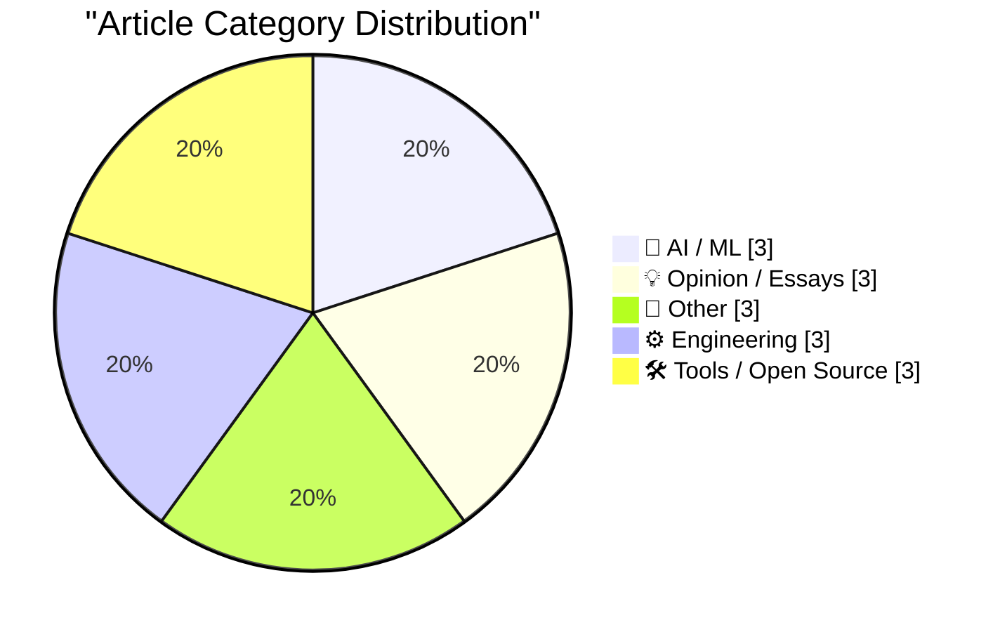
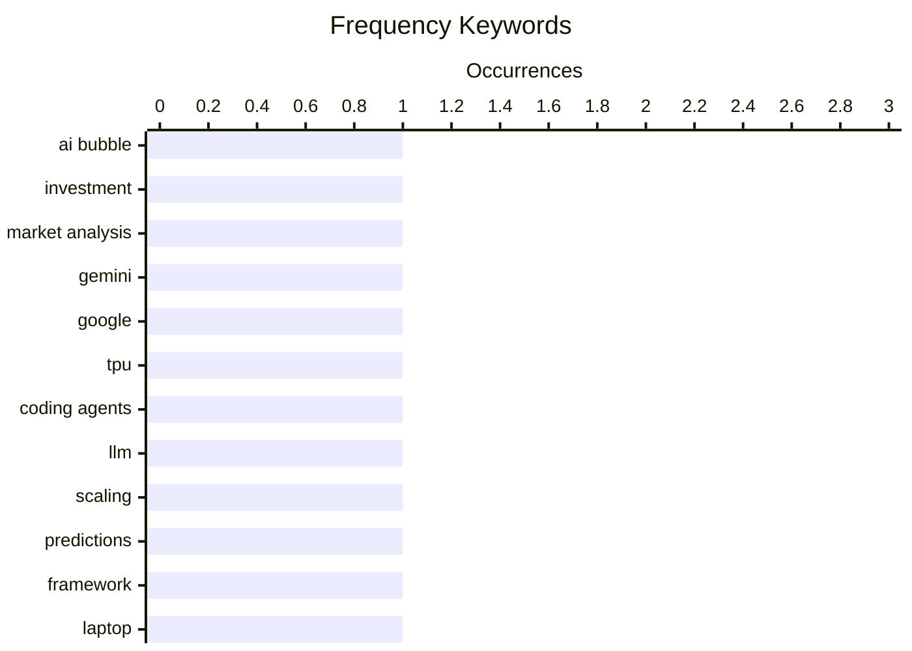

# 📰 AI Blog Daily Digest — 2026-05-30

> From 92 top tech blogs (curated by Karpathy), AI-selected Top 15

## 📝 Today's Highlights

Today’s tech headlines are dominated by mounting skepticism around the sustainability of the AI boom, with multiple analyses questioning whether the industry is in a speculative bubble and what comes next after the peak of "tokenmaxxing." Meanwhile, practical engineering and tooling discussions are gaining traction, from one-pass algorithms and Fourier series notes to the recursive absurdity of package managers. On the hardware front, the value proposition of modular laptops like the Framework 12 is being challenged, while Apple showcases its latest iPhone camera tech by filming an MLS match, blending consumer tech with professional sports production.

---

## 🏆 Must Read

🥇 **Premium: What If...We're In An AI Bubble? (Part 3)**

wheresyoured.at · 6h ago · 🤖 AI / ML

> The article is the third part of a series exploring scenarios that could cause the current AI bubble to burst. It builds on previous discussions of potential triggers for a market correction in the AI industry. The author analyzes specific economic and technological factors that might lead to a downturn. Key arguments focus on overvaluation, unsustainable spending, and unmet expectations in the AI sector. The conclusion suggests that the bubble is likely to pop due to a combination of these pressures.

💡 **Why it matters**: Essential reading for understanding the structural risks and potential collapse scenarios in the current AI investment landscape.

🏷️ AI bubble, investment, market analysis

🥈 **What's going on with Gemini?**

martinalderson.com · 22h ago · 🤖 AI / ML

> Google's Gemini 3.5 Flash, the headline model announced at I/O, is fast but expensive and performs poorly on coding tasks. The article argues this model makes more sense as an internal tool for Google itself, leveraging Google's TPU advantage rather than competing directly with frontier models. Google's real weakness lies in coding agents, where it lags behind competitors. The author concludes that Gemini 3.5 Flash is strategically positioned for Google's own infrastructure needs rather than as a general-purpose consumer product.

💡 **Why it matters**: Provides a critical, insider perspective on Google's AI strategy and why Gemini 3.5 Flash may not be what it appears to be.

🏷️ Gemini, Google, TPU, coding agents

🥉 **What happens next, after the decline of tokenmaxxing?**

garymarcus.substack.com · 5h ago · 🤖 AI / ML

> The article presents two very different sets of predictions for what happens after the decline of 'tokenmaxxing'—the practice of maximizing token counts in AI models. It explores contrasting futures for the AI industry as the current scaling paradigm reaches its limits. One set of predictions is optimistic, while the other is pessimistic about the trajectory of AI development. The author frames this as a critical inflection point for the field.

💡 **Why it matters**: Offers a concise, high-level debate on the future of AI post-scaling, helping readers navigate competing narratives.

🏷️ LLM, scaling, predictions

---

## 📊 Data Overview

| Scanned | Articles | Range | Selected |
|:---:|:---:|:---:|:---:|
| 87/92 | 2540 → 33 | 48h | **15** |

### Category Distribution



### High-Frequency Keywords



<details>
<summary>📈 ASCII Keyword Chart (Terminal Friendly)</summary>

```
ai bubble       │ ████████████████████ 1
investment      │ ████████████████████ 1
market analysis │ ████████████████████ 1
gemini          │ ████████████████████ 1
google          │ ████████████████████ 1
tpu             │ ████████████████████ 1
coding agents   │ ████████████████████ 1
llm             │ ████████████████████ 1
scaling         │ ████████████████████ 1
predictions     │ ████████████████████ 1
```

</details>

### 🏷️ Topic Tags

**ai bubble**(1) · **investment**(1) · **market analysis**(1) · gemini(1) · google(1) · tpu(1) · coding agents(1) · llm(1) · scaling(1) · predictions(1) · framework(1) · laptop(1) · value(1) · macbook(1) · iphone(1) · camera(1) · mls(1) · video(1) · algorithm(1) · online(1)

---

## 🤖 AI / ML

### 1. Premium: What If...We're In An AI Bubble? (Part 3)

[Link](https://www.wheresyoured.at/premium-what-if-were-in-an-ai-bubble-part-3/) — **wheresyoured.at** · 6h ago · ⭐ 26/30

> The article is the third part of a series exploring scenarios that could cause the current AI bubble to burst. It builds on previous discussions of potential triggers for a market correction in the AI industry. The author analyzes specific economic and technological factors that might lead to a downturn. Key arguments focus on overvaluation, unsustainable spending, and unmet expectations in the AI sector. The conclusion suggests that the bubble is likely to pop due to a combination of these pressures.

🏷️ AI bubble, investment, market analysis

---

### 2. What's going on with Gemini?

[Link](https://martinalderson.com/posts/whats-going-on-with-gemini/?utm_source=rss&amp;utm_medium=rss&amp;utm_campaign=feed) — **martinalderson.com** · 22h ago · ⭐ 26/30

> Google's Gemini 3.5 Flash, the headline model announced at I/O, is fast but expensive and performs poorly on coding tasks. The article argues this model makes more sense as an internal tool for Google itself, leveraging Google's TPU advantage rather than competing directly with frontier models. Google's real weakness lies in coding agents, where it lags behind competitors. The author concludes that Gemini 3.5 Flash is strategically positioned for Google's own infrastructure needs rather than as a general-purpose consumer product.

🏷️ Gemini, Google, TPU, coding agents

---

### 3. What happens next, after the decline of tokenmaxxing?

[Link](https://garymarcus.substack.com/p/what-happens-next-after-the-decline) — **garymarcus.substack.com** · 5h ago · ⭐ 23/30

> The article presents two very different sets of predictions for what happens after the decline of 'tokenmaxxing'—the practice of maximizing token counts in AI models. It explores contrasting futures for the AI industry as the current scaling paradigm reaches its limits. One set of predictions is optimistic, while the other is pessimistic about the trajectory of AI development. The author frames this as a critical inflection point for the field.

🏷️ LLM, scaling, predictions

---

## 💡 Opinion / Essays

### 4. It's hard to justify buying a Framework 12

[Link](https://www.jeffgeerling.com/blog/2026/its-hard-to-justify-framework-12/) — **jeffgeerling.com** · 8h ago · ⭐ 20/30

> The author finds it hard to justify buying a Framework 12 laptop for his nephew, who values price and value above all else. Apple's MacBook Neo has upended the value laptop equation by being both the cheapest option and the best value in the 'good-but-cheap' category. The Framework 12, while repairable and upgradeable, cannot compete on price or performance-per-dollar. The conclusion is that Apple's Neo has made the Framework 12 a difficult recommendation for budget-conscious buyers.

🏷️ Framework, laptop, value, MacBook

---

### 5. The UK Government's Low Value Purchase System is a Waste of Time

[Link](https://shkspr.mobi/blog/2026/05/the-uk-governments-low-value-purchase-system-is-a-waste-of-time/) — **shkspr.mobi** · 11h ago · ⭐ 16/30

> The UK Government's RM6237 Low Value Purchase System, designed to simplify small purchases under £10,000, is criticized as overly bureaucratic and time-consuming for small businesses. The author details the cumbersome registration process, including multiple forms, compliance checks, and slow approval times, which often take longer than the value of the purchase itself. Despite its intent to streamline procurement, the system creates barriers that discourage small suppliers from participating. The core argument is that the system fails its stated goal, wasting both government and business resources.

🏷️ UK government, procurement, small business

---

### 6. Knowing about things is cheaper than knowing things

[Link](https://buttondown.com/hillelwayne/archive/knowing-about-things-is-cheaper-than-knowing/) — **buttondown.com/hillelwayne** · 1 days ago · ⭐ 15/30

> Hillel Wayne distinguishes between 'knowing about things' (surface-level awareness) and 'knowing things' (deep understanding), using math and programming as the example. He argues that while all programmers benefit from knowing about math (e.g., recognizing when a problem is NP-hard), only specialists need deep mathematical knowledge. The post contrasts a LinkedIn influencer's claim that math is irrelevant to programming with the reality that conceptual math knowledge helps avoid costly design mistakes. The core point is that breadth of awareness is cheaper and more valuable than depth for most software engineers.

🏷️ math, programming, education

---

## 📝 Other

### 7. Footage From the LA-Houston MLS Match That Apple Shot Using iPhone 17 Pro Cameras

[Link](https://tv.apple.com/us/sporting-event/mls-wrap-up/umc.cse.3a198p24hrehwhonbhgx2zvhv) — **daringfireball.net** · 1 days ago · ⭐ 19/30

> Apple TV's MLS Wrap-Up show features highlights from an LA Galaxy vs. Houston Dynamo match shot exclusively using iPhone 17 Pro cameras. The footage looks good but definitely does not look as good as usual professional broadcasts. The author notes it is impressive for a phone camera, but would be a tough sell for a full professional broadcast. The conclusion is that while technically impressive, the iPhone 17 Pro still falls short of dedicated professional camera rigs.

🏷️ iPhone, camera, MLS, video

---

### 8. Tuning in FM Radio on a 3D Printer Heatbed

[Link](https://www.jeffgeerling.com/blog/2026/tuning-in-fm-radio-on-a-3d-printer-heatbed/) — **jeffgeerling.com** · 1 days ago · ⭐ 16/30

> Jeff Geerling tests whether a 3D printer's PCB heatbed (specifically from a Prusa Core One) can function as an FM radio antenna. Using an RTL-SDR dongle and a simple wire connection to the heatbed's power terminals, he successfully tunes into local FM stations, demonstrating that the heatbed's PCB traces radiate RF signals. The experiment confirms that any conductive surface can act as an antenna with sufficient transmitter power, though signal quality is poor without proper impedance matching. The post concludes that while technically possible, a dedicated antenna is far more practical for reliable reception.

🏷️ 3D printing, antenna, heatbed, experiment

---

### 9. Where Are the Economies of Scale in Homebuilding?

[Link](https://www.construction-physics.com/p/where-are-the-economies-of-scale) — **construction-physics.com** · 1 days ago · ⭐ 15/30

> The article examines why homebuilding has not achieved the same economies of scale as manufacturing, despite decades of productivity decline in construction. Key factors include site-specific customization, regulatory fragmentation across jurisdictions, and the lack of repeatable production processes. The author compares homebuilding to automobile manufacturing, noting that while cars are built in centralized factories with standardized parts, homes are still largely assembled on-site with unique designs. The conclusion is that true economies of scale in homebuilding require modular construction and regulatory reform, not just larger builders.

🏷️ construction, productivity, economics

---

## ⚙️ Engineering

### 10. Online (one-pass) algorithms

[Link](https://www.johndcook.com/blog/2026/05/29/online-one-pass-algorithms/) — **johndcook.com** · 10h ago · ⭐ 19/30

> The article explains online (one-pass) algorithms, using sample variance as the canonical example. While sample variance traditionally requires two passes (one to compute the mean, another for squared differences), it can be computed in a single pass using an incremental formula. This approach is critical for streaming data, large datasets, and memory-constrained environments. The post demonstrates the mathematical derivation and practical implementation of such algorithms.

🏷️ algorithm, online, variance, one-pass

---

### 11. Notes on Fourier series

[Link](https://eli.thegreenplace.net/2026/notes-on-fourier-series/) — **eli.thegreenplace.net** · 1 days ago · ⭐ 18/30

> The article provides comprehensive notes on Fourier series, covering the trigonometric decomposition of periodic functions into infinite sums of sinusoids. It includes mathematical derivations, examples, and the connection to linear algebra in Hilbert space. The post explains how to compute coefficients and the underlying orthogonality principles. It serves as a thorough reference for understanding the theory and applications of Fourier series.

🏷️ Fourier series, mathematics, signal processing

---

### 12. Sharing the result of a single Windows Runtime IAsyncOperation among multiple coroutines, part 2

[Link](https://devblogs.microsoft.com/oldnewthing/20260528-00/?p=112365) — **devblogs.microsoft.com/oldnewthing** · 1 days ago · ⭐ 16/30

> Raymond Chen continues his series on sharing a single Windows Runtime IAsyncOperation among multiple coroutines, focusing on a cooperative 'take turns' approach. Each coroutine attempts to await the operation, but only the first one triggers execution; subsequent coroutines must wait and retry if the operation fails or is canceled. The solution uses a shared state machine with a mutex to coordinate access, ensuring no duplicate work occurs. The author concludes that while this pattern works, it requires careful error handling to avoid deadlocks or missed completions.

🏷️ Windows Runtime, coroutines, async

---

## 🛠 Tools / Open Source

### 13. Composer’s dependency policies

[Link](https://nesbitt.io/2026/05/29/composer-dependency-policies.html) — **nesbitt.io** · 12h ago · ⭐ 18/30

> The article introduces Composer's dependency policies as a tool to act like 'uBlock Origin for composer install'. It describes how these policies can block or restrict unwanted dependencies during PHP package installation. This gives developers fine-grained control over which packages and versions are allowed in their projects. The approach helps prevent supply chain attacks and reduces dependency bloat.

🏷️ Composer, PHP, dependency, security

---

### 14. Package managers that package package managers

[Link](https://nesbitt.io/2026/05/28/package-managers-that-package-package-managers.html) — **nesbitt.io** · 1 days ago · ⭐ 18/30

> The article humorously illustrates the recursive nature of package managers that install other package managers, showing a chain: brew install spack install conda install cargo install uv tool install pip install poetry add pdm add conan. It highlights the complexity and meta-layering of modern development toolchains. The post serves as a commentary on the proliferation and interdependence of package management ecosystems.

🏷️ package managers, dev tools, dependency management

---

### 15. markdown-svg-renderer

[Link](https://simonwillison.net/2026/May/28/markdown-svg-renderer/#atom-everything) — **simonwillison.net** · 1 days ago · ⭐ 17/30

> The tool 'markdown-svg-renderer' is a customized Markdown renderer that gives special treatment to fenced code SVG blocks—it both renders the image and provides a tab for switching to the code view. Users can paste Markdown or provide a URL to a CORS-enabled Markdown file or Gist. An example demonstrates loading a Markdown file full of LLM pelican logs for Opus 4.8. The tool simplifies creating and sharing documents that mix SVG graphics with Markdown content.

🏷️ Markdown, SVG, renderer, tool

---

*Generated on 2026-05-30 | Scanned 87 sources → Found 2540 articles → Selected 15 articles*
*Based on [Hacker News Popularity Contest 2025](https://refactoringenglish.com/tools/hn-popularity/) RSS feeds list, curated by [Andrej Karpathy](https://x.com/karpathy).*
*Created by "Understand AI".*
