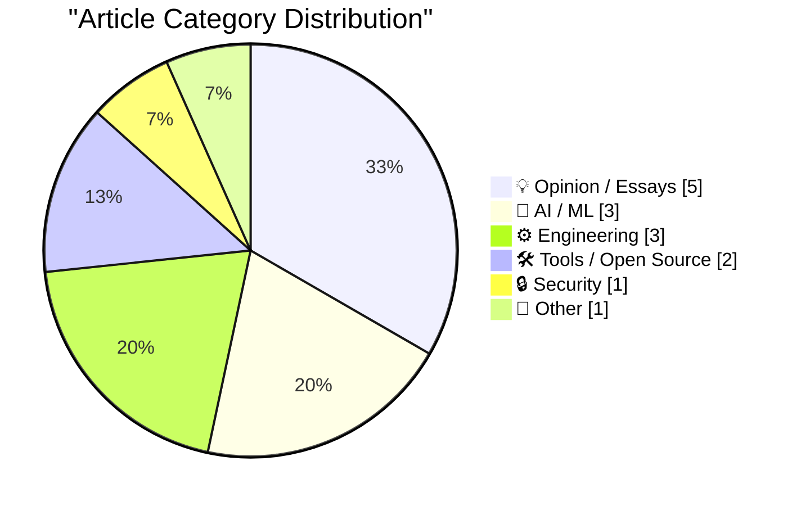
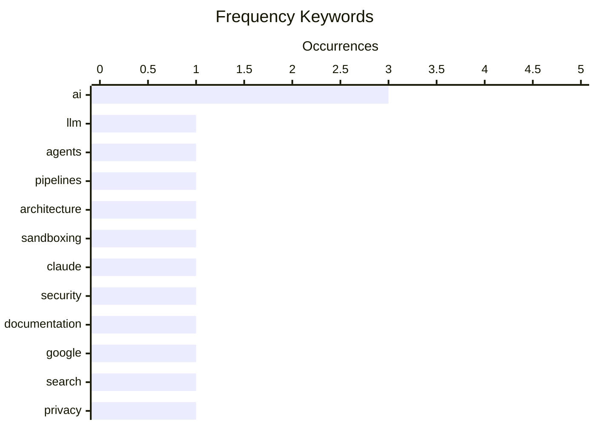

# 📰 AI Blog Daily Digest — 2026-06-01

> From 92 top tech blogs (curated by Karpathy), AI-selected Top 15

## 📝 Today's Highlights

Today’s top articles reveal a deepening divide in the AI community, with debates shifting from technical implementation—such as the choice between building agents versus pipelines—to fundamental philosophical disagreements about understanding and intelligence, exemplified by contrasting views from the Pope and Geoffrey Hinton. Meanwhile, the security landscape is increasingly focused on containing powerful AI models like Claude across products, reflecting growing concerns over sandboxing and control. Finally, a wave of user backlash against Google has reignited interest in obscure search parameters like &udm=14, signaling a broader frustration with algorithmic curation and a push for more transparent, user-controlled tools.

---

## 🏆 Must Read

🥇 **Build agents, not pipelines**

seangoedecke.com · 22h ago · 🤖 AI / ML

> There are only two ways to use LLMs in a computer program: as part of a pipeline, or as an agent. In other words, either you express the control flow of the program in code, or you give a LLM tools an

🏷️ LLM, agents, pipelines, architecture

🥈 **How we contain Claude across products**

simonwillison.net · 1 days ago · 🔒 Security

> How we contain Claude across products A complaint I often have about sandboxing products is that they are rarely thoroughly documented , and in the absence of detailed documentation it's hard to know 

🏷️ sandboxing, Claude, security, documentation

🥉 **One &udm After Another**

tedium.co · 21h ago · 💡 Opinion / Essays

> Google made everyone mad again, so another wave of people just learned about &udm=14. Maybe we should all take the hint.

🏷️ Google, search, privacy, &udm=14

---

## 📊 Data Overview

| Scanned | Articles | Range | Selected |
|:---:|:---:|:---:|:---:|
| 88/92 | 2566 → 26 | 48h | **15** |

### Category Distribution



### High-Frequency Keywords



<details>
<summary>📈 ASCII Keyword Chart (Terminal Friendly)</summary>

```
ai            │ ████████████████████ 3
llm           │ ███████░░░░░░░░░░░░░ 1
agents        │ ███████░░░░░░░░░░░░░ 1
pipelines     │ ███████░░░░░░░░░░░░░ 1
architecture  │ ███████░░░░░░░░░░░░░ 1
sandboxing    │ ███████░░░░░░░░░░░░░ 1
claude        │ ███████░░░░░░░░░░░░░ 1
security      │ ███████░░░░░░░░░░░░░ 1
documentation │ ███████░░░░░░░░░░░░░ 1
google        │ ███████░░░░░░░░░░░░░ 1
```

</details>

### 🏷️ Topic Tags

**ai**(3) · **llm**(1) · **agents**(1) · pipelines(1) · architecture(1) · sandboxing(1) · claude(1) · security(1) · documentation(1) · google(1) · search(1) · privacy(1) · &udm=14(1) · understanding(1) · philosophy(1) · hinton(1) · gambling(1) · software industry(1) · prediction markets(1) · ethics(1)

---

## 💡 Opinion / Essays

### 1. One &udm After Another

[Link](https://feed.tedium.co/link/15204/17351430/google-ai-udm14-reflection) — **tedium.co** · 21h ago · ⭐ 25/30

> Google made everyone mad again, so another wave of people just learned about &udm=14. Maybe we should all take the hint.

🏷️ Google, search, privacy, &udm=14

---

### 2. the totalisator

[Link](https://computer.rip/2026-05-31-totalisator.html) — **computer.rip** · 22h ago · ⭐ 23/30

> It has been an unfortunate turn in the software industry, one of many as of late, that gambling is once again one of its primary engines. With the rise of almost nationwide online sports betting, not 

🏷️ gambling, software industry, prediction markets, ethics

---

### 3. The solution might be cancelling my AI subscription

[Link](https://simonwillison.net/2026/May/31/the-solution-might-be-cancelling-my-ai-subscription/#atom-everything) — **simonwillison.net** · 6h ago · ⭐ 20/30

> The solution might be cancelling my AI subscription I find this post by David Wilson very relatable. David lists 16+ projects he's spun up with AI tooling, and concludes: I didn't mean to build most o

🏷️ AI, productivity, developer experience

---

### 4. Pluralistic: Carneyism without Carney (30 May 2026)

[Link](https://pluralistic.net/2026/05/30/rupture/) — **pluralistic.net** · 1 days ago · ⭐ 20/30

> Today's links Carneyism without Carney: Eh? Hey look at this: Delights to delectate. Object permanence: Replacing pharma patents with bounties; USTR v cheap leukemia meds; Plutocrats x wealth segregat

🏷️ politics, economics, policy, tech critique

---

### 5. I Am Retiring from Tech to Live Offline

[Link](https://simonwillison.net/2026/May/30/retiring-from-tech-to-live-offline/#atom-everything) — **simonwillison.net** · 1 days ago · ⭐ 17/30

> Chad Whitacre is retiring from tech—including open source—citing AI as the 'last straw,' and plans to live offline. He describes this as a concrete step, not a forum threat, and references an island off India where indigenous people kill outsiders as a metaphor for his desired disconnection. The letter is typewritten and scanned, emphasizing his commitment to stepping away from digital life.

🏷️ tech retirement, AI, offline

---

## 🤖 AI / ML

### 6. Build agents, not pipelines

[Link](https://seangoedecke.com/build-agents-not-pipelines/) — **seangoedecke.com** · 22h ago · ⭐ 26/30

> There are only two ways to use LLMs in a computer program: as part of a pipeline, or as an agent. In other words, either you express the control flow of the program in code, or you give a LLM tools an

🏷️ LLM, agents, pipelines, architecture

---

### 7. The Pope appears to understand AI better than Geoffrey Hinton does.

[Link](https://garymarcus.substack.com/p/the-pope-appears-to-understand-ai) — **garymarcus.substack.com** · 5h ago · ⭐ 23/30

> What a thing says doesn’t tell you how it came to say it

🏷️ AI, understanding, philosophy, Hinton

---

### 8. On first looking into JAX

[Link](https://www.gilesthomas.com/2026/05/on-first-looking-into-jax) — **gilesthomas.com** · 1 days ago · ⭐ 22/30

> Much have I travell'd in the realms of gold, And many goodly states and kingdoms seen; Round many western islands have I been Which bards in fealty to Apollo hold. Oft of one wide expanse had I been t

🏷️ JAX, machine learning, differentiable programming

---

## ⚙️ Engineering

### 9. Running Python ASGI apps in the browser via Pyodide + a service worker

[Link](https://simonwillison.net/2026/May/30/pyodide-asgi-browser/#atom-everything) — **simonwillison.net** · 1 days ago · ⭐ 22/30

> Research: Running Python ASGI apps in the browser via Pyodide + a service worker Datasette Lite is my version of Datasette that runs entirely in the browser using Pyodide in WebAssembly. When I first 

🏷️ Pyodide, WebAssembly, ASGI, service worker

---

### 10. Microcode inside the Intel 8087 floating-point chip: register exchange

[Link](http://www.righto.com/feeds/5917097192784199241/comments/default) — **righto.com** · 1 days ago · ⭐ 20/30

> The Intel 8087 floating-point coprocessor, introduced in 1980, accelerated floating-point operations by up to 100x and established the floating-point standard used in most processors today. Its complex algorithms for computing square roots, tangents, and exponentials are implemented in low-level microcode. The author, part of the Opcode Collective, is reverse-engineering this microcode to reveal the chip's internal logic. The article focuses specifically on the microcode mechanism for register exchange operations within the 8087.

🏷️ microcode, 8087, floating-point, retrocomputing

---

### 11. Please don't mess with links:

[Link](https://maurycyz.com/misc/real_links/) — **maurycyz.com** · 22h ago · ⭐ 17/30

> A real HTML link supports opening in a new tab (Ctrl+click), new window (Shift+click), saving as a file (Alt+click), copying the URL via right-click, keyboard navigation (Tab+Enter), and is readable by search engines and screen readers. The article demonstrates how CSS-styled spans that mimic links break all these functionalities, arguing they are 'pale, shallow imitations.' It calls for preserving native link behavior for accessibility and usability.

🏷️ links, UX, CSS, web design

---

## 🛠 Tools / Open Source

### 12. This Week in Package Management: 30 May 2026

[Link](https://nesbitt.io/2026/05/30/this-week-in-package-management.html) — **nesbitt.io** · 1 days ago · ⭐ 21/30

> Releases, advisories, and articles from across the package management world

🏷️ package management, releases, advisories

---

### 13. Notes from May 2026

[Link](https://evanhahn.com/notes-from-may-2026/) — **evanhahn.com** · 1 days ago · ⭐ 18/30

> The author's blog turned 16, and he published four tools: ZIP Shrinker (web app for higher compression ratios), a command-line offline translation tool, a Firefox extension to open links without loading them, and png-cmp (PNG pixel data comparison). He also contributed to Helm and explored tech ethics topics. The post is a monthly log of small but practical open-source projects and reflections.

🏷️ tools, ZIP, CLI, web app

---

## 🔒 Security

### 14. How we contain Claude across products

[Link](https://simonwillison.net/2026/May/30/how-we-contain-claude/#atom-everything) — **simonwillison.net** · 1 days ago · ⭐ 25/30

> How we contain Claude across products A complaint I often have about sandboxing products is that they are rarely thoroughly documented , and in the absence of detailed documentation it's hard to know 

🏷️ sandboxing, Claude, security, documentation

---

## 📝 Other

### 15. Meta Is Launching Instagram, Facebook, and WhatsApp Subscriptions for ‘Fun Features’

[Link](https://techcrunch.com/2026/05/27/meta-officially-launches-instagram-facebook-and-whatsapp-subscriptions-with-more-to-come-including-ai-plans/) — **daringfireball.net** · 1 days ago · ⭐ 19/30

> Meta is globally rolling out consumer subscriptions for Instagram Plus ($3.99/mo), Facebook Plus ($3.99/mo), and WhatsApp Plus ($2.99/mo), offering access to 'fun features' like custom themes, stickers, and profile badges. The company is also beginning tests on separate subscription tiers for businesses, creators, and Meta AI users. This marks a significant pivot from ad-supported models toward direct consumer monetization across its flagship apps.

🏷️ Meta, subscriptions, social media

---

*Generated on 2026-06-01 | Scanned 88 sources → Found 2566 articles → Selected 15 articles*
*Based on [Hacker News Popularity Contest 2025](https://refactoringenglish.com/tools/hn-popularity/) RSS feeds list, curated by [Andrej Karpathy](https://x.com/karpathy).*
*Created by "Understand AI".*
