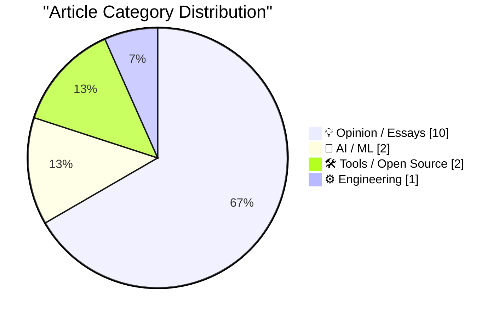
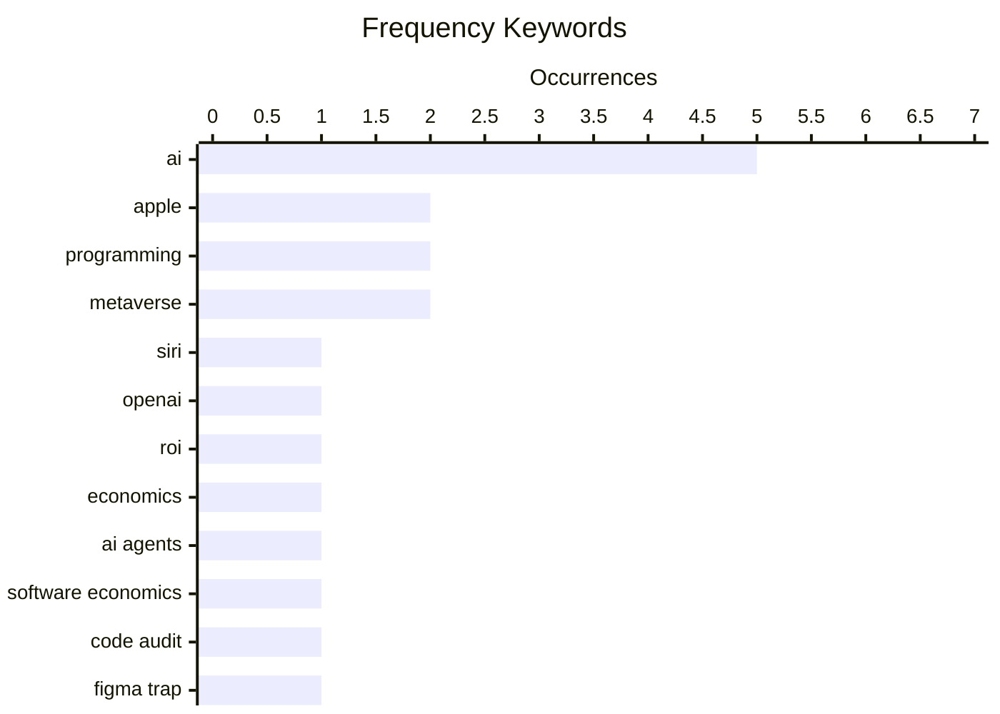

# 📰 AI Blog Daily Digest — 2026-06-03

> From 92 top tech blogs (curated by Karpathy), AI-selected Top 15

## 📝 Today's Highlights

Today’s tech headlines reveal a deepening tension between AI ambition and tangible results, as Apple’s unreleased Siri revamp and Microsoft’s new reasoning models highlight ongoing investment in AI, while a growing chorus of opinion pieces questions generative AI’s elusive return on investment. Meanwhile, the metaverse narrative is being reexamined, with Meta reportedly doubling down on smart glasses hardware and critics like Nick Heer tracing the hype cycle’s rise and fall, as Apple positions itself as an anti-metaverse VR player. Across the board, the industry is grappling with the gap between visionary promises and practical, measurable outcomes.

---

## 🏆 Must Read

🥇 **Take Two**

daringfireball.net · 1 days ago · 🤖 AI / ML

> Kelsey Peterson, the Apple AI employee who introduced the never-launched Siri revamp at WWDC 2024, has left Apple to join OpenAI. This means a new presenter will be needed for the second attempt at unveiling a next-gen Siri at WWDC 2025. The author argues this personnel change was inevitable regardless of Peterson's departure, comparing it to needing a new host for a second christening of a hypothetical Titanic II. The core point is that the failure of the initial Siri revamp necessitated a fresh face for its re-announcement.

💡 **Why it matters**: Provides a quick, cynical take on Apple's Siri struggles and the symbolic importance of who presents failed initiatives.

🏷️ Apple, Siri, OpenAI, AI

🥈 **AI Doesn't Have ROI**

wheresyoured.at · 8h ago · 💡 Opinion / Essays

> The article argues that generative AI currently lacks a clear return on investment (ROI) for most businesses. It critiques the massive spending on AI infrastructure by companies like NVIDIA and Anthropic without corresponding revenue or productivity gains. The author suggests the hype cycle has outpaced practical, profitable applications. The core conclusion is that the AI industry is in a bubble driven by speculation rather than sustainable economic value.

💡 **Why it matters**: Offers a critical, data-driven counterpoint to the prevailing AI hype, essential for anyone evaluating AI investments.

🏷️ AI, ROI, economics

🥉 **I went on the Built for Turbulence podcast**

martinalderson.com · 22h ago · 💡 Opinion / Essays

> Martin Anderson joined the 'Built for Turbulence' podcast to discuss how AI agents are fundamentally altering software economics. He covers the 'Figma Trap'—where platforms become indispensable but limit user freedom—and warns that running human-written code without AI audit will soon be considered reckless. The core argument is that AI is shifting software development from a craft to a risk-management discipline.

💡 **Why it matters**: Presents a forward-looking, provocative thesis on the operational and economic risks of ignoring AI in software development.

🏷️ AI agents, software economics, code audit, Figma Trap

---

## 📊 Data Overview

| Scanned | Articles | Range | Selected |
|:---:|:---:|:---:|:---:|
| 87/92 | 2543 → 47 | 48h | **15** |

### Category Distribution



### High-Frequency Keywords



<details>
<summary>📈 ASCII Keyword Chart (Terminal Friendly)</summary>

```
ai                 │ ████████████████████ 5
apple              │ ████████░░░░░░░░░░░░ 2
programming        │ ████████░░░░░░░░░░░░ 2
metaverse          │ ████████░░░░░░░░░░░░ 2
siri               │ ████░░░░░░░░░░░░░░░░ 1
openai             │ ████░░░░░░░░░░░░░░░░ 1
roi                │ ████░░░░░░░░░░░░░░░░ 1
economics          │ ████░░░░░░░░░░░░░░░░ 1
ai agents          │ ████░░░░░░░░░░░░░░░░ 1
software economics │ ████░░░░░░░░░░░░░░░░ 1
```

</details>

### 🏷️ Topic Tags

**ai**(5) · **apple**(2) · **programming**(2) · metaverse(2) · siri(1) · openai(1) · roi(1) · economics(1) · ai agents(1) · software economics(1) · code audit(1) · figma trap(1) · microsoft(1) · mai(1) · llm(1) · copilot(1) · logic(1) · book(1) · meta(1) · smart glasses(1)

---

## 💡 Opinion / Essays

### 1. AI Doesn't Have ROI

[Link](https://www.wheresyoured.at/ai-doesnt-have-roi/) — **wheresyoured.at** · 8h ago · ⭐ 23/30

> The article argues that generative AI currently lacks a clear return on investment (ROI) for most businesses. It critiques the massive spending on AI infrastructure by companies like NVIDIA and Anthropic without corresponding revenue or productivity gains. The author suggests the hype cycle has outpaced practical, profitable applications. The core conclusion is that the AI industry is in a bubble driven by speculation rather than sustainable economic value.

🏷️ AI, ROI, economics

---

### 2. I went on the Built for Turbulence podcast

[Link](https://martinalderson.com/posts/built-for-turbulence-podcast/?utm_source=rss&amp;utm_medium=rss&amp;utm_campaign=feed) — **martinalderson.com** · 22h ago · ⭐ 23/30

> Martin Anderson joined the 'Built for Turbulence' podcast to discuss how AI agents are fundamentally altering software economics. He covers the 'Figma Trap'—where platforms become indispensable but limit user freedom—and warns that running human-written code without AI audit will soon be considered reckless. The core argument is that AI is shifting software development from a craft to a risk-management discipline.

🏷️ AI agents, software economics, code audit, Figma Trap

---

### 3. ‘The Metaverse Fever Dream’

[Link](https://pxlnv.com/blog/metaverse-fever-dream/) — **daringfireball.net** · 22h ago · ⭐ 19/30

> Nick Heer's essay traces the rise and fall of 'metaverse' hype, starting with Matthew Ball's 2020 prediction that it would generate trillions in value. The article provides extensive receipts showing how Silicon Valley's obsession with the metaverse has largely fizzled. Heer argues that the concept was overhyped and failed to deliver on its grand promises. The core conclusion is that the metaverse was a speculative fever dream, not a viable computing platform.

🏷️ metaverse, hype, Silicon Valley, essay

---

### 4. Breaking: When dreams for AI sanity come true

[Link](https://garymarcus.substack.com/p/breaking-when-dreams-for-ai-sanity) — **garymarcus.substack.com** · 3h ago · ⭐ 19/30

> Gary Marcus reports a personal, real-life moment where his long-standing criticisms of AI's limitations were validated. The article is titled 'Breaking: When dreams for AI sanity come true,' suggesting an event where AI behaved in a more rational or predictable manner than expected. The core point is a brief, triumphant note from a prominent AI skeptic.

🏷️ AI, sanity, expectations

---

### 5. Apple, the Anti-‘Metaverse’ VR Company

[Link](https://daringfireball.net/2025/12/meta_says_fuck_that_metaverse_shit) — **daringfireball.net** · 1h ago · ⭐ 18/30

> The article contrasts Apple's approach to VR with the broader 'metaverse' hype, noting that Apple never endorsed the metaverse concept. The author points out that at a 2022 WSJ event, seven months before Vision Pro's announcement, Apple executives explicitly avoided metaverse language. The core argument is that Apple positioned itself as an anti-metaverse VR company, focusing on practical spatial computing rather than speculative virtual worlds.

🏷️ Apple, Vision Pro, metaverse, VR

---

### 6. ‘If You Take the Weasel Job Then You Must Be the Weasel’

[Link](https://www.hamiltonnolan.com/p/if-you-take-the-weasel-job-then-you?r=qy6gq) — **daringfireball.net** · 22h ago · ⭐ 17/30

> Hamilton Nolan argues that being hired for a prestigious job you are unqualified for is rarely due to unrecognized genius, but more often due to an incompetent hirer or, most damningly, because you were chosen specifically to be a compliant, unethical 'weasel' who will do the dirty work without protest. The article dissects the moral compromise inherent in accepting such a role, particularly in contexts like political appointments or corporate leadership. Nolan warns that taking a 'weasel job' transforms you into the weasel, corrupting your integrity for status or power. The core conclusion is that accepting a role you know you shouldn't have is a deliberate choice to become a tool of dysfunction.

🏷️ career, impostor syndrome, ethics, hiring

---

### 7. Why things will eventually fall apart

[Link](https://garymarcus.substack.com/p/why-things-will-eventually-fall-apart) — **garymarcus.substack.com** · 6h ago · ⭐ 17/30

> Gary Marcus explores why complex systems, from AI models to human societies, are inherently fragile and prone to catastrophic failure. He argues that the mathematical reality of compounding errors, combined with psychological biases like overconfidence and the neglect of tail risks, creates an inevitable trajectory toward breakdown. Marcus points to the 'house of cards' nature of large language models, where a single flawed input can cascade into nonsense, as a microcosm of larger systemic risks. The author's core point is that without explicit, robust safeguards and humility about limitations, all complex systems—including those built on AI—will eventually fall apart.

🏷️ AI, failure, psychology

---

### 8. Be thou not pilled

[Link](https://www.joanwestenberg.com/be-thou-not-pilled/) — **joanwestenberg.com** · 1 days ago · ⭐ 17/30

> Joan Westenberg revisits Charles MacKay's 1841 classic 'Extraordinary Popular Delusions and the Madness of Crowds' to diagnose modern internet-era manias, from crypto and AI hype to political cults. She argues that the same psychological mechanisms—herd mentality, confirmation bias, and the seduction of simple narratives—drive today's 'pilled' communities, whether they are rationalists, accelerationists, or tech utopians. Westenberg contends that the internet accelerates these delusions by creating echo chambers that reward extreme commitment and punish skepticism. The article's conclusion is a warning: being 'pilled' is not a sign of enlightenment but of having surrendered critical thinking to a crowd.

🏷️ crowd, delusion, technology

---

### 9. An Ode to the Exacting Pedantry of Computers

[Link](https://blog.jim-nielsen.com/2026/pedantry-of-computing/) — **blog.jim-nielsen.com** · 3h ago · ⭐ 17/30

> Jim Nielsen reflects on his early struggle with programming's requirement for exactness, like specifying integer vs. float types in C++, which initially drove him to drop out. He contrasts this with the forgiving nature of human language and communication, where ambiguity is tolerated and context fills gaps. Nielsen argues that this 'exacting pedantry' of computers is not a flaw but a feature: it forces clarity and precision that human systems often lack. The core insight is that learning to think like a computer—with rigorous, unambiguous logic—is a valuable discipline that improves how one thinks about problems in general.

🏷️ computers, pedantry, programming

---

### 10. May 2026 newsletter

[Link](https://simonwillison.net/2026/Jun/1/may-newsletter/#atom-everything) — **simonwillison.net** · 1 days ago · ⭐ 16/30

> Simon Willison's May 2026 newsletter covers a month where AI costs increased significantly while new model releases were 'a little disappointing.' He highlights Anthropic having a particularly strong month relative to competitors. Willison also shares his launch of 'Datasette Agent' and substantial progress on the broader Datasette project, alongside notes from conferences and podcasts he attended. The newsletter serves as a curated, insider perspective on the current state of the AI and data tooling ecosystem, with a focus on practical developments and cost realities.

🏷️ newsletter, AI, Anthropic, model releases

---

## 🤖 AI / ML

### 11. Take Two

[Link](https://x.com/markgurman/status/2061236259843182813) — **daringfireball.net** · 1 days ago · ⭐ 23/30

> Kelsey Peterson, the Apple AI employee who introduced the never-launched Siri revamp at WWDC 2024, has left Apple to join OpenAI. This means a new presenter will be needed for the second attempt at unveiling a next-gen Siri at WWDC 2025. The author argues this personnel change was inevitable regardless of Peterson's departure, comparing it to needing a new host for a second christening of a hypothetical Titanic II. The core point is that the failure of the initial Siri revamp necessitated a fresh face for its re-announcement.

🏷️ Apple, Siri, OpenAI, AI

---

### 12. Microsoft's new MAI models

[Link](https://simonwillison.net/2026/Jun/2/microsofts-new-models/#atom-everything) — **simonwillison.net** · 9m ago · ⭐ 22/30

> Microsoft announced two new text LLMs: MAI-Thinking-1 (35B parameters, reasoning-focused, for select partners) and MAI-Code-1-Flash (5B parameters, optimized for GitHub Copilot and VS Code with lower cost). The low parameter counts (5B and 35B) are notable, suggesting a strategic pivot toward efficiency and specialized performance over raw scale. The author highlights this as a significant departure from the trend of ever-larger models.

🏷️ Microsoft, MAI, LLM, Copilot

---

## 🛠 Tools / Open Source

### 13. Meta Reportedly Has a Slew of New Smart Glasses Planned for This Year

[Link](https://gizmodo.com/meta-has-a-ridiculous-amount-of-smart-glasses-planned-for-this-year-2000765741) — **daringfireball.net** · 37m ago · ⭐ 20/30

> Meta reportedly has an aggressive slate of smart glasses planned for 2025, including fall releases and a December pair codenamed 'Mojito VIP'. Two prototypes, 'Artemis' and 'SSG' (supersensing glasses), are also in testing. The 'supersensing' pair is expected to feature advanced sensor capabilities. The core takeaway is that Meta is doubling down on hardware despite the metaverse hype fading.

🏷️ Meta, smart glasses, AR, wearable

---

### 14. Pasted File Editor

[Link](https://simonwillison.net/2026/Jun/2/pasted-file-editor/#atom-everything) — **simonwillison.net** · 18h ago · ⭐ 19/30

> The author built a prototype tool called 'Pasted File Editor' inspired by Claude's ability to turn large pastes into file attachments. The tool allows users to paste text, open files (including images shown as thumbnails), or drag files onto a textarea, automatically converting them into attachments. It was built using Codex desktop and is intended as a proof-of-concept for improving AI interaction workflows. The core point is that this pattern simplifies working with large content in AI chat interfaces.

🏷️ Claude, file attachment, paste, prototype

---

## ⚙️ Engineering

### 15. Logic for Programmers extra credits

[Link](https://buttondown.com/hillelwayne/archive/logic-for-programmers-extra-credits/) — **buttondown.com/hillelwayne** · 7h ago · ⭐ 22/30

> Author Hillel Wayne has published four supplementary chapters for his book 'Logic for Programmers' that were too tangential for the main text. Topics include computing orderings of concurrent processes, first-order logic applications, and other advanced logic concepts. These supplements are freely available online. The core purpose is to provide deeper dives for readers who want more technical rigor without bloating the book.

🏷️ logic, programming, book

---

*Generated on 2026-06-03 | Scanned 87 sources → Found 2543 articles → Selected 15 articles*
*Based on [Hacker News Popularity Contest 2025](https://refactoringenglish.com/tools/hn-popularity/) RSS feeds list, curated by [Andrej Karpathy](https://x.com/karpathy).*
*Created by "Understand AI".*
