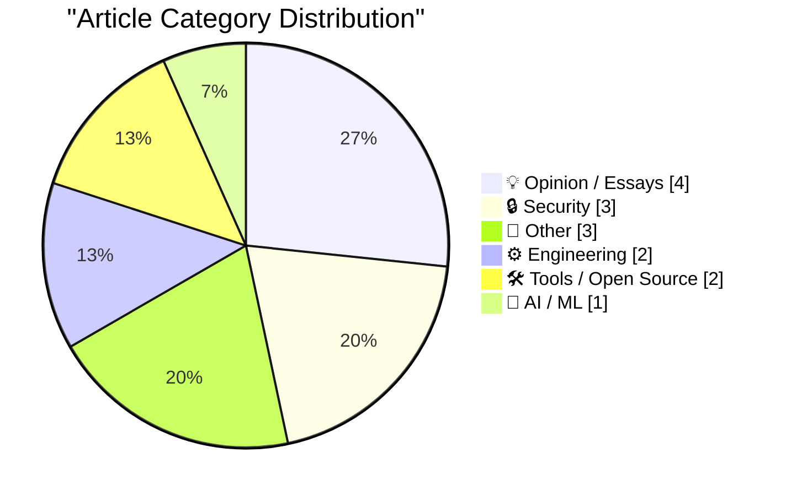
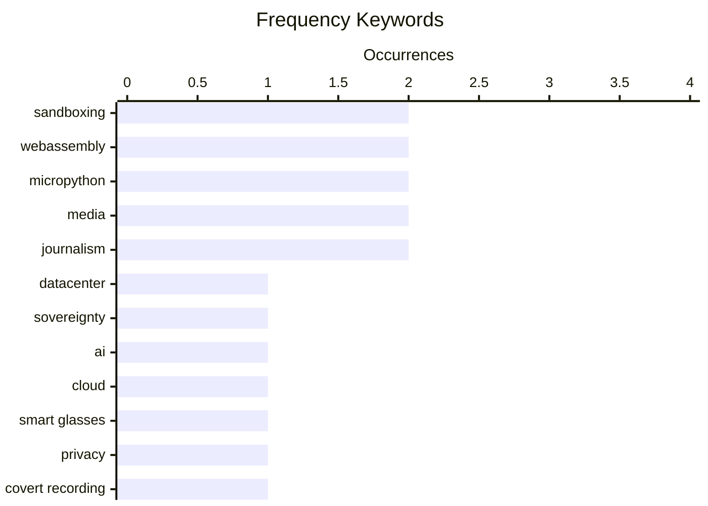

# 📰 AI Blog Daily Digest — 2026-06-04

> From 92 top tech blogs (curated by Karpathy), AI-selected Top 15

## 📝 Today's Highlights

Today’s top tech articles reveal a growing tension between the push for AI sovereignty and the practical costs of AI adoption, as the UK doubles down on domestic datacenters while Uber caps employee usage of tools like Claude Code to manage expenses. Meanwhile, security and privacy concerns are escalating, with an underground market emerging to disable recording indicators on Meta glasses and the Philippines joining Have I Been Pwned to bolster national cybersecurity. A broader backlash against AI-generated content is also surfacing, as readers unsubscribe from newsletters that have lost their human touch, signaling a demand for authenticity in an increasingly automated landscape.

---

## 🏆 Must Read

🥇 **Is datacentre sovereignty really that important?**

martinalderson.com · -89m ago · 💡 Opinion / Essays

> The UK government prioritizes building AI datacenters domestically, but the common justifications for this sovereignty push are weak. Latency arguments are largely irrelevant for most AI workloads, tax benefits are often offset by higher construction costs, and control over data is already governed by legal frameworks rather than physical location. The author argues that the real drivers are political optics and national pride, not technical or economic necessity. The conclusion is that the obsession with datacenter sovereignty is misguided and risks wasting public resources on a non-issue.

💡 **Why it matters**: Provides a clear, evidence-based debunking of a popular policy trend, saving readers from falling for political hype around AI infrastructure.

🏷️ datacenter, sovereignty, AI, cloud

🥈 **The Underworld Market to Remove the Recording Indicator Light on Meta Glasses**

daringfireball.net · 2h ago · 🔒 Security

> A growing underground market on Facebook Marketplace offers to disable the recording indicator light on Ray-Ban Meta glasses for $100, calling it 'Stealth Mode.' Joanna Stern investigates the legality and ethics of this modification, which turns the smart glasses into covert cameras. The service is being offered by individuals across the country, raising significant privacy concerns. The irony is that the market to find these services exists on the same platform where the modification is advertised.

💡 **Why it matters**: A timely and alarming investigation into the real-world privacy implications of smart glasses, showing how quickly consumer tech can be weaponized.

🏷️ smart glasses, privacy, covert recording

🥉 **Welcoming the Philippine Government to Have I Been Pwned**

troyhunt.com · 18h ago · 🔒 Security

> The Philippines becomes the 46th government to join Have I Been Pwned's free government service, allowing its National CERT and DICT to monitor official government domains against HIBP's breach database. This enables the Philippine government to proactively detect compromised credentials and notify affected agencies. The integration strengthens the country's cybersecurity posture by leveraging HIBP's extensive data on data breaches. This marks another step in HIBP's expansion of sovereign cyber defense capabilities.

💡 **Why it matters**: Demonstrates a concrete, scalable model for how governments can use breach data to protect their own infrastructure, relevant for any nation's cybersecurity strategy.

🏷️ data breach, government, HIBP, security

---

## 📊 Data Overview

| Scanned | Articles | Range | Selected |
|:---:|:---:|:---:|:---:|
| 88/92 | 2569 → 37 | 48h | **15** |

### Category Distribution



### High-Frequency Keywords



<details>
<summary>📈 ASCII Keyword Chart (Terminal Friendly)</summary>

```
sandboxing    │ ████████████████████ 2
webassembly   │ ████████████████████ 2
micropython   │ ████████████████████ 2
media         │ ████████████████████ 2
journalism    │ ████████████████████ 2
datacenter    │ ██████████░░░░░░░░░░ 1
sovereignty   │ ██████████░░░░░░░░░░ 1
ai            │ ██████████░░░░░░░░░░ 1
cloud         │ ██████████░░░░░░░░░░ 1
smart glasses │ ██████████░░░░░░░░░░ 1
```

</details>

### 🏷️ Topic Tags

**sandboxing**(2) · **webassembly**(2) · **micropython**(2) · media(2) · journalism(2) · datacenter(1) · sovereignty(1) · ai(1) · cloud(1) · smart glasses(1) · privacy(1) · covert recording(1) · data breach(1) · government(1) · hibp(1) · security(1) · ai budget(1) · cost management(1) · coding agents(1) · ai-generated(1)

---

## 💡 Opinion / Essays

### 1. Is datacentre sovereignty really that important?

[Link](https://martinalderson.com/posts/is-datacentre-sovereignty-really-that-important/?utm_source=rss&amp;utm_medium=rss&amp;utm_campaign=feed) — **martinalderson.com** · -89m ago · ⭐ 25/30

> The UK government prioritizes building AI datacenters domestically, but the common justifications for this sovereignty push are weak. Latency arguments are largely irrelevant for most AI workloads, tax benefits are often offset by higher construction costs, and control over data is already governed by legal frameworks rather than physical location. The author argues that the real drivers are political optics and national pride, not technical or economic necessity. The conclusion is that the obsession with datacenter sovereignty is misguided and risks wasting public resources on a non-issue.

🏷️ datacenter, sovereignty, AI, cloud

---

### 2. Now that your newsletter is AI-generated, I've Unsubscribed

[Link](https://idiallo.com/blog/unsubscribed-from-ai-generated-newsletters?src=feed) — **idiallo.com** · 1h ago · ⭐ 22/30

> The author unsubscribed from a newsletter they had followed for over 20 years after the author switched to AI-generated content without any announcement. The telltale signs were blue high-tech image thumbnails and a loss of personal voice. The core issue is that the author removed themselves from the equation, breaking the trust built over two decades. The conclusion is that AI-generated newsletters are a betrayal of the reader-author relationship, not an improvement.

🏷️ AI-generated, newsletter, trust, authenticity

---

### 3. The Metaverse Was Snake Oil for Isolation

[Link](https://daringfireball.net/linked/2026/06/01/the-metaverse-fever-dream) — **daringfireball.net** · 1 days ago · ⭐ 19/30

> The article argues that the metaverse hype was a direct response to the isolation and loneliness of the COVID-19 lockdowns, not a genuine technological revolution. It draws on Nick Heer's analysis to show how the pandemic's forced reliance on computer platforms for socializing created a market for escapist virtual worlds. The author contends that in 2026, it is now clear the metaverse was 'snake oil'—a product sold to a captive, isolated audience rather than a sustainable innovation. The core point is that the metaverse's appeal was rooted in a temporary crisis of physical isolation, not in solving a permanent human need.

🏷️ metaverse, pandemic, isolation

---

### 4. Pluralistic: The tedious power of storytelling (02 Jun 2026) must-we-pretend

[Link](https://pluralistic.net/2026/06/02/must-we-pretend/) — **pluralistic.net** · 1 days ago · ⭐ 19/30

> The article explores the idea that 'excitement' in storytelling serves a similar function to 'falsifiability' in science—it is a necessary but insufficient condition for quality. It argues that while excitement can drive engagement, it should not be mistaken for artistic merit, just as falsifiability alone does not make a scientific theory valid. The post then lists a series of links to other topics, including a lost Marx Brothers musical, USPTO trademark disputes, 3D scans vs. copyright, and antitrust actions against Amazon and Google. The author's conclusion is that critical thinking about narrative and power structures is essential, even when the subject is seemingly trivial.

🏷️ storytelling, art, criticism, culture

---

## 🔒 Security

### 5. The Underworld Market to Remove the Recording Indicator Light on Meta Glasses

[Link](https://www.youtube.com/watch?v=EaJSPeJmqis) — **daringfireball.net** · 2h ago · ⭐ 24/30

> A growing underground market on Facebook Marketplace offers to disable the recording indicator light on Ray-Ban Meta glasses for $100, calling it 'Stealth Mode.' Joanna Stern investigates the legality and ethics of this modification, which turns the smart glasses into covert cameras. The service is being offered by individuals across the country, raising significant privacy concerns. The irony is that the market to find these services exists on the same platform where the modification is advertised.

🏷️ smart glasses, privacy, covert recording

---

### 6. Welcoming the Philippine Government to Have I Been Pwned

[Link](https://www.troyhunt.com/welcoming-the-philippine-government-to-have-i-been-pwned/) — **troyhunt.com** · 18h ago · ⭐ 24/30

> The Philippines becomes the 46th government to join Have I Been Pwned's free government service, allowing its National CERT and DICT to monitor official government domains against HIBP's breach database. This enables the Philippine government to proactively detect compromised credentials and notify affected agencies. The integration strengthens the country's cybersecurity posture by leveraging HIBP's extensive data on data breaches. This marks another step in HIBP's expansion of sovereign cyber defense capabilities.

🏷️ data breach, government, HIBP, security

---

### 7. Skills Registry Threat Models

[Link](https://nesbitt.io/2026/06/03/skills-registry-threat-models.html) — **nesbitt.io** · 7h ago · ⭐ 20/30

> The author poses a provocative question about the future of software security: how long until a CVE (Common Vulnerabilities and Exposures) is filed against a markdown file? This highlights the growing attack surface as skills registries and other systems increasingly rely on markdown for configuration and documentation. The threat model expands beyond traditional code to include vulnerabilities in human-readable formats. The implication is that security practices must evolve to cover these new vectors.

🏷️ threat model, CVE, markdown, supply chain

---

## 📝 Other

### 8. London Data Store Relaunch

[Link](https://shkspr.mobi/blog/2026/06/london-data-store-relaunch/) — **shkspr.mobi** · 10h ago · ⭐ 21/30

> The London Data Store (data.london.gov.uk) has relaunched after 16 years as a pioneering open data platform. The refresh includes both front-end and back-end updates, transforming it from a mere repository into a celebration of how open data improves Londoners' lives. The relaunch emphasizes the platform's role in enabling civic applications and data-driven decision-making. It remains a benchmark for municipal open data initiatives worldwide.

🏷️ open data, London, data portal, relaunch

---

### 9. CBS News Fires Scott Pelley of ‘60 Minutes’

[Link](https://www.nytimes.com/2026/06/02/business/media/scott-pelley-cbs-bari-weiss.html) — **daringfireball.net** · 2h ago · ⭐ 17/30

> The article reports that CBS News fired veteran '60 Minutes' correspondent Scott Pelley 'for cause effective immediately,' as detailed in a letter from executive Nick Bilton. The author notes that Bilton's letter disputes none of the accusations Pelley made during a staff meeting, and that the firing itself proves Pelley was correct in his criticisms. The piece characterizes Bilton as 'pathetic' and emphasizes that the termination validates Pelley's claims about the network's leadership. The core point is that the firing is a self-damning act that confirms the dysfunction at CBS News.

🏷️ media, firing, journalism

---

### 10. Scott Pelley Accuses CBS News Boss of ‘Murdering’ ‘60 Minutes’

[Link](https://www.nytimes.com/2026/06/01/business/media/cbs-60-minutes-scott-pelley-nick-bilton.html?unlocked_article_code=1.nFA.TDGJ.HbBmlXuQWmcQ&amp;smid=url-share) — **daringfireball.net** · 1 days ago · ⭐ 17/30

> The article details an extraordinary staff meeting where '60 Minutes' correspondent Scott Pelley angrily accused new executive producer Nick Bilton and editor-in-chief Bari Weiss of 'murdering' the iconic Sunday news program. Pelley's voice reportedly shook as he confronted Bilton, highlighting a deep internal crisis at CBS News over the show's direction and integrity. The reporting captures the raw conflict between veteran journalists and new leadership, with Pelley framing the changes as a betrayal of the program's legacy. The conclusion is that the network is in turmoil, with a fundamental clash over the mission of '60 Minutes'.

🏷️ media, controversy, journalism

---

## ⚙️ Engineering

### 11. A survey of inlining heuristics

[Link](https://bernsteinbear.com/blog/inlining-heuristics/?utm_source=rss) — **bernsteinbear.com** · 22h ago · ⭐ 21/30

> This article surveys inlining heuristics used by compilers, particularly method JIT compilers for dynamic languages like Ruby. It notes that methods are typically small, especially in Ruby where even instance variable access uses method dispatch. The author explores how compilers decide which functions to inline to optimize performance, balancing code size against execution speed. The survey covers various strategies without claiming a single best approach.

🏷️ compilers, JIT, inlining, heuristics

---

### 12. Naively summing an alternating series

[Link](https://www.johndcook.com/blog/2026/06/03/naive-sum/) — **johndcook.com** · 7h ago · ⭐ 19/30

> The article demonstrates the pitfalls of naively summing an alternating series, such as the exponential function's power series, by simply stopping when the next term falls below a tolerance of 10⁻¹². It explains that this approach can lead to significant errors because the truncation error for an alternating series is bounded by the first omitted term, but only if the terms are monotonically decreasing. The author shows that for the exponential series with a negative argument, the terms initially grow before shrinking, causing the naive method to stop too early and produce inaccurate results. The conclusion is that careful error analysis and understanding of series behavior are critical for numerical computation.

🏷️ numerical analysis, alternating series, precision

---

## 🛠 Tools / Open Source

### 13. datasette-agent-micropython 0.1a0

[Link](https://simonwillison.net/2026/Jun/2/datasette-agent-micropython/#atom-everything) — **simonwillison.net** · 1 days ago · ⭐ 19/30

> The author released datasette-agent-micropython 0.1a0, an alpha package that enables Datasette Agent to generate and execute Python code safely using a MicroPython sandbox. The sandbox is built on WebAssembly via wasmtime, and early testing shows GPT-5.5 has so far failed to break out of it. This represents a promising approach to safe AI-generated code execution. The project is still in early alpha but shows potential for secure agent-based systems.

🏷️ sandboxing, WebAssembly, Datasette, MicroPython

---

### 14. micropython-wasm 0.1a0

[Link](https://simonwillison.net/2026/Jun/2/micropython-wasm-2/#atom-everything) — **simonwillison.net** · 1 days ago · ⭐ 19/30

> The author released micropython-wasm 0.1a0, an alpha package that bundles a lightly customized WebAssembly build of MicroPython with a wrapper for execution via wasmtime. This is the latest sandboxing experiment aimed at safely running Python code in isolated environments. The package provides a foundation for executing untrusted Python code without compromising the host system. It is designed for integration with tools like Datasette Agent.

🏷️ MicroPython, WebAssembly, sandboxing

---

## 🤖 AI / ML

### 15. Uber Caps Usage of AI Tools Like Claude Code to Manage Costs

[Link](https://simonwillison.net/2026/Jun/3/uber-caps-usage/#atom-everything) — **simonwillison.net** · 10h ago · ⭐ 23/30

> Uber is capping employee usage of AI coding tools like Claude Code at $1,500 per month per person after blowing its entire 2026 AI budget in just four months. The budget was set in 2025, before the explosion in token-burning coding agents, making the overspend predictable. The cap applies to all AI coding tools, not just Claude Code. This highlights the financial shock companies face as AI coding agents consume tokens at unprecedented rates.

🏷️ AI budget, cost management, coding agents

---

*Generated on 2026-06-04 | Scanned 88 sources → Found 2569 articles → Selected 15 articles*
*Based on [Hacker News Popularity Contest 2025](https://refactoringenglish.com/tools/hn-popularity/) RSS feeds list, curated by [Andrej Karpathy](https://x.com/karpathy).*
*Created by "Understand AI".*
