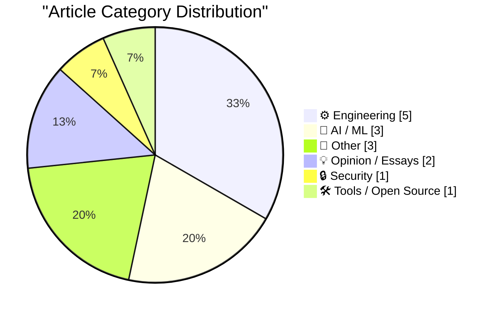
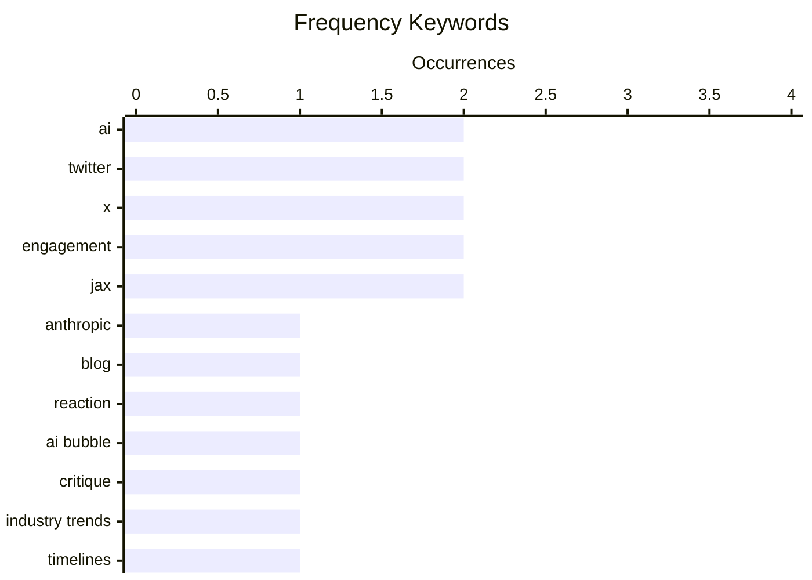

# 📰 AI Blog Daily Digest — 2026-06-06

> From 92 top tech blogs (curated by Karpathy), AI-selected Top 15

## 📝 Today's Highlights

Today’s tech discourse is dominated by a fierce debate over the true state and trajectory of artificial intelligence, with prominent voices both panning the industry as a speculative bubble and challenging claims of imminent breakthroughs. Meanwhile, the engineering community is focused on practical infrastructure challenges, from aggressive caching strategies for decentralized platforms like Mastodon to deep dives into security practices for package managers and hardware testing for homelab IP KVMs. A notable shift in open-source governance is also emerging, as the Ladybird browser project moves away from public pull requests, signaling a broader trend toward tighter control in software development.

---

## 🏆 Must Read

🥇 **No need to panic about Anthropic’s new blog**

garymarcus.substack.com · 21h ago · 🤖 AI / ML

> Gary Marcus argues that Anthropic's latest blog post, which claims to have made a breakthrough in AI interpretability, does not warrant panic. He critiques the methodology, suggesting the results are overhyped and do not demonstrate a fundamental understanding of model internals. Marcus points out that similar claims have been made before and failed to materialize into practical safety solutions. He concludes that the AI community should remain skeptical and not overreact to incremental, potentially flawed research.

💡 **Why it matters**: Provides a critical, expert take on a hyped AI safety claim, helping readers avoid unnecessary alarm and understand the limitations of current interpretability research.

🏷️ Anthropic, AI, blog, reaction

🥈 **Premium: The Hater's Guide To The AI Bubble 3.0**

wheresyoured.at · 6h ago · 💡 Opinion / Essays

> Ed Zitron continues his series critiquing the AI industry, arguing that the current AI boom is a speculative bubble driven by hype, not sustainable value. He dissects the financial and operational realities of AI companies, highlighting massive capital expenditures, lack of profitable use cases, and a disconnect between investor expectations and actual product utility. Zitron concludes that the bubble is inflating further and will eventually burst, leaving many investors and companies stranded.

💡 **Why it matters**: Offers a sharp, contrarian financial analysis of the AI industry, essential for understanding the economic risks behind the technology hype.

🏷️ AI bubble, critique, industry trends

🥉 **Sir Demis Hassabis vs Sir Demis Hassabis**

garymarcus.substack.com · 8h ago · 🤖 AI / ML

> Gary Marcus contrasts two conflicting timelines from Demis Hassabis regarding when Artificial General Intelligence (AGI) will arrive. He highlights Hassabis's public statements that AGI is 'a few years away' against his more cautious internal or private remarks suggesting it could take decades. Marcus uses this contradiction to argue that even leading AI figures are uncertain and often overpromise. He concludes that the public should be wary of AGI timelines from those with a vested interest in hype.

💡 **Why it matters**: Exposes the inconsistency in AGI predictions from a top AI leader, providing a valuable reality check for anyone following AI progress claims.

🏷️ AI, timelines, Demis Hassabis

---

## 📊 Data Overview

| Scanned | Articles | Range | Selected |
|:---:|:---:|:---:|:---:|
| 87/92 | 2544 → 45 | 48h | **15** |

### Category Distribution



### High-Frequency Keywords



<details>
<summary>📈 ASCII Keyword Chart (Terminal Friendly)</summary>

```
ai         │ ████████████████████ 2
twitter    │ ████████████████████ 2
x          │ ████████████████████ 2
engagement │ ████████████████████ 2
jax        │ ████████████████████ 2
anthropic  │ ██████████░░░░░░░░░░ 1
blog       │ ██████████░░░░░░░░░░ 1
reaction   │ ██████████░░░░░░░░░░ 1
ai bubble  │ ██████████░░░░░░░░░░ 1
critique   │ ██████████░░░░░░░░░░ 1
```

</details>

### 🏷️ Topic Tags

**ai**(2) · **twitter**(2) · **x**(2) · engagement(2) · jax(2) · anthropic(1) · blog(1) · reaction(1) · ai bubble(1) · critique(1) · industry trends(1) · timelines(1) · demis hassabis(1) · ai enthusiasts(1) · ai skeptics(1) · software development(1) · race(1) · package managers(1) · allowlists(1) · security(1)

---

## ⚙️ Engineering

### 1. Aggressive caching for a Mastodon reverse proxy: what to cache, what to never cache, and why content negotiation will eventually betray you

[Link](https://it-notes.dragas.net/2026/06/05/aggressive_caching_for_a_mastodon_reverse_proxy/) — **it-notes.dragas.net** · 13h ago · ⭐ 22/30

> The author details an aggressive caching strategy for a Mastodon instance (mastodon.bsd.cafe) using nginx on FreeBSD, explaining what to cache (public, static assets) and what to never cache (user-specific, authenticated content). A key finding is that HTTP content negotiation (for different media types like JSON vs. HTML) can break caching if not handled carefully, leading to stale or incorrect responses. The configuration shared achieves significant load reduction on the application server. The author concludes that with careful rules, a reverse proxy can absorb the vast majority of public, repetitive requests.

🏷️ Mastodon, caching, reverse proxy, content negotiation

---

### 2. Quoting Andreas Kling

[Link](https://simonwillison.net/2026/Jun/5/andreas-kling/#atom-everything) — **simonwillison.net** · 11h ago · ⭐ 21/30

> Andreas Kling announces that the Ladybird browser project will no longer accept public pull requests due to the rise of AI-generated code. He argues that a substantial patch is no longer a reliable proxy for good faith effort, as AI can produce large amounts of plausible-looking code. The project will now require contributors to be directly responsible for changes they introduce. Kling concludes that for a browser targeting real users, code provenance and accountability must take priority over open contribution volume.

🏷️ open source, pull requests, AI-generated code, maintainer trust

---

### 3. Rotation revisited: Cycle decomposition in clang’s libcxx

[Link](https://devblogs.microsoft.com/oldnewthing/20260604-00/?p=112384) — **devblogs.microsoft.com/oldnewthing** · 1 days ago · ⭐ 19/30

> Raymond Chen explains how clang's libc++ implements array rotation using cycle decomposition to achieve the minimum number of element moves. The technique works by tracing the permutation cycles of the rotation operation and moving elements directly to their final positions. This approach is more efficient than naive methods like repeated single-element shifts. Chen concludes that while mathematically elegant, cycle decomposition is primarily useful when element moves are expensive, such as with non-trivial types.

🏷️ rotation, cycle decomposition, libcxx, clang

---

### 4. Using Safetensors with Flax

[Link](https://www.gilesthomas.com/2026/06/flax-and-safetensors) — **gilesthomas.com** · 23h ago · ⭐ 18/30

> The author documents porting PyTorch LLM code to JAX/Flax and needing to use Safetensors for checkpoint storage. Despite Safetensors' official docs lacking a JAX implementation, the trick is to use the `safetensors.flax` module (from the `safetensors` Python package) which works seamlessly with Flax models. The key insight is that `safetensors.flax` exists and is functional, even though it's not prominently documented, solving the checkpoint compatibility issue between PyTorch and JAX.

🏷️ Safetensors, Flax, JAX, checkpoints

---

### 5. JAX backends and devices

[Link](https://www.gilesthomas.com/2026/06/jax-backends-and-devices) — **gilesthomas.com** · 3h ago · ⭐ 18/30

> While porting PyTorch LLM code to JAX, the author encountered a CUDA out-of-memory error when loading a 19GiB dataset (10.2 billion 16-bit integers) using `safetensors.flax.load_file`. The error occurred because JAX's default device placement tries to load the entire tensor onto a single GPU. The solution involves using `jax.device_put` with sharding or loading data in chunks to distribute across available devices, highlighting a key difference in memory management between PyTorch and JAX.

🏷️ JAX, backends, devices, dataset

---

## 🤖 AI / ML

### 6. No need to panic about Anthropic’s new blog

[Link](https://garymarcus.substack.com/p/no-need-to-panic-about-anthropics) — **garymarcus.substack.com** · 21h ago · ⭐ 24/30

> Gary Marcus argues that Anthropic's latest blog post, which claims to have made a breakthrough in AI interpretability, does not warrant panic. He critiques the methodology, suggesting the results are overhyped and do not demonstrate a fundamental understanding of model internals. Marcus points out that similar claims have been made before and failed to materialize into practical safety solutions. He concludes that the AI community should remain skeptical and not overreact to incremental, potentially flawed research.

🏷️ Anthropic, AI, blog, reaction

---

### 7. Sir Demis Hassabis vs Sir Demis Hassabis

[Link](https://garymarcus.substack.com/p/sir-demis-hassabis-vs-sir-demis-hassabis) — **garymarcus.substack.com** · 8h ago · ⭐ 23/30

> Gary Marcus contrasts two conflicting timelines from Demis Hassabis regarding when Artificial General Intelligence (AGI) will arrive. He highlights Hassabis's public statements that AGI is 'a few years away' against his more cautious internal or private remarks suggesting it could take decades. Marcus uses this contradiction to argue that even leading AI figures are uncertain and often overpromise. He concludes that the public should be wary of AGI timelines from those with a vested interest in hype.

🏷️ AI, timelines, Demis Hassabis

---

### 8. Checking in on Perplexity

[Link](https://daringfireball.net/linked/2025/08/05/regarding-those-rumors-of-apple-pursuing-an-acquisition-of-perplexity) — **daringfireball.net** · 7h ago · ⭐ 20/30

> John Gruber revisits his earlier skepticism about Apple acquiring Perplexity AI, noting that the startup has since slipped into the 'afterthought' tier of AI companies. He references ongoing negative press and declining relevance, arguing that Perplexity's rumored acquisition talks with Apple are more likely seeded by Perplexity itself than by Apple executives. Gruber concludes that Perplexity's current position makes it an unlikely and unattractive acquisition target for Apple.

🏷️ Perplexity, Apple, AI search, partnership

---

## 📝 Other

### 9. Nieman Journalism Lab: Twitter/X Punishes Accounts That Post Links

[Link](https://www.niemanlab.org/2026/04/do-links-hurt-news-publishers-on-twitter-our-analysis-suggests-yes/) — **daringfireball.net** · 1h ago · ⭐ 18/30

> Nieman Journalism Lab analyzed 200 recent tweets from 18 large publishers (6 paywalled, 9 free) on X and found that posts containing links receive significantly lower engagement (likes + comments + retweets) than those without. The analysis suggests X's algorithm actively suppresses link-containing posts, harming news publishers' organic reach. Paywalled publishers like Bloomberg and NYT were among those affected, while non-paywalled outlets like BBC and Reuters saw similar penalties. The core finding is that X's algorithm devalues link-sharing, undermining a primary traffic driver for news organizations.

🏷️ Twitter, X, engagement, publishers

---

### 10. Elon Musk’s X Is a Freak Show

[Link](https://www.natesilver.net/p/social-media-has-become-a-freak-show) — **daringfireball.net** · 2h ago · ⭐ 18/30

> Nate Silver analyzes a bubble chart of X's most-engaged accounts in February 2026, finding the platform's top traffic is dominated by low-quality, highly partisan accounts he had never heard of. He argues that X's remaining engagement is a 'freak show' of extreme content, with mainstream or quality accounts largely absent from the top ranks. The data suggests the platform's algorithm rewards outrage and partisanship over substance, accelerating its decline into a niche space for toxic engagement.

🏷️ Twitter, X, engagement, freak show

---

### 11. Book Review: Accessible Communications by Lisa Riemers and Matisse Hamel-Nelis ★★★★★

[Link](https://shkspr.mobi/blog/2026/06/book-review-accessible-communications-by-lisa-riemers-and-matisse-hamel-nelis/) — **shkspr.mobi** · 1 days ago · ⭐ 18/30

> This book review covers 'Accessible Communications' by Lisa Riemers and Matisse Hamel-Nelis, which provides a practical guide to creating accessible communications across multiple legal jurisdictions, ethical frameworks, and business cases. The book moves from convincing readers of the necessity of accessibility to detailed how-to instructions for implementation. It is praised for bridging theory and practice, making it useful for professionals in communications, UX, and compliance.

🏷️ accessibility, communications, book review

---

## 💡 Opinion / Essays

### 12. Premium: The Hater's Guide To The AI Bubble 3.0

[Link](https://www.wheresyoured.at/premium-the-haters-guide-to-the-ai-bubble-3-0/) — **wheresyoured.at** · 6h ago · ⭐ 24/30

> Ed Zitron continues his series critiquing the AI industry, arguing that the current AI boom is a speculative bubble driven by hype, not sustainable value. He dissects the financial and operational realities of AI companies, highlighting massive capital expenditures, lack of profitable use cases, and a disconnect between investor expectations and actual product utility. Zitron concludes that the bubble is inflating further and will eventually burst, leaving many investors and companies stranded.

🏷️ AI bubble, critique, industry trends

---

### 13. AI enthusiasts are in a race against time, AI skeptics are in a race against entropy

[Link](https://simonwillison.net/2026/Jun/4/ai-enthusiasts-ai-skeptics/#atom-everything) — **simonwillison.net** · 22h ago · ⭐ 22/30

> Charity Majors' observation, quoted by Simon Willison, frames the AI debate as a race between two opposing forces: enthusiasts racing against time to build with AI before it becomes obsolete, and skeptics racing against entropy to maintain reliable, maintainable systems. The post notes that enthusiasts are seeing real, discontinuous leaps in capability from teams that fully commit to AI workflows. Willison concludes that this dynamic creates genuine tension within engineering teams, as both perspectives have valid points.

🏷️ AI enthusiasts, AI skeptics, software development, race

---

## 🔒 Security

### 14. Install-script allowlists

[Link](https://nesbitt.io/2026/06/05/install-script-allowlists.html) — **nesbitt.io** · 10h ago · ⭐ 22/30

> This post surveys how different package managers and language ecosystems handle the security risk of install scripts that run arbitrary code. It compares allowlist mechanisms across tools like npm, pip, Homebrew, and others, noting which ones require explicit user approval and which do not. The analysis reveals significant inconsistency in security practices, with some ecosystems offering no protection at all. The author concludes that a standardized, opt-in allowlist approach would greatly improve supply chain security.

🏷️ package managers, allowlists, security, install scripts

---

## 🛠 Tools / Open Source

### 15. I tested every IP KVM in my Homelab

[Link](https://www.jeffgeerling.com/blog/2026/i-tested-every-ip-kvm/) — **jeffgeerling.com** · 8h ago · ⭐ 20/30

> Jeff Geerling tests nearly every IP KVM (Keyboard, Video, Mouse) device available for homelabs, comparing solutions like PiKVM, JetKVM, and others since the PiKVM's 2017 debut. He evaluates them on features, reliability, latency, and ease of setup, noting that while software solutions like VNC or Tailscale work for many cases, IP KVMs are essential for bare-metal server management and BIOS-level access. The comparison highlights trade-offs between cost, performance, and open-source support. Geerling concludes that PiKVM remains the gold standard for most users, but newer competitors offer compelling alternatives.

🏷️ IP KVM, PiKVM, homelab, remote control

---

*Generated on 2026-06-06 | Scanned 87 sources → Found 2544 articles → Selected 15 articles*
*Based on [Hacker News Popularity Contest 2025](https://refactoringenglish.com/tools/hn-popularity/) RSS feeds list, curated by [Andrej Karpathy](https://x.com/karpathy).*
*Created by "Understand AI".*
