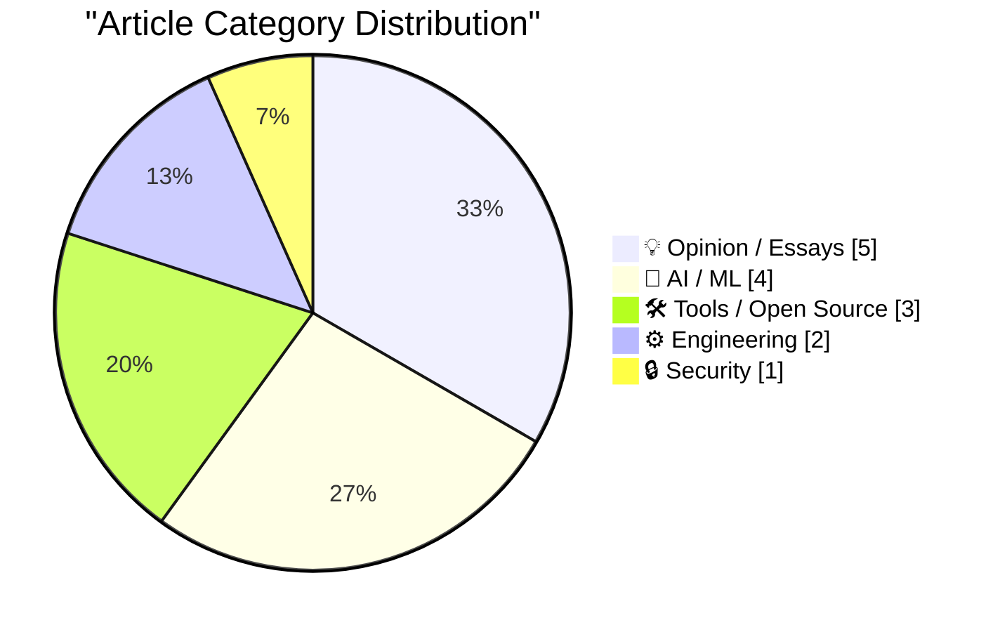
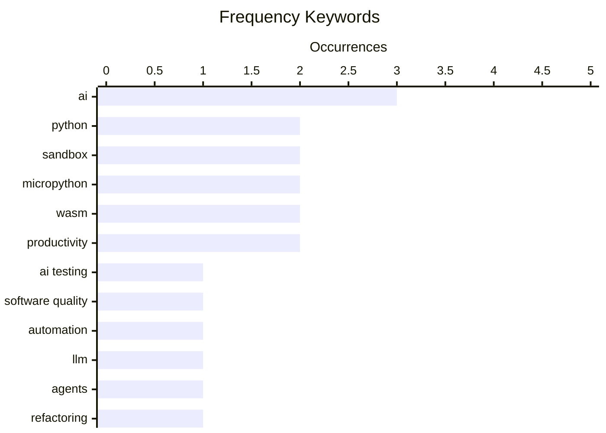

# 📰 AI Blog Daily Digest — 2026-06-08

> From 92 top tech blogs (curated by Karpathy), AI-selected Top 15

## 📝 Today's Highlights

Today’s tech landscape is sharply divided between the promise and peril of AI, with developers grappling with AI-generated code’s trade-offs and productivity paradoxes, while market events and security launches signal a maturing but volatile industry. A major theme is the tension between AI acceleration and human craftsmanship, as engineers explore LLM agents for project restructuring and debate the value of slower, more deliberate work. Meanwhile, security and regulation take center stage, with OpenAI rolling out Lockdown Mode and legal battles over AI style protection, even as experts push back against misinterpretations of AI development pauses.

---

## 🏆 Must Read

🥇 **A new era for software testing**

antirez.com · 12h ago · ⚙️ Engineering

> Antirez explores the trade-off between AI-generated code and hand-written software, arguing that while automatic programming rarely matches the structural quality and complexity economy of the best human code, it often surpasses 'decently developed' hand-written code in practice. The core problem is balancing quality against development speed in software testing. Key findings suggest that in the right hands and for certain use cases, AI can dramatically speed up writing software, but the output lacks the elegance of top-tier manual work. The author concludes that the real decision is not AI versus human, but rather a pragmatic choice between time and quality, where AI frequently wins for most practical scenarios.

💡 **Why it matters**: Provides a nuanced, experience-based perspective on AI code generation that cuts through hype, directly addressing when and why AI code is actually better or worse than human-written code.

🏷️ AI testing, software quality, automation

🥈 **Thoughts on starting new projects with LLM agents**

eli.thegreenplace.net · 21h ago · 🤖 AI / ML

> Eli Bendersky reports on successfully using LLM agents to restructure a Python project, noting the rewrite has been maintainable without issues months later. The article discusses the practical workflow of starting new projects with LLM agents, focusing on how to effectively delegate tasks and manage the agent's output. Key arguments include that LLM agents can handle significant refactoring work but require careful oversight and clear specifications. The author concludes that LLM agents are a viable tool for project restructuring when used with proper boundaries and review processes.

💡 **Why it matters**: Offers a rare, concrete post-mortem on a real-world LLM agent project rewrite, providing actionable insights for developers considering similar approaches.

🏷️ LLM, agents, refactoring, Python

🥉 **Running Python code in a sandbox with MicroPython and WASM**

simonwillison.net · 1 days ago · 🛠 Tools / Open Source

> Simon Willison introduces `micropython-wasm`, an alpha package that runs MicroPython in a WebAssembly sandbox for secure code execution, specifically as a plugin for Datasette Agent. The core problem is finding a safe, isolated environment to run untrusted Python code without compromising the host system. The solution combines MicroPython's minimal footprint with WebAssembly's sandboxing guarantees, providing a lightweight yet secure execution context. Willison concludes that this approach finally meets all his requirements for a code sandbox: security, performance, and ease of integration.

💡 **Why it matters**: Presents a practical, immediately usable solution for sandboxing Python code that solves a long-standing security challenge for data tools and web applications.

🏷️ sandbox, MicroPython, WASM, Python

---

## 📊 Data Overview

| Scanned | Articles | Range | Selected |
|:---:|:---:|:---:|:---:|
| 87/92 | 2554 → 30 | 48h | **15** |

### Category Distribution



### High-Frequency Keywords



<details>
<summary>📈 ASCII Keyword Chart (Terminal Friendly)</summary>

```
ai               │ ████████████████████ 3
python           │ █████████████░░░░░░░ 2
sandbox          │ █████████████░░░░░░░ 2
micropython      │ █████████████░░░░░░░ 2
wasm             │ █████████████░░░░░░░ 2
productivity     │ █████████████░░░░░░░ 2
ai testing       │ ███████░░░░░░░░░░░░░ 1
software quality │ ███████░░░░░░░░░░░░░ 1
automation       │ ███████░░░░░░░░░░░░░ 1
llm              │ ███████░░░░░░░░░░░░░ 1
```

</details>

### 🏷️ Topic Tags

**ai**(3) · **python**(2) · **sandbox**(2) · micropython(2) · wasm(2) · productivity(2) · ai testing(1) · software quality(1) · automation(1) · llm(1) · agents(1) · refactoring(1) · slop(1) · black friday(1) · market(1) · anthropic(1) · ai pause(1) · misinformation(1) · openai(1) · lockdown(1)

---

## 💡 Opinion / Essays

### 1. Communities of Not

[Link](https://lucumr.pocoo.org/2026/6/6/communities-of-not/) — **lucumr.pocoo.org** · 1 days ago · ⭐ 22/30

> Armin Ronacher examines the phenomenon of 'communities of not'—groups that form around opposition to something, such as childfree spaces, anti-car advocates, or LLM-skeptical developer communities. The core problem is that these communities, while starting with positive goals (autonomy, safer streets, code quality), often become defined by what they oppose rather than what they stand for. The thing being refused becomes the main subject of the community's identity, creating a negative feedback loop. Ronacher concludes that such communities risk becoming trapped in opposition, limiting their ability to build constructive alternatives.

🏷️ community, identity, opposition

---

### 2. Copping My Style

[Link](https://feed.tedium.co/link/15204/17355475/adobe-creator-act-style-protection-commentary) — **tedium.co** · 19h ago · ⭐ 22/30

> Tedium explores the Adobe-backed 'Creator Act', a bill that would legally protect artistic styles—something currently not possible under copyright law. The core problem is that AI can now replicate artistic styles at scale, creating a legal vacuum around style ownership. The bill represents a direct response to AI-generated art that mimics human creators' distinctive styles. The author concludes that the legal lines are deeply blurred, as style protection could stifle artistic inspiration and fair use while attempting to address legitimate AI harms.

🏷️ AI, copyright, style, legislation

---

### 3. Doing nothing at work

[Link](https://seangoedecke.com/doing-nothing-at-work/) — **seangoedecke.com** · 1 days ago · ⭐ 21/30

> Sean Goedecke argues that many engineers should work fewer hours and at a slower pace, aiming for 80% utilization by default with 20% of the workday spent away from the computer. The core insight is that performance at tech companies is dominated by outlier events, not consistent output. Working less allows engineers to be more available for those high-impact opportunities when they arise. Goedecke concludes that deliberate underutilization is a strategic advantage, not laziness, because it creates capacity for the moments that truly matter.

🏷️ productivity, work pace, engineering culture

---

### 4. Why all the PRs?

[Link](https://idiallo.com/blog/why-all-the-prs) — **idiallo.com** · 1 days ago · ⭐ 21/30

> It's a signal. That's why we get AI-generated PRs. We told everyone, in order to get your resume taken seriously, you need to show your work. When I was getting started in my career, that meant having

🏷️ AI-generated PRs, open source, signaling

---

### 5. Pluralistic: Criticizing the everything machine (06 Jun 2026)

[Link](https://pluralistic.net/2026/06/06/applied-counterescatology/) — **pluralistic.net** · 1 days ago · ⭐ 21/30

> Today's links Criticizing the everything machine: It slices, it dices, it even makes paperclips! Hey look at this: Delights to delectate. Object permanence: Parliament v DRM; Colbert's commencement; C

🏷️ criticism, technology, society

---

## 🤖 AI / ML

### 6. Thoughts on starting new projects with LLM agents

[Link](https://eli.thegreenplace.net/2026/thoughts-on-starting-new-projects-with-llm-agents/) — **eli.thegreenplace.net** · 21h ago · ⭐ 25/30

> Eli Bendersky reports on successfully using LLM agents to restructure a Python project, noting the rewrite has been maintainable without issues months later. The article discusses the practical workflow of starting new projects with LLM agents, focusing on how to effectively delegate tasks and manage the agent's output. Key arguments include that LLM agents can handle significant refactoring work but require careful oversight and clear specifications. The author concludes that LLM agents are a viable tool for project restructuring when used with proper boundaries and review processes.

🏷️ LLM, agents, refactoring, Python

---

### 7. Slop, productivity, and why the AI-fueled world is going nowhere mighty fast

[Link](https://garymarcus.substack.com/p/slop-productivity-and-why-the-ai) — **garymarcus.substack.com** · 6h ago · ⭐ 24/30

> Gary Marcus cites an FT graph from John Burn-Murdoch to argue that the AI-fueled world is producing massive amounts of 'slop' without corresponding productivity gains. The core problem is that despite massive investment and deployment of AI, measurable productivity growth remains stagnant. Key evidence points to a disconnect between AI output volume and actual economic value creation. Marcus concludes that the current AI boom is generating more noise than substance, failing to deliver on promised productivity transformations.

🏷️ AI, productivity, slop

---

### 8. AI’s Black Friday

[Link](https://garymarcus.substack.com/p/ais-black-friday) — **garymarcus.substack.com** · 1 days ago · ⭐ 23/30

> Gary Marcus analyzes a significant market event he calls 'AI's Black Friday', likely referring to a major stock sell-off or industry shakeup in the AI sector. The article offers thoughts on what just happened, interpreting the event as a market correction reflecting overvaluation and unmet expectations. Marcus argues that the AI industry's inflated promises are finally colliding with reality, leading to investor panic. The conclusion suggests this is a necessary reset that will separate viable AI companies from those built on hype.

🏷️ AI, Black Friday, market

---

### 9. No, Anthropic did not call for a pause on AI development

[Link](https://garymarcus.substack.com/p/no-anthropic-did-not-call-for-a-pause) — **garymarcus.substack.com** · 1 days ago · ⭐ 23/30

> Gary Marcus corrects a widespread misinterpretation of Anthropic's recent statement, clarifying that the company did not actually call for a pause on AI development. The core issue is media and public misreading of Anthropic's nuanced position on AI safety. Marcus dissects the original statement to show that Anthropic's actual recommendations were far more moderate than the 'pause' narrative suggests. The author concludes that the misrepresentation reflects a broader pattern of sensationalism in AI reporting.

🏷️ Anthropic, AI pause, misinformation

---

## 🛠 Tools / Open Source

### 10. Running Python code in a sandbox with MicroPython and WASM

[Link](https://simonwillison.net/2026/Jun/6/micropython-in-a-sandbox/#atom-everything) — **simonwillison.net** · 1 days ago · ⭐ 24/30

> Simon Willison introduces `micropython-wasm`, an alpha package that runs MicroPython in a WebAssembly sandbox for secure code execution, specifically as a plugin for Datasette Agent. The core problem is finding a safe, isolated environment to run untrusted Python code without compromising the host system. The solution combines MicroPython's minimal footprint with WebAssembly's sandboxing guarantees, providing a lightweight yet secure execution context. Willison concludes that this approach finally meets all his requirements for a code sandbox: security, performance, and ease of integration.

🏷️ sandbox, MicroPython, WASM, Python

---

### 11. This Week in Package Management: 6 June 2026

[Link](https://nesbitt.io/2026/06/06/this-week-in-package-management.html) — **nesbitt.io** · 1 days ago · ⭐ 20/30

> Releases, advisories, and articles from across the package management world

🏷️ package management, releases, advisories

---

### 12. micropython-wasm 0.1a2

[Link](https://simonwillison.net/2026/Jun/6/micropython-wasm/#atom-everything) — **simonwillison.net** · 1 days ago · ⭐ 19/30

> Release: micropython-wasm 0.1a2 I added a CLI to micropython-wasm ( issue #7 ), inspired by the first draft of the blog entry when I realized it would be a great way to illustrate the Try it yourself 

🏷️ MicroPython, WASM, sandbox, CLI

---

## ⚙️ Engineering

### 13. A new era for software testing

[Link](http://antirez.com/news/168) — **antirez.com** · 12h ago · ⭐ 26/30

> Antirez explores the trade-off between AI-generated code and hand-written software, arguing that while automatic programming rarely matches the structural quality and complexity economy of the best human code, it often surpasses 'decently developed' hand-written code in practice. The core problem is balancing quality against development speed in software testing. Key findings suggest that in the right hands and for certain use cases, AI can dramatically speed up writing software, but the output lacks the elegance of top-tier manual work. The author concludes that the real decision is not AI versus human, but rather a pragmatic choice between time and quality, where AI frequently wins for most practical scenarios.

🏷️ AI testing, software quality, automation

---

### 14. Getting silly with C, part &((int*)-8)[3]

[Link](https://lcamtuf.substack.com/p/getting-silly-with-c-part-and-int1) — **lcamtuf.substack.com** · 1 days ago · ⭐ 19/30

> Read on to uplevel your coding SKILLS.md.

🏷️ C programming, pointers, tricks

---

## 🔒 Security

### 15. OpenAI Help: Lockdown Mode

[Link](https://simonwillison.net/2026/Jun/5/openai-help-lockdown-mode/#atom-everything) — **simonwillison.net** · 1 days ago · ⭐ 22/30

> OpenAI has launched 'Lockdown Mode', a security feature rolling out to Free, Go, Plus, Pro, and self-serve ChatGPT Business accounts that limits outbound network requests to prevent data exfiltration from prompt injection attacks. The core problem is that prompt injections can trick ChatGPT into sending sensitive data to attackers. Lockdown Mode specifically targets the final stage of exfiltration by blocking unauthorized outbound connections, though it does not prevent prompt injections from appearing in generated content. The feature was first teased in February 2026 and is now live.

🏷️ OpenAI, lockdown, data exfiltration, security

---

*Generated on 2026-06-08 | Scanned 87 sources → Found 2554 articles → Selected 15 articles*
*Based on [Hacker News Popularity Contest 2025](https://refactoringenglish.com/tools/hn-popularity/) RSS feeds list, curated by [Andrej Karpathy](https://x.com/karpathy).*
*Created by "Understand AI".*
