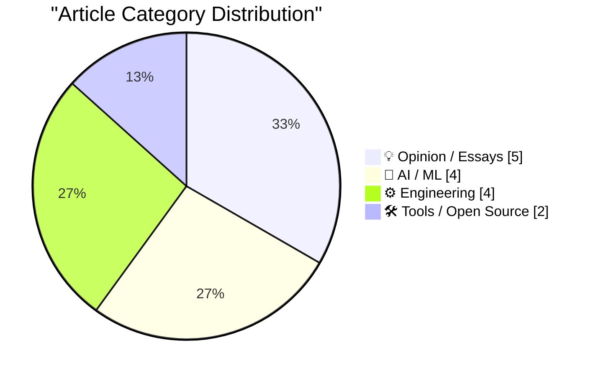
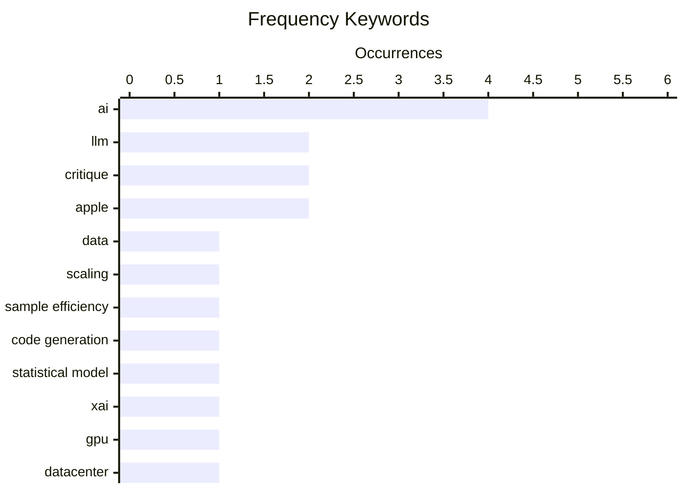

# 📰 AI Blog Daily Digest — 2026-06-09

> From 92 top tech blogs (curated by Karpathy), AI-selected Top 15

## 📝 Today's Highlights

Today’s top articles reveal a tech landscape grappling with the limits of artificial intelligence, both in terms of technical progress and financial sustainability. A dominant trend is the growing skepticism around AI’s current trajectory, with pieces arguing that the field is hitting a “sample efficiency black hole,” slowing down, and being propped up by unsustainable financial math. Meanwhile, the industry’s operational reality is laid bare by reports of xAI pivoting to a GPU rental model, highlighting a shift from frontier research to infrastructure commoditization. Finally, a recurring theme in opinion pieces challenges the quality of modern software development, critiquing tools like SwiftUI for enabling bad app design and reasserting that coding itself is a fundamental act of design.

---

## 🏆 Must Read

🥇 **The sample efficiency black hole**

dwarkesh.com · 4h ago · 🤖 AI / ML

> The article argues that the current AI paradigm is a 'sample efficiency black hole,' where massive amounts of data are required to produce seemingly intelligent behavior. The core problem is that models like GPT-4 consume internet-scale data but still lack true understanding, relying on brute-force pattern matching rather than efficient learning. The author suggests that this approach is unsustainable and masks a fundamental lack of progress in sample efficiency. The conclusion is that the industry's focus on scaling data and compute is a dead end, and real breakthroughs require new architectures that learn from far fewer examples.

💡 **Why it matters**: Provides a sharp, contrarian critique of the scaling hypothesis that dominates current AI research, forcing readers to question the long-term viability of the data-hungry approach.

🏷️ data, scaling, sample efficiency, LLM

🥈 **Stairway to Heaven**

geohot.github.io · 1 days ago · 🤖 AI / ML

> The post argues that current AI code generation models are 'highly sophisticated statistical models' that produce increasingly plausible but still broken output. The author frames this as an 'Eternal Sloptember,' where the errors become harder to detect as the model's accuracy improves. The core problem is that these models mimic the distribution of programming without understanding it, leading to a growing crisis of undetectable bugs. The conclusion is that the industry is sleepwalking into a future where AI-generated code is accepted despite being fundamentally unreliable.

💡 **Why it matters**: Offers a concise and memorable warning about the hidden dangers of relying on statistically plausible but semantically incorrect AI-generated code.

🏷️ LLM, code generation, statistical model, critique

🥉 **xAI is looking more like a datacentre REIT than a frontier lab**

martinalderson.com · 22h ago · 🤖 AI / ML

> The article reveals that xAI is renting massive GPU capacity to competitors like Anthropic and Google, positioning itself more as a datacenter REIT than a frontier AI lab. The author identifies three likely drivers: financial engineering ahead of the SpaceX IPO, a genuine compute shortage, and a strategic datacenter advantage. This move suggests xAI is monetizing its infrastructure buildout rather than focusing solely on model development. The conclusion is that this rental strategy is a pragmatic, multi-motive play that blurs the line between AI lab and infrastructure provider.

💡 **Why it matters**: Reveals a surprising and strategically significant business move by xAI that changes how we understand their competitive position in the AI arms race.

🏷️ xAI, GPU, datacenter, REIT

---

## 📊 Data Overview

| Scanned | Articles | Range | Selected |
|:---:|:---:|:---:|:---:|
| 86/92 | 2531 → 31 | 48h | **15** |

### Category Distribution



### High-Frequency Keywords



<details>
<summary>📈 ASCII Keyword Chart (Terminal Friendly)</summary>

```
ai                │ ████████████████████ 4
llm               │ ██████████░░░░░░░░░░ 2
critique          │ ██████████░░░░░░░░░░ 2
apple             │ ██████████░░░░░░░░░░ 2
data              │ █████░░░░░░░░░░░░░░░ 1
scaling           │ █████░░░░░░░░░░░░░░░ 1
sample efficiency │ █████░░░░░░░░░░░░░░░ 1
code generation   │ █████░░░░░░░░░░░░░░░ 1
statistical model │ █████░░░░░░░░░░░░░░░ 1
xai               │ █████░░░░░░░░░░░░░░░ 1
```

</details>

### 🏷️ Topic Tags

**ai**(4) · **llm**(2) · **critique**(2) · apple(2) · data(1) · scaling(1) · sample efficiency(1) · code generation(1) · statistical model(1) · xai(1) · gpu(1) · datacenter(1) · reit(1) · slowdown(1) · nvidia(1) · anthropic(1) · swiftui(1) · app development(1) · ui(1) · math(1)

---

## 💡 Opinion / Essays

### 1. ★ SwiftUI Only Makes It Easy to Develop Bad Apps

[Link](https://daringfireball.net/2026/06/swiftui_only_makes_it_easy_to_develop_bad_apps) — **daringfireball.net** · 21h ago · ⭐ 23/30

> The article argues that SwiftUI, now seven years old, makes it easy to develop bad apps that are not idiomatically native, unlike AppKit and UIKit. The core problem is that SwiftUI's declarative paradigm abstracts away platform conventions, leading to apps that feel wrong on Apple platforms. The author contends that Apple's original promise of 'easy to develop good apps' has been broken by SwiftUI. The conclusion is that SwiftUI is a failed framework for building quality native applications, and developers should stick with UIKit or AppKit.

🏷️ SwiftUI, app development, Apple, UI

---

### 2. An entire industry is being propped up by math that is insane.

[Link](https://garymarcus.substack.com/p/an-entire-industry-is-being-propped) — **garymarcus.substack.com** · 4h ago · ⭐ 23/30

> The article argues that the entire AI industry is built on 'insane' financial math, with companies spending hundreds of billions on compute without a clear path to profitability. The author points to the massive gap between capital expenditure and revenue generation, calling it 'fantasy land.' The core problem is that the economics of training and running large models do not add up, propped up by speculative investment. The conclusion is that a major correction is inevitable when the financial reality catches up with the hype.

🏷️ AI, critique, math, hype

---

### 3. Working with product managers

[Link](https://seangoedecke.com/working-with-product-managers/) — **seangoedecke.com** · 22h ago · ⭐ 22/30

> The article diagnoses the dysfunctional relationship between engineers and product managers, attributing it to a lack of shared culture, language, and clear authority. Unlike interactions with other roles, engineers communicate with PMs constantly but without the common ground they share with other engineers or managers. The author argues this leads to friction, miscommunication, and resentment. The conclusion is that improving this relationship requires deliberate effort to build shared understanding and respect for each other's expertise.

🏷️ product management, engineering, collaboration, culture

---

### 4. Coding Is Designing

[Link](https://blog.jim-nielsen.com/2026/code-is-design/) — **blog.jim-nielsen.com** · 1 days ago · ⭐ 21/30

> The article argues that coding is not just implementing a design, but a fundamental part of the design process itself. The author explains that through code, you can 'use it, feel it, interact with it, and poke at it' to discover the relationships between elements. The core idea is that design is 'how it works,' and code is the tool to specify and iterate on that. The conclusion is that separating coding from design is a false dichotomy; coding is designing.

🏷️ design, code, interface, iteration

---

### 5. Alberto Romero on Apple’s AI Spending

[Link](https://www.thealgorithmicbridge.com/p/what-apple-knows-about-ai-that-silicon) — **daringfireball.net** · 21h ago · ⭐ 20/30

> The article uses Alberto Romero's analogy that AI is like religion: you either believe it changes everything or you don't, with no moderate position. It argues that Apple's cautious, incremental AI spending reveals they do not truly believe in the transformative power of AI, unlike companies spending hundreds of billions. The core problem is that Apple's strategy of adding 'sparkly AI features' is incoherent if AI is truly a paradigm shift. The conclusion is that Apple's measured approach signals a fundamental skepticism about the current AI hype cycle.

🏷️ Apple, AI, spending, AGI

---

## 🤖 AI / ML

### 6. The sample efficiency black hole

[Link](https://www.dwarkesh.com/p/the-sample-efficiency-black-hole) — **dwarkesh.com** · 4h ago · ⭐ 26/30

> The article argues that the current AI paradigm is a 'sample efficiency black hole,' where massive amounts of data are required to produce seemingly intelligent behavior. The core problem is that models like GPT-4 consume internet-scale data but still lack true understanding, relying on brute-force pattern matching rather than efficient learning. The author suggests that this approach is unsustainable and masks a fundamental lack of progress in sample efficiency. The conclusion is that the industry's focus on scaling data and compute is a dead end, and real breakthroughs require new architectures that learn from far fewer examples.

🏷️ data, scaling, sample efficiency, LLM

---

### 7. Stairway to Heaven

[Link](https://geohot.github.io//blog/jekyll/update/2026/06/07/stairway-to-heaven.html) — **geohot.github.io** · 1 days ago · ⭐ 26/30

> The post argues that current AI code generation models are 'highly sophisticated statistical models' that produce increasingly plausible but still broken output. The author frames this as an 'Eternal Sloptember,' where the errors become harder to detect as the model's accuracy improves. The core problem is that these models mimic the distribution of programming without understanding it, leading to a growing crisis of undetectable bugs. The conclusion is that the industry is sleepwalking into a future where AI-generated code is accepted despite being fundamentally unreliable.

🏷️ LLM, code generation, statistical model, critique

---

### 8. xAI is looking more like a datacentre REIT than a frontier lab

[Link](https://martinalderson.com/posts/xais-new-rental-business/?utm_source=rss&amp;utm_medium=rss&amp;utm_campaign=feed) — **martinalderson.com** · 22h ago · ⭐ 25/30

> The article reveals that xAI is renting massive GPU capacity to competitors like Anthropic and Google, positioning itself more as a datacenter REIT than a frontier AI lab. The author identifies three likely drivers: financial engineering ahead of the SpaceX IPO, a genuine compute shortage, and a strategic datacenter advantage. This move suggests xAI is monetizing its infrastructure buildout rather than focusing solely on model development. The conclusion is that this rental strategy is a pragmatic, multi-motive play that blurs the line between AI lab and infrastructure provider.

🏷️ xAI, GPU, datacenter, REIT

---

### 9. AI Is Slowing Down

[Link](https://www.wheresyoured.at/ai-is-slowing-down/) — **wheresyoured.at** · 7h ago · ⭐ 24/30

> The article argues that the rapid pace of AI progress is decelerating, challenging the narrative of exponential growth. It points to diminishing returns from scaling compute and data, as well as increasing difficulty in finding novel breakthroughs. The author suggests that the industry's massive capital expenditures are not translating into proportional capability gains. The conclusion is that the AI boom is entering a more mature, slower phase where incremental improvements replace paradigm shifts.

🏷️ AI, slowdown, NVIDIA, Anthropic

---

## ⚙️ Engineering

### 10. Hacking for Defense @ Stanford 2026 – Lessons Learned Presentations

[Link](https://steveblank.com/2026/06/08/g-for-defense-stanford-2026-lessons-learned-presentations/) — **steveblank.com** · 9h ago · ⭐ 20/30

> The 11th year of Stanford's Hacking for Defense class reveals how asymmetric warfare (drones, off-the-shelf tech), disruptive technologies (AI, commercial space access), and a startup-friendly DoD acquisition system have fundamentally changed the course. Student teams tackled real national security problems using the Lean Startup methodology, presenting lessons learned from their engagements with defense and intelligence agencies. The class highlights the growing gap between traditional military procurement and the speed of commercial innovation. The author concludes that the intersection of low-cost asymmetric threats and rapid commercial tech development is forcing a paradigm shift in how the DoD must innovate.

🏷️ defense, startup, AI, drones

---

### 11. How many consecutive hyphens can you have in a domain name?

[Link](https://shkspr.mobi/blog/2026/06/how-many-consecutive-hyphens-can-you-have-in-a-domain-name/) — **shkspr.mobi** · 11h ago · ⭐ 19/30

> The article investigates the technical limits on consecutive hyphens in domain names, tracing the rules from 1978's RFC 606 (HOST NAMES) to modern TLD restrictions. While early standards allowed unlimited hyphens, modern TLDs like .com and .org prohibit leading, trailing, and consecutive hyphens (e.g., 'a--b.com' is invalid), but some newer gTLDs have anomalies with no such restrictions. The author finds that technically, a domain like 'a----------hyphen.com' is blocked by most registries, but the rules vary by TLD operator. The core takeaway is that domain name hyphen rules are a patchwork of historical standards and inconsistent TLD policies, not a single universal technical limitation.

🏷️ domain names, standards, hyphens, DNS

---

### 12. Powering up a module from the IBM 604: an electronic calculator from 1948

[Link](http://www.righto.com/feeds/3379514160039863191/comments/default) — **righto.com** · 1 days ago · ⭐ 19/30

> This article details the restoration and power-up of a vacuum-tube module from the IBM 604 Electronic Calculating Punch (1948), a transitional machine between electromechanical punch-card equipment and fully electronic computers. The IBM 604 used plugboard programming and over 1,400 vacuum tubes to perform arithmetic at electronic speeds, replacing slower relay-based calculators. The author describes the process of safely applying power to a 70+ year-old module, checking for short circuits and testing individual tube heaters. The piece concludes that these early electronic modules represent a critical bridge between wartime radar technology and the dawn of commercial computing.

🏷️ IBM 604, vintage computing, electronics, history

---

### 13. Aitken acceleration before Aitken

[Link](https://www.johndcook.com/blog/2026/06/07/aitkin-acceleration-kepler/) — **johndcook.com** · 1 days ago · ⭐ 15/30

> The article traces the history of Aitken's delta-squared acceleration method back to Johannes Kepler's work on solving his eponymous equation (M = E - e sin(E)) in the early 1600s. Kepler used a fixed-point iteration (E = M + e sin(E)) and noted that a couple of iterations were sufficient, effectively applying a form of acceleration without formalizing it. The author explains that Aitken's method, formalized in 1926, generalizes this intuitive approach to speed up convergence of slowly converging sequences. The core point is that a powerful numerical technique was used in practice centuries before it was formally named and analyzed.

🏷️ Aitken acceleration, Kepler, fixed point, numerical methods

---

## 🛠 Tools / Open Source

### 14. Package Manager Patents

[Link](https://nesbitt.io/2026/06/08/package-manager-patents.html) — **nesbitt.io** · 12h ago · ⭐ 22/30

> The article is a reference list of patents and patent applications relevant to package manager design, with notes on prior art. It covers patents related to dependency resolution, version management, and package distribution systems. The author provides commentary on the validity and prior art for each patent. The conclusion is that many of these patents are overly broad and may be invalidated by existing prior art.

🏷️ package manager, patents, prior art, open source

---

### 15. datasette-agent-edit 0.1a0

[Link](https://simonwillison.net/2026/Jun/7/datasette-agent-edit/#atom-everything) — **simonwillison.net** · 22h ago · ⭐ 17/30

> This release introduces datasette-agent-edit 0.1a0, a plugin for Datasette Agent that enables agentic editing of text content (Markdown, SQL queries, SVG files). The plugin implements a tool-based approach inspired by the Claude text editor, providing 'view' (with line numbers) and 'str_replace' (exact string replacement) tools to safely modify files. This design avoids the common pitfalls of LLM-based editing, such as hallucinated insertions or corrupted formatting, by requiring exact matches for replacements. The author positions this as a foundational plugin for building collaborative editing features within the Datasette ecosystem.

🏷️ Datasette, agent, editing, plugin

---

*Generated on 2026-06-09 | Scanned 86 sources → Found 2531 articles → Selected 15 articles*
*Based on [Hacker News Popularity Contest 2025](https://refactoringenglish.com/tools/hn-popularity/) RSS feeds list, curated by [Andrej Karpathy](https://x.com/karpathy).*
*Created by "Understand AI".*
