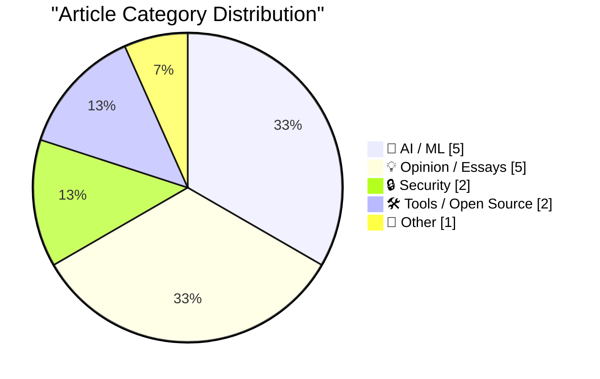
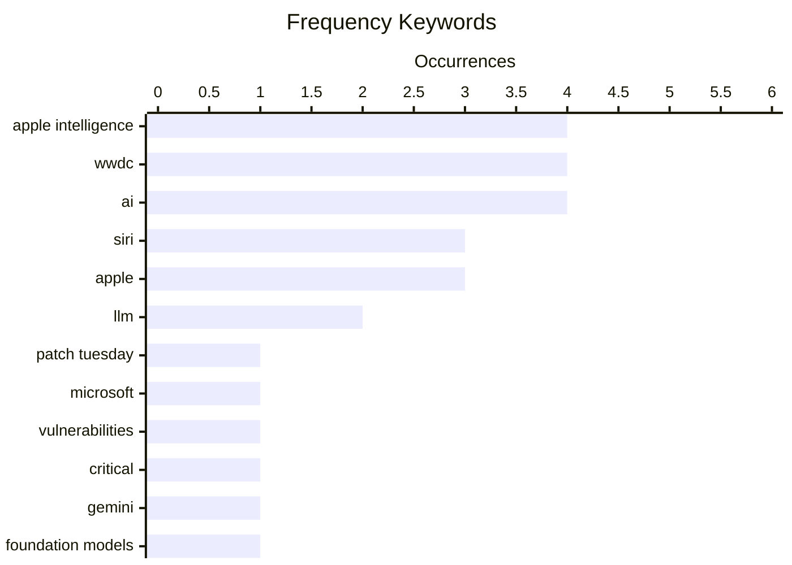

# 📰 AI Blog Daily Digest — 2026-06-10

> From 92 top tech blogs (curated by Karpathy), AI-selected Top 15

## 📝 Today's Highlights

Today’s tech landscape is dominated by two major stories: a historic surge in security vulnerabilities and Apple’s aggressive push into AI. Microsoft’s June 2026 Patch Tuesday shattered records with nearly 200 fixes, while a critical OpenSSL flaw forced widespread emergency patching, underscoring an escalating security crisis. Meanwhile, Apple’s WWDC 2026 unveiled its new Apple Intelligence system and a deeply revamped Siri AI, with live demos confirming real-time capabilities despite being pre-taped. These developments signal a tech world grappling with both unprecedented software risk and a new era of on-device, agent-driven AI.

---

## 🏆 Must Read

🥇 **A Record-Breaking Patch Tuesday for June 2026**

krebsonsecurity.com · 24m ago · 🔒 Security

> Microsoft's June 2026 Patch Tuesday set a record with nearly 200 security fixes, the highest number ever in a single monthly cycle. Nearly three dozen of these vulnerabilities received Microsoft's most severe 'critical' rating, indicating they could allow remote code execution without user interaction. Exploit code for at least three of the patched weaknesses is already publicly available, increasing the urgency for immediate patching. The record-breaking volume reflects the growing attack surface of modern Windows ecosystems and the increasing sophistication of threat actors. The author emphasizes that organizations must prioritize deployment of these updates, especially for the actively exploited vulnerabilities.

💡 **Why it matters**: Essential reading for IT and security teams to understand the unprecedented scale of this month's patches and prioritize their response to actively exploited vulnerabilities.

🏷️ Patch Tuesday, Microsoft, vulnerabilities, critical

🥈 **Apple’s WWDC Announcement of the New Apple Intelligence System**

daringfireball.net · 5h ago · 🤖 AI / ML

> Apple announced its new Apple Intelligence system at WWDC 2026, powered by next-generation Apple Foundation Models built in collaboration with Google and its Gemini models. These capabilities run both on-device and on servers using Private Cloud Compute, with a privacy-first architecture embedded from the foundation models to the operating system. The system integrates AI deeply into everyday app experiences while ensuring user data remains protected. Apple positions this as a major leap in on-device intelligence that maintains its core privacy commitments.

💡 **Why it matters**: Provides the official details on Apple's strategic AI partnership with Google and its privacy-preserving architecture, critical for understanding the future of consumer AI.

🏷️ Apple Intelligence, Gemini, foundation models, privacy

🥉 **"No way to prevent this" say users of only language where this regularly happens**

xeiaso.net · 22h ago · 🔒 Security

> CVE-2026-45447, a heap use-after-free vulnerability in OpenSSL's PKCS7_verify() function, forced site reliability engineers and sysadmins into emergency patching of all affected systems. The flaw exists because the affected components are written in C, which the author argues is the only language where such memory safety vulnerabilities regularly occur. The post satirically quotes a fictional administrator saying 'there's nothing anyone can do to stop them,' highlighting the industry's resignation to these preventable bugs. The author uses this incident to critique the continued reliance on memory-unsafe languages for critical infrastructure.

💡 **Why it matters**: A pointed, satirical take that makes a compelling argument for adopting memory-safe languages in security-critical software, relevant to any developer or ops professional.

🏷️ CVE, OpenSSL, C, use-after-free

---

## 📊 Data Overview

| Scanned | Articles | Range | Selected |
|:---:|:---:|:---:|:---:|
| 87/92 | 2556 → 41 | 48h | **15** |

### Category Distribution



### High-Frequency Keywords



<details>
<summary>📈 ASCII Keyword Chart (Terminal Friendly)</summary>

```
apple intelligence │ ████████████████████ 4
wwdc               │ ████████████████████ 4
ai                 │ ████████████████████ 4
siri               │ ███████████████░░░░░ 3
apple              │ ███████████████░░░░░ 3
llm                │ ██████████░░░░░░░░░░ 2
patch tuesday      │ █████░░░░░░░░░░░░░░░ 1
microsoft          │ █████░░░░░░░░░░░░░░░ 1
vulnerabilities    │ █████░░░░░░░░░░░░░░░ 1
critical           │ █████░░░░░░░░░░░░░░░ 1
```

</details>

### 🏷️ Topic Tags

**apple intelligence**(4) · **wwdc**(4) · **ai**(4) · siri(3) · apple(3) · llm(2) · patch tuesday(1) · microsoft(1) · vulnerabilities(1) · critical(1) · gemini(1) · foundation models(1) · privacy(1) · cve(1) · openssl(1) · c(1) · use-after-free(1) · ai demos(1) · real-time(1) · personal context(1)

---

## 🤖 AI / ML

### 1. Apple’s WWDC Announcement of the New Apple Intelligence System

[Link](https://www.apple.com/newsroom/2026/06/apple-intelligence-brings-powerful-ai-capabilities-into-everyday-experiences/) — **daringfireball.net** · 5h ago · ⭐ 26/30

> Apple announced its new Apple Intelligence system at WWDC 2026, powered by next-generation Apple Foundation Models built in collaboration with Google and its Gemini models. These capabilities run both on-device and on servers using Private Cloud Compute, with a privacy-first architecture embedded from the foundation models to the operating system. The system integrates AI deeply into everyday app experiences while ensuring user data remains protected. Apple positions this as a major leap in on-device intelligence that maintains its core privacy commitments.

🏷️ Apple Intelligence, Gemini, foundation models, privacy

---

### 2. Apple’s WWDC AI Demos Were Real and in Real Time

[Link](https://techcrunch.com/2026/06/08/apples-wwdc-ai-demos-looked-more-real-after-250m-false-ad-settlement/) — **daringfireball.net** · 4h ago · ⭐ 24/30

> TechCrunch reports that Apple's WWDC 2026 AI demonstrations were pre-taped but showed real, working features, unlike the 2024 demos which were criticized as misleading. The demos featured someone holding a phone and interacting in real time with another camera showing the phone's response, proving the features were functional. This contrasts with Apple's $250 million false ad settlement related to previous AI claims. The article suggests Apple learned from past criticism and chose to show only demonstrably working capabilities this year.

🏷️ Apple Intelligence, WWDC, AI demos, real-time

---

### 3. Apple Introduces Siri AI

[Link](https://www.apple.com/newsroom/2026/06/apple-introduces-siri-ai-a-profoundly-more-capable-and-personal-assistant/) — **daringfireball.net** · 5h ago · ⭐ 24/30

> Apple introduced Siri AI, a profoundly more capable personal assistant built on Apple Intelligence that can draw on personal context across messages, emails, photos, and third-party apps. Users can ask Siri to find a restaurant recommendation from a friend's message, surface a hotel confirmation from an old email, or pull up photos from a recent trip. The system extends personal context understanding to third-party apps, enabling cross-app intelligence. This represents a fundamental shift from Siri's previous limitations to a genuinely context-aware assistant.

🏷️ Siri, Apple Intelligence, personal context, AI

---

### 4. Siri AI at WWDC 2026

[Link](https://simonwillison.net/2026/Jun/8/wwdc/#atom-everything) — **simonwillison.net** · 22h ago · ⭐ 23/30

> Simon Willison adopts a strict 'I'll believe it when I see it' policy for Apple's WWDC 2026 AI announcements, given the 2024 Apple Intelligence promises that failed to materialize. He notes the new Siri AI features at least look feasible with current technology, especially since Apple is licensing a custom Gemini-derived model for its Private Cloud Compute. Willison highlights that Apple appears to be using vision LLMs to extract information from user screens, which is technically achievable today. The post reflects deep skepticism tempered by acknowledgment that the technical approach seems more realistic this time.

🏷️ Siri, Apple Intelligence, WWDC, AI

---

### 5. LLMs and almost good code

[Link](https://entropicthoughts.com/llms-and-almost-good-code) — **entropicthoughts.com** · 1 days ago · ⭐ 22/30

> The author's new prior is that top-of-the-line LLMs generate code that is approximately 10% more complicated than necessary for easy tasks, and this complexity is too easily accepted because it solves the immediate problem. This discovery came from a simple CRUD plumbing task where the LLM output was functional but unnecessarily convoluted. The author warns that this added complexity may create significant maintenance burdens over the long term. The post argues for more critical evaluation of AI-generated code beyond just correctness.

🏷️ LLM, code generation, complexity, code quality

---

## 💡 Opinion / Essays

### 6. Quoting Andrej Karpathy

[Link](https://simonwillison.net/2026/Jun/9/andrej-karpathy/#atom-everything) — **simonwillison.net** · 3h ago · ⭐ 20/30

> Andrej Karpathy observes that as working software becomes increasingly available 'on a tap' through AI, his demand for software has grown substantially due to Jevons paradox. He describes being able to ask for explainers, visualizers, dashboards, bespoke single-use apps, 10X test suite expansions, auto-optimized code, and custom research project tools. Karpathy frames this as a fundamental shift where the constraint is no longer technical feasibility but imagination. He encourages readers to 'free your mind' and explore the expanded possibilities.

🏷️ Jevons paradox, software demand, AI, productivity

---

### 7. Apple OS 27: The Small Things

[Link](https://blog.oneberri.com/posts/wwdc26-the-small-things) — **daringfireball.net** · 1h ago · ⭐ 18/30

> The article catalogs the subtle, quality-of-life improvements in Apple's upcoming OS 27, arguing these 'small things' are the truest indicator of Apple's commitment to craftsmanship. It details specific fixes and workflow enhancements, such as smoothed-over rough edges and reworked longstanding flaws, all captured from a WWDC26 screen-grab. The author presents a bullet-point collection of these updates, organized for readability, focusing on annoyances fixed rather than flashy new features. The core point is that these quiet touches, not headline features, demonstrate a company that genuinely cares about its product's polish.

🏷️ Apple, UX, refinements, WWDC

---

### 8. From the Annals of People Having Knowledge of the Matter, Siri AI Extensions Edition

[Link](https://www.bloomberg.com/news/articles/2026-03-26/apple-plans-to-open-up-siri-to-rival-ai-assistants-beyond-chatgpt-in-ios-27) — **daringfireball.net** · 20h ago · ⭐ 18/30

> The article reports on a Bloomberg scoop from March 2026, stating Apple plans to open Siri to rival AI assistants beyond ChatGPT in the iOS 27 update. This move is part of a major Siri overhaul aimed at bolstering the iPhone as an AI platform, according to people with knowledge of the matter. Currently, Siri can only tap into ChatGPT via a partnership with OpenAI, but the update will allow competing services to integrate as well.

🏷️ Siri, Apple, AI extensions, iOS

---

### 9. The revenge of Claude Mythos

[Link](https://garymarcus.substack.com/p/the-revenge-of-claude-mythos) — **garymarcus.substack.com** · 4h ago · ⭐ 18/30

> The article appears to discuss a concept or narrative referred to as 'The revenge of Claude Mythos,' but the provided content is incomplete, consisting only of a title and an emoji. No core problem, arguments, or conclusions can be extracted from the given text.

🏷️ Claude, AI, mythos

---

### 10. Forms of Open Source Government

[Link](https://nesbitt.io/2026/06/09/forms-of-open-source-government.html) — **nesbitt.io** · 12h ago · ⭐ 18/30

> The article argues that open source projects exhibit a greater diversity of governance models than the world's countries. It explores the various forms of government found within open source communities, from benevolent dictatorships to democratic structures. The author uses this observation to frame a discussion on the unique organizational challenges and solutions in open source development.

🏷️ open source, governance, community

---

## 🔒 Security

### 11. A Record-Breaking Patch Tuesday for June 2026

[Link](https://krebsonsecurity.com/2026/06/a-record-breaking-patch-tuesday-for-june-2026/) — **krebsonsecurity.com** · 24m ago · ⭐ 27/30

> Microsoft's June 2026 Patch Tuesday set a record with nearly 200 security fixes, the highest number ever in a single monthly cycle. Nearly three dozen of these vulnerabilities received Microsoft's most severe 'critical' rating, indicating they could allow remote code execution without user interaction. Exploit code for at least three of the patched weaknesses is already publicly available, increasing the urgency for immediate patching. The record-breaking volume reflects the growing attack surface of modern Windows ecosystems and the increasing sophistication of threat actors. The author emphasizes that organizations must prioritize deployment of these updates, especially for the actively exploited vulnerabilities.

🏷️ Patch Tuesday, Microsoft, vulnerabilities, critical

---

### 12. "No way to prevent this" say users of only language where this regularly happens

[Link](https://xeiaso.net/shitposts/no-way-to-prevent-this/memory-safety/CVE-2026-45447/) — **xeiaso.net** · 22h ago · ⭐ 26/30

> CVE-2026-45447, a heap use-after-free vulnerability in OpenSSL's PKCS7_verify() function, forced site reliability engineers and sysadmins into emergency patching of all affected systems. The flaw exists because the affected components are written in C, which the author argues is the only language where such memory safety vulnerabilities regularly occur. The post satirically quotes a fictional administrator saying 'there's nothing anyone can do to stop them,' highlighting the industry's resignation to these preventable bugs. The author uses this incident to critique the continued reliance on memory-unsafe languages for critical infrastructure.

🏷️ CVE, OpenSSL, C, use-after-free

---

## 🛠 Tools / Open Source

### 13. [Sponsor] WorkOS Launches auth.md — an Open Protocol for Agent Registration

[Link](https://youtu.be/Dqp_b8GHLXU?t=1074) — **daringfireball.net** · 18h ago · ⭐ 24/30

> WorkOS launched auth.md, an open protocol for AI agent registration that solves the problem of programmatic service authentication. By exposing a single machine-readable Markdown file at a service's root, AI agents can dynamically discover OAuth Protected Resource Metadata, parse required scopes, and authenticate seamlessly. The protocol is natively supported in WorkOS AuthKit, enabling immediate implementation. This standardizes how AI tools log into applications, replacing the current ad-hoc approaches.

🏷️ auth.md, AI agents, OAuth, protocol

---

### 14. Setting a custom price for a model in AgentsView

[Link](https://simonwillison.net/2026/Jun/9/agentsview-custom-model-price/#atom-everything) — **simonwillison.net** · 56m ago · ⭐ 19/30

> Simon Willison shares a technique for setting custom model prices in AgentsView, a tool by Wes McKinney for exploring token usage across coding agents. When Claude Fable 5 was released but not yet in AgentsView's pricing database, Willison used Fable itself to reverse-engineer the tool and discover the configuration recipe. He includes a treemap visualization of his Fable 5 usage across different local coding agents. The post demonstrates practical problem-solving with AI tools and the flexibility of AgentsView.

🏷️ AgentsView, pricing, LLM, token usage

---

## 📝 Other

### 15. Apple WWDC 2026 Keynote

[Link](https://www.youtube.com/watch?v=hF8swzNR1-o) — **daringfireball.net** · 4h ago · ⭐ 18/30

> The article notes that the Apple WWDC 2026 keynote was a brisk 76 minutes, including a post-credits Easter egg music video. This marks a significant reduction in length compared to the past few years, which typically ran about a half hour longer. The author provides no further analysis, simply stating the runtime as a notable fact.

🏷️ WWDC, Apple, keynote, announcements

---

*Generated on 2026-06-10 | Scanned 87 sources → Found 2556 articles → Selected 15 articles*
*Based on [Hacker News Popularity Contest 2025](https://refactoringenglish.com/tools/hn-popularity/) RSS feeds list, curated by [Andrej Karpathy](https://x.com/karpathy).*
*Created by "Understand AI".*
