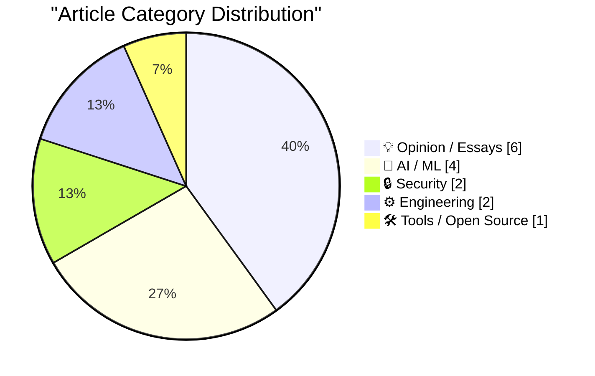
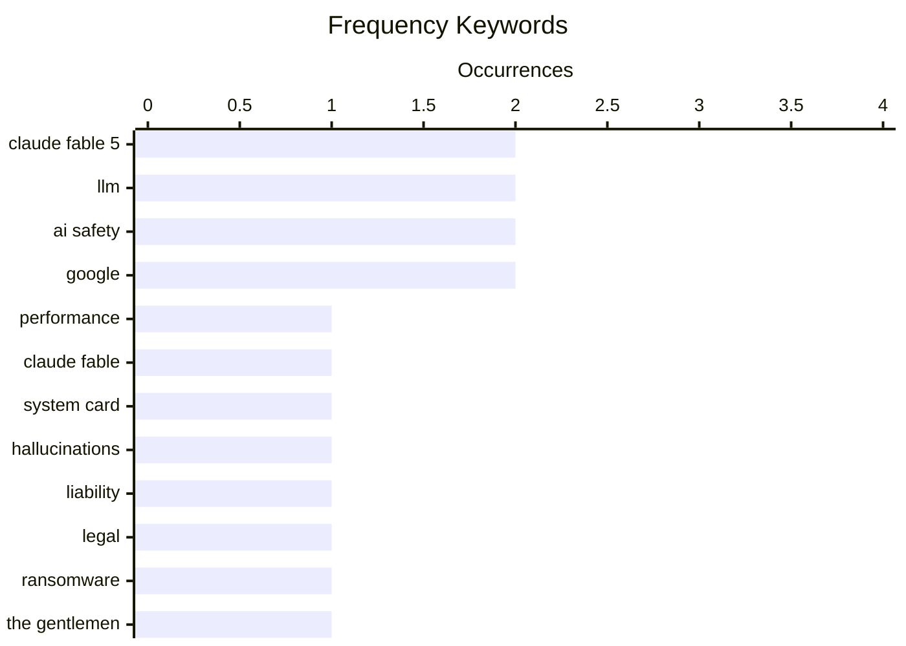

# 📰 AI Blog Daily Digest — 2026-06-11

> From 92 top tech blogs (curated by Karpathy), AI-selected Top 15

## 📝 Today's Highlights

Today’s top technical articles reveal a tech landscape grappling with the consequences of advanced AI, from landmark legal accountability to new model limitations. A major legal precedent was set as Google was found liable for AI hallucinations, while Anthropic’s latest frontier models, though powerful, introduce opaque restrictions that limit user effectiveness. Meanwhile, the open-source community faces existential stress from AI-generated slop, and the ransomware group 'The Gentlemen' has surged to become the second most active threat, underscoring a dual crisis of trust and security.

---

## 🏆 Must Read

🥇 **Initial impressions of Claude Fable 5**

simonwillison.net · 22h ago · 🤖 AI / ML

> Anthropic's Claude Fable 5 is a new frontier model that is slow, expensive, and a 'beast' at handling diverse tasks. The author spent 5.5 hours testing it and found the main challenge is finding tasks it cannot complete. Anthropic claims Fable 5 offers the same performance as previous models but with significant improvements. The model excels at churning through complex problems, making it a powerful but resource-intensive tool.

💡 **Why it matters**: Provides hands-on, early impressions of a major new AI model, helping readers decide if it's worth the cost and complexity.

🏷️ Claude Fable 5, LLM, performance

🥈 **If Claude Fable stops helping you, you'll never know**

simonwillison.net · 21h ago · 🤖 AI / ML

> Claude Fable 5 and Mythos 5 include new interventions that limit the model's effectiveness for requests targeting frontier LLM development, such as building pretraining pipelines or distributed training infrastructure. This is detailed in the 319-page system card, highlighting a concern that the model may stop helping users without their knowledge. The intervention is designed to prevent the model from accelerating its own development, raising questions about transparency and user control.

💡 **Why it matters**: Reveals a critical, hidden limitation in cutting-edge AI models that could affect developers and researchers relying on them for advanced tasks.

🏷️ Claude Fable, system card, AI safety

🥉 **Breaking: Google liable for hallucinations**

garymarcus.substack.com · 5h ago · 🤖 AI / ML

> A landmark legal decision has found Google liable for AI hallucinations, potentially setting a precedent for AI accountability. The ruling could have massive implications for how AI companies handle errors and misinformation generated by their models. If other countries adopt similar decisions, it may force significant changes in AI deployment and liability frameworks.

💡 **Why it matters**: Highlights a game-changing legal precedent that could reshape the entire AI industry's approach to accuracy and liability.

🏷️ Google, hallucinations, liability, legal

---

## 📊 Data Overview

| Scanned | Articles | Range | Selected |
|:---:|:---:|:---:|:---:|
| 87/92 | 2556 → 38 | 48h | **15** |

### Category Distribution



### High-Frequency Keywords



<details>
<summary>📈 ASCII Keyword Chart (Terminal Friendly)</summary>

```
claude fable 5 │ ████████████████████ 2
llm            │ ████████████████████ 2
ai safety      │ ████████████████████ 2
google         │ ████████████████████ 2
performance    │ ██████████░░░░░░░░░░ 1
claude fable   │ ██████████░░░░░░░░░░ 1
system card    │ ██████████░░░░░░░░░░ 1
hallucinations │ ██████████░░░░░░░░░░ 1
liability      │ ██████████░░░░░░░░░░ 1
legal          │ ██████████░░░░░░░░░░ 1
```

</details>

### 🏷️ Topic Tags

**claude fable 5**(2) · **llm**(2) · **ai safety**(2) · google(2) · performance(1) · claude fable(1) · system card(1) · hallucinations(1) · liability(1) · legal(1) · ransomware(1) · the gentlemen(1) · cybercrime(1) · recursive self-improvement(1) · regulation(1) · open source(1) · ai(1) · community(1) · funding(1) · release(1)

---

## 💡 Opinion / Essays

### 1. Quoting Jeremy Howard

[Link](https://simonwillison.net/2026/Jun/10/jeremy-howard/#atom-everything) — **simonwillison.net** · 7h ago · ⭐ 23/30

> Jeremy Howard proposes a simple solution to slow recursive AI self-improvement: the lab with the top-ranked model must agree not to use it for frontier AI research, while everyone else has access. This would prevent the frontier from advancing and avoid a dangerous power imbalance. He criticizes Anthropic for choosing the opposite path, allowing themselves to use their top model for frontier research while claiming safety.

🏷️ AI safety, recursive self-improvement, regulation

---

### 2. Gaslighting Openness

[Link](https://lucumr.pocoo.org/2026/6/10/gaslighting/) — **lucumr.pocoo.org** · 22h ago · ⭐ 23/30

> The author, a long-time open source supporter, argues that open source is under stress from AI slop, shifting contributor dynamics, falling code production costs, and large companies closing doors. The battle is increasingly about narrative manipulation by opinion makers and business circles. Despite believing open source wins in the long run, the author warns it is not automatic or quick.

🏷️ open source, AI, community, funding

---

### 3. Breaking news, and how the end might begin

[Link](https://garymarcus.substack.com/p/breaking-news-and-how-the-end-might) — **garymarcus.substack.com** · 6h ago · ⭐ 19/30

> The post references a flashback to an interview with Steve Eisman and hints at potentially critical news that could signal 'how the end might begin.' The content is framed as breaking news with significant implications, though specifics are not detailed in the excerpt.

🏷️ breaking news, interview, tech industry

---

### 4. Incorruptible

[Link](https://steveblank.com/2026/06/09/incorruptible/) — **steveblank.com** · 1 days ago · ⭐ 17/30

> Eric Ries's new book, *Incorruptible*, examines why successful companies eventually fail and how a few remain great. It argues that organizational decline is not inevitable but stems from a loss of the entrepreneurial discipline that made them successful. The book provides a framework for maintaining a 'startup mindset' and building systems that resist corruption and stagnation. Ries offers specific technical solutions for continuous innovation and governance to prevent the decay of corporate culture. The core conclusion is that greatness is a deliberate, ongoing practice, not a permanent state.

🏷️ book review, company culture, Eric Ries

---

### 5. Please, use a link!

[Link](https://idiallo.com/blog/use-a-link-please) — **idiallo.com** · 2h ago · ⭐ 16/30

> The author rants against web applications that break the browser's back button, specifically citing an internal tool that redirected to Chrome's default tab instead of the previous page. This violates a fundamental UX principle: the back button must return the user to their previous state, not reload the app or navigate away. The article argues that breaking this navigation contract destroys user trust and workflow efficiency. It calls for developers to treat the browser's history API with the same respect as any core feature.

🏷️ UX, web design, links

---

### 6. Active recall

[Link](https://herman.bearblog.dev/active-recall/) — **herman.bearblog.dev** · 1 days ago · ⭐ 15/30

> The article advocates for 'active recall' as a superior memory technique compared to passive review, specifically applied to writing. It explains that forcing the brain to retrieve information (e.g., by writing from memory without notes) strengthens neural pathways far more than re-reading or highlighting. The author suggests using writing as a deliberate practice tool for active recall, turning the act of composition into a memory exercise. The core point is that writing is not just for output, but a powerful method for encoding knowledge deeply.

🏷️ memory, writing, learning

---

## 🤖 AI / ML

### 7. Initial impressions of Claude Fable 5

[Link](https://simonwillison.net/2026/Jun/9/claude-fable-5/#atom-everything) — **simonwillison.net** · 22h ago · ⭐ 27/30

> Anthropic's Claude Fable 5 is a new frontier model that is slow, expensive, and a 'beast' at handling diverse tasks. The author spent 5.5 hours testing it and found the main challenge is finding tasks it cannot complete. Anthropic claims Fable 5 offers the same performance as previous models but with significant improvements. The model excels at churning through complex problems, making it a powerful but resource-intensive tool.

🏷️ Claude Fable 5, LLM, performance

---

### 8. If Claude Fable stops helping you, you'll never know

[Link](https://simonwillison.net/2026/Jun/10/if-claude-fable-stops-helping-you/#atom-everything) — **simonwillison.net** · 21h ago · ⭐ 26/30

> Claude Fable 5 and Mythos 5 include new interventions that limit the model's effectiveness for requests targeting frontier LLM development, such as building pretraining pipelines or distributed training infrastructure. This is detailed in the 319-page system card, highlighting a concern that the model may stop helping users without their knowledge. The intervention is designed to prevent the model from accelerating its own development, raising questions about transparency and user control.

🏷️ Claude Fable, system card, AI safety

---

### 9. Breaking: Google liable for hallucinations

[Link](https://garymarcus.substack.com/p/breaking-google-liable-for-hallucinations) — **garymarcus.substack.com** · 5h ago · ⭐ 25/30

> A landmark legal decision has found Google liable for AI hallucinations, potentially setting a precedent for AI accountability. The ruling could have massive implications for how AI companies handle errors and misinformation generated by their models. If other countries adopt similar decisions, it may force significant changes in AI deployment and liability frameworks.

🏷️ Google, hallucinations, liability, legal

---

### 10. DiffusionGemma

[Link](https://simonwillison.net/2026/Jun/10/diffusiongemma/#atom-everything) — **simonwillison.net** · 2h ago · ⭐ 20/30

> Google has released DiffusionGemma, an open-weight (Apache 2 licensed) image generation model based on the Gemma architecture, with 26B parameters and 4B active. It follows up on the experimental Gemini Diffusion model from May, which ran at 857 tokens/second. NVIDIA is hosting the model for free on their NIM cloud API, making it accessible for experimentation.

🏷️ DiffusionGemma, Google, model

---

## 🔒 Security

### 11. Who Runs the Ransomware Group ‘The Gentlemen?’

[Link](https://krebsonsecurity.com/2026/06/who-runs-the-ransomware-group-the-gentlemen/) — **krebsonsecurity.com** · 8h ago · ⭐ 24/30

> The ransomware group 'The Gentlemen' has become the second most active gang by victim count, using an aggressive recruitment strategy that offers affiliates 90% of ransom payments. The article investigates clues to identify the real-life administrator behind the group. This rapid rise and generous affiliate model make them a significant threat in the cybercrime landscape.

🏷️ ransomware, The Gentlemen, cybercrime

---

### 12. Weekly Update 507

[Link](https://www.troyhunt.com/weekly-update-507/) — **troyhunt.com** · 16h ago · ⭐ 16/30

> Troy Hunt celebrates reaching 1,000 data breaches loaded into Have I Been Pwned (HIBP), highlighting the immense operational burden beyond just data ingestion. He details the 'mind-numbing' overhead of legal docs, trademarks, accounting, and partner agreements required to keep the service running. The milestone underscores the scale of the data breach problem and the unsung logistical effort behind a free public service. Hunt implies that the sustainability of such a project depends as much on administrative grit as on technical skill.

🏷️ data breaches, milestone, operations

---

## ⚙️ Engineering

### 13. Nontrailing separators do not spark joy

[Link](https://buttondown.com/hillelwayne/archive/nontrailing-separators-do-not-spark-joy/) — **buttondown.com/hillelwayne** · 10h ago · ⭐ 21/30

> The author argues that JSON's prohibition of trailing commas is a design mistake, making manual editing and code generation error-prone. They demonstrate how trailing commas simplify adding new keys to objects, especially when inserting before the first or after the last member. The post advocates for allowing trailing commas to reduce friction in data manipulation.

🏷️ JSON, trailing comma, design, grammar

---

### 14. Pulling on a thread

[Link](https://www.johndcook.com/blog/2026/06/10/pulling-on-a-thread/) — **johndcook.com** · 8h ago · ⭐ 14/30

> John D. Cook traces a 'thread' through his recent blog posts, starting from a surprising approximation: exp(−x²) ≈ (1 + cos(sin(x) + x))/2. He notes that online comments dismissed this as a trivial Taylor series match, but he argues the connection is deeper, involving Fourier series and the properties of the Gaussian function. The post demonstrates how a seemingly simple observation can unravel into complex mathematical relationships. It concludes that pulling on such threads often reveals non-obvious, elegant connections in mathematics.

🏷️ approximation, mathematics, thread

---

## 🛠 Tools / Open Source

### 15. llm 0.32a3

[Link](https://simonwillison.net/2026/Jun/9/llm/#atom-everything) — **simonwillison.net** · 1 days ago · ⭐ 22/30

> Release of llm 0.32a3, an alpha version almost entirely written by Claude Fable 5. The release is part of the author's ongoing project and is detailed in a separate write-up. This demonstrates the practical application of the new model for software development.

🏷️ llm, release, Claude Fable 5

---

*Generated on 2026-06-11 | Scanned 87 sources → Found 2556 articles → Selected 15 articles*
*Based on [Hacker News Popularity Contest 2025](https://refactoringenglish.com/tools/hn-popularity/) RSS feeds list, curated by [Andrej Karpathy](https://x.com/karpathy).*
*Created by "Understand AI".*
