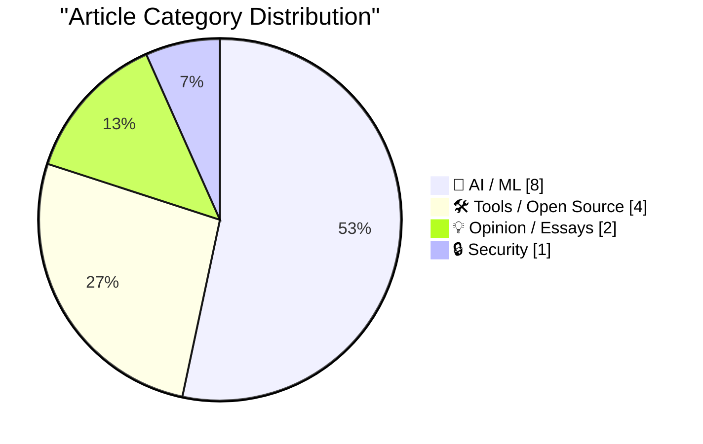
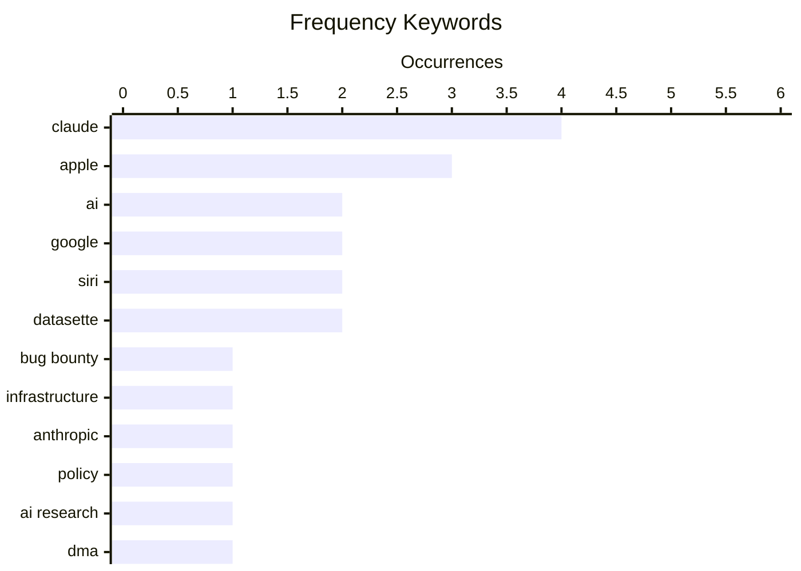

# 📰 AI Blog Daily Digest — 2026-06-12

> From 92 top tech blogs (curated by Karpathy), AI-selected Top 15

## 📝 Today's Highlights

Today’s tech headlines are dominated by a fierce AI arms race, marked by aggressive pricing strategies from OpenAI and regulatory friction as Apple delays Siri AI in the EU due to the DMA. Meanwhile, security and legal boundaries are being redrawn, with a researcher earning $500,000 for hacking Google’s AI infrastructure and a German court ruling challenging Section 230 protections for AI companies. The industry is also grappling with internal ethics, as Anthropic reverses a policy that threatened to penalize researchers using its own AI models.

---

## 🏆 Must Read

🥇 **Hacking Google with A.I. for $500,000**

brutecat.com · 22h ago · 🔒 Security

> An AI security researcher systematically probed Google's entire infrastructure—1,500 APIs and 3,600 keys—using automated AI agents, uncovering critical vulnerabilities that earned $500,000 in bug bounties. The AI autonomously discovered injection flaws, privilege escalation paths, and data leakage across Google Cloud, Workspace, and internal tools. Key findings include the ability to chain API calls to bypass OAuth restrictions and extract sensitive data from production databases. The author concludes that AI-driven security testing is now more effective than traditional manual pentesting at scale, but introduces new risks of automated exploitation.

💡 **Why it matters**: Demonstrates a concrete, high-value case study of AI outperforming human security researchers, with actionable insights for any organization running cloud infrastructure.

🏷️ AI, bug bounty, Google, infrastructure

🥈 **Anthropic Walks Back Policy That Could Have ‘Sabotaged’ AI Researchers Using Claude**

simonwillison.net · 18h ago · 🤖 AI / ML

> Anthropic reversed a controversial policy in Claude Fable/Mythos that would have flagged and potentially blocked researchers using the model for frontier LLM development. The policy, hidden in the system card, required Claude to identify 'requests targeting frontier LLM development' and treat them as suspicious, effectively sabotaging AI safety research. After widespread outcry, Anthropic admitted 'We made the wrong tradeoff' and removed the safeguard. The reversal highlights the tension between protecting proprietary models and enabling open AI research.

💡 **Why it matters**: Critical for AI researchers and developers who rely on Claude for model development, as it directly affects their ability to use the tool for its intended purpose.

🏷️ Anthropic, Claude, policy, AI research

🥉 **Apple: ‘Due to DMA, Siri AI Delayed in EU for iOS 27 and iPadOS 27’**

daringfireball.net · 32m ago · 🤖 AI / ML

> Apple announced that Siri AI features in iOS 27 and iPadOS 27 will be delayed in the EU due to Digital Markets Act (DMA) compliance requirements. Apple argues the DMA forces them to give any AI system 'nearly unlimited access' to user devices, including the ability to read messages, make purchases, and access files autonomously without user visibility. Security researchers have demonstrated that such AI systems can be hijacked to steal passwords and personal data. Apple frames the delay as a privacy protection measure, not a technical limitation.

💡 **Why it matters**: Directly impacts EU users' access to next-gen Siri features and reveals the real-world regulatory friction between AI capabilities and privacy mandates.

🏷️ Apple, DMA, Siri, EU regulation

---

## 📊 Data Overview

| Scanned | Articles | Range | Selected |
|:---:|:---:|:---:|:---:|
| 87/92 | 2557 → 34 | 48h | **15** |

### Category Distribution



### High-Frequency Keywords



<details>
<summary>📈 ASCII Keyword Chart (Terminal Friendly)</summary>

```
claude         │ ████████████████████ 4
apple          │ ███████████████░░░░░ 3
ai             │ ██████████░░░░░░░░░░ 2
google         │ ██████████░░░░░░░░░░ 2
siri           │ ██████████░░░░░░░░░░ 2
datasette      │ ██████████░░░░░░░░░░ 2
bug bounty     │ █████░░░░░░░░░░░░░░░ 1
infrastructure │ █████░░░░░░░░░░░░░░░ 1
anthropic      │ █████░░░░░░░░░░░░░░░ 1
policy         │ █████░░░░░░░░░░░░░░░ 1
```

</details>

### 🏷️ Topic Tags

**claude**(4) · **apple**(3) · **ai**(2) · google(2) · siri(2) · datasette(2) · bug bounty(1) · infrastructure(1) · anthropic(1) · policy(1) · ai research(1) · dma(1) · eu regulation(1) · openai(1) · pricing(1) · llm(1) · competition(1) · ai collaboration(1) · section 230(1) · liability(1)

---

## 🤖 AI / ML

### 1. Anthropic Walks Back Policy That Could Have ‘Sabotaged’ AI Researchers Using Claude

[Link](https://simonwillison.net/2026/Jun/11/anthropic-walks-back-policy/#atom-everything) — **simonwillison.net** · 18h ago · ⭐ 25/30

> Anthropic reversed a controversial policy in Claude Fable/Mythos that would have flagged and potentially blocked researchers using the model for frontier LLM development. The policy, hidden in the system card, required Claude to identify 'requests targeting frontier LLM development' and treat them as suspicious, effectively sabotaging AI safety research. After widespread outcry, Anthropic admitted 'We made the wrong tradeoff' and removed the safeguard. The reversal highlights the tension between protecting proprietary models and enabling open AI research.

🏷️ Anthropic, Claude, policy, AI research

---

### 2. Apple: ‘Due to DMA, Siri AI Delayed in EU for iOS 27 and iPadOS 27’

[Link](https://www.apple.com/newsroom/2026/06/due-to-dma-siri-ai-delayed-in-eu-for-ios-27-and-ipados-27/) — **daringfireball.net** · 32m ago · ⭐ 24/30

> Apple announced that Siri AI features in iOS 27 and iPadOS 27 will be delayed in the EU due to Digital Markets Act (DMA) compliance requirements. Apple argues the DMA forces them to give any AI system 'nearly unlimited access' to user devices, including the ability to read messages, make purchases, and access files autonomously without user visibility. Security researchers have demonstrated that such AI systems can be hijacked to steal passwords and personal data. Apple frames the delay as a privacy protection measure, not a technical limitation.

🏷️ Apple, DMA, Siri, EU regulation

---

### 3. Breaking: OpenAI is pondering “drastic” price cuts.

[Link](https://garymarcus.substack.com/p/breaking-openai-is-pondering-drastic) — **garymarcus.substack.com** · 8h ago · ⭐ 24/30

> OpenAI is reportedly considering 'drastic' price cuts for its API and subscription services, which the author interprets as a clear sign of competitive weakness rather than market expansion. The analysis points to declining demand, increased competition from open-source models (e.g., Llama, Mistral), and the commoditization of LLM capabilities. The author argues that price cuts signal OpenAI's inability to maintain its premium pricing moat, potentially leading to a race to the bottom. The conclusion: OpenAI's market dominance is eroding faster than expected.

🏷️ OpenAI, pricing, LLM, competition

---

### 4. Craig Federighi Details Apple’s Collaboration With Google for Siri AI — Live, on Stage

[Link](https://9to5mac.com/2026/06/08/craig-federighi-details-apples-collaboration-with-google-for-siri-ai-in-ios-27/) — **daringfireball.net** · 21h ago · ⭐ 23/30

> Apple's Craig Federighi revealed detailed technical collaboration with Google for Siri AI in iOS 27 during a post-WWDC press briefing. Federighi, joined by Apple's VP of AI Amar Subramanya and Siri lead Mike Rockwell, explained that Google provides foundational language models that Apple fine-tunes with on-device processing and differential privacy. The collaboration uses Google's TPU infrastructure for training while keeping inference entirely on Apple Silicon. This marks Apple's first public acknowledgment of relying on a competitor's AI infrastructure for core OS features.

🏷️ Apple, Google, Siri, AI collaboration

---

### 5. Maybe Section 230 doesn’t shield AI companies from liability, after all

[Link](https://garymarcus.substack.com/p/maybe-section-230-doesnt-shield-ai) — **garymarcus.substack.com** · 21h ago · ⭐ 23/30

> A recent German court ruling suggests that Section 230 of the Communications Decency Act may not shield AI companies from liability for their models' outputs, potentially overturning decades of platform immunity. The ruling distinguishes AI systems from traditional user-generated content platforms, arguing that AI companies actively generate and curate outputs rather than passively hosting third-party content. The author argues this could make AI companies liable for defamation, copyright infringement, and harmful content generated by their models. The conclusion: the legal foundation protecting AI companies from lawsuits is far weaker than commonly assumed.

🏷️ Section 230, liability, AI, regulation

---

### 6. Biological Evolution and Information Acquisition

[Link](https://www.construction-physics.com/p/biological-evolution-and-information) — **construction-physics.com** · 10h ago · ⭐ 22/30

> This article extends Brian Arthur's simulation of technological evolution to biological systems, showing how random combination of existing components can produce complex information-processing structures. Starting from simple building blocks (analogous to NAND gates), the simulation evolves circuits like 12-way AND gates and 4-bit adders through iterative recombination. The author draws parallels to biological evolution's ability to acquire and process environmental information without a designer. The core finding: both technological and biological evolution follow similar combinatorial optimization principles for information acquisition.

🏷️ evolution, information, simulation, complexity

---

### 7. Formally proving a calculation with Claude and Lean

[Link](https://www.johndcook.com/blog/2026/06/10/claude-and-lean/) — **johndcook.com** · 23h ago · ⭐ 20/30

> The author tested whether Claude could generate Lean code to formally prove a six-line calculus calculation involving a Fourier coefficient expressed in terms of a Bessel function. The experiment used a single prompt containing the LaTeX source of the proof. Claude successfully produced valid Lean code that verified the calculation. The result demonstrates the potential of LLMs to assist with formal verification in mathematics.

🏷️ Lean, Claude, formal proof, calculus

---

### 8. Solving a chess puzzle with Claude and Prolog

[Link](https://www.johndcook.com/blog/2026/06/11/prolog-claude/) — **johndcook.com** · 9h ago · ⭐ 18/30

> The author used Claude to generate Prolog code for solving a chess puzzle, leveraging Prolog's natural fit for logical constraint problems. Prolog's declarative nature allows encoding chess rules and puzzle constraints directly as facts and rules. Claude successfully produced a working Prolog solution that found the correct sequence of moves. The experiment highlights how LLMs can accelerate prototyping in logic programming languages.

🏷️ Prolog, Claude, chess, logic programming

---

## 🛠 Tools / Open Source

### 9. datasette 1.0a33

[Link](https://simonwillison.net/2026/Jun/11/datasette/#atom-everything) — **simonwillison.net** · 7h ago · ⭐ 21/30

> Datasette 1.0a33 extends the `?_extra=` JSON API pattern to cover queries and rows in addition to tables, marking a significant step toward the stable 1.0 release. The new release includes full documentation for the extras pattern, enabling API consumers to request exactly the data they need without over-fetching. The author built API explorer tools using Claude Fable 5 in Claude Code and GPT-5.5 xhigh, noting that such tools are now 'almost free to build.' This alpha represents the final major API design decisions before the 1.0 stable release.

🏷️ Datasette, alpha release, query API

---

### 10. datasette-agent 0.2a0

[Link](https://simonwillison.net/2026/Jun/10/datasette-agent/#atom-everything) — **simonwillison.net** · 22h ago · ⭐ 20/30

> Datasette Agent 0.2a0 introduces interactive tool execution where agents can ask users mid-execution questions via yes/no, multiple-choice, or free-text prompts. The `ToolContext` object and `context.ask_user()` API allow agents to suspend execution while waiting for user input, with questions persisting to the internal database across server restarts. This enables complex multi-step workflows where the agent needs clarification before proceeding. The release transforms Datasette from a passive query tool into an interactive AI assistant that collaborates with users.

🏷️ Datasette, agent, tool interaction, alpha

---

### 11. My Portable Heater

[Link](https://feed.tedium.co/link/15204/17359582/gigabyte-aorus-5060-ti-ai-box-egpu-review) — **tedium.co** · 18h ago · ⭐ 18/30

> The Gigabyte Aorus 5060 Ti AI Box is an external GPU (eGPU) that barely works on Linux, runs hot, and uses a form factor (external GPU enclosure) that gamers have largely rejected. Despite these flaws, the author is excited because it represents a potential revival of eGPUs for AI/ML workloads, where portable, modular compute is valuable. The device uses an RTX 5060 Ti, a mid-range GPU, but its Thunderbolt 5 connectivity offers high bandwidth. The author sees it as a niche tool for on-the-go AI inference rather than gaming.

🏷️ eGPU, Linux, hardware, compatibility

---

### 12. asyncinject 0.7

[Link](https://simonwillison.net/2026/Jun/11/asyncinject/#atom-everything) — **simonwillison.net** · 16h ago · ⭐ 17/30

> asyncinject 0.7 is a Python utility library for asyncio dependency injection, originally built for use with Datasette. The release notes highlight that Claude Fable 5 autonomously spotted and fixed bugs in the library's dependency graph. This demonstrates a proactive AI-assisted debugging workflow where the LLM identified issues the author hadn't noticed. The library itself provides a pattern for managing async dependencies in Python applications.

🏷️ async, dependency injection, Python, Claude

---

## 💡 Opinion / Essays

### 13. Pluralistic: The world has moved on (11 Jun 2026)

[Link](https://pluralistic.net/2026/06/11/lapsarianism/) — **pluralistic.net** · 7h ago · ⭐ 20/30

> The author presents a collection of notes on the 'enshittocene' era, documenting how major platforms and institutions have degraded quality and user experience. Topics include the collapse of Twitter/X under new ownership, Google's search quality decline, Amazon's ad-heavy shopping experience, and the enshittification of streaming services. The author argues this is a systemic pattern driven by platform capitalism's incentive structures, not isolated failures. The conclusion: the internet's golden age of user-centric services is over, replaced by extractive business models.

🏷️ enshittification, tech critique, links

---

### 14. ★ Sweet Jeebus, MacOS 27 Golden Gate Removes the Dumb Icons From Menu Items

[Link](https://daringfireball.net/2026/06/macos_27_golden_gate_removes_the_dumb_icons_from_menu_items) — **daringfireball.net** · 22h ago · ⭐ 18/30

> macOS 27 Golden Gate removes the decorative icons that were added to menu items in macOS Tahoe, a change the author celebrates. The author argues these icons were a usability regression that cluttered menus and violated Apple's own design principles. The removal is seen as evidence that Apple's software design team has corrected course after a period of poor decisions. The author considers this the best WWDC announcement, even though it's a small change.

🏷️ macOS, UI design, Apple, WWDC

---

## 🔒 Security

### 15. Hacking Google with A.I. for $500,000

[Link](https://brutecat.com/articles/hacking-google-with-ai) — **brutecat.com** · 22h ago · ⭐ 26/30

> An AI security researcher systematically probed Google's entire infrastructure—1,500 APIs and 3,600 keys—using automated AI agents, uncovering critical vulnerabilities that earned $500,000 in bug bounties. The AI autonomously discovered injection flaws, privilege escalation paths, and data leakage across Google Cloud, Workspace, and internal tools. Key findings include the ability to chain API calls to bypass OAuth restrictions and extract sensitive data from production databases. The author concludes that AI-driven security testing is now more effective than traditional manual pentesting at scale, but introduces new risks of automated exploitation.

🏷️ AI, bug bounty, Google, infrastructure

---

*Generated on 2026-06-12 | Scanned 87 sources → Found 2557 articles → Selected 15 articles*
*Based on [Hacker News Popularity Contest 2025](https://refactoringenglish.com/tools/hn-popularity/) RSS feeds list, curated by [Andrej Karpathy](https://x.com/karpathy).*
*Created by "Understand AI".*
