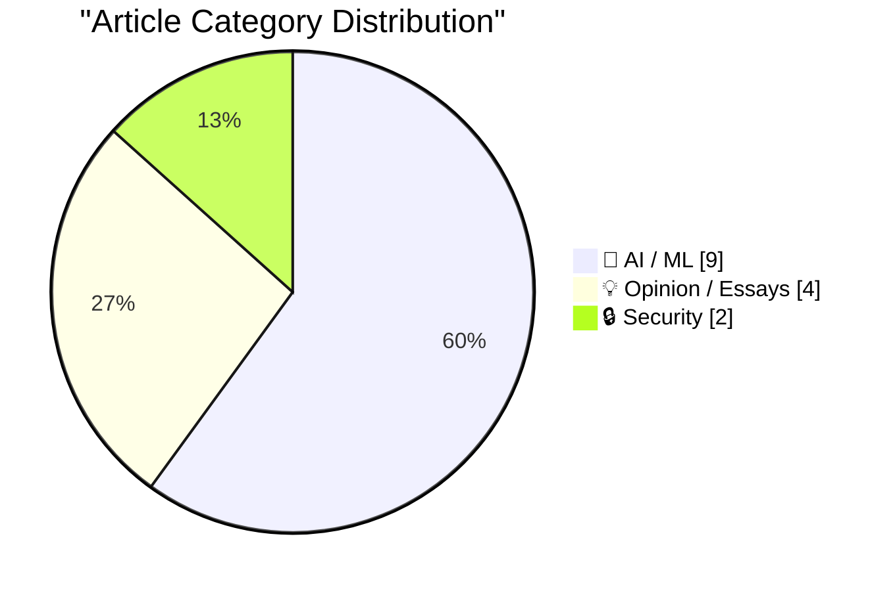
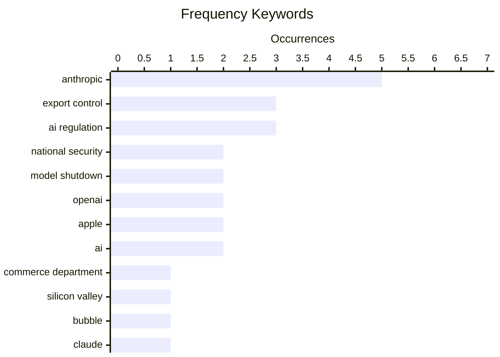

# 📰 AI Blog Daily Digest — 2026-06-14

> From 92 top tech blogs (curated by Karpathy), AI-selected Top 15

## 📝 Today's Highlights

Today, the tech world is dominated by a seismic government intervention in AI, as the U.S. Commerce Department has ordered Anthropic to shut down its latest Fable and Mythos models on national security grounds, marking a dramatic shift from previous hands-off regulation. This crackdown has sparked intense debate about the balance between innovation and safety, with critics calling the policy shambolic and warning of dangerous technology restrictions for Americans only. Meanwhile, the industry faces additional pressure from European regulators targeting Siri AI under the DMA, while Apple’s Private Cloud Compute remains severely limited for third-party developers, and a new analysis suggests the Silicon Valley bubble may be approaching its end.

---

## 🏆 Must Read

🥇 **Statement on the US government directive to suspend access to Fable 5 and Mythos 5**

simonwillison.net · 21h ago · 🤖 AI / ML

> Statement on the US government directive to suspend access to Fable 5 and Mythos 5 Well this is nuts : The US government, citing national security authorities, has issued an export control directive t

🏷️ national security, export control, AI regulation, Anthropic

🥈 **U.S. Government Directs Anthropic to Shut Down Fable 5 and Mythos 5 Models on National Security Grounds**

daringfireball.net · 5h ago · 🤖 AI / ML

> Anthropic: The US government, citing national security authorities, has issued an export control directive to suspend all access to Fable 5 and Mythos 5 by any foreign national, whether inside or outs

🏷️ national security, export control, Anthropic, model shutdown

🥉 **Breaking news: US Commerce Department effectively shuts down Anthropic’s latest models**

garymarcus.substack.com · 20h ago · 🤖 AI / ML

> After two years of underregulating AI, the US government suddenly takes the nuclear option

🏷️ Anthropic, Commerce Department, model shutdown, AI regulation

---

## 📊 Data Overview

| Scanned | Articles | Range | Selected |
|:---:|:---:|:---:|:---:|
| 87/92 | 2557 → 30 | 48h | **15** |

### Category Distribution



### High-Frequency Keywords



<details>
<summary>📈 ASCII Keyword Chart (Terminal Friendly)</summary>

```
anthropic           │ ████████████████████ 5
export control      │ ████████████░░░░░░░░ 3
ai regulation       │ ████████████░░░░░░░░ 3
national security   │ ████████░░░░░░░░░░░░ 2
model shutdown      │ ████████░░░░░░░░░░░░ 2
openai              │ ████████░░░░░░░░░░░░ 2
apple               │ ████████░░░░░░░░░░░░ 2
ai                  │ ████████░░░░░░░░░░░░ 2
commerce department │ ████░░░░░░░░░░░░░░░░ 1
silicon valley      │ ████░░░░░░░░░░░░░░░░ 1
```

</details>

### 🏷️ Topic Tags

**anthropic**(5) · **export control**(3) · **ai regulation**(3) · national security(2) · model shutdown(2) · openai(2) · apple(2) · ai(2) · commerce department(1) · silicon valley(1) · bubble(1) · claude(1) · proactive(1) · ai agent(1) · datasette(1) · private cloud compute(1) · developer access(1) · small business(1) · dangerous technology(1) · ai policy(1)

---

## 🤖 AI / ML

### 1. Statement on the US government directive to suspend access to Fable 5 and Mythos 5

[Link](https://simonwillison.net/2026/Jun/13/us-government-directive-to-suspend-access/#atom-everything) — **simonwillison.net** · 21h ago · ⭐ 27/30

> Statement on the US government directive to suspend access to Fable 5 and Mythos 5 Well this is nuts : The US government, citing national security authorities, has issued an export control directive t

🏷️ national security, export control, AI regulation, Anthropic

---

### 2. U.S. Government Directs Anthropic to Shut Down Fable 5 and Mythos 5 Models on National Security Grounds

[Link](https://www.anthropic.com/news/fable-mythos-access) — **daringfireball.net** · 5h ago · ⭐ 27/30

> Anthropic: The US government, citing national security authorities, has issued an export control directive to suspend all access to Fable 5 and Mythos 5 by any foreign national, whether inside or outs

🏷️ national security, export control, Anthropic, model shutdown

---

### 3. Breaking news: US Commerce Department effectively shuts down Anthropic’s latest models

[Link](https://garymarcus.substack.com/p/breaking-news-us-commerce-department) — **garymarcus.substack.com** · 20h ago · ⭐ 27/30

> After two years of underregulating AI, the US government suddenly takes the nuclear option

🏷️ Anthropic, Commerce Department, model shutdown, AI regulation

---

### 4. Claude Fable is relentlessly proactive

[Link](https://simonwillison.net/2026/Jun/11/fable-is-relentlessly-proactive/#atom-everything) — **simonwillison.net** · 1 days ago · ⭐ 25/30

> After two days of experience with Claude Fable 5 I think the best way to describe it is relentlessly proactive . It knows a whole lot of tricks and it will deploy pretty much any of them to get to its

🏷️ Claude, proactive, AI agent, Datasette

---

### 5. Apple’s Private Cloud Compute Is Severely Limited for Third-Party Developers

[Link](https://developer.apple.com/private-cloud-compute/) — **daringfireball.net** · 5h ago · ⭐ 25/30

> From Apple’s Developer site: To ensure getting started with a large cloud model is as accessible as possible, developers in the App Store Small Business Program with fewer than two million first time 

🏷️ Private Cloud Compute, Apple, developer access, small business

---

### 6. Dangerous Technology For Americans Only

[Link](https://lucumr.pocoo.org/2026/6/13/americans-only/) — **lucumr.pocoo.org** · 22h ago · ⭐ 25/30

> There is a bit of schadenfreude on Twitter right now about Anthropic being hit by the US government’s export control directive to suspend access to Fable and Mythos . Anthropic and their leadership ha

🏷️ Anthropic, export control, AI regulation, dangerous technology

---

### 7. The European Commission Response to Siri AI and the DMA

[Link](https://www.linkedin.com/posts/thomas-regnier-24a05810b_what-is-the-true-story-behind-apples-decision-activity-7470439874664280064-TuEt) — **daringfireball.net** · 1 days ago · ⭐ 23/30

> Thomas Regnier, spokesperson for the European Commission, in a statement posted to LinkedIn (with edited video, if you’d like to watch him read parts aloud): What is the true story behind Apple’s deci

🏷️ Siri AI, EU, DMA, Apple

---

### 8. OpenAI WebRTC Audio Session, now with document context

[Link](https://simonwillison.net/2026/Jun/12/openai-webrtc/#atom-everything) — **simonwillison.net** · 22h ago · ⭐ 22/30

> Simon Willison details his updated OpenAI WebRTC Audio Session tool, which now supports document context for real-time voice interactions. The tool leverages the new GPT-Realtime-2 model, described as OpenAI's first voice model with GPT-5-class reasoning and a September 2024 knowledge cut-off. The key technical addition is the ability to inject document context into the audio session, allowing the model to answer questions about specific documents during a voice call. The author built this because the model had not yet appeared in the ChatGPT iPhone app, demonstrating a practical workaround for accessing cutting-edge voice AI capabilities.

🏷️ WebRTC, realtime audio, GPT-Realtime-2, OpenAI

---

### 9. Why are cached input tokens cheaper with AI services?

[Link](https://xeiaso.net/notes/2026/why-llm-cached-token-cheaper/) — **xeiaso.net** · 1 days ago · ⭐ 22/30

> The article provides a concise technical explanation for why AI services charge less for cached input tokens: the GPU performs significantly less computation. When a prompt prefix is cached, the GPU skips the expensive attention mechanism calculations for those tokens, reusing pre-computed Key-Value (KV) cache entries instead. This reduces both latency and GPU compute cycles, directly translating to lower operational costs for the provider. The author's TL;DR is that the GPU 'doesn't have to math as hard' for cached tokens.

🏷️ cached tokens, GPU, inference cost, AI services

---

## 💡 Opinion / Essays

### 10. Premium: The Silicon Valley Bubble (Part 1)

[Link](https://www.wheresyoured.at/premium-the-silicon-valley-bubble-part-1/) — **wheresyoured.at** · 1 days ago · ⭐ 26/30

> Friends, I believe we&#x2019;re approaching the end of this era. Both OpenAI and Anthropic have filed the paperwork to go public, starting a race for exit liquidity for two companies that burn billion

🏷️ Silicon Valley, bubble, OpenAI, Anthropic

---

### 11. The White House’s shambolic AI policy

[Link](https://garymarcus.substack.com/p/the-white-houses-shambolic-ai-policy) — **garymarcus.substack.com** · 6h ago · ⭐ 24/30

> Also , why states are taking things into their own hands, and what might be better

🏷️ AI policy, White House, regulation, states

---

### 12. Human Routers of Machine Words

[Link](https://borretti.me/article/human-routers-of-machine-words) — **borretti.me** · 22h ago · ⭐ 23/30

> The article examines the phenomenon of people using AI as a cognitive crutch, effectively outsourcing their thinking to large language models. It argues that relying on AI to generate ideas, summarize information, or make decisions creates a dependency that atrophies critical thinking and reasoning skills. The author draws a parallel to 'human routers' in networking, where humans become passive conduits for machine-generated text rather than active thinkers. Key evidence includes the observation that users often cannot explain or defend the AI's output, indicating a loss of intellectual ownership. The conclusion is that using AI to 'think' for you is a net negative for individual cognition and societal intelligence.

🏷️ AI, thinking, human, cognition

---

### 13. I Am Not a Reverse Centaur

[Link](https://blog.miguelgrinberg.com/post/i-am-not-a-reverse-centaur) — **miguelgrinberg.com** · 1 days ago · ⭐ 23/30

> The author, an open-source maintainer, describes a growing frustration with LLM-generated code contributions flooding his projects. While his stance against using LLMs for coding remains unchanged, he now faces a new problem: nearly all incoming pull requests are AI-generated, often low-quality, and require significant human effort to review and fix. The core issue is the shift from human contributors who understand the codebase to 'reverse centaurs'—humans acting as mere conduits for machine output. The author concludes that this trend degrades open-source collaboration by increasing maintainer burden while diminishing genuine human learning and contribution.

🏷️ LLM, coding, reverse centaur, AI

---

## 🔒 Security

### 14. Pluralistic: Google's new remote attestation scheme is every bit as terrible as its old remote attestation scheme (12 Jun 2026)

[Link](https://pluralistic.net/2026/06/12/compelled-speech/) — **pluralistic.net** · 1 days ago · ⭐ 23/30

> Today's links Google's new remote attestation scheme is every bit as terrible as its old remote attestation scheme: Not even a QR code can produce a kissable pig. Hey look at this: Delights to delecta

🏷️ remote attestation, Google, privacy, QR code

---

### 15. Joint Guidance on Vulnerability Naming and Disclosure

[Link](https://nesbitt.io/2026/06/12/joint-guidance-on-vulnerability-naming-and-disclosure.html) — **nesbitt.io** · 1 days ago · ⭐ 22/30

> This post announces a new joint guidance on vulnerability naming and disclosure, introducing a standardized single-page site at `.vuln` for every named CVE. The initiative aims to streamline how vulnerability information is accessed and shared, providing a predictable, machine-readable URL format. This addresses the fragmentation of vulnerability data across multiple databases and vendor sites. The core conclusion is that this new naming convention will improve automation, reduce confusion, and speed up incident response by creating a single source of truth for each CVE.

🏷️ CVE, vulnerability, naming, disclosure

---

*Generated on 2026-06-14 | Scanned 87 sources → Found 2557 articles → Selected 15 articles*
*Based on [Hacker News Popularity Contest 2025](https://refactoringenglish.com/tools/hn-popularity/) RSS feeds list, curated by [Andrej Karpathy](https://x.com/karpathy).*
*Created by "Understand AI".*
