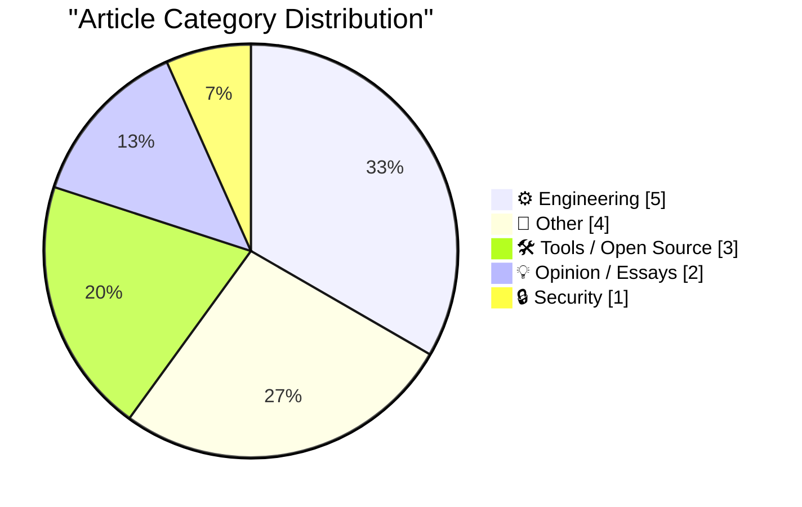
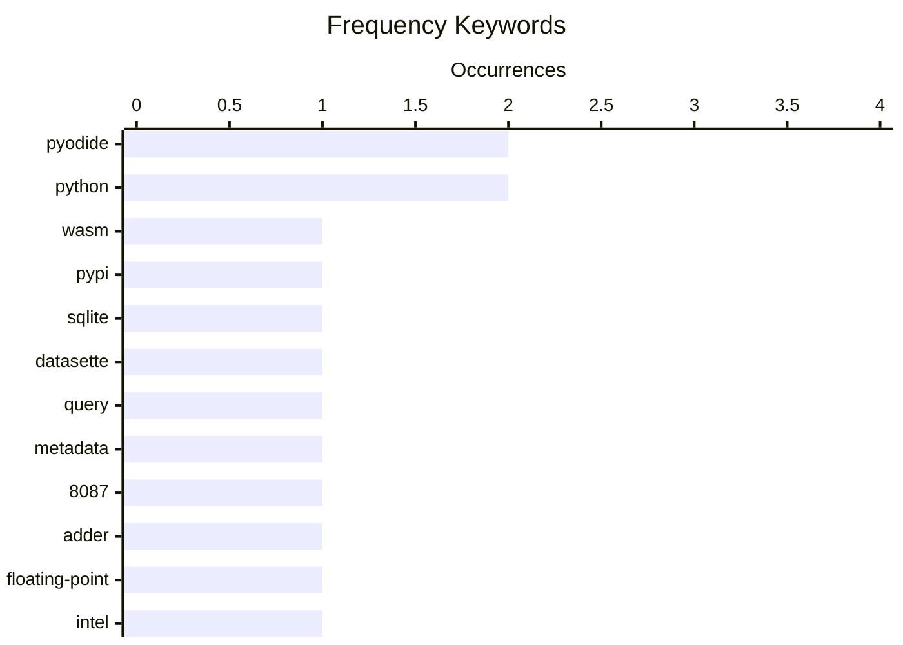

# 📰 AI Blog Daily Digest — 2026-06-15

> From 92 top tech blogs (curated by Karpathy), AI-selected Top 15

## 📝 Today's Highlights

Today’s tech highlights center on the growing convergence of WebAssembly and package ecosystems, with tools like Pyodide and Luau enabling Python and Lua packages to run directly in the browser via WASM wheels on PyPI. In engineering, deep dives into retro computing and low-level hardware—such as the Intel 8087’s adder and DIY VGA consoles—reflect a sustained fascination with foundational computing architecture. Meanwhile, the security and policy landscape is marked by echoes of past encryption battles, as the RSA munitions T-shirt story resurfaces amid ongoing debates over shareholder supremacy and government intervention.

---

## 🏆 Must Read

🥇 **Publishing WASM wheels to PyPI for use with Pyodide**

simonwillison.net · 22h ago · 🛠 Tools / Open Source

> Pyodide 314.0 now allows publishing Python packages built for Pyodide (or any PyEmscripten-compatible runtime per PEP 783) directly to PyPI, enabling runtime installation. Previously, the Pyodide maintainers had to build and host over 300 packages themselves, creating a significant maintenance burden and bottleneck. This shift offloads package distribution to individual maintainers, leveraging PyPI's existing infrastructure. The change dramatically reduces the core team's workload and accelerates community contributions.

💡 **Why it matters**: Essential reading for anyone building or using Python packages in WebAssembly environments, as it removes a major bottleneck in the Pyodide ecosystem.

🏷️ Pyodide, WASM, PyPI, Python

🥈 **Mapping SQLite result columns back to their source `table.column`**

simonwillison.net · 23h ago · ⚙️ Engineering

> The article explores a method to programmatically map SQL query result columns back to their source table.column, even across joins and aliases, to enable richer rendering in tools like Datasette. It discusses parsing SQL to trace column provenance, handling complex queries with multiple tables and subqueries. The goal is to allow arbitrary SQL queries to display additional metadata (e.g., column types, foreign keys) based on source table information.

💡 **Why it matters**: Valuable for developers building SQL-based tools or dashboards who want to enhance query results with schema-aware features without manual annotation.

🏷️ SQLite, Datasette, query, metadata

🥉 **The adder at the heart of Intel's 8087 floating-point chip**

righto.com · 1 days ago · ⚙️ Engineering

> The Intel 8087 floating-point coprocessor (1980) accelerated math up to 100x and computed transcendental functions like tangent, exponentiation, and logarithms. Its core was a 69-bit adder, described in the patent as the 'arithmetic heart' of a nanomachine with registers, shifters, and control circuitry. The article details the adder's design and its critical role in enabling the 8087's advanced floating-point operations.

💡 **Why it matters**: Fascinating deep dive for hardware enthusiasts and computer historians into the microarchitecture that powered early high-performance math coprocessing.

🏷️ 8087, adder, floating-point, Intel

---

## 📊 Data Overview

| Scanned | Articles | Range | Selected |
|:---:|:---:|:---:|:---:|
| 87/92 | 2557 → 23 | 48h | **15** |

### Category Distribution



### High-Frequency Keywords



<details>
<summary>📈 ASCII Keyword Chart (Terminal Friendly)</summary>

```
pyodide   │ ████████████████████ 2
python    │ ████████████████████ 2
wasm      │ ██████████░░░░░░░░░░ 1
pypi      │ ██████████░░░░░░░░░░ 1
sqlite    │ ██████████░░░░░░░░░░ 1
datasette │ ██████████░░░░░░░░░░ 1
query     │ ██████████░░░░░░░░░░ 1
metadata  │ ██████████░░░░░░░░░░ 1
8087      │ ██████████░░░░░░░░░░ 1
adder     │ ██████████░░░░░░░░░░ 1
```

</details>

### 🏷️ Topic Tags

**pyodide**(2) · **python**(2) · **wasm**(1) · pypi(1) · sqlite(1) · datasette(1) · query(1) · metadata(1) · 8087(1) · adder(1) · floating-point(1) · intel(1) · pluggy(1) · plugin system(1) · pytest(1) · luau(1) · webassembly(1) · package management(1) · releases(1) · advisories(1)

---

## ⚙️ Engineering

### 1. Mapping SQLite result columns back to their source `table.column`

[Link](https://simonwillison.net/2026/Jun/13/sqlite-column-provenance/#atom-everything) — **simonwillison.net** · 23h ago · ⭐ 21/30

> The article explores a method to programmatically map SQL query result columns back to their source table.column, even across joins and aliases, to enable richer rendering in tools like Datasette. It discusses parsing SQL to trace column provenance, handling complex queries with multiple tables and subqueries. The goal is to allow arbitrary SQL queries to display additional metadata (e.g., column types, foreign keys) based on source table information.

🏷️ SQLite, Datasette, query, metadata

---

### 2. The adder at the heart of Intel's 8087 floating-point chip

[Link](http://www.righto.com/feeds/3050107772739337632/comments/default) — **righto.com** · 1 days ago · ⭐ 21/30

> The Intel 8087 floating-point coprocessor (1980) accelerated math up to 100x and computed transcendental functions like tangent, exponentiation, and logarithms. Its core was a 69-bit adder, described in the patent as the 'arithmetic heart' of a nanomachine with registers, shifters, and control circuitry. The article details the adder's design and its critical role in enabling the 8087's advanced floating-point operations.

🏷️ 8087, adder, floating-point, Intel

---

### 3. Plugins case study: Pluggy

[Link](https://eli.thegreenplace.net/2026/plugins-case-study-pluggy/) — **eli.thegreenplace.net** · 19h ago · ⭐ 21/30

> Pluggy is a Python library for building plugin systems, originally extracted from pytest, which is known for its extensive plugin ecosystem. It provides a lightweight, hook-based framework for defining extension points and managing plugin registration. The article examines Pluggy's design, including hook specifications, implementations, and how it enables modular, extensible applications.

🏷️ Pluggy, plugin system, Python, pytest

---

### 4. Building a serial and VGA "everything console"

[Link](https://oldvcr.blogspot.com/feeds/7900423283602789203/comments/default) — **oldvcr.blogspot.com** · 21h ago · ⭐ 16/30

> The author builds a DIY serial and VGA 'everything console' from a used IBM 1U console unit purchased for $120 on eBay, aiming for a portable, self-contained alternative to dragging around old CRT terminals or tying up laptops. The project targets systems with serial consoles, emphasizing cost savings and customization. The post details the hardware selection, modifications, and assembly process.

🏷️ serial console, VGA, retro computing, hardware

---

### 5. Making glass-to-metal seals for home&shy;made vacuum tubes.

[Link](https://maurycyz.com/projects/glass/1/) — **maurycyz.com** · 1 days ago · ⭐ 15/30

> The article details the process of creating glass-to-metal seals for homemade vacuum tubes using borosilicate/lab glass. The author explains that premade tube stock is easily available and that heating the end softens the glass, allowing surface tension to close it off. A rotary vane pump removes air from the tube, and heating the middle causes the atmosphere to crush it into a sealed ampule. The core challenge is not the glasswork but achieving and maintaining the vacuum, as glass is practically impermeable to gases. The conclusion is that with basic lab equipment and careful technique, functional vacuum tubes can be fabricated at home.

🏷️ glass, vacuum tubes, metal sealing

---

## 📝 Other

### 6. Trump’s Name (Set in the Wrong Font, of Course) Has Been Removed From the Kennedy Center

[Link](https://apple.news/ANLNtQOeuSkiJ35tzkYw9oA) — **daringfireball.net** · 1 days ago · ⭐ 14/30

> The article reports that President Donald Trump’s name has been physically removed from the Kennedy Center building, following a federal judge’s ruling that the board’s decision to rename it was illegal. Crews began removal at 3 a.m., hours after the center missed the judge’s two-week deadline. The removal serves as a symbolic act, described as a perfect metaphor for the work ahead. The core point is that the legal and physical erasure of the name marks a definitive end to the controversy.

🏷️ politics, Kennedy Center, Trump

---

### 7. ★ The Talk Show: Live From WWDC 2026

[Link](https://daringfireball.net/2026/06/the_talk_show_live_from_wwdc_2026) — **daringfireball.net** · 1 days ago · ⭐ 11/30

> This is an announcement for a live recording of The Talk Show podcast at WWDC 2026, held at The California Theatre in San Jose on June 9, 2026. Special guests include Joanna Stern and Nilay Patel, who join host John Gruber to discuss Apple’s announcements from the conference. The event is recorded in front of a live audience. The core content is a post-event analysis of Apple’s WWDC 2026 product and software reveals.

🏷️ WWDC, Apple, podcast

---

### 8. Did Frank Sinatra really think "Something" was a Lennon/McCartney song?

[Link](https://shkspr.mobi/blog/2026/06/did-frank-sinatra-really-think-something-was-a-lennon-mccartney-song/) — **shkspr.mobi** · 10h ago · ⭐ 11/30

> The article investigates the persistent claim that Frank Sinatra introduced his cover of George Harrison’s “Something” as his “favourite Lennon & McCartney number.” The author argues this is likely a semi-apocryphal line, similar to the misquote about Ringo Starr not being the best drummer in The Beatles. The analysis examines Paul McCartney’s own accounts and historical recordings to question the anecdote’s accuracy. The conclusion is that the story has taken on a life of its own through repeated retelling, despite lacking solid evidence.

🏷️ Beatles, Sinatra, misquote

---

### 9. Reading List 06/13/2026

[Link](https://www.construction-physics.com/p/reading-list-06132026) — **construction-physics.com** · 1 days ago · ⭐ 11/30

> The article is a curated reading list covering diverse topics: homes being built on top of libraries, Patriot missile manufacturing, efforts to construct new US coal plants, and a proposed tunnel between the US and Russia. Each item links to a separate, longer piece of journalism or analysis. The list serves as a digest of unusual or significant infrastructure, defense, and geopolitical stories. The core purpose is to provide a quick overview of noteworthy but niche articles for further reading.

🏷️ reading list, infrastructure, miscellaneous

---

## 🛠 Tools / Open Source

### 10. Publishing WASM wheels to PyPI for use with Pyodide

[Link](https://simonwillison.net/2026/Jun/13/publishing-wasm-wheels/#atom-everything) — **simonwillison.net** · 22h ago · ⭐ 25/30

> Pyodide 314.0 now allows publishing Python packages built for Pyodide (or any PyEmscripten-compatible runtime per PEP 783) directly to PyPI, enabling runtime installation. Previously, the Pyodide maintainers had to build and host over 300 packages themselves, creating a significant maintenance burden and bottleneck. This shift offloads package distribution to individual maintainers, leveraging PyPI's existing infrastructure. The change dramatically reduces the core team's workload and accelerates community contributions.

🏷️ Pyodide, WASM, PyPI, Python

---

### 11. luau-wasm 0.1a0

[Link](https://simonwillison.net/2026/Jun/13/luau-wasm/#atom-everything) — **simonwillison.net** · 23h ago · ⭐ 19/30

> luau-wasm 0.1a0 is a release that publishes Luau (a Lua dialect) as a WebAssembly wheel to PyPI, following the approach detailed in the 'Publishing WASM wheels to PyPI for use with Pyodide' article. This enables running Luau scripts directly in Pyodide or other PyEmscripten-compatible runtimes. The release tags include Lua, WebAssembly, and Pyodide.

🏷️ luau, WebAssembly, Pyodide

---

### 12. This Week in Package Management: 13 June 2026

[Link](https://nesbitt.io/2026/06/13/this-week-in-package-management.html) — **nesbitt.io** · 1 days ago · ⭐ 19/30

> A curated roundup of releases, security advisories, and articles from across the package management ecosystem for the week of 13 June 2026. It aggregates updates from various package managers (e.g., npm, PyPI, cargo) and related tools. The post serves as a digest for staying informed about changes and vulnerabilities in the package management landscape.

🏷️ package management, releases, advisories

---

## 💡 Opinion / Essays

### 13. Pluralistic: Shareholder supremacy and the precog CEO (13 Jun 2026)

[Link](https://pluralistic.net/2026/06/13/minority-shareholder-report/) — **pluralistic.net** · 1 days ago · ⭐ 18/30

> The article critiques 'shareholder supremacy' and the concept of a 'precog CEO'—a CEO who claims to foresee future market trends to justify decisions. It argues this creates an unfalsifiable bright-line test that shields management from accountability. Links cover topics from Microsoft vs. Linux geeks to the ACCESS Act, highlighting systemic issues in corporate governance and tech policy.

🏷️ shareholder, corporate governance, critique

---

### 14. What Washington must do

[Link](https://garymarcus.substack.com/p/what-washington-must-do) — **garymarcus.substack.com** · 6h ago · ⭐ 16/30

> The article argues that Washington must take decisive, direct action to address systemic challenges, with the core message 'The only way out is through.' It likely advocates for confronting problems head-on rather than avoiding or deferring them. The specific policy areas are not detailed in the snippet, but the tone suggests urgency and a call for political courage.

🏷️ policy, AI, regulation

---

## 🔒 Security

### 15. RSA munitions T-shirt

[Link](https://www.johndcook.com/blog/2026/06/13/rsa-munitions-t-shirt/) — **johndcook.com** · 1 days ago · ⭐ 17/30

> In 1995, when the US classified strong encryption as 'munitions' and banned export, Adam Back protested by creating a terse, obfuscated RSA implementation in Perl code, used as an email signature and printed on T-shirts. The T-shirt itself was technically classified as a munition under US law. The post recounts this historical act of civil disobedience against encryption export restrictions.

🏷️ RSA, cryptography, history, protest

---

*Generated on 2026-06-15 | Scanned 87 sources → Found 2557 articles → Selected 15 articles*
*Based on [Hacker News Popularity Contest 2025](https://refactoringenglish.com/tools/hn-popularity/) RSS feeds list, curated by [Andrej Karpathy](https://x.com/karpathy).*
*Created by "Understand AI".*
