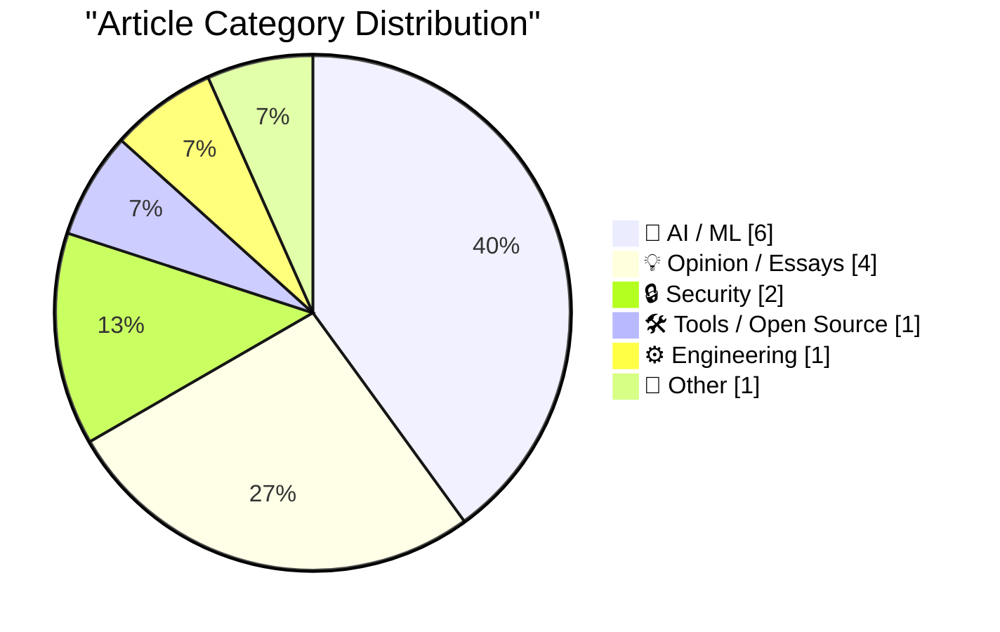
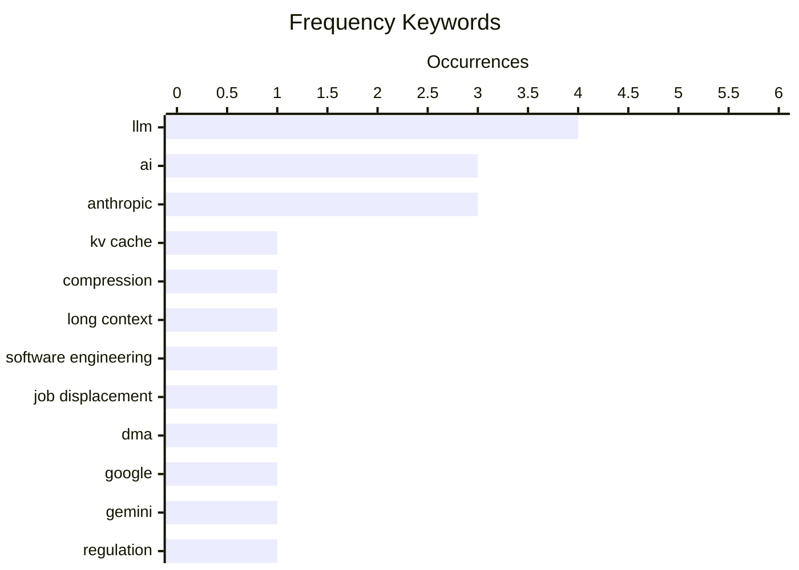

# 📰 AI Blog Daily Digest — 2026-06-16

> From 92 top tech blogs (curated by Karpathy), AI-selected Top 15

## 📝 Today's Highlights

Today’s top articles reveal a tech landscape grappling with AI’s economic and operational realities, as debates over its sustainability and impact on jobs intensify. A major trend is the growing scrutiny of AI’s business model and safety claims, with pieces questioning the industry’s financial viability and highlighting internal conflicts at leading labs like Anthropic. Meanwhile, regulatory and infrastructure developments are shaping the field, from the EU’s antitrust ruling against Google’s Gemini integration to new protocols for AI agent authentication and evidence that GPU lifespans may be longer than assumed.

---

## 🏆 Must Read

🥇 **A brief history of KV cache compression developments**

martinalderson.com · 22h ago · 🤖 AI / ML

> KV cache compression techniques—from Multi-Query Attention (MQA) and Grouped-Query Attention (GQA) to Multi-head Latent Attention (MLA) and linear-attention hybrids—have been the key enabler of long-context windows in modern LLMs. MQA reduced memory by sharing a single key-value head across all query heads, while GQA offered a middle ground with grouped key-value heads. MLA further compressed the cache by projecting keys and values into a low-dimensional latent space. Linear-attention hybrids like Mamba-2 and Transformer++ combine recurrent and attention mechanisms to achieve sub-quadratic memory scaling. These innovations collectively reduced per-token KV cache memory from O(n²) to near-constant, enabling context windows of 128K+ tokens. The author concludes that without these compression methods, agentic LLMs requiring long-term memory would be computationally infeasible.

💡 **Why it matters**: Essential reading for understanding the unsung engineering breakthroughs that made today's long-context AI agents possible, with clear technical lineage from MQA to modern hybrids.

🏷️ KV cache, compression, LLM, long context

🥈 **Why AI hasn’t replaced software engineers, and won’t**

simonwillison.net · 22h ago · 💡 Opinion / Essays

> Arvind Narayanan and Sayash Kapoor argue that AI will not cause mass layoffs among software engineers, even though software engineering is uniquely suited to AI disruption due to low regulatory barriers. They reject the narrative that once AI capabilities reach a certain threshold, job replacement becomes inevitable. Key evidence includes the persistent need for human judgment in system design, debugging, and requirement interpretation—tasks where AI still fails catastrophically. The authors note that AI coding assistants boost productivity by 20-30% but introduce new failure modes that require skilled oversight. They conclude that most other professions, facing even higher regulatory and trust barriers, are even less likely to see mass AI-driven displacement.

💡 **Why it matters**: Provides a data-driven counterargument to the 'AI will replace programmers' hype, grounded in actual software engineering workflows rather than capability extrapolation.

🏷️ AI, software engineering, job displacement

🥉 **The European Commission Ruled Months Ago That Google’s Integration of Gemini in Android Violates the DMA**

daringfireball.net · 3h ago · 🔒 Security

> The European Commission has ruled that Google's integration of Gemini into Android violates the Digital Markets Act (DMA), potentially forcing Google to open Android to third-party AI assistants. Proposed remedies include allowing alternative AI tools to be invoked system-wide via hot words or button presses, and granting them access to screen context and local data for proactive suggestions. This would fundamentally change Android's AI ecosystem by enabling competitors like ChatGPT, Claude, or Mistral to operate at the same system level as Gemini. The ruling extends DMA principles from app stores and browsers to AI assistants, setting a precedent for platform regulation in the AI era.

💡 **Why it matters**: Critical for understanding how EU regulation is reshaping the competitive landscape for AI assistants on mobile platforms, with direct implications for Google's business model.

🏷️ DMA, Google, Gemini, regulation

---

## 📊 Data Overview

| Scanned | Articles | Range | Selected |
|:---:|:---:|:---:|:---:|
| 87/92 | 2560 → 27 | 48h | **15** |

### Category Distribution



### High-Frequency Keywords



<details>
<summary>📈 ASCII Keyword Chart (Terminal Friendly)</summary>

```
llm                  │ ████████████████████ 4
ai                   │ ███████████████░░░░░ 3
anthropic            │ ███████████████░░░░░ 3
kv cache             │ █████░░░░░░░░░░░░░░░ 1
compression          │ █████░░░░░░░░░░░░░░░ 1
long context         │ █████░░░░░░░░░░░░░░░ 1
software engineering │ █████░░░░░░░░░░░░░░░ 1
job displacement     │ █████░░░░░░░░░░░░░░░ 1
dma                  │ █████░░░░░░░░░░░░░░░ 1
google               │ █████░░░░░░░░░░░░░░░ 1
```

</details>

### 🏷️ Topic Tags

**llm**(4) · **ai**(3) · **anthropic**(3) · kv cache(1) · compression(1) · long context(1) · software engineering(1) · job displacement(1) · dma(1) · google(1) · gemini(1) · regulation(1) · safety(1) · competition(1) · economics(1) · nvidia(1) · export control(1) · government(1) · gpu(1) · lifespan(1)

---

## 🤖 AI / ML

### 1. A brief history of KV cache compression developments

[Link](https://martinalderson.com/posts/a-brief-history-of-kv-cache-compression-developments/?utm_source=rss&amp;utm_medium=rss&amp;utm_campaign=feed) — **martinalderson.com** · 22h ago · ⭐ 26/30

> KV cache compression techniques—from Multi-Query Attention (MQA) and Grouped-Query Attention (GQA) to Multi-head Latent Attention (MLA) and linear-attention hybrids—have been the key enabler of long-context windows in modern LLMs. MQA reduced memory by sharing a single key-value head across all query heads, while GQA offered a middle ground with grouped key-value heads. MLA further compressed the cache by projecting keys and values into a low-dimensional latent space. Linear-attention hybrids like Mamba-2 and Transformer++ combine recurrent and attention mechanisms to achieve sub-quadratic memory scaling. These innovations collectively reduced per-token KV cache memory from O(n²) to near-constant, enabling context windows of 128K+ tokens. The author concludes that without these compression methods, agentic LLMs requiring long-term memory would be computationally infeasible.

🏷️ KV cache, compression, LLM, long context

---

### 2. ‘Anthropic’s Safety Superpower’

[Link](https://stratechery.com/2026/anthropics-safety-superpower/) — **daringfireball.net** · 5h ago · ⭐ 24/30

> Ben Thompson analyzes Anthropic's 'safety superpower' as a strategic moat, arguing that the company's safety-first positioning is as much about competitive advantage as genuine concern. He notes that Anthropic's policy of not helping competitors with safety research, enacted just two months after a dispute with the Department of War over Claude's use in legal contexts, reveals a belief that only Anthropic should be making frontier LLMs. Thompson points out the tension between Anthropic's public safety advocacy and its private reluctance to share safety techniques. He concludes that Anthropic's safety narrative serves dual purposes: genuine risk mitigation and a powerful differentiator in a market where trust is increasingly valuable.

🏷️ Anthropic, safety, LLM, competition

---

### 3. "They screwed us": Personality clashes sent Anthropic's models offline

[Link](https://simonwillison.net/2026/Jun/15/axios-clashes-anthropics/#atom-everything) — **simonwillison.net** · 7h ago · ⭐ 23/30

> An Axios investigation, summarized by Simon Willison, reveals that personality clashes between Anthropic leadership and US government officials led to Anthropic's models being taken offline for export control compliance. The piece cites sources familiar with both sides, describing tensions over the 'Mythos/Fable' export control framework. Key figures mentioned include Logan Graham (Frontier Red Team lead), Dave Orr (Head of Safeguards, ex-Google DeepMind), and Nicholas Carlini. The article suggests that interpersonal dynamics, rather than purely technical or policy disagreements, drove the decision to restrict model access. Willison notes this is the best behind-the-scenes account of the export control story to date.

🏷️ Anthropic, export control, LLM, government

---

### 4. AI GPUs probably live longer than three years

[Link](https://seangoedecke.com/ai-gpus-live-longer-than-three-years/) — **seangoedecke.com** · 22h ago · ⭐ 22/30

> Sean Goedecke debunks the common claim that AI inference GPUs only last 'three years at the most' under load, which is often used to argue that current AI economics are unsustainable. He traces the origin of this claim to a misinterpretation of data center GPU depreciation schedules, not actual hardware failure rates. Evidence from cloud providers and hyperscalers shows that GPUs routinely operate for 5-7 years in production, with failure rates below 5% annually after the first year. The author notes that NVIDIA's H100 and A100 GPUs are designed for continuous operation with proper cooling and power management. He concludes that the 'three-year lifespan' myth significantly overstates the replacement costs that AI companies will face.

🏷️ GPU, lifespan, inference, infrastructure

---

### 5. Quaternion Rotations, Claude, and Lean

[Link](https://www.johndcook.com/blog/2026/06/15/quaternions-claude-lean/) — **johndcook.com** · 3h ago · ⭐ 16/30

> The author tested Claude Sonnet 4.6 Medium's ability to find a typo in a year-old blog post about converting between quaternions and rotation matrices, specifically a sign error in a matrix element. Claude successfully identified the exact error, correctly noting that the `2yz + 2wx` term should be `2yz - 2wx` in the rotation matrix. The article then compares this to a formal verification approach using the Lean theorem prover, which would catch such errors through mathematical proof rather than pattern matching. The conclusion is that while LLMs can spot known errors in well-documented code, formal verification tools like Lean provide a more rigorous and reliable method for ensuring mathematical correctness.

🏷️ quaternion, Claude, Lean, rotation

---

### 6. Writing Prolog with ChatGPT

[Link](https://www.johndcook.com/blog/2026/06/15/writing-prolog-with-chatgpt/) — **johndcook.com** · 5h ago · ⭐ 15/30

> The author tasked ChatGPT with writing Prolog code to solve a chess puzzle: placing a queen, king, rook, bishop, and knight on a 4x4 board so no piece attacks another. ChatGPT generated a Prolog program that used `permutation` and `member` to assign positions, but the initial code had a logical error in the knight's movement constraint, incorrectly using `abs(X1-X2) = 2` instead of `abs(X1-X2) =:= 2`. After the author pointed out the error, ChatGPT corrected the code, which then successfully found all valid solutions. The article concludes that while ChatGPT can generate plausible Prolog code for constraint satisfaction problems, it still requires human verification for subtle logical and syntactic errors.

🏷️ Prolog, ChatGPT, chess, LLM

---

## 💡 Opinion / Essays

### 7. Why AI hasn’t replaced software engineers, and won’t

[Link](https://simonwillison.net/2026/Jun/14/why-ai-hasnt-replaced-software-engineers/#atom-everything) — **simonwillison.net** · 22h ago · ⭐ 25/30

> Arvind Narayanan and Sayash Kapoor argue that AI will not cause mass layoffs among software engineers, even though software engineering is uniquely suited to AI disruption due to low regulatory barriers. They reject the narrative that once AI capabilities reach a certain threshold, job replacement becomes inevitable. Key evidence includes the persistent need for human judgment in system design, debugging, and requirement interpretation—tasks where AI still fails catastrophically. The authors note that AI coding assistants boost productivity by 20-30% but introduce new failure modes that require skilled oversight. They conclude that most other professions, facing even higher regulatory and trust barriers, are even less likely to see mass AI-driven displacement.

🏷️ AI, software engineering, job displacement

---

### 8. AI's Brokenomics

[Link](https://www.wheresyoured.at/brokenomics/) — **wheresyoured.at** · 3h ago · ⭐ 24/30

> The article examines the fundamental economic unsustainability of the current AI boom, arguing that the cost of training and inference far exceeds any realistic revenue model. It highlights that NVIDIA's GPU sales are driven by massive capital expenditure from a handful of companies (Microsoft, Google, Amazon, Meta) that are collectively spending over $200B annually on AI infrastructure. The author points out that current AI products—from chatbots to code assistants—generate far less revenue than the compute costs they incur. The piece concludes that the AI industry is operating on 'broken economics' that will eventually lead to a correction when investors demand returns.

🏷️ AI, economics, NVIDIA, Anthropic

---

### 9. EU & Civil Society need to progress on Digital Autonomy

[Link](https://berthub.eu/articles/posts/eu-civil-society-need-progress-digital-autonomy/) — **berthub.eu** · 9h ago · ⭐ 20/30

> Bert Hubert argues that EU and civil society discussions on digital autonomy have stagnated, going 'round in circles' between legislation and values talk. He urges stakeholders to look beyond current regulatory debates (DMA, DSA, AI Act) and focus on the long, practical road to digital sovereignty. Key areas requiring progress include open-source infrastructure, European cloud providers, semiconductor manufacturing, and digital identity systems. The author emphasizes that civil society and think tanks are well-positioned to contribute but need to shift from critique to building concrete alternatives. He concludes that achieving true digital autonomy will take decades of sustained effort across technology, policy, and culture.

🏷️ EU, digital autonomy, sovereignty, policy

---

### 10. Pluralistic: AI and amateurism (15 Jun 2026)

[Link](https://pluralistic.net/2026/06/15/vernacular/) — **pluralistic.net** · 6h ago · ⭐ 19/30

> The article explores the distinction between generative AI content that is merely derivative versus content that achieves 'vernacular' status—a form of amateur, community-driven creativity that enriches culture rather than depleting it. It argues that the key difference lies in whether the output is produced by people within a community for that community (vernacular) or by corporations extracting value from cultural commons. The author uses examples like fan fiction, memes, and open-source software to illustrate how amateur production can be a vibrant, non-exploitative form of creativity. The core conclusion is that the problem with generative AI is not amateurism itself, but the corporate enclosure of amateur creativity for profit, stripping it of its communal and reciprocal nature.

🏷️ AI, amateurism, generative content

---

## 🔒 Security

### 11. The European Commission Ruled Months Ago That Google’s Integration of Gemini in Android Violates the DMA

[Link](https://arstechnica.com/ai/2026/04/europe-could-force-google-to-open-android-to-other-ai-assistants/) — **daringfireball.net** · 3h ago · ⭐ 24/30

> The European Commission has ruled that Google's integration of Gemini into Android violates the Digital Markets Act (DMA), potentially forcing Google to open Android to third-party AI assistants. Proposed remedies include allowing alternative AI tools to be invoked system-wide via hot words or button presses, and granting them access to screen context and local data for proactive suggestions. This would fundamentally change Android's AI ecosystem by enabling competitors like ChatGPT, Claude, or Mistral to operate at the same system level as Gemini. The ruling extends DMA principles from app stores and browsers to AI assistants, setting a precedent for platform regulation in the AI era.

🏷️ DMA, Google, Gemini, regulation

---

### 12. Things that made me think: Open Source trust relationships, knowledge without provenance, and theory building

[Link](https://tomrenner.com/posts/ttmmt-4/) — **tomrenner.com** · 22h ago · ⭐ 20/30

> Tom Renner collects three thought-provoking items: (1) A Socket.dev report on AI agents landing pull requests in major open-source projects and targeting maintainers via cold outreach, highlighting the intersection of automation and human trust dynamics. (2) The challenge of 'knowledge without provenance' in an era where AI generates plausible but unattributable information, making it difficult to verify claims or assign credit. (3) The importance of theory-building in software engineering, contrasting with the current trend toward purely empirical, data-driven approaches. Renner notes that each item raises questions about trust, verification, and methodology in an AI-augmented world.

🏷️ open source, trust, AI agent, supply chain

---

## 🛠 Tools / Open Source

### 13. WorkOS Launches Auth.md — an Open Protocol for Agent Registration

[Link](https://workos.com/auth-md?utm_source=daringfireball&amp;utm_medium=newsletter&amp;utm_campaign=q22026) — **daringfireball.net** · 4h ago · ⭐ 21/30

> WorkOS has launched Auth.md, an open protocol for AI agent registration that uses a machine-readable Markdown file exposed at a service's root URL. The protocol allows AI agents to dynamically discover OAuth Protected Resource Metadata, parse required scopes, and authenticate without human intervention. This addresses the fundamental problem that existing sign-up forms were designed for humans in browsers, not programmatic agent access. Auth.md leverages the simplicity of Markdown to define agent registration endpoints, scopes, and authentication flows in a format that both humans and machines can read. The protocol aims to standardize how AI agents register with web services, similar to how robots.txt standardized crawler access.

🏷️ Auth.md, AI agents, registration, protocol

---

## ⚙️ Engineering

### 14. JAX: commitment issues

[Link](https://www.gilesthomas.com/2026/06/jax-commitment-issues) — **gilesthomas.com** · 1h ago · ⭐ 18/30

> The article investigates a subtle but critical bug in JAX where using `jax.default_device` to force array creation on CPU can cause a silent, catastrophic memory leak when a CUDA-capable GPU is present. The issue stems from JAX's asynchronous execution model: the CPU array's internal buffer is pinned (non-pageable) memory allocated by the CUDA driver, which is never freed because the array's reference count is held by a CUDA stream callback that never completes. This results in the process consuming gigabytes of pinned memory until it crashes, even though the array appears to be on CPU. The author demonstrates the bug with a minimal reproducible example and explains the root cause in JAX's buffer management and device synchronization logic.

🏷️ JAX, CUDA, performance, device

---

## 📝 Other

### 15. from hookswitch to grave

[Link](https://computer.rip/2026-06-14-hookswitch-to-grave.html) — **computer.rip** · 1 days ago · ⭐ 15/30

> The article traces the complete lifecycle of a telephone call through the Bell System's electromechanical switching infrastructure, from the 'hookswitch' (the physical cradle that detects off-hook) to the 'grave' (call termination and billing). It details the step-by-step electromechanical processes: line relay activation, rotary dial pulse decoding, crossbar switch matrix path selection, and the 'cut-through' that establishes a physical circuit. The author explains how AT&T's vertical integration and monopoly allowed it to build a unified, nationwide system where every component—from the handset to the central office switch—was designed and maintained by a single entity. The core argument is that this monolithic, vertically-integrated architecture, while technically elegant, was a direct consequence of monopoly power that would be impossible to replicate in today's competitive telecommunications landscape.

🏷️ AT&T, history, telecommunications

---

*Generated on 2026-06-16 | Scanned 87 sources → Found 2560 articles → Selected 15 articles*
*Based on [Hacker News Popularity Contest 2025](https://refactoringenglish.com/tools/hn-popularity/) RSS feeds list, curated by [Andrej Karpathy](https://x.com/karpathy).*
*Created by "Understand AI".*
