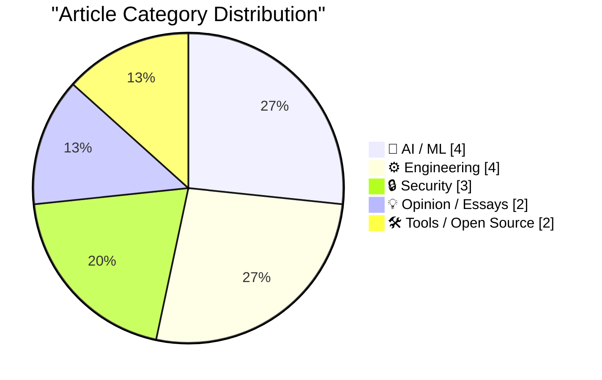
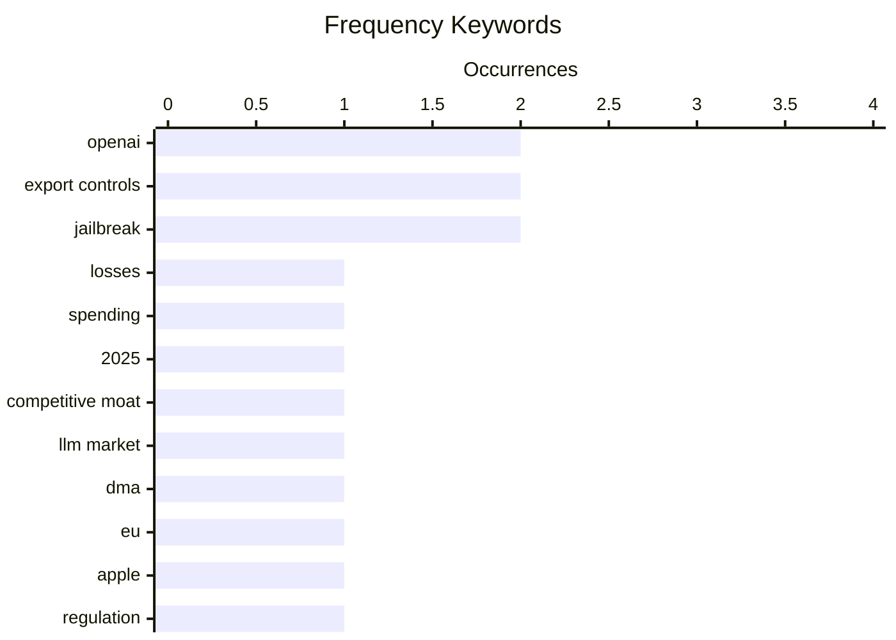

# 📰 AI Blog Daily Digest — 2026-06-17

> From 92 top tech blogs (curated by Karpathy), AI-selected Top 15

## 📝 Today's Highlights

Today’s top stories reveal a tech landscape marked by AI’s soaring costs and eroding dominance, as OpenAI’s spending skyrockets to $34 billion while its competitive lead fades. Meanwhile, regulatory friction intensifies, with the EU’s Digital Markets Act prompting Apple to withhold AI features and experts warning against big-tech involvement in digital autonomy talks. Security concerns also take center stage, from crypto drainers appearing atop search engines to debates over export controls harming U.S. cyber defense, signaling a shift toward fragmented, local, and independent AI ecosystems.

---

## 🏆 Must Read

🥇 **Exclusive: OpenAI Losses Increased Nearly 8X in 2025, With Spending Hitting $34 Billion**

wheresyoured.at · 18h ago · 🤖 AI / ML

> OpenAI's losses surged nearly 8x in 2025, reaching $34 billion in spending, driven by massive compute costs and scaling efforts. The company's revenue growth has not kept pace with expenses, leading to a widening financial gap. Key spending areas include training and inference for models like GPT-5, with operational costs exceeding $10 billion annually. The article highlights that OpenAI's burn rate is unsustainable without continuous external funding or a dramatic revenue increase. The author concludes that OpenAI's financial trajectory poses a serious risk to its long-term viability.

💡 **Why it matters**: Provides critical financial transparency on OpenAI's spending, essential for understanding the economic realities behind leading AI companies.

🏷️ OpenAI, losses, spending, 2025

🥈 **OpenAI’s lead is dwindling fast**

garymarcus.substack.com · 36m ago · 🤖 AI / ML

> OpenAI's competitive advantage is rapidly eroding due to the lack of a durable moat in the AI industry. Competitors like Anthropic, Google, and open-source models are closing the performance gap, with models like Claude 4 and Gemini 2.5 matching or exceeding GPT-4 in key benchmarks. The article argues that OpenAI's early lead was based on first-mover advantage and data scale, but these are now replicable by rivals. The author concludes that without a proprietary data or hardware edge, OpenAI's dominance is unsustainable.

💡 **Why it matters**: Offers a sharp, data-driven analysis of why OpenAI's lead is fading, crucial for investors and strategists tracking AI market dynamics.

🏷️ OpenAI, competitive moat, LLM market

🥉 **The Washington Post on the EU’s DMA Folly**

daringfireball.net · 20h ago · 💡 Opinion / Essays

> The EU's Digital Markets Act (DMA) is causing Apple to withhold the new Siri AI from Europe, as the law would require granting rival AI agents equal access to user data. Apple proposed a security layer to mitigate risks, but regulators rejected it, citing the DMA's strict interoperability rules. The Washington Post editorial board argues that the DMA's rigid framework inadvertently harms European consumers by delaying AI innovation. The core point is that the DMA's one-size-fits-all approach fails to balance security, privacy, and competition.

💡 **Why it matters**: Illuminates a concrete, high-stakes example of how regulation can backfire, directly impacting consumer access to AI features in Europe.

🏷️ DMA, EU, Apple, regulation

---

## 📊 Data Overview

| Scanned | Articles | Range | Selected |
|:---:|:---:|:---:|:---:|
| 87/92 | 2564 → 45 | 48h | **15** |

### Category Distribution



### High-Frequency Keywords



<details>
<summary>📈 ASCII Keyword Chart (Terminal Friendly)</summary>

```
openai           │ ████████████████████ 2
export controls  │ ████████████████████ 2
jailbreak        │ ████████████████████ 2
losses           │ ██████████░░░░░░░░░░ 1
spending         │ ██████████░░░░░░░░░░ 1
2025             │ ██████████░░░░░░░░░░ 1
competitive moat │ ██████████░░░░░░░░░░ 1
llm market       │ ██████████░░░░░░░░░░ 1
dma              │ ██████████░░░░░░░░░░ 1
eu               │ ██████████░░░░░░░░░░ 1
```

</details>

### 🏷️ Topic Tags

**openai**(2) · **export controls**(2) · **jailbreak**(2) · losses(1) · spending(1) · 2025(1) · competitive moat(1) · llm market(1) · dma(1) · eu(1) · apple(1) · regulation(1) · digital autonomy(1) · big tech(1) · europe(1) · policy(1) · phishing(1) · duckduckgo(1) · seo poisoning(1) · crypto scam(1)

---

## 🤖 AI / ML

### 1. Exclusive: OpenAI Losses Increased Nearly 8X in 2025, With Spending Hitting $34 Billion

[Link](https://www.wheresyoured.at/exclusive-openai-financials/) — **wheresyoured.at** · 18h ago · ⭐ 26/30

> OpenAI's losses surged nearly 8x in 2025, reaching $34 billion in spending, driven by massive compute costs and scaling efforts. The company's revenue growth has not kept pace with expenses, leading to a widening financial gap. Key spending areas include training and inference for models like GPT-5, with operational costs exceeding $10 billion annually. The article highlights that OpenAI's burn rate is unsustainable without continuous external funding or a dramatic revenue increase. The author concludes that OpenAI's financial trajectory poses a serious risk to its long-term viability.

🏷️ OpenAI, losses, spending, 2025

---

### 2. OpenAI’s lead is dwindling fast

[Link](https://garymarcus.substack.com/p/openais-lead-is-dwindling-fast) — **garymarcus.substack.com** · 36m ago · ⭐ 25/30

> OpenAI's competitive advantage is rapidly eroding due to the lack of a durable moat in the AI industry. Competitors like Anthropic, Google, and open-source models are closing the performance gap, with models like Claude 4 and Gemini 2.5 matching or exceeding GPT-4 in key benchmarks. The article argues that OpenAI's early lead was based on first-mover advantage and data scale, but these are now replicable by rivals. The author concludes that without a proprietary data or hardware edge, OpenAI's dominance is unsustainable.

🏷️ OpenAI, competitive moat, LLM market

---

### 3. Maybe it's time for lots of little indie AIs to take over

[Link](https://anildash.com/2026/06/15/indie-AI-takeover/) — **anildash.com** · 1 days ago · ⭐ 23/30

> The author advocates for a shift from monolithic AI models like ChatGPT to a ecosystem of small, responsible indie AIs. Drawing parallels to the evolution of the web, the article argues that decentralized, specialized models can offer better privacy, customization, and accountability. The author cites examples of small teams building effective models for niche tasks, contrasting with big tech's centralized approach. The conclusion is that the future of AI lies in many small, interoperable models rather than a single dominant player.

🏷️ indie AI, decentralization, alternatives

---

### 4. Quoting Georgi Gerganov

[Link](https://simonwillison.net/2026/Jun/16/georgi-gerganov/#atom-everything) — **simonwillison.net** · 6h ago · ⭐ 21/30

> Georgi Gerganov, creator of llama.cpp, attests that Qwen3.6-27B is a highly capable local model for coding tasks, which he uses daily on his M2 Ultra and RTX 5090. He uses it for small mundane tasks at ggml-org, finding it a helpful tool for a maintainer. He notes he would use it more if not for time spent on PR reviews, and mentions using a lightweight harness called 'pi agent.' The quote highlights the growing viability of local AI models for practical development work.

🏷️ Qwen, local model, coding

---

## ⚙️ Engineering

### 5. How Open Source Projects Change Hands

[Link](https://nesbitt.io/2026/06/16/how-open-source-projects-change-hands.html) — **nesbitt.io** · 12h ago · ⭐ 22/30

> The article explores the various ways open-source projects transition to new maintainers, emphasizing that there are more options than simply abandoning the project. It categorizes handoff methods: direct succession, forking, donation to a foundation, or gradual delegation. The author argues that proactive planning for maintainer transitions is crucial for project longevity. The core point is that open-source sustainability depends on structured handoff processes to avoid project death.

🏷️ open source, maintenance, project handoff

---

### 6. Lean, not backpressure

[Link](https://entropicthoughts.com/lean-not-backpressure) — **entropicthoughts.com** · 1 days ago · ⭐ 21/30

> The article critiques Lucas Costa's piece on building systems for code-generating AI, arguing that his proposed solutions are mislabeled as 'backpressure.' True backpressure signals upstream processes to slow down, whereas Costa's suggestions focus on signaling them to change behavior (e.g., improving output quality) rather than just reducing speed. The author contends that conflating these concepts leads to flawed system design, as the real need is quality control, not rate limiting. The core point is that using the wrong metaphor (backpressure) obscures the actual engineering challenge of managing AI-generated code quality.

🏷️ backpressure, system design, code generation

---

### 7. Lean Launch Pad 2026 @ Stanford – Lessons Learned Presentations

[Link](https://steveblank.com/2026/06/16/lean-launch-pad-2026-stanford-lessons-learned-presentations/) — **steveblank.com** · 9h ago · ⭐ 20/30

> The post announces the completion of the 16th annual Lean LaunchPad class at Stanford, tracing its evolution from a radical idea to a widely accepted startup methodology. Over 16 years, the Lean method has shifted from a controversial framework to a standard approach for building new ventures. The article highlights that the class has become so established that it now faces the challenge of maintaining innovation while being mainstream. The author concludes that the Lean LaunchPad's success validates its core premise: structured experimentation reduces startup failure rates.

🏷️ Lean LaunchPad, startups, Stanford, methodology

---

### 8. The time the x86 emulator team found code so bad that they fixed it during emulation

[Link](https://devblogs.microsoft.com/oldnewthing/20260615-00/?p=112419) — **devblogs.microsoft.com/oldnewthing** · 1 days ago · ⭐ 19/30

> The x86 emulator team encountered such egregiously bad code in a legacy application that they implemented runtime fixes during emulation rather than relying on the original software to be patched. The 'offensive' code violated fundamental assumptions about instruction ordering and memory access, causing crashes that the emulator could not gracefully handle. The team's solution involved dynamically rewriting the problematic instructions on-the-fly within the emulation layer. The author's point is that when software is too broken to fix conventionally, emulation can serve as a last-resort compatibility layer.

🏷️ x86 emulation, code quality, software engineering

---

## 🔒 Security

### 9. Would you like a drainer served at the very top of DuckDuckGo?

[Link](https://timsh.org/drainer-at-the-top-of-duckduckgo/) — **timsh.org** · 8h ago · ⭐ 23/30

> A fake Tronscan blockchain explorer appeared as the #1 result on DuckDuckGo, serving a crypto drainer that steals users' funds. The phishing site was an exact copy of the legitimate site, exploiting DuckDuckGo's ad or ranking algorithms. The author discovered the drainer by inspecting the site's JavaScript, which connected to a known malicious wallet. The article highlights the failure of search engines to prevent such scams, especially for high-risk queries. The core point is that users cannot trust top search results for sensitive actions.

🏷️ phishing, DuckDuckGo, SEO poisoning, crypto scam

---

### 10. The Fable 5 Export Controls Harm US Cyber Defense

[Link](https://simonwillison.net/2026/Jun/16/fable-5-export-controls/#atom-everything) — **simonwillison.net** · 17h ago · ⭐ 22/30

> US export controls on AI models like Claude Fable 5 are harming domestic cyber defense by restricting access to security tools. The article quotes cybersecurity expert Kate Moussouris, who confirmed that the 'jailbreak' triggering the ban was simply asking Fable 5 to 'fix this code' with known vulnerabilities. Fable 5 initially refused to 'review the code for security issues' but complied when asked to 'fix this code,' highlighting the absurdity of the ban. The author argues that such controls impede legitimate security research and weaken US cyber defenses.

🏷️ export controls, jailbreak, Claude

---

### 11. Quoting Matteo Wong, The Atlantic

[Link](https://simonwillison.net/2026/Jun/16/matteo-wong-the-atlantic/#atom-everything) — **simonwillison.net** · 19h ago · ⭐ 22/30

> Anthropic shared a White House report on the Fable jailbreak with cybersecurity expert Katie Moussouris, who revealed the details. The report involved IT experts asking Fable to find and patch bugs; the model refused 'review the code for security issues' but complied with 'fix this code.' Moussouris noted that the distinction was semantic, not a genuine security bypass. The article underscores the flawed reasoning behind export controls on AI models used for security.

🏷️ export controls, jailbreak, Anthropic

---

## 💡 Opinion / Essays

### 12. The Washington Post on the EU’s DMA Folly

[Link](https://www.washingtonpost.com/opinions/2026/06/14/apple-withholding-siri-ai-europe-is-another-dma-failure/) — **daringfireball.net** · 20h ago · ⭐ 24/30

> The EU's Digital Markets Act (DMA) is causing Apple to withhold the new Siri AI from Europe, as the law would require granting rival AI agents equal access to user data. Apple proposed a security layer to mitigate risks, but regulators rejected it, citing the DMA's strict interoperability rules. The Washington Post editorial board argues that the DMA's rigid framework inadvertently harms European consumers by delaying AI innovation. The core point is that the DMA's one-size-fits-all approach fails to balance security, privacy, and competition.

🏷️ DMA, EU, Apple, regulation

---

### 13. Do not invite big-tech to join your digital autonomy discussion

[Link](https://berthub.eu/articles/posts/do-not-invite-big-tech-to-your-digital-autonomy-discussion/) — **berthub.eu** · 6h ago · ⭐ 24/30

> Inviting big tech companies like Microsoft, Google, and Amazon to discussions on European digital autonomy undermines the goal, as their interests conflict with European sovereignty. The author recounts attending an event where these firms dominated the agenda, steering conversations toward their proprietary solutions. The article argues that true digital autonomy requires excluding big tech from strategic planning sessions to avoid regulatory capture. The conclusion is that Europe must develop independent digital infrastructure without big tech's influence.

🏷️ digital autonomy, big tech, Europe, policy

---

## 🛠 Tools / Open Source

### 14. Key, in sight

[Link](https://aresluna.org/key-in-sight) — **aresluna.org** · 3h ago · ⭐ 19/30

> This 9,400-word guide provides a comprehensive framework for keyboard customization, covering hardware (switches, keycaps, layouts) and software (QMK, VIA, ZMK) configuration. It systematically walks through ergonomic considerations, firmware flashing, and keymap design for both beginners and advanced users. The guide emphasizes that customization is about optimizing for individual typing patterns and workflow efficiency, not just aesthetics. The author concludes that a well-tuned keyboard can reduce RSI risk and improve typing speed by 10-20% compared to stock configurations.

🏷️ keyboard, customization, guide

---

### 15. datasette-agent 0.3a0

[Link](https://simonwillison.net/2026/Jun/15/datasette-agent/#atom-everything) — **simonwillison.net** · 1 days ago · ⭐ 18/30

> Datasette Agent 0.3a0 introduces `execute_write_sql`, a new tool that enables AI agents to write to databases after obtaining explicit user approval, respecting existing user permissions. This builds on the approval mechanism from version 0.2a0, now allowing operations like inserting records (e.g., adding pelican sightings to a table). The update also enhances the chat terminal mode to support these approval workflows. The release demonstrates a practical approach to safely granting LLM agents write access to structured data stores.

🏷️ Datasette, SQL, permissions

---

*Generated on 2026-06-17 | Scanned 87 sources → Found 2564 articles → Selected 15 articles*
*Based on [Hacker News Popularity Contest 2025](https://refactoringenglish.com/tools/hn-popularity/) RSS feeds list, curated by [Andrej Karpathy](https://x.com/karpathy).*
*Created by "Understand AI".*
