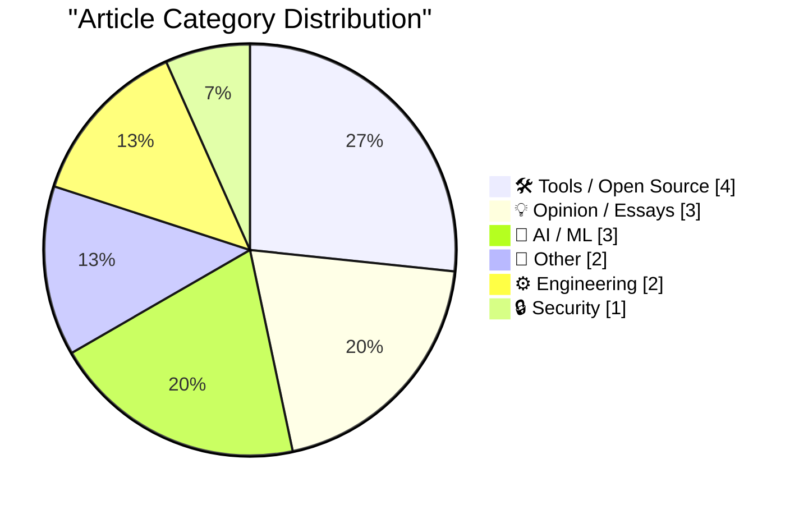
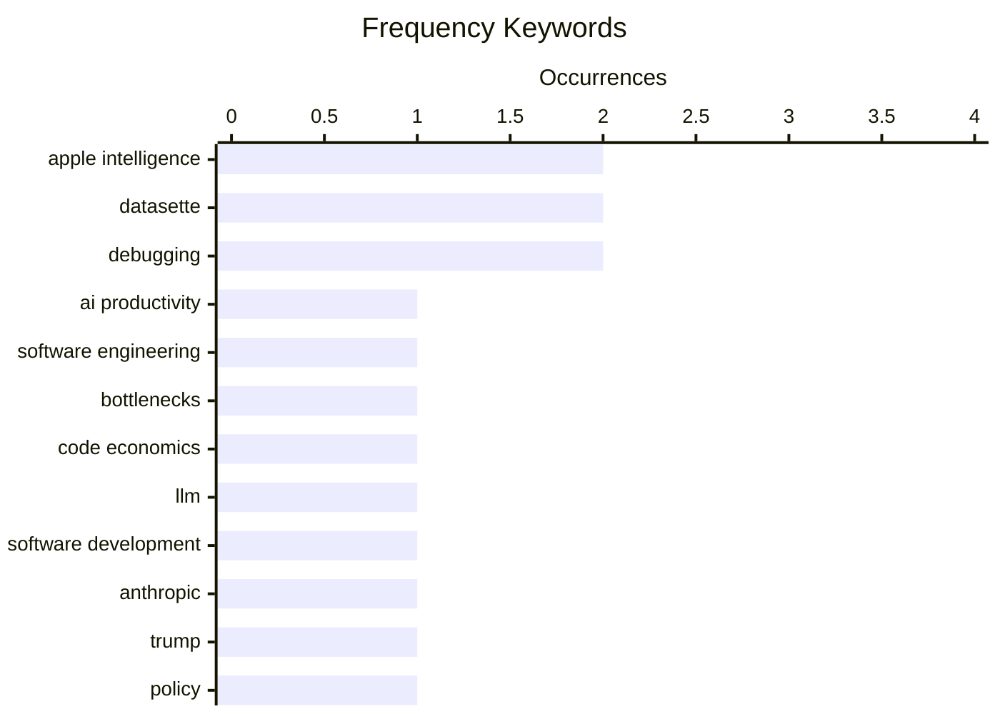

# 📰 AI Blog Daily Digest — 2026-06-18

> From 92 top tech blogs (curated by Karpathy), AI-selected Top 15

## 📝 Today's Highlights

Today’s top technical articles reveal two dominant themes: the growing tension between individual AI-driven productivity and stagnant organizational structures, and the escalating intersection of AI with high-stakes government and formal systems. Developers using tools like Copilot and Claude are achieving 2-3x speed gains, yet companies fail to adapt, while the Trump administration pushes Anthropic to build an impossible AI system. Meanwhile, advances in AI-assisted formal theorem proving with Lean 4 and Claude signal a deepening role for AI in rigorous, logic-based domains.

---

## 🏆 Must Read

🥇 **You Got Faster. Your Company Didn’t.**

terriblesoftware.org · 4h ago · 💡 Opinion / Essays

> Individual developers using AI tools like GitHub Copilot or Claude can write code 2-3x faster, but this speed gain is negated when the rest of the organization—code review, testing, deployment pipelines, and coordination—remains at the same pace. The article argues that AI primarily accelerates the 'writing' phase, while the bottleneck shifts to slower organizational processes like integration, debugging, and stakeholder alignment. It highlights that without parallel investment in automation for CI/CD, automated testing, and streamlined review workflows, individual productivity gains become invisible to the team. The core insight is that companies must redesign their workflows to match the new cadence of AI-assisted development, or risk wasting the potential of faster developers.

💡 **Why it matters**: Essential reading for engineering leaders to understand why AI coding tools aren't translating to team-level productivity and how to fix the systemic bottleneck.

🏷️ AI productivity, software engineering, bottlenecks

🥈 **Quoting Charity Majors**

simonwillison.net · 5h ago · 💡 Opinion / Essays

> Charity Majors observes that the economics of code production were fundamentally inverted in 2025: generating code shifted from being 'very hard, time-consuming, and expensive' to 'effectively free and instant.' Lines of code transformed from treasured, carefully curated assets into disposable, regenerable commodities practically overnight. She argues this shift demands more engineering discipline, not less, because the ease of generation increases the burden of validation, testing, and maintenance. The conclusion is that AI amplifies the need for rigorous engineering practices rather than replacing them.

💡 **Why it matters**: A sharp, contrarian take from a respected engineer that reframes AI's impact as a discipline amplifier, not a productivity shortcut.

🏷️ code economics, LLM, software development

🥉 **Breaking: Trump asks the impossible of Anthropic**

garymarcus.substack.com · 4h ago · 🤖 AI / ML

> Gary Marcus reports that the Trump administration has asked Anthropic to build an AI system capable of perfectly detecting and preventing all forms of harmful content, including hate speech, misinformation, and illegal activity, while also being completely transparent and unbiased—a task Marcus argues is technically impossible with current AI. He points out that no existing model can satisfy all these constraints simultaneously, and that such demands risk forcing companies into either impossible engineering or deceptive compliance. The article explores the broader political and regulatory implications of setting unachievable standards for AI safety. Marcus concludes that this request is a political trap designed to either discredit AI companies or justify heavy-handed regulation.

💡 **Why it matters**: A critical analysis of how unrealistic regulatory demands can backfire, with direct implications for anyone following AI policy and the future of model deployment.

🏷️ Anthropic, Trump, policy, AI safety

---

## 📊 Data Overview

| Scanned | Articles | Range | Selected |
|:---:|:---:|:---:|:---:|
| 87/92 | 2564 → 39 | 48h | **15** |

### Category Distribution



### High-Frequency Keywords



<details>
<summary>📈 ASCII Keyword Chart (Terminal Friendly)</summary>

```
apple intelligence   │ ████████████████████ 2
datasette            │ ████████████████████ 2
debugging            │ ████████████████████ 2
ai productivity      │ ██████████░░░░░░░░░░ 1
software engineering │ ██████████░░░░░░░░░░ 1
bottlenecks          │ ██████████░░░░░░░░░░ 1
code economics       │ ██████████░░░░░░░░░░ 1
llm                  │ ██████████░░░░░░░░░░ 1
software development │ ██████████░░░░░░░░░░ 1
anthropic            │ ██████████░░░░░░░░░░ 1
```

</details>

### 🏷️ Topic Tags

**apple intelligence**(2) · **datasette**(2) · **debugging**(2) · ai productivity(1) · software engineering(1) · bottlenecks(1) · code economics(1) · llm(1) · software development(1) · anthropic(1) · trump(1) · policy(1) · ai safety(1) · lean 4(1) · claude(1) · theorem proving(1) · formalization(1) · siri(1) · wwdc(1) · alpha release(1)

---

## 🛠 Tools / Open Source

### 1. datasette 1.0a34

[Link](https://simonwillison.net/2026/Jun/16/datasette/#atom-everything) — **simonwillison.net** · 1 days ago · ⭐ 20/30

> Datasette 1.0a34 introduces long-overdue tools for inserting, editing, and deleting rows directly within the Datasette interface, available on table pages and row pages. The feature was inspired by Datasette Agent, which already supported these operations via a chat interface, highlighting the absurdity of having more advanced data manipulation through chat than the native UI. This alpha release marks a significant step toward feature parity for the 1.0 release. The update also includes SQL write support, further bridging the gap between the chat interface and core functionality.

🏷️ Datasette, alpha release, row editing

---

### 2. Logic for Programmers v0.15, Livecoding

[Link](https://buttondown.com/hillelwayne/archive/logic-for-programmers-v015-livecoding/) — **buttondown.com/hillelwayne** · 5h ago · ⭐ 20/30

> Hillel Wayne released version 0.15 of 'Logic for Programmers,' the first true release candidate with all content finalized, copy edited, and proofread. The next release will be version 1.0 and available in print, barring major issues. The author is also testing a smaller-margin PDF format optimized for phones and computers, distinct from the printed book's larger margins. This release marks the culmination of a long development process for a book that bridges formal logic and practical programming.

🏷️ logic, programming, book release, formal methods

---

### 3. datasette-tailscale 0.1a0

[Link](https://simonwillison.net/2026/Jun/16/datasette-tailscale/#atom-everything) — **simonwillison.net** · 1 days ago · ⭐ 17/30

> This is a release announcement for datasette-tailscale 0.1a0, an experimental alpha plugin that runs a local Datasette server with a Tailscale sidecar. It allows users to serve a SQLite database via a Tailscale hostname (e.g., http://datasette-preview/) using a single command with an auth key. The plugin leverages Python bindings for the experimental tailscale-rs library. The author notes the proxy mechanism setup is still rough and has filed an issue for a cleaner approach.

🏷️ Datasette, Tailscale, plugin

---

### 4. [Sponsor] Mux — Video for Developers

[Link](https://www.mux.com/?utm_campaign=fireball&amp;utm_source=DF) — **daringfireball.net** · 1 days ago · ⭐ 17/30

> This is a sponsored post for Mux, a video infrastructure platform for developers. It introduces Mux Robots, a feature that turns video files into actionable intelligence by analyzing audio, objects, and scenes. Users configure video workflows once (e.g., asking questions, summarizing, finding key moments), and they run automatically on every new upload without needing asset webhooks or self-hosted glue code. Mux is trusted by companies like Synthesia, Shopify, and the U.S. Soccer Federation.

🏷️ video, AI, workflow, intelligence

---

## 💡 Opinion / Essays

### 5. You Got Faster. Your Company Didn’t.

[Link](https://terriblesoftware.org/2026/06/17/you-got-faster-your-company-didnt/) — **terriblesoftware.org** · 4h ago · ⭐ 25/30

> Individual developers using AI tools like GitHub Copilot or Claude can write code 2-3x faster, but this speed gain is negated when the rest of the organization—code review, testing, deployment pipelines, and coordination—remains at the same pace. The article argues that AI primarily accelerates the 'writing' phase, while the bottleneck shifts to slower organizational processes like integration, debugging, and stakeholder alignment. It highlights that without parallel investment in automation for CI/CD, automated testing, and streamlined review workflows, individual productivity gains become invisible to the team. The core insight is that companies must redesign their workflows to match the new cadence of AI-assisted development, or risk wasting the potential of faster developers.

🏷️ AI productivity, software engineering, bottlenecks

---

### 6. Quoting Charity Majors

[Link](https://simonwillison.net/2026/Jun/17/charity-majors/#atom-everything) — **simonwillison.net** · 5h ago · ⭐ 24/30

> Charity Majors observes that the economics of code production were fundamentally inverted in 2025: generating code shifted from being 'very hard, time-consuming, and expensive' to 'effectively free and instant.' Lines of code transformed from treasured, carefully curated assets into disposable, regenerable commodities practically overnight. She argues this shift demands more engineering discipline, not less, because the ease of generation increases the burden of validation, testing, and maintenance. The conclusion is that AI amplifies the need for rigorous engineering practices rather than replacing them.

🏷️ code economics, LLM, software development

---

### 7. Checking In on the iOS Continental Fun-Gap Drift

[Link](https://daringfireball.net/2024/09/ios_continental_drift_fun_gap) — **daringfireball.net** · 21h ago · ⭐ 17/30

> The article revisits the author's 2024 skepticism that European iPhones were 'more fun' due to regulatory changes (e.g., sideloading, alternative app stores), while missing Apple Intelligence and iPhone Mirroring. Two years later, the author assesses whether the EU's theoretical fun has materialized into actual user enjoyment. The core argument is that the EU side has not delivered meaningful fun in practice, while the US side's features (Apple Intelligence, iPhone Mirroring) have proven genuinely useful and enjoyable. The conclusion is that the 'fun gap' remains firmly in favor of non-EU iPhones.

🏷️ iOS, EU, Apple Intelligence

---

## 🤖 AI / ML

### 8. Breaking: Trump asks the impossible of Anthropic

[Link](https://garymarcus.substack.com/p/breaking-trump-asks-the-impossible) — **garymarcus.substack.com** · 4h ago · ⭐ 24/30

> Gary Marcus reports that the Trump administration has asked Anthropic to build an AI system capable of perfectly detecting and preventing all forms of harmful content, including hate speech, misinformation, and illegal activity, while also being completely transparent and unbiased—a task Marcus argues is technically impossible with current AI. He points out that no existing model can satisfy all these constraints simultaneously, and that such demands risk forcing companies into either impossible engineering or deceptive compliance. The article explores the broader political and regulatory implications of setting unachievable standards for AI safety. Marcus concludes that this request is a political trap designed to either discredit AI companies or justify heavy-handed regulation.

🏷️ Anthropic, Trump, policy, AI safety

---

### 9. Formalizing a ring theorem with Lean 4 and Claude

[Link](https://www.johndcook.com/blog/2026/06/17/rings-with-lean-claude/) — **johndcook.com** · 8h ago · ⭐ 22/30

> John D. Cook tested Claude's ability to generate Lean 4 code for formal theorem proving, following previous successful experiments with calculations and a failed attempt at the pqr theorem for seminorms. This time, he asked Claude to formally prove a ring theorem from scratch, including defining necessary algebraic structures and lemmas. The experiment demonstrated that Claude can produce correct, compilable Lean 4 proofs for moderately complex mathematical theorems, though it required careful prompting and verification. Cook concludes that LLMs are becoming viable assistants for formal mathematics, but still struggle with non-trivial proof strategies without human guidance.

🏷️ Lean 4, Claude, theorem proving, formalization

---

### 10. Yours Truly on MacBreak Weekly: Is the New Siri AI Good?

[Link](https://twit.tv/shows/macbreak-weekly/episodes/1029?autostart=false) — **daringfireball.net** · 6h ago · ⭐ 21/30

> John Gruber joined MacBreak Weekly to discuss Apple's new Siri AI following WWDC, covering why Apple Intelligence and the new Siri won't launch in the EU initially, and whether the iPhone Ultra's release might be delayed. The panel shared real-world experiences with the new Siri, evaluating its improvements and remaining limitations. Gruber provided his perspective as a long-time Apple commentator on the strategic implications of Apple's cautious AI rollout. The discussion highlights the tension between Apple's privacy-focused approach and the competitive pressure from more aggressive AI deployments by Google and OpenAI.

🏷️ Apple Intelligence, Siri, WWDC

---

## 📝 Other

### 11. New in the App Store: Personalized Recommendations

[Link](https://techcrunch.com/2026/06/09/apples-app-store-rolls-out-personalized-recommendations/) — **daringfireball.net** · 1 days ago · ⭐ 20/30

> Apple announced Personalized Collections in the App Store at WWDC, which will tailor app recommendations to individual users based on their interests and behavior, along with 'App Notes' explaining why specific apps are suggested. This represents a significant shift from the App Store's historically generic discovery mechanisms, aiming to improve app discoverability for developers and user experience for consumers. The feature leverages on-device intelligence to maintain privacy while personalizing recommendations. Sarah Perez notes this could fundamentally change how users find new apps and how developers approach App Store optimization.

🏷️ App Store, personalization, recommendations

---

### 12. Yours Truly on The Vergecast: ‘# the **Epic** Story of Markdown’

[Link](https://www.theverge.com/podcast/950082/markdown-history-gruber-vergecast) — **daringfireball.net** · 6h ago · ⭐ 18/30

> John Gruber joined The Vergecast to tell the story of Markdown's creation and its journey to becoming the lingua franca of LLM agentic systems, alongside Anil Dash. The discussion covers Markdown's origins, its steady growth over years, and its recent explosion in popularity as the default format for AI chat interfaces and agent outputs. Gruber also mentions a conversation with Apple's developer tools team about Markdown's role in their systems. The episode explores how a simple formatting syntax designed for web writers became the universal language for human-AI interaction.

🏷️ Markdown, history, John Gruber

---

## ⚙️ Engineering

### 13. Debugging on Prod

[Link](https://idiallo.com/blog/debugging-on-prod) — **idiallo.com** · 1 days ago · ⭐ 18/30

> The article addresses the nightmare scenario of bugs that only manifest in production, specifically the author's experience with a 500 error on their blog after a redesign. The root cause was deleting old templates and unused CSS, which inadvertently broke production behavior that wasn't caught in staging. The author highlights the difficulty of debugging environment-specific issues where local tests pass but production fails. The core conclusion is that production-only bugs are the hardest to fix because they often stem from subtle dependencies or cleanup that only surface under real traffic.

🏷️ debugging, production, redesign, error

---

### 14. Flax debugging: making a hash of things

[Link](https://www.gilesthomas.com/2026/06/hashing-jax-parameters) — **gilesthomas.com** · 19h ago · ⭐ 18/30

> The article describes a debugging technique for JAX/Flax NNX training loops to determine whether the issue lies in the model, loss function, optimizer, or training loop plumbing. The author needed to verify if gradients were actually being applied to parameters, but printing full parameter arrays was unhelpful due to their size. The trick involves hashing the parameters before and after each update step to quickly detect if they are changing, providing a compact signal for debugging gradient flow. The conclusion is that hashing is a lightweight, effective method to confirm parameter updates without overwhelming output.

🏷️ JAX, Flax, debugging, training loop

---

## 🔒 Security

### 15. Cloudflare CAPTCHA on at least one ampersand

[Link](https://simonwillison.net/2026/Jun/16/captcha-on-at-least-one-ampersand/#atom-everything) — **simonwillison.net** · 1 days ago · ⭐ 19/30

> Simon Willison discovered that Cloudflare's Managed Challenge (CAPTCHA) was triggering on simple search queries containing an ampersand (&), causing frustration for legitimate users. After experimenting with Claude Code, he found a workaround: registering a custom rule that only triggers the CAPTCHA when search URLs contain at least one ampersand, rather than all search requests. This targeted approach prevents crawlers from aggressively spidering his faceted search engine while allowing normal searches to pass through. The post shares the specific Cloudflare WAF rule configuration needed to implement this fix.

🏷️ Cloudflare, CAPTCHA, crawler, WAF

---

*Generated on 2026-06-18 | Scanned 87 sources → Found 2564 articles → Selected 15 articles*
*Based on [Hacker News Popularity Contest 2025](https://refactoringenglish.com/tools/hn-popularity/) RSS feeds list, curated by [Andrej Karpathy](https://x.com/karpathy).*
*Created by "Understand AI".*
