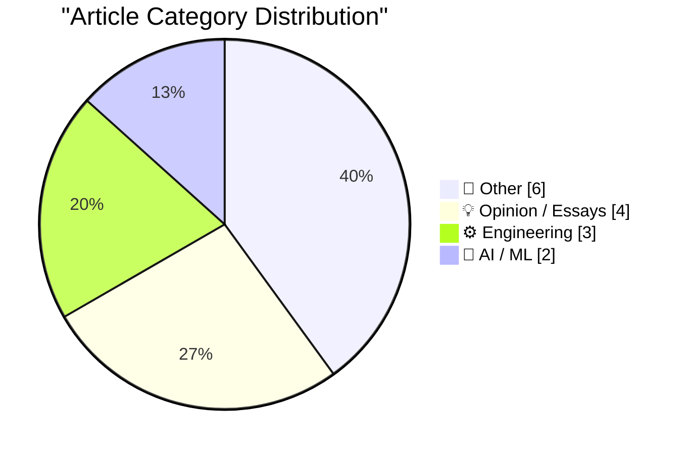
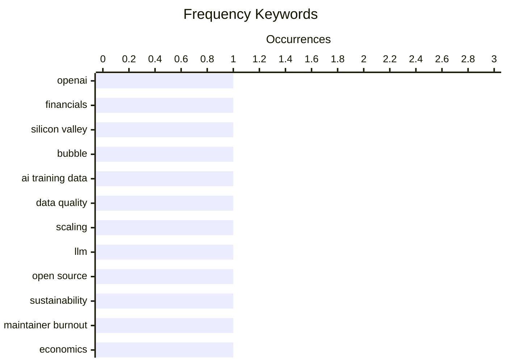

# 📰 AI Blog Daily Digest — 2026-06-20

> ⚠️ **Degraded run.** AI scoring failed for some batches — a subset of rankings and categories below are placeholder defaults.

> From 92 top tech blogs (curated by Karpathy), AI-selected Top 15

## 📝 Today's Highlights

Today’s top articles reveal a deepening reckoning with the economics of scale in tech, as AI’s massive operational costs—exemplified by OpenAI’s $34 billion spend against $13 billion in revenue—collide with the unsustainable financial models underpinning open-source software. Meanwhile, a critical thread examines how monetary policy and market structures have created a system where prices can only rise, stifling innovation and distorting value. On the engineering front, deep dives into interface design, compiler frustrations, and protocol architecture highlight a growing tension between the promise of powerful tools and the messy, often opaque realities of building and maintaining them.

---

## 🏆 Must Read

🥇 **Premium: The Silicon Valley Bubble (Part 2)**

wheresyoured.at · 5h ago · 🤖 AI / ML

> OpenAI's audited financials reveal it spent $34 billion to generate $13.07 billion in revenue in 2024-2025, a staggering loss that raises questions about the sustainability of the AI industry's valuation bubble. The article argues that this spending is not just on compute but also on massive operational costs, including $8 billion in cloud credits and $4 billion in employee compensation. It contextualizes this within a broader Silicon Valley pattern where companies prioritize growth over profitability, fueled by cheap capital. The author concludes that OpenAI's financials are a canary in the coal mine for an overvalued sector that may face a severe correction.

💡 **Why it matters**: Essential reading for anyone tracking AI industry economics, as it provides rare, hard financial data on the gap between AI hype and actual business viability.

🏷️ OpenAI, financials, Silicon Valley, bubble

🥈 **The data black hole at the center of AI**

dwarkesh.com · 5h ago · 🤖 AI / ML

> The article posits that AI models' impressive capabilities are powered by an invisible, massive consumption of training data, which acts as a 'black hole' at the center of AI progress. It argues that sample efficiency—the ability to learn from less data—has not improved as dramatically as model capabilities, meaning current AI systems are fundamentally data-hungry. This creates a looming scarcity problem as high-quality public data is exhausted, potentially stalling future progress. The author warns that the field's focus on scaling compute has obscured this critical dependency on finite data resources.

💡 **Why it matters**: A crucial perspective shift that challenges the dominant scaling narrative, revealing a hidden bottleneck that could define the next phase of AI development.

🏷️ AI training data, data quality, scaling, LLM

🥉 **Open Source vs the Invisible Hand**

nesbitt.io · 1 days ago · 💡 Opinion / Essays

> The article examines the unsustainable economics of open-source software, exemplified by a project with 10 million weekly downloads maintained by a single unpaid developer. It argues that the 'invisible hand' of the market fails to allocate resources to critical digital infrastructure, creating a tragedy of the commons where corporations extract value without contributing. The author contrasts this with the venture-backed model, where funding flows to proprietary software, leaving open-source maintainers burnt out. The core conclusion is that without new funding mechanisms (e.g., corporate sponsorship mandates or public funding), the open-source ecosystem will collapse under its own success.

💡 **Why it matters**: A stark, data-backed wake-up call about the broken economics of open-source maintenance that affects every company relying on free software.

🏷️ open source, sustainability, maintainer burnout

---

## 📊 Data Overview

| Scanned | Articles | Range | Selected |
|:---:|:---:|:---:|:---:|
| 85/92 | 2531 → 35 | 48h | **15** |

### Category Distribution



### High-Frequency Keywords



<details>
<summary>📈 ASCII Keyword Chart (Terminal Friendly)</summary>

```
openai           │ ████████████████████ 1
financials       │ ████████████████████ 1
silicon valley   │ ████████████████████ 1
bubble           │ ████████████████████ 1
ai training data │ ████████████████████ 1
data quality     │ ████████████████████ 1
scaling          │ ████████████████████ 1
llm              │ ████████████████████ 1
open source      │ ████████████████████ 1
sustainability   │ ████████████████████ 1
```

</details>

### 🏷️ Topic Tags

**openai**(1) · **financials**(1) · **silicon valley**(1) · bubble(1) · ai training data(1) · data quality(1) · scaling(1) · llm(1) · open source(1) · sustainability(1) · maintainer burnout(1) · economics(1) · inflation(1) · tech industry(1) · monetary policy(1) · ui design(1) · touch interactions(1) · accessibility(1) · compilers(1) · determinism(1)

---

## 📝 Other

### 1. Converting Coal Plants to Natural Gas

[Link](https://www.construction-physics.com/p/converting-coal-plants-to-natural) — **construction-physics.com** · 10h ago · ⭐ 16/30

> The article explores the technical and economic realities of converting coal-fired power plants to run on natural gas, a process that has accelerated in the last decade. It details the engineering challenges: coal plants use different boilers and fuel handling systems, so conversion often requires replacing the entire combustion system or building a combined-cycle gas turbine alongside the existing plant. The author notes that while conversions reduce CO2 emissions by roughly 50% compared to coal, they still lock in fossil fuel infrastructure for decades. The conclusion is that conversion is a pragmatic but incomplete climate solution that delays the transition to renewables.

🏷️ energy, coal, natural gas, infrastructure

---

### 2. Datasette Apps: Host custom HTML applications inside Datasette

[Link](https://simonwillison.net/2026/Jun/18/datasette-apps/#atom-everything) — **simonwillison.net** · 22h ago · ⭐ 15/30

> Datasette Apps is a new plugin that allows hosting self-contained HTML+JavaScript applications inside a Datasette instance, running in a tightly constrained sandbox. These apps can execute read-only SQL queries against Datasette data via JavaScript, and can also perform write queries if explicitly configured. The author explains the 'why' behind the launch, emphasizing that this enables building interactive data tools directly within Datasette without external servers. The sandbox ensures security by restricting app capabilities to the Datasette context. The core point is that Datasette Apps transforms Datasette from a data exploration tool into a platform for deploying custom data-driven web applications.

---

### 3. datasette-acl 0.6a0

[Link](https://simonwillison.net/2026/Jun/18/datasette-acl/#atom-everything) — **simonwillison.net** · 1 days ago · ⭐ 15/30

> The datasette-acl plugin has been updated to version 0.6a0, expanding from table-only permissions toward a general resource-sharing system for multi-user Datasette instances. Alex Garcia contributed most of the work, fleshing out fine-grained control over which users can access specific resources within Datasette. This release moves the plugin closer to enabling complex multi-tenant or collaborative data platforms. The author highlights this as a key step toward production-ready access control for Datasette.

---

### 4. GLM-5.2 is probably the most powerful text-only open weights LLM

[Link](https://simonwillison.net/2026/Jun/17/glm-52/#atom-everything) — **simonwillison.net** · 1 days ago · ⭐ 15/30

> Chinese AI lab Z.ai released GLM-5.2, a 753B parameter Mixture-of-Experts model with 40 active parameters and a 1.51TB footprint, under an MIT license. It is a text-only model (vision capabilities are in a separate, non-open family) with a 1 million token context window. The author positions it as probably the most powerful text-only open-weights LLM available, comparable in size to prior GLM-5 and 5.1 releases. The open MIT license makes it accessible for commercial and research use.

---

### 5. ‘Popa’ Botnet Linked to Publicly-Traded Israeli Firm

[Link](https://krebsonsecurity.com/2026/06/popa-botnet-linked-to-publicly-traded-israeli-firm/) — **krebsonsecurity.com** · 1 days ago · ⭐ 15/30

> Security researchers have linked the 'Popa' Android botnet, which has infected millions of consumer TV boxes over four years, to NetNut, a residential proxy provider owned by publicly-traded Israeli firm Alarum Technologies (NASDAQ: ALAR). The botnet hijacks devices to relay internet traffic for advertising fraud, account takeovers, and mass data scraping. Multiple security firms independently concluded the connection this week. The article reveals how a legitimate proxy service may be leveraging compromised devices at scale.

---

### 6. Trump Mobile T1 Phone Is a Gold-Painted Two-Year-Old HTC U24 Pro

[Link](https://www.nbcnews.com/tech/gadgets/trump-mobile-t1-phone-nearly-identical-htc-device-analysis-rcna349293) — **daringfireball.net** · 3h ago · ⭐ 15/30

> NBC News and iFixit's teardown analysis reveals that the Trump Mobile T1 phone, marketed as 'Made in the USA,' is nearly identical to the two-year-old HTC U24 Pro, a Taiwanese phone built with Chinese parts. The only difference is a gold paint job. The report includes a full iFixit teardown and a five-minute NBC News video. The author notes the unsurprising nature of the rebranding, given the political marketing claims.

---

## 💡 Opinion / Essays

### 7. Open Source vs the Invisible Hand

[Link](https://nesbitt.io/2026/06/18/open-source-vs-the-invisible-hand.html) — **nesbitt.io** · 1 days ago · ⭐ 23/30

> The article examines the unsustainable economics of open-source software, exemplified by a project with 10 million weekly downloads maintained by a single unpaid developer. It argues that the 'invisible hand' of the market fails to allocate resources to critical digital infrastructure, creating a tragedy of the commons where corporations extract value without contributing. The author contrasts this with the venture-backed model, where funding flows to proprietary software, leaving open-source maintainers burnt out. The core conclusion is that without new funding mechanisms (e.g., corporate sponsorship mandates or public funding), the open-source ecosystem will collapse under its own success.

🏷️ open source, sustainability, maintainer burnout

---

### 8. You don’t understand, prices can’t go down

[Link](https://geohot.github.io//blog/jekyll/update/2026/06/18/prices-cant-go-down.html) — **geohot.github.io** · 1 days ago · ⭐ 23/30

> The author argues that since 2008, monetary policy has consistently prioritized preventing asset price declines over aligning money with real value, creating a decoupled financial system. This manifests in phenomena like infinite money printing, zero-interest rates, and bailouts that inflate bubbles rather than allowing corrections. The article contends that this 'prices can't go down' dogma has led to systemic fragility, where any attempt to restore value alignment would trigger a crash. The conclusion is that the current system is unsustainable, and a painful rebalancing is inevitable.

🏷️ economics, inflation, tech industry, monetary policy

---

### 9. Accenture: Then and now, and how it may signify things to come

[Link](https://garymarcus.substack.com/p/accenture-then-and-now-and-how-it) — **garymarcus.substack.com** · 1 days ago · ⭐ 18/30

> The article examines Accenture's recent financial performance and market position as a potential bellwether for the broader AI and tech consulting industry. It compares Accenture's current trajectory (slowing growth, AI-related revenue not materializing as expected) to its historical patterns during previous tech bubbles. The author suggests that if Accenture—a proxy for enterprise AI adoption—is struggling, it may signal that the AI boom is not translating into real-world deployment at scale. The core question is whether this is a temporary blip or a leading indicator of a broader slowdown.

🏷️ Accenture, AI consulting, industry trends

---

### 10. Full Page Paralysis

[Link](https://blog.jim-nielsen.com/2026/full-page-paralysis/) — **blog.jim-nielsen.com** · 3h ago · ⭐ 17/30

> The article reframes the common concept of 'blank page paralysis' as 'full page paralysis'—the difficulty of finishing, not starting, creative work. It argues that the final 10% of a project (the 'last mile') is disproportionately hard because completion makes the work finite and subject to judgment. The author draws parallels to software's 'last 90%' problem and logistics' 'last mile' challenge, noting that perfectionism and fear of criticism often stall completion. The core insight is that shipping imperfect work is better than holding out for an unattainable ideal.

🏷️ software development, project management, finishing

---

## ⚙️ Engineering

### 11. Show your hands honor for the strange power they bring you

[Link](https://aresluna.org/show-your-hands-honor) — **aresluna.org** · 1 days ago · ⭐ 20/30

> This 7,700-word essay with 38 interactive playgrounds explores the design philosophy of creating finger-friendly interfaces for touch devices. It argues that modern UI design neglects the ergonomic and cognitive realities of human hands, favoring visual aesthetics over tactile usability. The author provides concrete guidelines for touch targets, gesture recognition, and thumb-zone placement based on biomechanics. The core point is that honoring the physicality of hands leads to more intuitive, less frustrating digital experiences.

🏷️ UI design, touch interactions, accessibility

---

### 12. I hate compilers

[Link](https://xeiaso.net/notes/2026/anubis-wasm-vendor-binary/) — **xeiaso.net** · 1 days ago · ⭐ 18/30

> The author details a frustrating experience where compiling the same source code with the same compiler (Anubis) produced different binary outputs, breaking deterministic builds. The root cause is traced to non-reproducible build environments, including timestamps, file paths, and compiler version variations that leak into the output. The article humorously but seriously argues that compilers are fundamentally unreliable for security-critical applications requiring verifiable builds. The conclusion is that achieving truly deterministic compilation is far harder than most developers assume.

🏷️ compilers, determinism, build systems

---

### 13. There Are No Instances in atproto

[Link](https://overreacted.io/there-are-no-instances-in-atproto/) — **overreacted.io** · 22h ago · ⭐ 17/30

> The article clarifies a fundamental architectural difference between AT Protocol (atproto) and traditional federated systems like Mastodon or RSS: atproto has no 'instances' in the traditional sense. Instead, it uses a personal data server (PDS) model where each user controls their own data, and social interactions happen through a shared relay network. The author compares this to how Google Reader worked—a centralized aggregation layer over distributed content. The conclusion is that atproto's design avoids the governance and migration problems of instance-based federation while enabling similar decentralization.

🏷️ atproto, decentralization, RSS, protocol design

---

## 🤖 AI / ML

### 14. Premium: The Silicon Valley Bubble (Part 2)

[Link](https://www.wheresyoured.at/premium-the-silicon-valley-bubble-part-2/) — **wheresyoured.at** · 5h ago · ⭐ 27/30

> OpenAI's audited financials reveal it spent $34 billion to generate $13.07 billion in revenue in 2024-2025, a staggering loss that raises questions about the sustainability of the AI industry's valuation bubble. The article argues that this spending is not just on compute but also on massive operational costs, including $8 billion in cloud credits and $4 billion in employee compensation. It contextualizes this within a broader Silicon Valley pattern where companies prioritize growth over profitability, fueled by cheap capital. The author concludes that OpenAI's financials are a canary in the coal mine for an overvalued sector that may face a severe correction.

🏷️ OpenAI, financials, Silicon Valley, bubble

---

### 15. The data black hole at the center of AI

[Link](https://www.dwarkesh.com/p/the-sample-efficiency-black-hole-2) — **dwarkesh.com** · 5h ago · ⭐ 26/30

> The article posits that AI models' impressive capabilities are powered by an invisible, massive consumption of training data, which acts as a 'black hole' at the center of AI progress. It argues that sample efficiency—the ability to learn from less data—has not improved as dramatically as model capabilities, meaning current AI systems are fundamentally data-hungry. This creates a looming scarcity problem as high-quality public data is exhausted, potentially stalling future progress. The author warns that the field's focus on scaling compute has obscured this critical dependency on finite data resources.

🏷️ AI training data, data quality, scaling, LLM

---

*Generated on 2026-06-20 | Scanned 85 sources → Found 2531 articles → Selected 15 articles*
*Based on [Hacker News Popularity Contest 2025](https://refactoringenglish.com/tools/hn-popularity/) RSS feeds list, curated by [Andrej Karpathy](https://x.com/karpathy).*
*Created by "Understand AI".*
