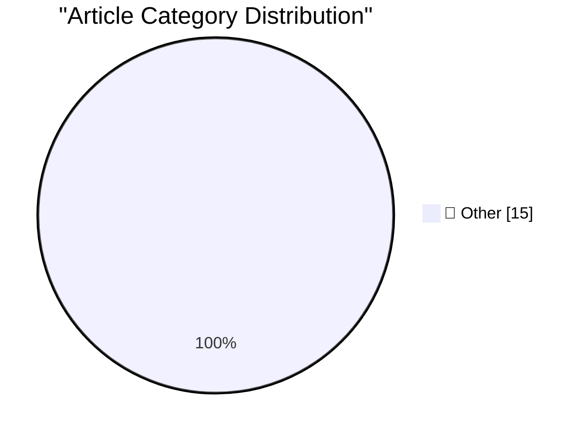

# 📰 AI Blog Daily Digest — 2026-06-21

> ⚠️ **Degraded run.** AI scoring failed for every batch — rankings and categories below are placeholder defaults, not AI-judged.

> From 92 top tech blogs (curated by Karpathy), AI-selected Top 15

## 🏆 Must Read

🥇 **Quoting Sean Lynch**

simonwillison.net · 23h ago · 📝 Other

> The real valuable capability MCP offers over skills/CLI is isolating the auth flow outside of the agent’s context window, and potentially out of the harness completely. [...] Maybe the idealized form 

🥈 **Another One for the ‘Sorry, We Used to Be Crap’ Truth-in-Advertising File: Carlsberg Beer**

daringfireball.net · 21h ago · 📝 Other

> Ben Chapman, reporting for The Independent in 2019: After 40 years of advertising its lager as “Probably the best beer in the world”, Danish brewer Carlsberg has confessed that the famous slogan may n

🥉 **‘What’s the Deal With Old Guys and Giant Glasses?’**

daringfireball.net · 21h ago · 📝 Other

> Early adoption of new technology is generally considered a young-person thing, but maybe Snap Specs will turn that notion on its head. Direct sales in retirement homes? ★

---

## 📊 Data Overview

| Scanned | Articles | Range | Selected |
|:---:|:---:|:---:|:---:|
| 87/92 | 2566 → 27 | 48h | **15** |

### Category Distribution

---

## 📝 Other

### 1. Quoting Sean Lynch

[Link](https://simonwillison.net/2026/Jun/19/sean-lynch/#atom-everything) — **simonwillison.net** · 23h ago · ⭐ 15/30

> The real valuable capability MCP offers over skills/CLI is isolating the auth flow outside of the agent’s context window, and potentially out of the harness completely. [...] Maybe the idealized form 

---

### 2. Another One for the ‘Sorry, We Used to Be Crap’ Truth-in-Advertising File: Carlsberg Beer

[Link](https://www.independent.co.uk/news/business/news/carlsberg-probably-not-best-beer-in-world-lager-brewer-a8874016.html) — **daringfireball.net** · 21h ago · ⭐ 15/30

> Ben Chapman, reporting for The Independent in 2019: After 40 years of advertising its lager as “Probably the best beer in the world”, Danish brewer Carlsberg has confessed that the famous slogan may n

---

### 3. ‘What’s the Deal With Old Guys and Giant Glasses?’

[Link](https://www.youtube.com/watch?v=8DYGxn6Xvt0) — **daringfireball.net** · 21h ago · ⭐ 15/30

> Early adoption of new technology is generally considered a young-person thing, but maybe Snap Specs will turn that notion on its head. Direct sales in retirement homes? ★

---

### 4. Fox to Buy Roku Streaming Service in $25 Billion Deal

[Link](https://www.wsj.com/business/deals/fox-roku-deal-f6e564f9?st=mKdQwC&amp;reflink=desktopwebshare_permalink) — **daringfireball.net** · 1 days ago · ⭐ 15/30

> The Wall Street Journal on Monday: Fox Corp. said it is acquiring Roku in a deal valued at around $25 billion, making a major bet on the future of ad-supported streaming. The deal — Fox’s largest to d

---

### 5. Snap Launches Ad Campaign for Specs Starring Michael Caine

[Link](https://www.reddit.com/r/funny/comments/1jk6onr/bloody_large_glasses_by_michael_caine/) — **daringfireball.net** · 1 days ago · ⭐ 15/30

> “They’re about power, aren’t they, and the bloody powerful blokes who wear them.” Maybe I’m all wet and these things are stylish, no matter what they do to your ears . ★

---

### 6. Jerry Seinfeld Tries Out Snap’s Specs

[Link](https://youtu.be/siM8NW24QPs?t=217) — **daringfireball.net** · 1 days ago · ⭐ 15/30

> “Hey buddy, nice frames.” Seinfeld’s father tried them out too . ★

---

### 7. Domino’s Admitted Their Pizza Tasted Like Cardboard

[Link](https://www.inc.com/jeff-haden/10-years-ago-cardboard-pizza-almost-killed-dominos-then-dominos-did-something-brilliant.html) — **daringfireball.net** · 1 days ago · ⭐ 15/30

> Re: my post on Verizon flat-out admitting their business practices have resembled a scheme from Dr. Evil, Domino’s did something similar regarding their pizza a while back. This 2021 story for Inc. by

---

### 8. Verizon, Formerly Menace Mobile

[Link](https://www.youtube.com/watch?v=lzmntndEXWo) — **daringfireball.net** · 1 days ago · ⭐ 15/30

> Verizon has sprung for a new ad campaign set in the Austin Powers world, with four stars from the cast — Mike Myers, of course, as Dr. Evil; Rob Lowe as Number Two (Robert Wagner is alive but is 96); 

---

### 9. I know Kung-fu

[Link](https://idiallo.com/blog/i-know-kung-fu) — **idiallo.com** · 19h ago · ⭐ 15/30

> Remember that scene in the Matrix where Neo is strapped into the chair and Link uploads all sorts of martial arts into his mind? When Neo wakes up, he says "I know Kung-fu," then proceeds to demonstra

---

### 10. Arp 29: The fireworks galaxy

[Link](https://maurycyz.com/astro/arp29/) — **maurycyz.com** · 1 days ago · ⭐ 15/30

> North is right. 0.55"/pixel (26'x26' field). FWHM=3.7" This one is in the Atlas of Pecular Galaxies under "one heavy arm", which checks out: the eastern arm (down) is considerably bighter and denser t

---

### 11. Pluralistic: How the Epstein Class recruits (20 Jun 2026)

[Link](https://pluralistic.net/2026/06/20/any-club-that-would-have-me/) — **pluralistic.net** · 6h ago · ⭐ 15/30

> Today's links How the Epstein Class recruits: Oh wait, THAT'S what this was?! Hey look at this: Delights to delectate. Object permanence: MPAA blasted in WSJ; RFID skimmers; Post-Soviet inventions; "F

---

### 12. Pluralistic: The Big Con (19 Jun 2026)

[Link](https://pluralistic.net/2026/06/19/too-big-to-fact-check/) — **pluralistic.net** · 1 days ago · ⭐ 15/30

> Today's links The Big Con: Making the pile of shit bigger won't increase the number of ponies underneath it. Hey look at this: Delights to delectate. Object permanence: TVA v SETI@Home; Telemarketers 

---

### 13. Which Copyleft Licence is Suitable for an SVG?

[Link](https://shkspr.mobi/blog/2026/06/which-copyleft-licence-is-suitable-for-an-svg/) — **shkspr.mobi** · 11h ago · ⭐ 15/30

> The Scalable Vector Graphics (SVG) format is amazing. It allows you to precisely define how an image should look. Written in XML, it uses various mathematical operations to display an image which look

---

### 14. What does it mean when the bottom bit of my HMODULE is set?

[Link](https://devblogs.microsoft.com/oldnewthing/20260619-00/?p=112447) — **devblogs.microsoft.com/oldnewthing** · 1 days ago · ⭐ 15/30

> A special kind of HMODULE . The post What does it mean when the bottom bit of my HMODULE is set? appeared first on The Old New Thing .

---

### 15. All pieces on a 6 by 5 board

[Link](https://www.johndcook.com/blog/2026/06/20/z3-python-claude/) — **johndcook.com** · 1h ago · ⭐ 15/30

> I’ve written a couple posts lately on getting an LLM to generate code to solve chess problems. The first used Claude to generate Prolog and the second used ChatGPT to generate Prolog. This post will u

---

*Generated on 2026-06-21 | Scanned 87 sources → Found 2566 articles → Selected 15 articles*
*Based on [Hacker News Popularity Contest 2025](https://refactoringenglish.com/tools/hn-popularity/) RSS feeds list, curated by [Andrej Karpathy](https://x.com/karpathy).*
*Created by "Understand AI".*
