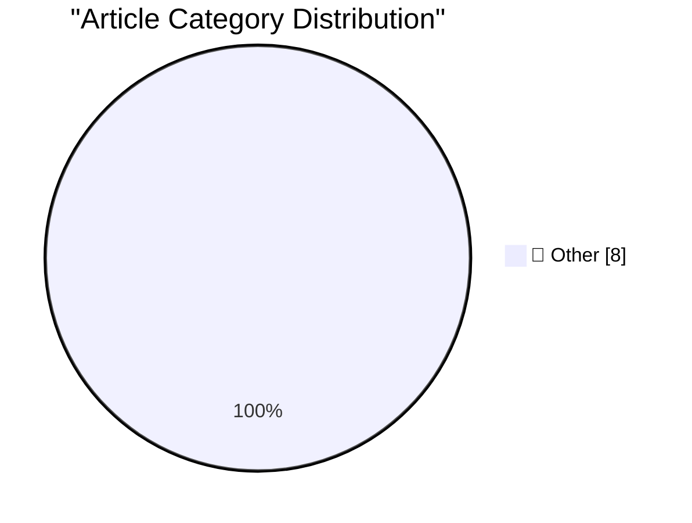

# 📰 AI Blog Daily Digest — 2026-06-22

> ⚠️ **Degraded run.** AI scoring failed for every batch — rankings and categories below are placeholder defaults, not AI-judged.

> From 92 top tech blogs (curated by Karpathy), AI-selected Top 8

## 🏆 Must Read

🥇 **Temporary Cloudflare Accounts for AI agents**

simonwillison.net · 30m ago · 📝 Other

> Temporary Cloudflare Accounts for AI agents The announcement says this is "for AI agents" but (as is pretty common these days) the AI hook isn't really necessary, this is an interesting feature for ev

🥈 **Glassblowing #3: A better thermionic diode**

maurycyz.com · 1 days ago · 📝 Other

> My last attempt at a vacuum tube technically worked, but not very well because there was a lot of glass between the anode and cathode: Because of this, many any electrons that miss anode and build up 

🥉 **The 100,000 whys of AI**

lcamtuf.substack.com · 16h ago · 📝 Other

> One of the most painful arguments I keep having with fellow techies is the question of whether you can distinguish between human-written and AI-generated text.

---

## 📊 Data Overview

| Scanned | Articles | Range | Selected |
|:---:|:---:|:---:|:---:|
| 87/92 | 2566 → 16 | 48h | **8** |

### Category Distribution

---

## 📝 Other

### 1. Temporary Cloudflare Accounts for AI agents

[Link](https://simonwillison.net/2026/Jun/21/temporary-cloudflare-accounts/#atom-everything) — **simonwillison.net** · 30m ago · ⭐ 15/30

> Temporary Cloudflare Accounts for AI agents The announcement says this is "for AI agents" but (as is pretty common these days) the AI hook isn't really necessary, this is an interesting feature for ev

---

### 2. Glassblowing #3: A better thermionic diode

[Link](https://maurycyz.com/projects/glass/3/) — **maurycyz.com** · 1 days ago · ⭐ 15/30

> My last attempt at a vacuum tube technically worked, but not very well because there was a lot of glass between the anode and cathode: Because of this, many any electrons that miss anode and build up 

---

### 3. The 100,000 whys of AI

[Link](https://lcamtuf.substack.com/p/the-100000-whys-of-ai) — **lcamtuf.substack.com** · 16h ago · ⭐ 15/30

> One of the most painful arguments I keep having with fellow techies is the question of whether you can distinguish between human-written and AI-generated text.

---

### 4. This Week in Package Management: 20 June 2026

[Link](https://nesbitt.io/2026/06/20/this-week-in-package-management.html) — **nesbitt.io** · 1 days ago · ⭐ 15/30

> Releases, advisories, and articles from across the package management world

---

### 5. Reading List 06/20/26

[Link](https://www.construction-physics.com/p/reading-list-062026) — **construction-physics.com** · 1 days ago · ⭐ 15/30

> A new housing bill, General Motors joining the grid-scale battery game, skepticism about data center delays, solid-state air conditioning, and more.

---

### 6. On Vulgar Materialism

[Link](https://borretti.me/article/on-vulgar-materialism) — **borretti.me** · 22h ago · ⭐ 15/30

> Or, sufficiently advanced cynicism is indistinguishable from naïveté.

---

### 7. The doom justifies the valuation

[Link](https://geohot.github.io//blog/jekyll/update/2026/06/21/the-doom-justifies-the-valuation.html) — **geohot.github.io** · 15h ago · ⭐ 15/30

> I’ve been in Berkeley for the last 2 weeks. I haven’t really been back here for a while, and it’s worse than you can believe. This is a cult of atheistic hedonists needing AI doom to be true to justif

---

### 8. Bobby Prince has died

[Link](https://oldvcr.blogspot.com/feeds/8983624217005254252/comments/default) — **oldvcr.blogspot.com** · 1 days ago · ⭐ 15/30

> Bobby Prince, '90s FPS game musician extraordinare and longtime id Software associate, has died at 81 . Now, early on, there were things like Commander Keen and Eat Your Vegetables , which were cute a

---

*Generated on 2026-06-22 | Scanned 87 sources → Found 2566 articles → Selected 8 articles*
*Based on [Hacker News Popularity Contest 2025](https://refactoringenglish.com/tools/hn-popularity/) RSS feeds list, curated by [Andrej Karpathy](https://x.com/karpathy).*
*Created by "Understand AI".*
