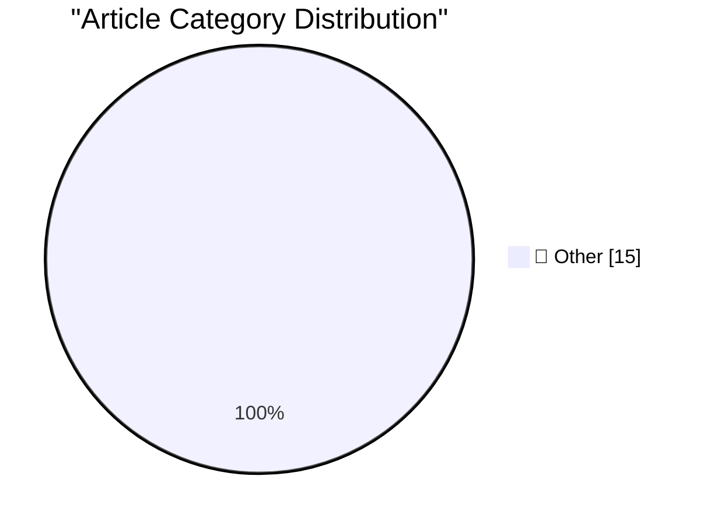

# 📰 AI Blog Daily Digest — 2026-06-25

> ⚠️ **Degraded run.** AI scoring failed for every batch — rankings and categories below are placeholder defaults, not AI-judged.

> From 92 top tech blogs (curated by Karpathy), AI-selected Top 15

## 🏆 Must Read

🥇 **Quoting Tom MacWright**

simonwillison.net · 4h ago · 📝 Other

> In the last few months, I've started to see [job applications] that were clearly cowritten by an LLM, link to an LLM-generated portfolio site, which then links to LLM-generated GitHub projects, with p

🥈 **datasette 1.0a35**

simonwillison.net · 1 days ago · 📝 Other

> Release: datasette 1.0a35 I'll write more about this one soon, but it's a big release. Three highlights from the release notes: New "Create table" interface in the database actions menu, backed by the

🥉 **OPFS + Pyodide test harness**

simonwillison.net · 1 days ago · 📝 Other

> Tool: OPFS + Pyodide test harness I've been pondering if Datasette Lite - the Python Datasette application run entirely in the browser using Pyodide and WebAssembly - might be able to edit persistent 

---

## 📊 Data Overview

| Scanned | Articles | Range | Selected |
|:---:|:---:|:---:|:---:|
| 86/92 | 2545 → 34 | 48h | **15** |

### Category Distribution

---

## 📝 Other

### 1. Quoting Tom MacWright

[Link](https://simonwillison.net/2026/Jun/24/tom-macwright/#atom-everything) — **simonwillison.net** · 4h ago · ⭐ 15/30

> In the last few months, I've started to see [job applications] that were clearly cowritten by an LLM, link to an LLM-generated portfolio site, which then links to LLM-generated GitHub projects, with p

---

### 2. datasette 1.0a35

[Link](https://simonwillison.net/2026/Jun/23/datasette/#atom-everything) — **simonwillison.net** · 1 days ago · ⭐ 15/30

> Release: datasette 1.0a35 I'll write more about this one soon, but it's a big release. Three highlights from the release notes: New "Create table" interface in the database actions menu, backed by the

---

### 3. OPFS + Pyodide test harness

[Link](https://simonwillison.net/2026/Jun/23/opfs-pyodide/#atom-everything) — **simonwillison.net** · 1 days ago · ⭐ 15/30

> Tool: OPFS + Pyodide test harness I've been pondering if Datasette Lite - the Python Datasette application run entirely in the browser using Pyodide and WebAssembly - might be able to edit persistent 

---

### 4. Prompt Injection as Role Confusion

[Link](https://simonwillison.net/2026/Jun/22/prompt-injection-as-role-confusion/#atom-everything) — **simonwillison.net** · 1 days ago · ⭐ 15/30

> Prompt Injection as Role Confusion First, I absolutely love this: This is a blog-style writeup of the paper. I wish every paper would come with one of these. Academic writing is pretty dry - the impac

---

### 5. Porting the Moebius 0.2B image inpainting model to run in the browser with Claude Code

[Link](https://simonwillison.net/2026/Jun/22/porting-moebius/#atom-everything) — **simonwillison.net** · 1 days ago · ⭐ 15/30

> This morning on Hacker News I saw Moebius: 0.2B Lightweight Image Inpainting Framework with 10B-Level Performance , describing a small but effective inpainting model - a model where you can mark regio

---

### 6. Framework's 10G Ethernet module exposes USB-C's complexity

[Link](https://www.jeffgeerling.com/blog/2026/framework-10g-ethernet-module-usb-c-complexity/) — **jeffgeerling.com** · 8h ago · ⭐ 15/30

> I've been following WisdPi's development of various 5 Gbps and 10 Gbps Ethernet adapters for the past couple years. They use newer Realtek Ethernet chips, which sometimes have performance quirks—most 

---

### 7. Scattered Spider Hackers Plead Guilty on Day 1 of Trial

[Link](https://krebsonsecurity.com/2026/06/scattered-spider-hackers-plead-guilty-on-day-1-of-trial/) — **krebsonsecurity.com** · 1 days ago · ⭐ 15/30

> Two men pleaded guilty in the United Kingdom this week to criminal charges stemming from an August 2024 cyberattack that crippled Transport for London, the entity responsible for the public transport 

---

### 8. WebKit Always Enables the Copy Menu Item in Every App

[Link](https://lapcatsoftware.com/articles/2026/6/5.html) — **daringfireball.net** · 38m ago · ⭐ 15/30

> Jeff Johnson: Several weeks ago, John Gruber of Daring Fireball asked me whether I could reproduce an issue he was seeing in Safari: when a web page is focused, the Copy menu item in the main menu is 

---

### 9. WebKit in Safari 27 Beta

[Link](https://webkit.org/blog/17967/news-from-wwdc26-webkit-in-safari-27-beta/) — **daringfireball.net** · 3h ago · ⭐ 15/30

> WebKit (back during WWDC): If you look through the lists of features and fixes in Safari 27, you’ll notice that, although there are 58 brand-new features and 525 fixes — the largest pile of fixes in a

---

### 10. [Sponsor] WorkOS: Agents Need Auth. There’s Now a Spec for It.

[Link](http://workos.com/auth-md?utm_source=daringfireball&amp;utm_medium=newsletter&amp;utm_campaign=q32026) — **daringfireball.net** · 3h ago · ⭐ 15/30

> When an AI agent tries to complete a task that requires a new account, it hits a wall: the sign-up form. There’s no standard for how an agent registers a user with an app on their behalf. auth.md is a

---

### 11. Designed in California: An Apple History Podcast

[Link](https://designed.fm/) — **daringfireball.net** · 7h ago · ⭐ 15/30

> Kickstarter campaign from Jason Snell and Myke Hurley to fund a 50-episode narrative podcast on Apple’s 50-year history. (Actually, with stretch goals, more than 50 episodes.) The campaign has already

---

### 12. The Talk Show: ‘Perp Walk for Selfies’

[Link](https://daringfireball.net/thetalkshow/2026/06/23/ep-450) — **daringfireball.net** · 1 days ago · ⭐ 15/30

> Jason Snell returns to the show for a look back at WWDC 2026, and a look ahead to Designed in California , his and Myke Hurley’s upcoming 50-episode Apple history podcast. Sponsored by: Factor : Healt

---

### 13. Ultra-Wide 0.5× Lenses Have Utility Beyond ‘Photography’

[Link](https://daringfireball.net/linked/2026/06/22/gurman-iphone-air-2) — **daringfireball.net** · 1 days ago · ⭐ 15/30

> Some follow-up thoughts on my earlier piece , regarding the second-gen iPhone Air’s additional camera lens being a 0.5× ultra-wide, not a 3× or 4× telephoto: Ultimately, it’s the fact that I use my 0.

---

### 14. Arp 293: More interacting galaxies

[Link](https://maurycyz.com/astro/arp293/) — **maurycyz.com** · 1 days ago · ⭐ 15/30

> North is right. 0.52"/pixel (18'x9' field) FWHM=4.5" The pair of galaxies near the center is NGC 6285 (top) and NGC 6286 (bottom). The lower one has a distinct tidal trail below it, and a faint bridge

---

### 15. Pluralistic: Spying on kids to save kids from spying is very, very stupid (23 Jun 2026)

[Link](https://pluralistic.net/2026/06/23/destroy-the-village/) — **pluralistic.net** · 1 days ago · ⭐ 15/30

> Today's links Spying on kids to save kids from spying is very, very stupid: First they came for the VPNs. Hey look at this: Delights to delectate. Object permanence: RIP Darwin's tortoise; ISPs conspi

---

*Generated on 2026-06-25 | Scanned 86 sources → Found 2545 articles → Selected 15 articles*
*Based on [Hacker News Popularity Contest 2025](https://refactoringenglish.com/tools/hn-popularity/) RSS feeds list, curated by [Andrej Karpathy](https://x.com/karpathy).*
*Created by "Understand AI".*
