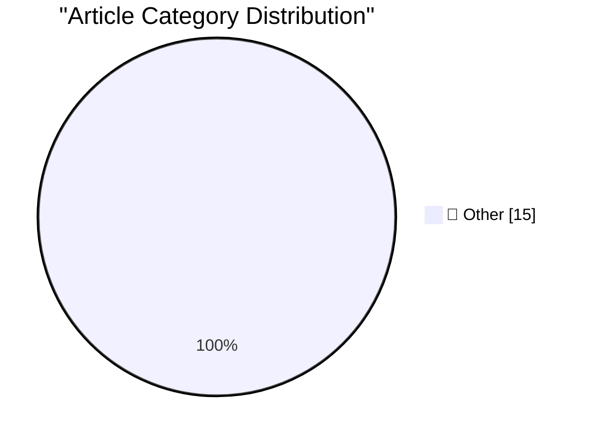

# 📰 AI Blog Daily Digest — 2026-06-26

> ⚠️ **Degraded run.** AI scoring failed for every batch — rankings and categories below are placeholder defaults, not AI-judged.

> From 92 top tech blogs (curated by Karpathy), AI-selected Top 15

## 🏆 Must Read

🥇 **simonw/browser-compat-db**

simonwillison.net · 22h ago · 📝 Other

> simonw/browser-compat-db Inspired by Mozilla's new MDN MCP service - source code here - I decided to try converting their comprehensive mdn/browser-compat-data repository full of browser compatibility

🥈 **Om Malik, 1966-2026**

daringfireball.net · 2h ago · 📝 Other

> Heartbreaking news, shared by Om’s family: Om Malik passed away on June 24, 2026, at Stanford Hospital after a long health journey with his heart. He was surrounded by family and friends. We invite yo

🥉 **Apple Raises Prices on Most Products by 15–25 Percent, but Not iPhones, Watches, or AirPods**

daringfireball.net · 5h ago · 📝 Other

> Rolfe Winkler, reporting for The Wall Street Journal (gift link): The company briefly took down its Apple Online Store early this morning as it typically does when announcing new products. When it cam

---

## 📊 Data Overview

| Scanned | Articles | Range | Selected |
|:---:|:---:|:---:|:---:|
| 86/92 | 2545 → 30 | 48h | **15** |

### Category Distribution

---

## 📝 Other

### 1. simonw/browser-compat-db

[Link](https://simonwillison.net/2026/Jun/24/browser-compat-db/#atom-everything) — **simonwillison.net** · 22h ago · ⭐ 15/30

> simonw/browser-compat-db Inspired by Mozilla's new MDN MCP service - source code here - I decided to try converting their comprehensive mdn/browser-compat-data repository full of browser compatibility

---

### 2. Om Malik, 1966-2026

[Link](https://om.co/2026/06/24/1966-2026/) — **daringfireball.net** · 2h ago · ⭐ 15/30

> Heartbreaking news, shared by Om’s family: Om Malik passed away on June 24, 2026, at Stanford Hospital after a long health journey with his heart. He was surrounded by family and friends. We invite yo

---

### 3. Apple Raises Prices on Most Products by 15–25 Percent, but Not iPhones, Watches, or AirPods

[Link](https://www.wsj.com/tech/apple-raises-prices-on-macs-ipads-by-200-or-more-on-some-models-a7463f99?st=zse57R) — **daringfireball.net** · 5h ago · ⭐ 15/30

> Rolfe Winkler, reporting for The Wall Street Journal (gift link): The company briefly took down its Apple Online Store early this morning as it typically does when announcing new products. When it cam

---

### 4. Pluralistic: Jailbreaking isn't theft (25 Jun 2026)

[Link](https://pluralistic.net/2026/06/25/thieve-different/) — **pluralistic.net** · 12h ago · ⭐ 15/30

> Today's links Jailbreaking isn't theft: It wasn't progress when they did it, it's not piracy when we do it back to them. Hey look at this: Delights to delectate. Object permanence: Major AI breakthrou

---

### 5. Auth0 PHP - manually authenticating JWT idTokens

[Link](https://shkspr.mobi/blog/2026/06/auth0-php-manually-authenticating-tokens/) — **shkspr.mobi** · 1 days ago · ⭐ 15/30

> I find it baffling just how poorly documented most big projects are. Auth0 by Okta has a fair bit of cash, lots of customers, and almost completely absent documentation. Here's how to successfully aut

---

### 6. "No way to prevent this" say users of only language where this regularly happens

[Link](https://xeiaso.net/shitposts/no-way-to-prevent-this/memory-safety/CVE-2026-8461/) — **xeiaso.net** · 22h ago · ⭐ 15/30

> In the hours following the release of CVE-2026-8461 for the project FFmpeg , site reliability workers and systems administrators scrambled to desperately rebuild and patch all their systems to fix an 

---

### 7. "No way to prevent this" say users of only language where this regularly happens

[Link](https://xeiaso.net/shitposts/no-way-to-prevent-this/memory-safety/CVE-2026-55200/) — **xeiaso.net** · 1 days ago · ⭐ 15/30

> In the hours following the release of CVE-2026-55200 for the project libssh2 , site reliability workers and systems administrators scrambled to desperately rebuild and patch all their systems to fix a

---

### 8. Raymond’s hot take on Hainanese chicken

[Link](https://devblogs.microsoft.com/oldnewthing/20260625-01/?p=112469) — **devblogs.microsoft.com/oldnewthing** · 8h ago · ⭐ 15/30

> Subtlety. The post Raymond’s hot take on Hainanese chicken appeared first on The Old New Thing .

---

### 9. The case of the DLL that was not present in memory despite not being formally unloaded, part 1

[Link](https://devblogs.microsoft.com/oldnewthing/20260625-00/?p=112467) — **devblogs.microsoft.com/oldnewthing** · 8h ago · ⭐ 15/30

> Figuring out how it went missing. The post The case of the DLL that was not present in memory despite not being formally unloaded, part 1 appeared first on The Old New Thing .

---

### 10. Cancellation of Windows Runtime activities is asynchronous

[Link](https://devblogs.microsoft.com/oldnewthing/20260624-00/?p=112465) — **devblogs.microsoft.com/oldnewthing** · 1 days ago · ⭐ 15/30

> You're asking for it to cancel, but it doesn't wait for confirmation. The post Cancellation of Windows Runtime activities is asynchronous appeared first on The Old New Thing .

---

### 11. The Generative AI Fizzle™

[Link](https://garymarcus.substack.com/p/the-generative-ai-fizzle) — **garymarcus.substack.com** · 6h ago · ⭐ 15/30

> Disclaimer: Anything can happen at anytime in the market; I don’t give stock picks, and as the saying goes, the market can remain irrational longer than you can remain solvent.

---

### 12. Hart’s theorem

[Link](https://www.johndcook.com/blog/2026/06/25/harts-theorem/) — **johndcook.com** · 3h ago · ⭐ 15/30

> Hart’s theorem says If a triangle be formed by the arcs of three circles, the inscribed and the three escribed circles are all tangent to a new circle or line. Here “triangle” means a three-sided figu

---

### 13. Incircles and Excircles of Pythagorean triangles

[Link](https://www.johndcook.com/blog/2026/06/25/incircle-excircle/) — **johndcook.com** · 7h ago · ⭐ 15/30

> This post will reveal the connection between my two previous posts: one on the Star Trek lemma and one on Pythagorean triples. In the process of writing the latter, I looked at the Wikipedia article o

---

### 14. Consecutive Pythagorean triangle sides

[Link](https://www.johndcook.com/blog/2026/06/25/consecutive-pythagorean/) — **johndcook.com** · 10h ago · ⭐ 15/30

> In this post we find all Pythagorean triples that contain consecutive numbers, all Pythagorean triples (a, b, c) such that a + 1 = b or b + 1 = c. a + 1 = b George Osborne wrote a paper [1] addressing

---

### 15. The Star Trek lemma

[Link](https://www.johndcook.com/blog/2026/06/24/star-trek-lemma/) — **johndcook.com** · 19h ago · ⭐ 15/30

> I was reading an article this evening and saw a footnote to a book by Arthur Baragar [1]. This caught my eye because he was my officemate at UT for a year. I found his book on Archive.org and was surp

---

*Generated on 2026-06-26 | Scanned 86 sources → Found 2545 articles → Selected 15 articles*
*Based on [Hacker News Popularity Contest 2025](https://refactoringenglish.com/tools/hn-popularity/) RSS feeds list, curated by [Andrej Karpathy](https://x.com/karpathy).*
*Created by "Understand AI".*
