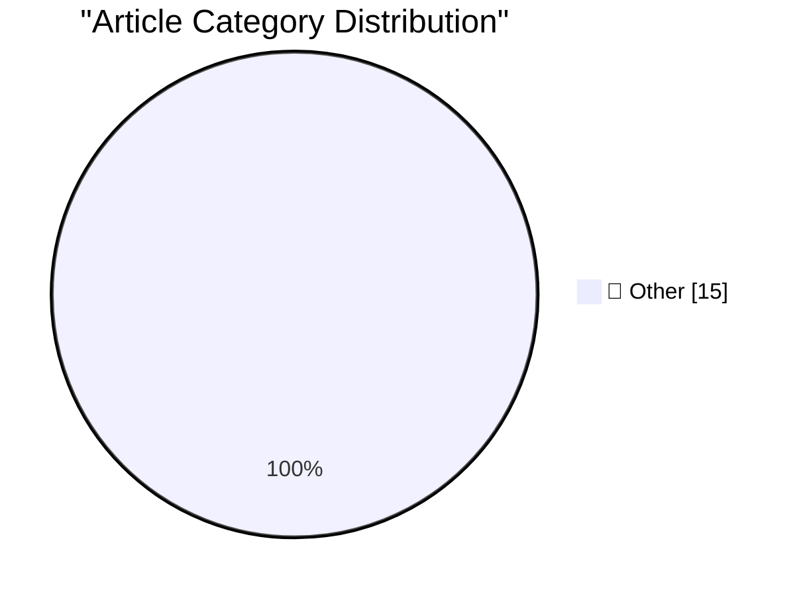

# 📰 AI Blog Daily Digest — 2026-06-27

> ⚠️ **Degraded run.** AI scoring failed for every batch — rankings and categories below are placeholder defaults, not AI-judged.

> From 92 top tech blogs (curated by Karpathy), AI-selected Top 15

## 🏆 Must Read

🥇 **Quoting Dean W. Ball**

simonwillison.net · 5m ago · 📝 Other

> This is a bad state of affairs. Consider, in particular, some industry dynamics: Frontier models are trained at an enormous cost, and a significant fraction of that cost is recouped in the few post-re

🥈 **Quoting Timothy B. Lee**

simonwillison.net · 1h ago · 📝 Other

> This is like saying there's no learning curve to being a manager because your employees will just do whatever you tell them to do. &mdash; Timothy B. Lee , on the idea that LLMs take no skill and have

🥉 **What happened after 2,000 people tried to hack my AI assistant**

simonwillison.net · 3h ago · 📝 Other

> What happened after 2,000 people tried to hack my AI assistant Fernando Irarrázaval ran a challenge on hackmyclaw.com to see if anyone could leak secrets held by his OpenClaw test instance by sending 

---

## 📊 Data Overview

| Scanned | Articles | Range | Selected |
|:---:|:---:|:---:|:---:|
| 86/92 | 2545 → 38 | 48h | **15** |

### Category Distribution

---

## 📝 Other

### 1. Quoting Dean W. Ball

[Link](https://simonwillison.net/2026/Jun/26/dean-w-ball/#atom-everything) — **simonwillison.net** · 5m ago · ⭐ 15/30

> This is a bad state of affairs. Consider, in particular, some industry dynamics: Frontier models are trained at an enormous cost, and a significant fraction of that cost is recouped in the few post-re

---

### 2. Quoting Timothy B. Lee

[Link](https://simonwillison.net/2026/Jun/26/timothy-b-lee/#atom-everything) — **simonwillison.net** · 1h ago · ⭐ 15/30

> This is like saying there's no learning curve to being a manager because your employees will just do whatever you tell them to do. &mdash; Timothy B. Lee , on the idea that LLMs take no skill and have

---

### 3. What happened after 2,000 people tried to hack my AI assistant

[Link](https://simonwillison.net/2026/Jun/26/hack-my-ai-assistant/#atom-everything) — **simonwillison.net** · 3h ago · ⭐ 15/30

> What happened after 2,000 people tried to hack my AI assistant Fernando Irarrázaval ran a challenge on hackmyclaw.com to see if anyone could leak secrets held by his OpenClaw test instance by sending 

---

### 4. Incident Report: CVE-2026-LGTM

[Link](https://simonwillison.net/2026/Jun/26/incident-report/#atom-everything) — **simonwillison.net** · 4h ago · ⭐ 15/30

> Incident Report: CVE-2026-LGTM Spectacular hypothetical incident report by Andrew Nesbitt. Day 2, 16:00 UTC --- Two AI review agents from competing vendors, both attached to a downstream pull request 

---

### 5. Quoting OpenAI

[Link](https://simonwillison.net/2026/Jun/26/openai/#atom-everything) — **simonwillison.net** · 5h ago · ⭐ 15/30

> We're beginning a limited preview of the GPT‑5.6 series: Sol, our flagship model; Terra, a balanced model for everyday work; and Luna, a fast and affordable model. Terra has competitive performance to

---

### 6. AI and Liability

[Link](https://simonwillison.net/2026/Jun/25/ai-and-liability/#atom-everything) — **simonwillison.net** · 1 days ago · ⭐ 15/30

> AI and Liability Bruce Schneier on the recent German ruling that Google be held liable for errors introduced in their AI overviews: AI agents are agents of the person or organization that deploys them

---

### 7. datasette-export-database 0.3a2

[Link](https://simonwillison.net/2026/Jun/25/datasette-export-database/#atom-everything) — **simonwillison.net** · 1 days ago · ⭐ 15/30

> Release: datasette-export-database 0.3a2 An embarrassingly tiny release. The pyproject.toml had pinned to datasette==1.0a27 , inadvertently making this plugin incompatible with all other Datasette ver

---

### 8. Quickly apply LUTs (color grading) with ffmpeg

[Link](https://www.jeffgeerling.com/blog/2026/apply-lut-color-grade-with-ffmpeg/) — **jeffgeerling.com** · 20h ago · ⭐ 15/30

> This is a quick post, mostly for my own reference. I've avoided LUTs and 'Log' video footage for years 1 , mostly because of the extra tiny bit of workflow involved. Like RAW photos, 'Log' footage ret

---

### 9. AI inference is obviously profitable

[Link](https://seangoedecke.com/ai-inference-is-obviously-profitable/) — **seangoedecke.com** · 22h ago · ⭐ 15/30

> Many people claim that AI inference is unprofitable to serve, and thus must be subsidized by an ocean of dumb money from investors who believe that some future AI model will come to dominate the world

---

### 10. Apple’s Full Statement on Yesterday’s Price Increases

[Link](https://www.macrumors.com/2026/06/25/apple-explains-why-it-raised-prices/) — **daringfireball.net** · 5h ago · ⭐ 15/30

> Apple, in a statement issues to the press yesterday, quoted fully by MacRumors: The consumer electronics industry is facing an unprecedented challenge. The rapid expansion of AI data centers has creat

---

### 11. The Price-Hiked Apple TV 4K Is 4 Years Old

[Link](https://buyersguide.macrumors.com/#Apple_TV) — **daringfireball.net** · 6h ago · ⭐ 15/30

> Via MacRumors’s Buyer Guide, the current third-gen Apple TV 4K models were introduced in October 2022 , and sport the A15 Bionic chip that debuted with the iPhones 13 in 2021. It’s widely believed tha

---

### 12. ★ Spensive Thoughts

[Link](https://daringfireball.net/2026/06/spensive_thoughts) — **daringfireball.net** · 23h ago · ⭐ 15/30

> Some quick thoughts on the hardware prices Apple increased — and didn’t increase — today.

---

### 13. Review: Gamrombo PS5 controller - including Linux set up ★★★★☆

[Link](https://shkspr.mobi/blog/2026/06/review-gamrombo-ps5-controller-including-linux-set-up/) — **shkspr.mobi** · 10h ago · ⭐ 15/30

> I'm not paying seventy bloody quid for an official PS5 controller - so I found a knock-off version for a smidge under £40. And this one has lots of unnecessary blinkenlights! Gamrombo is the consumer-

---

### 14. AI children's books, body horror edition

[Link](https://lcamtuf.substack.com/p/ai-childrens-books-body-horror-edition) — **lcamtuf.substack.com** · 21h ago · ⭐ 15/30

> Last week, I posted a visual demonstration of the sameness of AI-generated content.

---

### 15. Blink if you’re human

[Link](https://dynomight.net/blink/) — **dynomight.net** · 22h ago · ⭐ 15/30

> Or human-ish

---

*Generated on 2026-06-27 | Scanned 86 sources → Found 2545 articles → Selected 15 articles*
*Based on [Hacker News Popularity Contest 2025](https://refactoringenglish.com/tools/hn-popularity/) RSS feeds list, curated by [Andrej Karpathy](https://x.com/karpathy).*
*Created by "Understand AI".*
