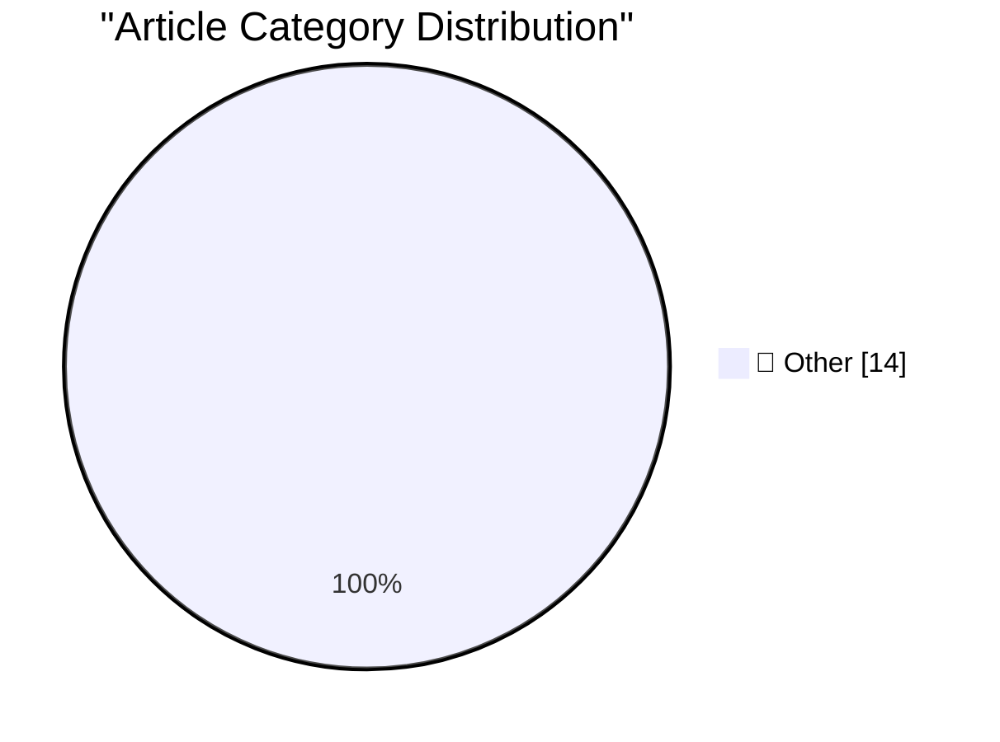

# 📰 AI Blog Daily Digest — 2026-06-30

> ⚠️ **Degraded run.** AI scoring failed for every batch — rankings and categories below are placeholder defaults, not AI-judged.

> From 92 top tech blogs (curated by Karpathy), AI-selected Top 14

## 🏆 Must Read

🥇 **Count the number of Safari tabs**

simonwillison.net · 3h ago · 📝 Other

> Tiniest TIL, using AppleScript to count the number of open browser tabs in Safari: osascript -e 'tell application "Safari" to count tabs of every window' Tags: safari , til , applescript

🥈 **Ornith-1.0: Self-Scaffolding LLMs for Agentic Coding**

simonwillison.net · 6h ago · 📝 Other

> Ornith-1.0: Self-Scaffolding LLMs for Agentic Coding This is an interesting new open weights (MIT licensed) model, the first model release from DeepReinforce. [...] with variants including 9B Dense, 3

🥉 **Daniel Agee: ‘Remembering Om’**

daringfireball.net · 21h ago · 📝 Other

> Daniel Agee, an early member of the team at Glass, writing on the Glass blog: It’s not lost on us that Om’s photography , often taken in frozen lands in or around the arctic circle, was the polar oppo

---

## 📊 Data Overview

| Scanned | Articles | Range | Selected |
|:---:|:---:|:---:|:---:|
| 87/92 | 2573 → 26 | 48h | **14** |

### Category Distribution

---

## 📝 Other

### 1. Count the number of Safari tabs

[Link](https://simonwillison.net/2026/Jun/29/safari-tab-count/#atom-everything) — **simonwillison.net** · 3h ago · ⭐ 15/30

> Tiniest TIL, using AppleScript to count the number of open browser tabs in Safari: osascript -e 'tell application "Safari" to count tabs of every window' Tags: safari , til , applescript

---

### 2. Ornith-1.0: Self-Scaffolding LLMs for Agentic Coding

[Link](https://simonwillison.net/2026/Jun/29/ornith/#atom-everything) — **simonwillison.net** · 6h ago · ⭐ 15/30

> Ornith-1.0: Self-Scaffolding LLMs for Agentic Coding This is an interesting new open weights (MIT licensed) model, the first model release from DeepReinforce. [...] with variants including 9B Dense, 3

---

### 3. Daniel Agee: ‘Remembering Om’

[Link](https://glass.photo/highlights/remembering-om) — **daringfireball.net** · 21h ago · ⭐ 15/30

> Daniel Agee, an early member of the team at Glass, writing on the Glass blog: It’s not lost on us that Om’s photography , often taken in frozen lands in or around the arctic circle, was the polar oppo

---

### 4. Matt Mullenweg: ‘All Roads Lead to Om’

[Link](https://ma.tt/2026/06/om-forever/) — **daringfireball.net** · 21h ago · ⭐ 15/30

> Matt Mullenweg: Fundamentally, Om was a lover of humanity. He became a fast “regular” everywhere he went. He wouldn’t just buy coffee, he would also learn the name and story of every barista, the dogs

---

### 5. The New York Times: ‘Om Malik, Whose Blog Shaped How Silicon Valley Saw Itself, Dies at 59’

[Link](https://www.nytimes.com/2026/06/26/technology/om-malik-dead.html?unlocked_article_code=1.t1A.AyPT.p7GhDrDcJSfa) — **daringfireball.net** · 22h ago · ⭐ 15/30

> Clay Risen, writing for The New York Times (gift link): Mr. Malik started his blog just as the dot-com bubble burst, leading to a recession that also took down many of the journalism start-ups that wr

---

### 6. I turned my prologue into a short video

[Link](https://idiallo.com/byte-size/my-prologue-to-short-video) — **idiallo.com** · 20h ago · ⭐ 15/30

> It's hard to write a whole book. So for now at least, I've turned the prologue of my book into a short video. I hope you enjoy it.

---

### 7. Pluralistic: Gemini is better than search because Google enshittified search (29 Jun 2026)

[Link](https://pluralistic.net/2026/06/29/arsonist-firefighters/) — **pluralistic.net** · 5h ago · ⭐ 15/30

> Today's links Gemini is better than search because Google enshittified search: We're All Trying To Find The Guy Who Did This. Hey look at this: Delights to delectate. Object permanence: Microsoft anti

---

### 8. Off for adventures

[Link](https://garymarcus.substack.com/p/off-for-adventures) — **garymarcus.substack.com** · 8h ago · ⭐ 15/30

> Leaving you with a couple laughs

---

### 9. Who you gonna believe: Grok or the docs?

[Link](https://www.johndcook.com/blog/2026/06/29/who-you-gonna-believe/) — **johndcook.com** · 10h ago · ⭐ 15/30

> The calculator utility bc has a minimal math library. For example, there’s no tangent function because you’re expected take the ratio of sine and cosine. (The Gnu version of bc does have a function fo

---

### 10. Unbundling the standard library

[Link](https://nesbitt.io/2026/06/29/unbundling-the-standard-library.html) — **nesbitt.io** · 12h ago · ⭐ 15/30

> Batteries no longer included, available separately on aisle four

---

### 11. Notes from Bryan Cantrill’s “Intelligence is not Enough”

[Link](https://blog.jim-nielsen.com/2026/intelligence-isnt-enough/) — **blog.jim-nielsen.com** · 1 days ago · ⭐ 15/30

> I quite enjoyed this talk from Bryan Cantrill where he discusses the difficult engineering problems they overcame while working on their company Oxide . Some of the problems they ran into were bugs. B

---

### 12. What happened to Altavista

[Link](https://dfarq.homeip.net/what-happened-to-altavista/?utm_source=rss&#038;utm_medium=rss&#038;utm_campaign=what-happened-to-altavista) — **dfarq.homeip.net** · 11h ago · ⭐ 15/30

> For as long as I can remember, my home page has been about:blank. But for a good chunk of the 1990s, I would have done well to set it to altavista.digital.com. Here’s what happened to Altavista, the s

---

### 13. My favorite keyboards

[Link](https://fabiensanglard.net/keyboards/index.html) — **fabiensanglard.net** · 1 days ago · ⭐ 15/30

> 

---

### 14. Working around dragons with the Lemote Yeeloong laptop and OpenBSD

[Link](https://oldvcr.blogspot.com/feeds/4105976086519173967/comments/default) — **oldvcr.blogspot.com** · 1 days ago · ⭐ 15/30

> Behold: the Guru of GNU ! (Photo by Habib Mhenni, Wikimedia Commons, CC BY-SA 3.0.) True enlightment only comes from a truly free computing experience, probably! And while there is no nerd who lacks a

---

*Generated on 2026-06-30 | Scanned 87 sources → Found 2573 articles → Selected 14 articles*
*Based on [Hacker News Popularity Contest 2025](https://refactoringenglish.com/tools/hn-popularity/) RSS feeds list, curated by [Andrej Karpathy](https://x.com/karpathy).*
*Created by "Understand AI".*
