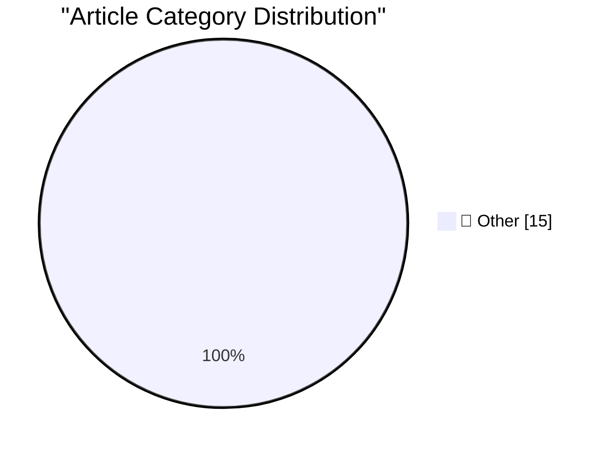

# 📰 AI Blog Daily Digest — 2026-07-01

> ⚠️ **Degraded run.** AI scoring failed for every batch — rankings and categories below are placeholder defaults, not AI-judged.

> From 92 top tech blogs (curated by Karpathy), AI-selected Top 15

## 🏆 Must Read

🥇 **Nano Banana 2 Lite**

simonwillison.net · 15m ago · 📝 Other

> Nano Banana 2 Lite Also known as Gemini 3.1 Flash Lite Image ( gemini-3.1-flash-lite-image in their API ), this is the "fastest and cheapest Gemini image model, engineered for velocity and scale". I u

🥈 **What's new in Claude Sonnet 5**

simonwillison.net · 1h ago · 📝 Other

> What&#x27;s new in Claude Sonnet 5 Claude Sonnet 5 came out this morning . I always head straight for the "what's new" developer docs because they tend to have more actionable information than the off

🥉 **The AI Compass**

simonwillison.net · 4h ago · 📝 Other

> The AI Compass This political compass style quiz by bambamramfan is pretty neat - answer 29 questions about AI and AI ethics to see which of the 30 archetypes you best fit. I'm impressed that my answe

---

## 📊 Data Overview

| Scanned | Articles | Range | Selected |
|:---:|:---:|:---:|:---:|
| 87/92 | 2573 → 43 | 48h | **15** |

### Category Distribution

---

## 📝 Other

### 1. Nano Banana 2 Lite

[Link](https://simonwillison.net/2026/Jun/30/nano-banana-2-lite/#atom-everything) — **simonwillison.net** · 15m ago · ⭐ 15/30

> Nano Banana 2 Lite Also known as Gemini 3.1 Flash Lite Image ( gemini-3.1-flash-lite-image in their API ), this is the "fastest and cheapest Gemini image model, engineered for velocity and scale". I u

---

### 2. What's new in Claude Sonnet 5

[Link](https://simonwillison.net/2026/Jun/30/claude-sonnet-5/#atom-everything) — **simonwillison.net** · 1h ago · ⭐ 15/30

> What&#x27;s new in Claude Sonnet 5 Claude Sonnet 5 came out this morning . I always head straight for the "what's new" developer docs because they tend to have more actionable information than the off

---

### 3. The AI Compass

[Link](https://simonwillison.net/2026/Jun/30/the-ai-compass/#atom-everything) — **simonwillison.net** · 4h ago · ⭐ 15/30

> The AI Compass This political compass style quiz by bambamramfan is pretty neat - answer 29 questions about AI and AI ethics to see which of the 30 archetypes you best fit. I'm impressed that my answe

---

### 4. Have your agent record video demos of its work with shot-scraper video

[Link](https://simonwillison.net/2026/Jun/30/shot-scraper-video/#atom-everything) — **simonwillison.net** · 5h ago · ⭐ 15/30

> shot-scraper video is a new command introduced in today's shot-scraper 1.10 release which accepts a storyboard.yml file defining a routine to run against a web application and uses Playwright to recor

---

### 5. shot-scraper 1.10

[Link](https://simonwillison.net/2026/Jun/30/shot-scraper/#atom-everything) — **simonwillison.net** · 7h ago · ⭐ 15/30

> Release: shot-scraper 1.10 The big new feature is shot-scraper video storyboard.yml , described in detail in Have your agent record video demos of its work with shot-scraper video . Tags: shot-scraper

---

### 6. HTML table extractor

[Link](https://simonwillison.net/2026/Jun/29/html-table-extractor/#atom-everything) — **simonwillison.net** · 22h ago · ⭐ 15/30

> Tool: HTML table extractor Yet another in my growing collection of paste-conversion tools. This one accepts pasted rich text from browsers (with embedded HTML tables) and converts every detected table

---

### 7. Gnome

[Link](https://lexfriedman.com/gnome/) — **daringfireball.net** · 1h ago · ⭐ 15/30

> Gnome is a deceptively clever animated GIF app by Lex Friedman: The truest thing about animated GIFs is that they are a critical pillar of modern human communication, and yet getting one into a Slack 

---

### 8. Supreme Court Agrees to Review Apple’s Petition Regarding Civil Contempt Finding in ‘Apple v. Epic Games’

[Link](https://www.supremecourt.gov/orders/courtorders/063026zor_3f14.pdf) — **daringfireball.net** · 2h ago · ⭐ 15/30

> Speaking of the Supreme Court’s end-of-term rulings , they today agreed to grant certiorari to Apple’s petition from last month , ordering: APPLE INC. V. EPIC GAMES, INC. The petition for a writ of ce

---

### 9. Supreme Court Upholds Birthright Citizenship in 6-3 Decision

[Link](https://talkingpointsmemo.com/edblog/the-birthright-citizenship-decision-is-more-evidence-for-court-reform/sharetoken/e2bf9547-fa9b-468c-8af3-aa09e72ca698) — **daringfireball.net** · 2h ago · ⭐ 15/30

> Josh Marshall, writing at TPM (gift link): As you’ve seen, the Supreme Court upheld the constitutionality of birthright citizenship by a 6 — or perhaps 5½ — vote margin. See Kate Riga’s report on the 

---

### 10. ★ The Supreme Court Rules That Law Enforcement’s Use of ‘Geofence Warrant’ Was a ‘Search’ (But May Be Moot, Technically, Since 2024)

[Link](https://daringfireball.net/2026/06/scotus_geofence_warrant_search) — **daringfireball.net** · 3h ago · ⭐ 15/30

> Google no longer collects this information in a way that is susceptible to geofence warrants, and, more importantly, Apple never did.

---

### 11. Three Players From the Japanese Men’s National Team vs. 100 School Children

[Link](https://x.com/BallStreet/status/950382135969566720) — **daringfireball.net** · 3h ago · ⭐ 15/30

> I know there’s been a lot of exciting World Cup action this week, but this 2018 clip from Japan is the best soccer video I’ve seen a long while. ★

---

### 12. CMA Consultation on Mobile App Steering and NFC Access

[Link](https://www.gov.uk/government/news/cma-consults-on-new-requirements-for-apple-and-googles-mobile-platforms) — **daringfireball.net** · 5h ago · ⭐ 15/30

> The UK Competition and Markets Authority: ‘Steering’ — the ability for developers to engage with customers about off‑platform options — is currently banned by Apple and restricted by Google in the UK.

---

### 13. U.K. Regulator Considers Requiring App Store to Allow Steering to the Web, and iOS NFC to Be Open

[Link](https://www.reuters.com/world/uk-regulator-proposes-easing-apple-google-app-store-payment-rules-2026-06-30/) — **daringfireball.net** · 6h ago · ⭐ 15/30

> Sam Tabahriti, reporting for Reuters: Britain’s competition regulator ​on Tuesday proposed allowing app developers to steer users to alternative payment options outside Apple and Alphabet’s Google app

---

### 14. Data Breach at Indian Supplier Tata Electronics Exposes iPhone 18 Pro Details and Photos

[Link](https://www.reuters.com/business/media-telecom/apple-iphone-18-pro-supplier-list-parts-photos-exposed-tata-data-leak-2026-06-29/) — **daringfireball.net** · 21h ago · ⭐ 15/30

> Munsif Vengattil, Aditya Kalra, and Stephen Nellis, reporting for Reuters: Sensitive lists of components and suppliers, ​and photos of Apple’s upcoming iPhone 18 Pro models are part of files posted on

---

### 15. [Sponsor] Day One Journal

[Link](https://dayoneapp.com/blog/introducing-daily-chat/) — **daringfireball.net** · 23h ago · ⭐ 15/30

> Day One recognizes that many people struggle with journaling not because they can’t write, but because they don’t know how to begin or what a “good” journal entry about their day looks like. That’s wh

---

*Generated on 2026-07-01 | Scanned 87 sources → Found 2573 articles → Selected 15 articles*
*Based on [Hacker News Popularity Contest 2025](https://refactoringenglish.com/tools/hn-popularity/) RSS feeds list, curated by [Andrej Karpathy](https://x.com/karpathy).*
*Created by "Understand AI".*
