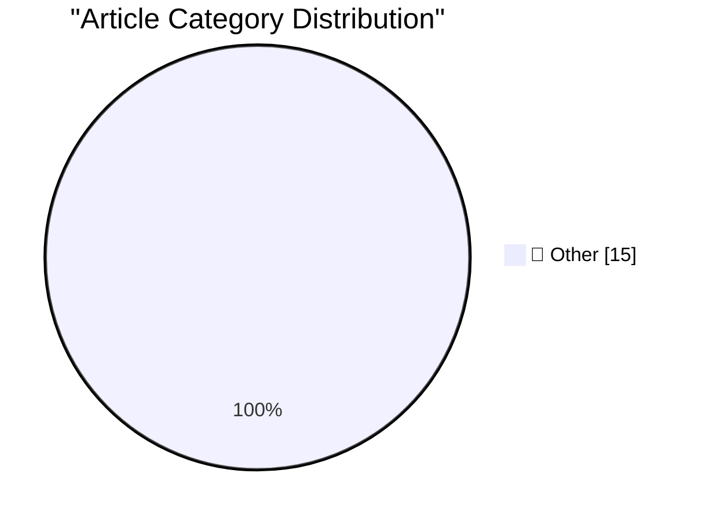

# 📰 AI Blog Daily Digest — 2026-07-02

> ⚠️ **Degraded run.** AI scoring failed for every batch — rankings and categories below are placeholder defaults, not AI-judged.

> From 92 top tech blogs (curated by Karpathy), AI-selected Top 15

## 🏆 Must Read

🥇 **Quoting Anthropic**

simonwillison.net · 22h ago · 📝 Other

> We’ve received notice that the Department of Commerce has lifted export controls on Claude Fable 5 and Mythos 5. We'll begin restoring access tomorrow, and will share an update soon. &mdash; Anthropic

🥈 **PlayStation Plus and Xbox Game Pass Subscriptions**

daringfireball.net · 2h ago · 📝 Other

> Following up on my earlier post on Valve’s righteous objection to selling game console hardware at a loss, I should have noted that PlayStation Plus starts at $11/month (and goes up to $20/month) and 

🥉 **Valve Explains Why It Doesn’t Subsidize Its Hardware Platforms**

daringfireball.net · 4h ago · 📝 Other

> Valve, in a statement to The Verge, explaining why it doesn’t sell its handheld Steam Deck or new Steam Machine gaming devices at a loss (gift link): While this might seem like an easy solution, it do

---

## 📊 Data Overview

| Scanned | Articles | Range | Selected |
|:---:|:---:|:---:|:---:|
| 87/92 | 2575 → 45 | 48h | **15** |

### Category Distribution

---

## 📝 Other

### 1. Quoting Anthropic

[Link](https://simonwillison.net/2026/Jun/30/anthropic/#atom-everything) — **simonwillison.net** · 22h ago · ⭐ 15/30

> We’ve received notice that the Department of Commerce has lifted export controls on Claude Fable 5 and Mythos 5. We'll begin restoring access tomorrow, and will share an update soon. &mdash; Anthropic

---

### 2. PlayStation Plus and Xbox Game Pass Subscriptions

[Link](https://daringfireball.net/linked/2026/07/01/valve-on-subsidizing-hardware) — **daringfireball.net** · 2h ago · ⭐ 15/30

> Following up on my earlier post on Valve’s righteous objection to selling game console hardware at a loss, I should have noted that PlayStation Plus starts at $11/month (and goes up to $20/month) and 

---

### 3. Valve Explains Why It Doesn’t Subsidize Its Hardware Platforms

[Link](https://www.theverge.com/games/952004/valve-steam-machine-price-not-subsidizing) — **daringfireball.net** · 4h ago · ⭐ 15/30

> Valve, in a statement to The Verge, explaining why it doesn’t sell its handheld Steam Deck or new Steam Machine gaming devices at a loss (gift link): While this might seem like an easy solution, it do

---

### 4. The Talk Show: ‘Taking Drugs to Get Fat’

[Link](https://daringfireball.net/thetalkshow/2026/06/30/ep-451) — **daringfireball.net** · 6h ago · ⭐ 15/30

> The great John Moltz returns to the show. Topics include Apple’s hardware price hikes in response to the global RAM/SSD shortage, and some spitballing on what we like about the UI changes in the MacOS

---

### 5. 404 Media: Vulnerability in iCloud’s ‘Hide My Email’ Reveals Peoples’ Real Email Addresses

[Link](https://www.404media.co/apple-hide-my-email-vulnerability-reveals-peoples-real-email-addresses/) — **daringfireball.net** · 7h ago · ⭐ 15/30

> Joseph Cox, reporting for 404 Media: 404 Media is not revealing the exact details of the vulnerability because it can still be exploited as of Monday, when 404 Media verified the issue with one of our

---

### 6. The Dating App Plot Device

[Link](https://idiallo.com/blog/dating-plot-device) — **idiallo.com** · 1 days ago · ⭐ 15/30

> I've always been interested in how dating apps work. You really only have two choices if you want to get in the business. Help people find a match, and they will never come back Make people pay and ke

---

### 7. Pluralistic: Technocarcinization (01 Jul 2026)

[Link](https://pluralistic.net/2026/07/01/ontogeny/) — **pluralistic.net** · 7h ago · ⭐ 15/30

> Today's links Technocarcinization: Enshittification is the great leveler. Hey look at this: Delights to delectate. Object permanence: Grampa's backyard Disneyland; Elizabeth Warren on monopolies; Spot

---

### 8. Pluralistic: Jo Walton's "Everybody's Perfect" (30 Jun 2026)

[Link](https://pluralistic.net/2026/06/30/serenissima/) — **pluralistic.net** · 1 days ago · ⭐ 15/30

> Today's links Jo Walton's "Everybody's Perfect": A mystical tour-de-force that makes you feel like your mundane life until this point has all been a boring dream. Hey look at this: Delights to delecta

---

### 9. Book Review: Fake Creativity by Blake Loch ★★★☆☆

[Link](https://shkspr.mobi/blog/2026/06/book-review-fake-creativity-by-blake-loch/) — **shkspr.mobi** · 1 days ago · ⭐ 15/30

> Thanks to BookSirens for providing me with a review copy. This is an intriguing self-published novel with a backstory almost as interesting as the plot. The story is a descent into paranoia as an auth

---

### 10. It rather involved being on the other side of this airtight hatchway: Changing administrative settings

[Link](https://devblogs.microsoft.com/oldnewthing/20260701-00/?p=112498) — **devblogs.microsoft.com/oldnewthing** · 8h ago · ⭐ 15/30

> Unlocking the door from the inside. The post It rather involved being on the other side of this airtight hatchway: Changing administrative settings appeared first on The Old New Thing .

---

### 11. 2026 mid-year link clearance

[Link](https://devblogs.microsoft.com/oldnewthing/20260630-01/?p=112494) — **devblogs.microsoft.com/oldnewthing** · 1 days ago · ⭐ 15/30

> Made it to another midpoint. The post 2026 mid-year link clearance appeared first on The Old New Thing .

---

### 12. A compatibility note on the abuse of Windows window class extra bytes

[Link](https://devblogs.microsoft.com/oldnewthing/20260630-00/?p=112488) — **devblogs.microsoft.com/oldnewthing** · 1 days ago · ⭐ 15/30

> Finding an illicit place to hide data. The post A compatibility note on the abuse of Windows window class extra bytes appeared first on The Old New Thing .

---

### 13. DNA Sequence Alignment and Kings

[Link](https://www.johndcook.com/blog/2026/06/30/dna-sequence-alignment-and-kings/) — **johndcook.com** · 22h ago · ⭐ 15/30

> This morning I wrote a post that included the central Delannoy numbers. The nth central Delannoy number Dn counts the number of ways a king can move from one corner of a chessboard to the diagonally o

---

### 14. Distinguishing variables from parameters

[Link](https://www.johndcook.com/blog/2026/06/30/variables-and-parameters/) — **johndcook.com** · 1 days ago · ⭐ 15/30

> Imagine the following dialog. Professor: f is a function of a real variable x that takes a real parameter k. Student: What’s a parameter? Professor: It’s a constant that can vary. Student: Then if it 

---

### 15. Silver Rectangles and the Ways of Kings

[Link](https://www.johndcook.com/blog/2026/06/30/silver-kings/) — **johndcook.com** · 1 days ago · ⭐ 15/30

> Golden rectangles The defining property of golden rectangle is that if you stick a square on its longer side, you get another golden rectangle. The smaller vertical rectangle is similar to the larger 

---

*Generated on 2026-07-02 | Scanned 87 sources → Found 2575 articles → Selected 15 articles*
*Based on [Hacker News Popularity Contest 2025](https://refactoringenglish.com/tools/hn-popularity/) RSS feeds list, curated by [Andrej Karpathy](https://x.com/karpathy).*
*Created by "Understand AI".*
