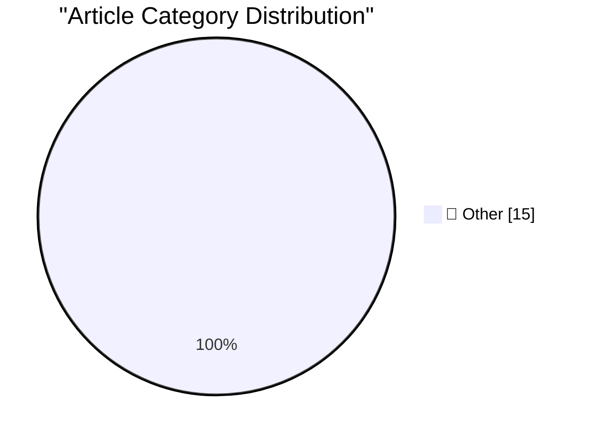

# 📰 AI Blog Daily Digest — 2026-07-03

> ⚠️ **Degraded run.** AI scoring failed for every batch — rankings and categories below are placeholder defaults, not AI-judged.

> From 92 top tech blogs (curated by Karpathy), AI-selected Top 15

## 🏆 Must Read

🥇 **llm-coding-agent 0.1a0**

simonwillison.net · 2h ago · 📝 Other

> Release: llm-coding-agent 0.1a0 Another Fable 5 experiment. Now that my LLM library has evolved into more of an agent framework it's time to see what a simple coding agent would look like built on it.

🥈 **Using DSPy to evaluate and improve Datasette Agent's SQL system prompts**

simonwillison.net · 4h ago · 📝 Other

> Research: Using DSPy to evaluate and improve Datasette Agent&#x27;s SQL system prompts One of this morning's AIE keynotes covered dspy , which reminded me I've been meaning to see if it could help me 

🥉 **Understand to participate**

simonwillison.net · 5h ago · 📝 Other

> I saw Geoffrey Litt speak at AIE yesterday, and one framing he used particularly resonated with me: Understand to participate Geoffrey was talking about the challenge of collaborating with coding agen

---

## 📊 Data Overview

| Scanned | Articles | Range | Selected |
|:---:|:---:|:---:|:---:|
| 88/92 | 2588 → 38 | 48h | **15** |

### Category Distribution

---

## 📝 Other

### 1. llm-coding-agent 0.1a0

[Link](https://simonwillison.net/2026/Jul/2/llm-coding-agent/#atom-everything) — **simonwillison.net** · 2h ago · ⭐ 15/30

> Release: llm-coding-agent 0.1a0 Another Fable 5 experiment. Now that my LLM library has evolved into more of an agent framework it's time to see what a simple coding agent would look like built on it.

---

### 2. Using DSPy to evaluate and improve Datasette Agent's SQL system prompts

[Link](https://simonwillison.net/2026/Jul/2/dspy-datasette-agent-prompts/#atom-everything) — **simonwillison.net** · 4h ago · ⭐ 15/30

> Research: Using DSPy to evaluate and improve Datasette Agent&#x27;s SQL system prompts One of this morning's AIE keynotes covered dspy , which reminded me I've been meaning to see if it could help me 

---

### 3. Understand to participate

[Link](https://simonwillison.net/2026/Jul/2/understand-to-participate/#atom-everything) — **simonwillison.net** · 5h ago · ⭐ 15/30

> I saw Geoffrey Litt speak at AIE yesterday, and one framing he used particularly resonated with me: Understand to participate Geoffrey was talking about the challenge of collaborating with coding agen

---

### 4. Text AI watermarks will always be trivial to remove

[Link](https://seangoedecke.com/text-ai-watermarks/) — **seangoedecke.com** · 22h ago · ⭐ 15/30

> The European Union AI Act will begin to be enforceable in August 2026, one month from now 1 . One of the biggest new requirements is Article 50 , which requires all AI outputs to be “detectable as art

---

### 5. FBI Seizes NetNut Proxy Platform, Popa Botnet

[Link](https://krebsonsecurity.com/2026/07/fbi-seizes-netnut-proxy-platform-popa-botnet/) — **krebsonsecurity.com** · 3h ago · ⭐ 15/30

> The Federal Bureau of Investigation (FBI) said today it worked with industry partners to seize hundreds of domains associated with NetNut, a sprawling residential proxy service operated by the publicl

---

### 6. Introducing the Safari MCP Server for Web Developers

[Link](https://webkit.org/blog/18136/introducing-the-safari-mcp-server-for-web-developers/) — **daringfireball.net** · 35m ago · ⭐ 15/30

> Saron Yitbarek, writing on the WebKit blog, with a nice post-WWDC surprise: In Safari Technology Preview 247 , we’re introducing the Safari MCP server — a Model Context Protocol server for web develop

---

### 7. EveryMac Turns 30

[Link](https://everymac.com/whatsnew/) — **daringfireball.net** · 59m ago · ⭐ 15/30

> EveryMac: Thirty years is a long time — and a great deal has changed since then — but what has not changed is that EveryMac.com has been there to provide you with detailed info on every Mac from the o

---

### 8. I Repeat Myself (5G vs. LTE Edition)

[Link](https://daringfireball.net/linked/2022/03/23/5g-battery-life) — **daringfireball.net** · 1h ago · ⭐ 15/30

> Back in March 2022, Nicole Nguyen of The Wall Street Journal compared the battery life effects of 5G vs. LTE by streaming videos on several iPhone and iPad models. She found that using LTE saved signi

---

### 9. Truth Social Is Still Just Trump’s Blog

[Link](https://daringfireball.net/2025/06/truth_social_is_just_trumps_blog) — **daringfireball.net** · 2h ago · ⭐ 15/30

> After I linked to Commerce Secretary Howard Lutnick posting on Twitter/X about the Trump administration allowing Anthropic to once again release Claude Fable 5, I was reminded once again that no one e

---

### 10. ‘A Perfect Reflection of Trump’s Washington’

[Link](https://politicalwire.com/2026/06/19/a-perfect-reflection-of-trumps-washington/) — **daringfireball.net** · 3h ago · ⭐ 15/30

> Taegan Goddard, two weeks ago at Political Wire: The Lincoln Memorial Reflecting Pool has become an almost too-perfect metaphor for Donald Trump’s presidency. He promised a quick, cheap fix. Instead, 

---

### 11. Claude Fable and Kayfabe

[Link](https://www.anthropic.com/news/redeploying-fable-5) — **daringfireball.net** · 4h ago · ⭐ 15/30

> Anthropic: On Friday, June 12, the US government applied export controls to our newest models, Claude Fable 5 and Claude Mythos 5. This required us to restrict access to foreign nationals, whether ins

---

### 12. ‘Why Is Meta Destroying Its Engineering Organization?’

[Link](https://newsletter.pragmaticengineer.com/p/why-is-meta-destroying-its-engineering) — **daringfireball.net** · 5h ago · ⭐ 15/30

> Gergely Orosz, writing at The Pragmatic Engineer (which, sadly , is a Substack blog): The biggest problem: people stop caring about real work and focus on performative work. Let’s check the four ingre

---

### 13. MG Siegler Got Banned From WhatsApp for No Reason

[Link](https://spyglass.org/whatsapp-ban/) — **daringfireball.net** · 6h ago · ⭐ 15/30

> MG Siegler, writing at Spyglass: Yes, that’s right, for a third time in as many years, I’ve been banned by Meta. What for? Do you really have to ask? Nobody knows . My suspicion is that it’s directly 

---

### 14. Hackers Stole Instagram Accounts Simply by Asking Meta AI to Give Them Access

[Link](https://www.404media.co/hackers-simply-asked-meta-ai-to-give-them-access-to-high-profile-instagram-accounts-it-worked/) — **daringfireball.net** · 6h ago · ⭐ 15/30

> Jason Koebler, a month ago at 404 Media: Over the last several days, Telegram groups for security researchers and hacking groups have been sharing videos and screenshots of the steps taken to steal an

---

### 15. ★ A Tale of Two Modems

[Link](https://daringfireball.net/2026/07/a_tale_of_two_modems) — **daringfireball.net** · 23h ago · ⭐ 15/30

> Cellular download speed and reception is nearly a solved problem for my needs. Battery life is not.

---

*Generated on 2026-07-03 | Scanned 88 sources → Found 2588 articles → Selected 15 articles*
*Based on [Hacker News Popularity Contest 2025](https://refactoringenglish.com/tools/hn-popularity/) RSS feeds list, curated by [Andrej Karpathy](https://x.com/karpathy).*
*Created by "Understand AI".*
