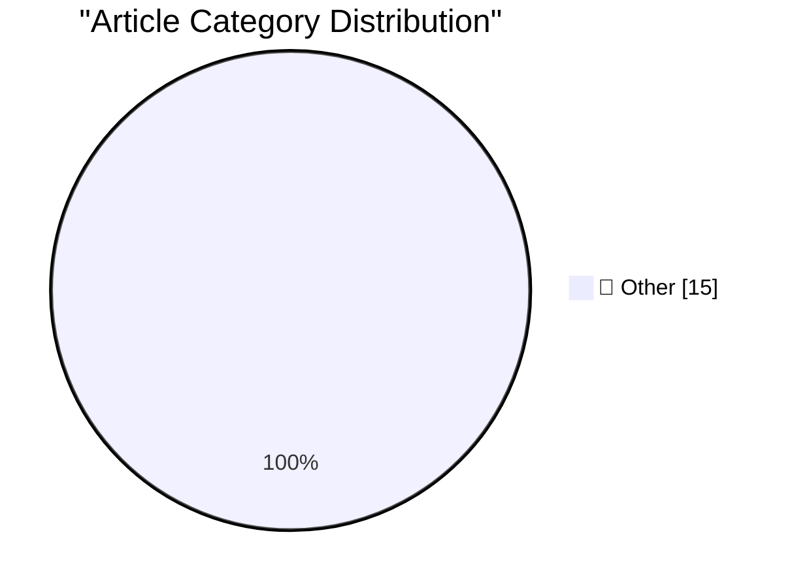

# 📰 AI Blog Daily Digest — 2026-07-04

> ⚠️ **Degraded run.** AI scoring failed for every batch — rankings and categories below are placeholder defaults, not AI-judged.

> From 92 top tech blogs (curated by Karpathy), AI-selected Top 15

## 🏆 Must Read

🥇 **Open Source AI Gap Map**

simonwillison.net · 26m ago · 📝 Other

> Open Source AI Gap Map Current AI is "a global partnership building a public option for AI", founded as a non-profit at the AI Action Summit in Paris in February 2025 and backed by serious capital ($4

🥈 **Quoting Josh W. Comeau**

simonwillison.net · 1h ago · 📝 Other

> I just launched my third course, Whimsical Animations, and so far, it’s on track to sell roughly ⅓ as many copies as a typical course launch. It’s a similar story with my two existing courses. Sales a

🥉 **Fable's judgement**

simonwillison.net · 3h ago · 📝 Other

> One of the most interesting tips I got from the Fireside Chat I hosted with Cat Wu and Thariq Shihipar from the Claude Code team at AIE on Wednesday was to let Fable (and to a certain extent Opus) use

---

## 📊 Data Overview

| Scanned | Articles | Range | Selected |
|:---:|:---:|:---:|:---:|
| 88/92 | 2588 → 35 | 48h | **15** |

### Category Distribution

---

## 📝 Other

### 1. Open Source AI Gap Map

[Link](https://simonwillison.net/2026/Jul/3/open-source-ai-gap-map/#atom-everything) — **simonwillison.net** · 26m ago · ⭐ 15/30

> Open Source AI Gap Map Current AI is "a global partnership building a public option for AI", founded as a non-profit at the AI Action Summit in Paris in February 2025 and backed by serious capital ($4

---

### 2. Quoting Josh W. Comeau

[Link](https://simonwillison.net/2026/Jul/3/josh-w-comeau/#atom-everything) — **simonwillison.net** · 1h ago · ⭐ 15/30

> I just launched my third course, Whimsical Animations, and so far, it’s on track to sell roughly ⅓ as many copies as a typical course launch. It’s a similar story with my two existing courses. Sales a

---

### 3. Fable's judgement

[Link](https://simonwillison.net/2026/Jul/3/judgement/#atom-everything) — **simonwillison.net** · 3h ago · ⭐ 15/30

> One of the most interesting tips I got from the Fireside Chat I hosted with Cat Wu and Thariq Shihipar from the Claude Code team at AIE on Wednesday was to let Fable (and to a certain extent Opus) use

---

### 4. June 2026 newsletter

[Link](https://simonwillison.net/2026/Jul/3/june-newsletter/#atom-everything) — **simonwillison.net** · 7h ago · ⭐ 15/30

> The June edition of my sponsors-only monthly newsletter is out. If you are a sponsor (or if you start a sponsorship now) you can access it here . This month: Claude Fable 5, GPT-5.6, and US export res

---

### 5. ★ Claude’s Criminally Bad Electron Mac App Is an Inside Job

[Link](https://daringfireball.net/2026/07/claudes_criminally_bad_mac_app_is_an_inside_job) — **daringfireball.net** · 1h ago · ⭐ 15/30

> Felix Rieseberg, quite obviously, is the answer to the question why Claude is an Electron app. It’s like wondering why all the screws in a building were hammered into the walls, and then finding out t

---

### 6. April Report From Ookla: ‘A Return to mmWave 5G’

[Link](https://www.ookla.com/articles/a-return-to-mmwave-5g) — **daringfireball.net** · 1 days ago · ⭐ 15/30

> Mike Dano, in a long ( too long, I say) report for Ookla (makers of the nifty Speedtest app ): Further, few other countries in the world followed in the mmWave footsteps of the U.S., with internationa

---

### 7. Pluralistic: CARDiac, syntax coloring, view source and vibe code (03 Jul 2026)

[Link](https://pluralistic.net/2026/07/03/rod-logic/) — **pluralistic.net** · 13h ago · ⭐ 15/30

> Today's links CARDiac, syntax coloring, view source and vibe code: With great abstraction comes great power comes great responsibility comes great loss of fidelity. Hey look at this: Delights to delec

---

### 8. Pluralistic: The difference between "today's task" and "accretive work" (02 Jul 2026)

[Link](https://pluralistic.net/2026/07/02/canonization/) — **pluralistic.net** · 1 days ago · ⭐ 15/30

> Today's links The difference between "today's task" and "accretive work": Sometimes, "I got it working" is fine, but sometimes it isn't. Hey look at this: Delights to delectate. Object permanence: Ser

---

### 9. This blog is written in en-GB

[Link](https://shkspr.mobi/blog/2026/07/this-blog-is-written-in-en-gb/) — **shkspr.mobi** · 1 days ago · ⭐ 15/30

> Someone left a comment on my blog recently asking if I'd mind making my language more inclusive. They didn't get some of the cultural references I'd used and suggested it would be easier if I used tro

---

### 10. How did we conclude that CcNamespace.dll was the ringleader of a group of DLLs that unloaded prematurely?

[Link](https://devblogs.microsoft.com/oldnewthing/20260703-00/?p=112504) — **devblogs.microsoft.com/oldnewthing** · 8h ago · ⭐ 15/30

> Contextual clues. The post How did we conclude that CcNamespace.dll was the ringleader of a group of DLLs that unloaded prematurely? appeared first on The Old New Thing .

---

### 11. The case of the thread executing from an unloaded third-party DLL

[Link](https://devblogs.microsoft.com/oldnewthing/20260702-00/?p=112500) — **devblogs.microsoft.com/oldnewthing** · 1 days ago · ⭐ 15/30

> Oops, I didn't realize that I was still doing that. The post The case of the thread executing from an unloaded third-party DLL appeared first on The Old New Thing .

---

### 12. The Fall and Rise of Screwworm

[Link](https://www.construction-physics.com/p/the-fall-and-rise-of-screwworm) — **construction-physics.com** · 10h ago · ⭐ 15/30

> Every spring, as sure as the seasons, and for generations unknown, screwworms began their annual march northward from their overwintering sanctuaries in Mexico and South Texas.

---

### 13. The Life and Times of Maxis, Part 1: SimEverything

[Link](https://www.filfre.net/2026/07/the-life-and-times-of-maxis-part-1-simeverything/) — **filfre.net** · 6h ago · ⭐ 15/30

> This article tells part of the story of Maxis Software. I’m still to this day just blown away by continental drift and things like that, stuff that most people think sounds pretty boring. — Will Wrigh

---

### 14. This Page Left Intentionally Blank

[Link](https://blog.jim-nielsen.com/2026/intentionally-blank/) — **blog.jim-nielsen.com** · 1 days ago · ⭐ 15/30

> I was popping off about negation being an act of creativity, when Blake Watson introduce me to the idea of the “This Page Intentionally Left Blank”-Project (Internet Archive) : In former times printed

---

### 15. Compute!’s Gazette magazine, 1983-1995

[Link](https://dfarq.homeip.net/computes-gazette-magazine-1983-1995/?utm_source=rss&#038;utm_medium=rss&#038;utm_campaign=computes-gazette-magazine-1983-1995) — **dfarq.homeip.net** · 11h ago · ⭐ 15/30

> In July 1983, one of my personal favorite Commodore computer magazines of all time, Compute!’s Gazette, was born. An offshoot of the general computer magazine Compute!, Gazette’s first issue was dated

---

*Generated on 2026-07-04 | Scanned 88 sources → Found 2588 articles → Selected 15 articles*
*Based on [Hacker News Popularity Contest 2025](https://refactoringenglish.com/tools/hn-popularity/) RSS feeds list, curated by [Andrej Karpathy](https://x.com/karpathy).*
*Created by "Understand AI".*
