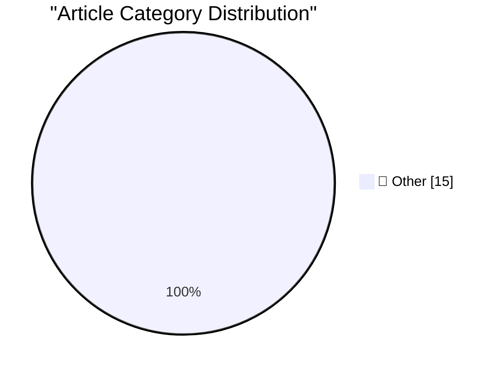

# 📰 AI Blog Daily Digest — 2026-07-09

> ⚠️ **Degraded run.** AI scoring failed for every batch — rankings and categories below are placeholder defaults, not AI-judged.

> From 92 top tech blogs (curated by Karpathy), AI-selected Top 15

## 🏆 Must Read

🥇 **Quoting Kenton Varda**

simonwillison.net · 2h ago · 📝 Other

> I just declared a moratorium against AI-written change descriptions (e.g. PR and commit messages, also issues/tickets) from my team. AI was writing change descriptions that were worse than useless to 

🥈 **sqlite-utils 4.0, now with database schema migrations**

simonwillison.net · 1 days ago · 📝 Other

> This morning I released sqlite-utils 4.0 , the 124th release of that project and the first major version bump since 3.0 in November 2020. In addition to some small but significant breaking changes (de

🥉 **sqlite-migrate 0.2**

simonwillison.net · 1 days ago · 📝 Other

> Release: sqlite-migrate 0.2 The version that retires the library, instead implementing a compatibility shim against the new sqlite-utils 4.0 dependency. Tags: sqlite-utils

---

## 📊 Data Overview

| Scanned | Articles | Range | Selected |
|:---:|:---:|:---:|:---:|
| 88/92 | 2590 → 32 | 48h | **15** |

### Category Distribution

---

## 📝 Other

### 1. Quoting Kenton Varda

[Link](https://simonwillison.net/2026/Jul/8/kenton-varda/#atom-everything) — **simonwillison.net** · 2h ago · ⭐ 15/30

> I just declared a moratorium against AI-written change descriptions (e.g. PR and commit messages, also issues/tickets) from my team. AI was writing change descriptions that were worse than useless to 

---

### 2. sqlite-utils 4.0, now with database schema migrations

[Link](https://simonwillison.net/2026/Jul/7/sqlite-utils-4/#atom-everything) — **simonwillison.net** · 1 days ago · ⭐ 15/30

> This morning I released sqlite-utils 4.0 , the 124th release of that project and the first major version bump since 3.0 in November 2020. In addition to some small but significant breaking changes (de

---

### 3. sqlite-migrate 0.2

[Link](https://simonwillison.net/2026/Jul/7/sqlite-migrate/#atom-everything) — **simonwillison.net** · 1 days ago · ⭐ 15/30

> Release: sqlite-migrate 0.2 The version that retires the library, instead implementing a compatibility shim against the new sqlite-utils 4.0 dependency. Tags: sqlite-utils

---

### 4. github-code Web Component

[Link](https://simonwillison.net/2026/Jul/7/github-code-component/#atom-everything) — **simonwillison.net** · 1 days ago · ⭐ 15/30

> Tool: github-code Web Component An experimental Web Component built using GPT-5.5 and the following prompt : let's build a Web Component for embedding code from GitHub It takes URLs like that, convert

---

### 5. sqlite-utils 4.0

[Link](https://simonwillison.net/2026/Jul/7/sqlite-utils/#atom-everything) — **simonwillison.net** · 1 days ago · ⭐ 15/30

> Release: sqlite-utils 4.0 See sqlite-utils 4.0, now with database schema migrations for details. Tags: sqlite-utils

---

### 6. sqlite-utils 4.0rc4

[Link](https://simonwillison.net/2026/Jul/7/sqlite-utils-2/#atom-everything) — **simonwillison.net** · 1 days ago · ⭐ 15/30

> Release: sqlite-utils 4.0rc4 The last RC before the 4.0 stable release. Mainly implements feedback from a detailed review by Claude Fable 5. Tags: sqlite-utils , claude-mythos-fable

---

### 7. tencent/Hy3

[Link](https://simonwillison.net/2026/Jul/6/hy3/#atom-everything) — **simonwillison.net** · 1 days ago · ⭐ 15/30

> tencent/Hy3 New Apache 2.0 licensed model from Tencent in China: Hy3 is a 295B-parameter Mixture-of-Experts (MoE) model with 21B active parameters and 3.8B MTP layer parameters, developed by the Tence

---

### 8. The Special Value Pi 4 was extremely short-lived

[Link](https://www.jeffgeerling.com/blog/2026/special-value-pi-4-extremely-short-lived/) — **jeffgeerling.com** · 8h ago · ⭐ 15/30

> The 'Special Value' Pi 4 pictured above is probably the rarest Raspberry Pi I own—even rarer than my blue special edition Pi . A Raspberry Pi reseller briefly listed a special 'value edition' Pi 4 . B

---

### 9. Blog about things you don't understand yet

[Link](https://seangoedecke.com/blog-about-things-you-dont-understand-yet/) — **seangoedecke.com** · 1 days ago · ⭐ 15/30

> Every post I publish represents at least two things I’ve learned: the thing that prompted me to write the post, and the thing I learned in the course of writing it. If I don’t learn anything new while

---

### 10. Felons, Fraudsters Flog Offensive Cybersecurity Startup

[Link](https://krebsonsecurity.com/2026/07/felons-fraudsters-flog-offensive-cybersecurity-startup/) — **krebsonsecurity.com** · 10h ago · ⭐ 15/30

> A cybersecurity startup dangling millions of dollars to acquire zero-day security vulnerabilities in popular software is run by a pair of far-right conspiracy theorists and convicted felons whose most

---

### 11. Mac Apps Can Escape From Squircle Jail If They’re Not in the Mac App Store

[Link](https://tyler.io/2026/07/05/escape-from-squircle-jail/) — **daringfireball.net** · 1h ago · ⭐ 15/30

> Tyler Hall: We all know about macOS Tahoe’s terrible app icons and how 3rd party developers have been confined to squircle jail . If you’re lucky enough to distribute an app outside the Mac App Store,

---

### 12. ‘Searching for SmarterChild’ Kickstarter

[Link](https://www.kickstarter.com/projects/smarterchild/searching-for-smarterchild-a-feature-documentary/creator) — **daringfireball.net** · 2h ago · ⭐ 15/30

> After reading my posts earlier today about ELIZA, the first “hit” chatbot from the 1960s, DF reader AP sent me a link to the Kickstarter page for Searching for SmarterChild , a project from documentar

---

### 13. My Conversation With ELIZA

[Link](https://sites.google.com/view/elizaarchaeology/try-eliza?authuser=0) — **daringfireball.net** · 4h ago · ⭐ 15/30

> I vaguely recall first trying some version of ELIZA back in the 1990s. I never found it all that impressive nor understood its stature in the AI literature. It’s better than a bunch of if/then stateme

---

### 14. The ELIZA Archaeology Project

[Link](https://findingeliza.org/) — **daringfireball.net** · 5h ago · ⭐ 15/30

> The ELIZA Archaeology Project: ELIZA is the original and highly influential chatbot that launched the genre of human-computer interactions using text-based agents. It was created at MIT in the 1960s a

---

### 15. App Icon Conventions From the Original Macintosh

[Link](https://leancrew.com/all-this/2026/07/old-icons/) — **daringfireball.net** · 7h ago · ⭐ 15/30

> Dr. Drang, in a post replete with examples of icons of popular apps from the original Macintosh, in their one-bit glory: You can see that Apple liked the idea of app icons being a tilted rectangle wit

---

*Generated on 2026-07-09 | Scanned 88 sources → Found 2590 articles → Selected 15 articles*
*Based on [Hacker News Popularity Contest 2025](https://refactoringenglish.com/tools/hn-popularity/) RSS feeds list, curated by [Andrej Karpathy](https://x.com/karpathy).*
*Created by "Understand AI".*
