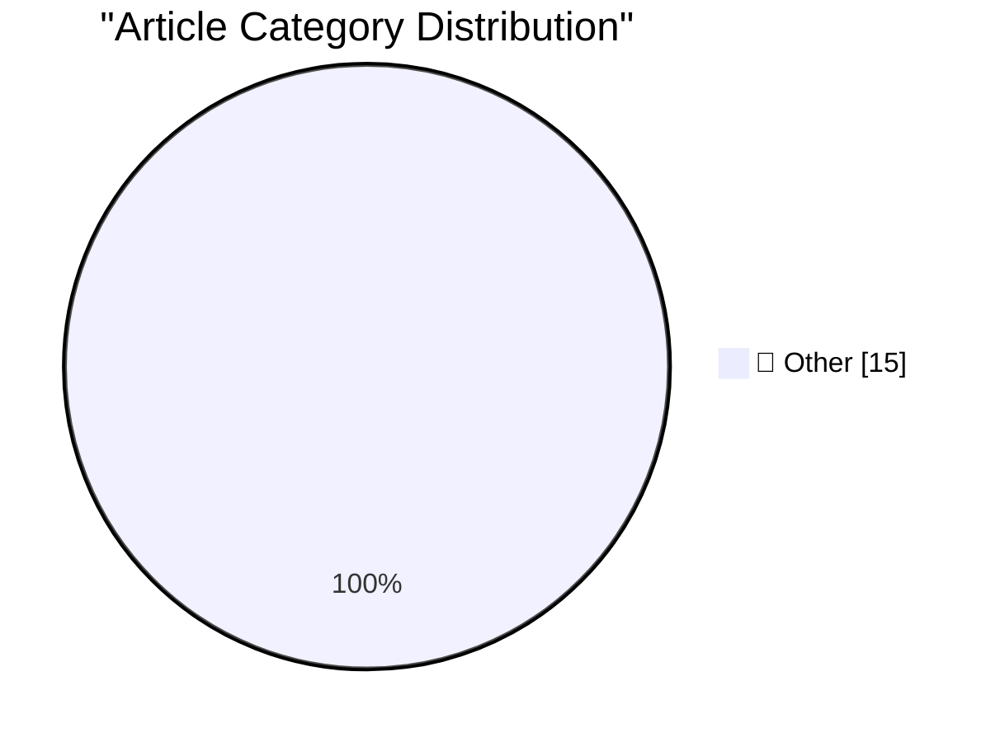

# 📰 AI Blog Daily Digest — 2026-07-10

> ⚠️ **Degraded run.** AI scoring failed for every batch — rankings and categories below are placeholder defaults, not AI-judged.

> From 92 top tech blogs (curated by Karpathy), AI-selected Top 15

## 🏆 Must Read

🥇 **The new GPT-5.6 family: Luna, Terra, Sol**

simonwillison.net · 2h ago · 📝 Other

> OpenAI's latest flagship model hit general availability this morning , and comes in three sizes: Luna, Terra, and Sol (from smallest to largest). The new models are priced per 1M input/output tokens a

🥈 **Introducing Muse Spark 1.1**

simonwillison.net · 6h ago · 📝 Other

> Introducing Muse Spark 1.1 Following Muse Spark in April , here's Muse Spark 1.1 - the first Spark model to offer an API. Meta claim significant improvements in agentic tool calling and computer use. 

🥉 **llm-meta-ai 0.1**

simonwillison.net · 6h ago · 📝 Other

> Release: llm-meta-ai 0.1 Let's LLM run prompts against the new muse-spark-1.1 model. Tags: llm , meta

---

## 📊 Data Overview

| Scanned | Articles | Range | Selected |
|:---:|:---:|:---:|:---:|
| 88/92 | 2590 → 39 | 48h | **15** |

### Category Distribution

---

## 📝 Other

### 1. The new GPT-5.6 family: Luna, Terra, Sol

[Link](https://simonwillison.net/2026/Jul/9/gpt-5-6/#atom-everything) — **simonwillison.net** · 2h ago · ⭐ 15/30

> OpenAI's latest flagship model hit general availability this morning , and comes in three sizes: Luna, Terra, and Sol (from smallest to largest). The new models are priced per 1M input/output tokens a

---

### 2. Introducing Muse Spark 1.1

[Link](https://simonwillison.net/2026/Jul/9/muse-spark-1-1/#atom-everything) — **simonwillison.net** · 6h ago · ⭐ 15/30

> Introducing Muse Spark 1.1 Following Muse Spark in April , here's Muse Spark 1.1 - the first Spark model to offer an API. Meta claim significant improvements in agentic tool calling and computer use. 

---

### 3. llm-meta-ai 0.1

[Link](https://simonwillison.net/2026/Jul/9/llm-meta-ai/#atom-everything) — **simonwillison.net** · 6h ago · ⭐ 15/30

> Release: llm-meta-ai 0.1 Let's LLM run prompts against the new muse-spark-1.1 model. Tags: llm , meta

---

### 4. llm 0.31.1

[Link](https://simonwillison.net/2026/Jul/9/llm/#atom-everything) — **simonwillison.net** · 6h ago · ⭐ 15/30

> Release: llm 0.31.1 Fix for a bug with OpenAI Chat Completion endpoints where a tool call with empty arguments could result in a JSON error from some providers. #1521 This bug came up when I was testi

---

### 5. Rewriting Bun in Rust

[Link](https://simonwillison.net/2026/Jul/8/rewriting-bun-in-rust/#atom-everything) — **simonwillison.net** · 22h ago · ⭐ 15/30

> Rewriting Bun in Rust Jarred Sumner has been promising this blog post ( since May 9th ) about his Zig to Rust rewrite of Bun for significantly longer than it took him to finish the rewrite. Honestly, 

---

### 6. Introducing GPT‑Live

[Link](https://simonwillison.net/2026/Jul/8/introducing-gptlive/#atom-everything) — **simonwillison.net** · 23h ago · ⭐ 15/30

> Introducing GPT‑Live OpenAI finally upgraded the model used by ChatGPT voice mode! I've had preview access for a few weeks in the iPhone app, and the new model is very impressive. It also has the abil

---

### 7. Today’s the Day OpenAI Fucked Up the ChatGPT Mac App

[Link](https://9to5mac.com/2026/07/09/openai-announcing-the-next-chapter-for-chatgpt-today-watch-here/) — **daringfireball.net** · 2h ago · ⭐ 15/30

> Zac Hall, writing at 9to5Mac about OpenAI’s sprawling product announcements today: To summarize today’s desktop app changes: The existing ChatGPT app is now ChatGPT Classic. Codex is now the new ChatG

---

### 8. Apple’s Classic Mac Era Forays Into ‘Apps as Tiled Buttons’ Simplified Computing: At Ease and Launcher

[Link](https://daringfireball.net/2026/07/whats_good_for_the_ios_goose_is_often_not_good_for_the_macos_gander) — **daringfireball.net** · 2h ago · ⭐ 15/30

> Some historical follow-up regarding just-click-it launching and apps as tiled buttons with a uniform square shape. Back in the System 7 era in the 1990s, Apple sold (sold!) a product called At Ease (v

---

### 9. ★ John Ternus Should Reverse Apple’s Slide Down the Advertising Slippery Slope

[Link](https://daringfireball.net/2026/07/ternus_apple_slippery_slope) — **daringfireball.net** · 3h ago · ⭐ 15/30

> What gave Tim Cook’s privacy letter heft in 2014 wasn’t just the clarity of its plain language, but the fact that you didn’t have to take his word for it that the ads Apple showed you respected your p

---

### 10. Meta Sets Default for Instagram Accounts to Permit Content Reuse by AI

[Link](https://www.nytimes.com/2026/07/08/technology/meta-instagram-ai.html?unlocked_article_code=1.wVA.Q5Do.Uvg5yPwCEB5H) — **daringfireball.net** · 8h ago · ⭐ 15/30

> Eli Tan, reporting for The New York Times (gift link): The company’s new A.I. image generator has a surprising twist: It allows people to use images from public Instagram accounts. When Meta unveiled 

---

### 11. ★ What’s Good for the iOS Goose Is Often Not Good for the MacOS Gander

[Link](https://daringfireball.net/2026/07/whats_good_for_the_ios_goose_is_often_not_good_for_the_macos_gander) — **daringfireball.net** · 20h ago · ⭐ 15/30

> App icons in MacOS are not mere buttons. You can drag them, move them, and drop things on them. You click them to select, and double-click to launch. They are richer objects that deserve a richer visu

---

### 12. ‘Parry Encounters the Doctor’ — Chatbot on Chatbot Action Circa 1973

[Link](https://www.rfc-editor.org/info/rfc439/) — **daringfireball.net** · 23h ago · ⭐ 15/30

> Back in the primordial days of AI, Parry was an ELIZA-style chatbot created by psychiatrist Kenneth Colby to simulate the words of a paranoid schizophrenic. Someone had the genius idea to connect it t

---

### 13. [Sponsor] WorkOS Pipes: More Context Makes for Smarter Products

[Link](https://workos.com/pipes?utm_source=daringfireball&amp;utm_medium=newsletter&amp;utm_campaign=q32026) — **daringfireball.net** · 1 days ago · ⭐ 15/30

> Users expect apps and agents to reach the tools they already work in. Every integration that gets you there is a different OAuth flow, a different token lifecycle, weeks of infrastructure before you w

---

### 14. And Then the Billionaire Paid Off $550 Million of Our Debts

[Link](https://idiallo.com/blog/billionaire-paid-off-550-million-dollars-of-our-debts) — **idiallo.com** · 1 days ago · ⭐ 15/30

> Imagine being worth $2 billion. Would you give away $550 million? That's a quarter of your wealth, more money than I could spend in several lifetimes. Yet that's how much Evan Spiegel, the CEO of Snap

---

### 15. Arp 90

[Link](https://maurycyz.com/astro/arp90/) — **maurycyz.com** · 1 days ago · ⭐ 15/30

> North is up (mirrored, exact). 0.53"/px [15' x 9.2' field]. FWHM = 3.9" Arp 90 is the two interacting galaxies in the east. The west of the image has a wierd distorted galaxy (?), with a similar redsh

---

*Generated on 2026-07-10 | Scanned 88 sources → Found 2590 articles → Selected 15 articles*
*Based on [Hacker News Popularity Contest 2025](https://refactoringenglish.com/tools/hn-popularity/) RSS feeds list, curated by [Andrej Karpathy](https://x.com/karpathy).*
*Created by "Understand AI".*
