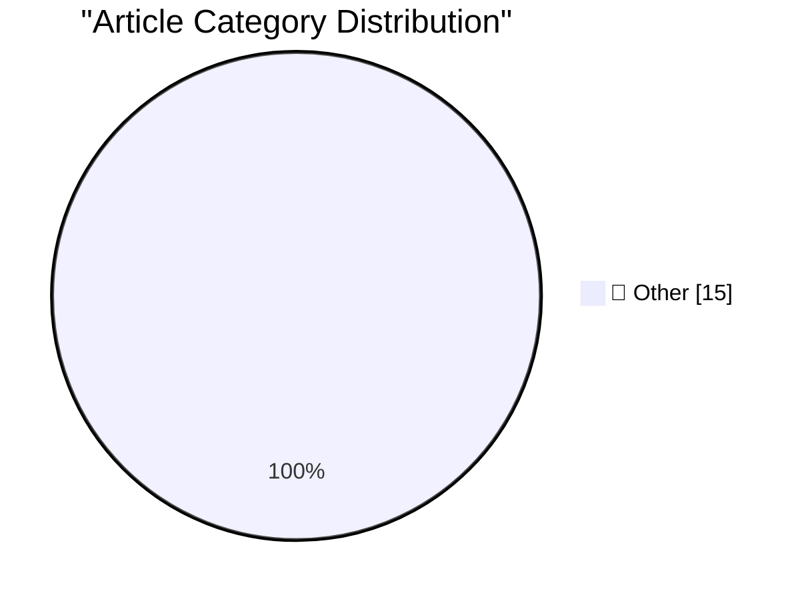

# 📰 AI Blog Daily Digest — 2026-07-11

> ⚠️ **Degraded run.** AI scoring failed for every batch — rankings and categories below are placeholder defaults, not AI-judged.

> From 92 top tech blogs (curated by Karpathy), AI-selected Top 15

## 🏆 Must Read

🥇 **Quoting Nilay Patel**

simonwillison.net · 5h ago · 📝 Other

> The reality is to make augmented reality glasses, you need to put a camera next to your eyes that is continuously recording everything you see and processing that to put information over it. There is 

🥈 **Quoting OpenAI**

simonwillison.net · 21h ago · 📝 Other

> [...] Work on web and mobile runs in the cloud. Work in the desktop app can also use local files and desktop apps with your permission. At launch, cloud Work conversations do not appear in desktop Wor

🥉 **QuadRF can spot drones and see WiFi through my wall**

jeffgeerling.com · 8h ago · 📝 Other

> The QuadRF (pictured above) a phased-array radio built around a Raspberry Pi 5 and an FPGA board with picosecond-level timing. It does advanced signal processing and beamforming. It can see WiFi throu

---

## 📊 Data Overview

| Scanned | Articles | Range | Selected |
|:---:|:---:|:---:|:---:|
| 87/92 | 2565 → 35 | 48h | **15** |

### Category Distribution

---

## 📝 Other

### 1. Quoting Nilay Patel

[Link](https://simonwillison.net/2026/Jul/10/nilay-patel/#atom-everything) — **simonwillison.net** · 5h ago · ⭐ 15/30

> The reality is to make augmented reality glasses, you need to put a camera next to your eyes that is continuously recording everything you see and processing that to put information over it. There is 

---

### 2. Quoting OpenAI

[Link](https://simonwillison.net/2026/Jul/10/openai/#atom-everything) — **simonwillison.net** · 21h ago · ⭐ 15/30

> [...] Work on web and mobile runs in the cloud. Work in the desktop app can also use local files and desktop apps with your permission. At launch, cloud Work conversations do not appear in desktop Wor

---

### 3. QuadRF can spot drones and see WiFi through my wall

[Link](https://www.jeffgeerling.com/blog/2026/quadrf-can-spot-drones-and-see-wifi-through-my-wall/) — **jeffgeerling.com** · 8h ago · ⭐ 15/30

> The QuadRF (pictured above) a phased-array radio built around a Raspberry Pi 5 and an FPGA board with picosecond-level timing. It does advanced signal processing and beamforming. It can see WiFi throu

---

### 4. Apple Sues OpenAI, io, and Former Employees, Alleging Theft of Trade Secrets

[Link](https://9to5mac.com/2026/07/10/apple-sues-openai-trade-secret-theft/) — **daringfireball.net** · 1h ago · ⭐ 15/30

> Chance Miller, 9to5Mac: The lawsuit names Chang Liu and Tang Tan as two of the defendants. Tang Tan served as VP of product design at Apple, leading iPhone and Apple Watch product design. He departed 

---

### 5. Shocking No One, Fidji Simo, Would-Be Usurper, Is Out at OpenAI

[Link](https://www.wsj.com/tech/openai-top-executive-fidji-simo-to-step-down-c3daca47?st=NfBZTe) — **daringfireball.net** · 21h ago · ⭐ 15/30

> Berber Jin and Anissa Gardizy, reporting for The Wall Street Journal (gift link): Fidji Simo, OpenAI’s No. 2 executive, plans to step down from her full-time role after an extended medical leave. She 

---

### 6. The Tadpole galaxy:

[Link](https://maurycyz.com/astro/arp188/) — **maurycyz.com** · 1 days ago · ⭐ 15/30

> North is up (exact, mirrored). 0.53 "/pixel [18.8' x 7.4'] FWHM = 4.2" This galaxy has a massive (and rather bright) tidal tail, but I can't see an obvious companion galaxy. The general consensus is t

---

### 7. Pluralistic: "Rights for robots" and the AI slavery fantasy (10 Jul 2026)

[Link](https://pluralistic.net/2026/07/10/posthuman-as-in-no-humans/) — **pluralistic.net** · 12h ago · ⭐ 15/30

> Today's links "Rights for robots" and the AI slavery fantasy: When we were robots in Egypt… Hey look at this: Delights to delectate. Object permanence: Awkward questions for the entertainment industry

---

### 8. Pluralistic: Post-political (09 Jul 2026)

[Link](https://pluralistic.net/2026/07/08/wilhoitian/) — **pluralistic.net** · 1 days ago · ⭐ 15/30

> Today's links Post-political: What a "leftist" is. Hey look at this: Delights to delectate. Object permanence: MSFT x OSCON; Parental spyware; "Resurrection Man"; Brexit do-over petition; Workplace em

---

### 9. Game Review: Lovers In A Dangerous Spacetime ★★★☆☆

[Link](https://shkspr.mobi/blog/2026/07/game-review-lovers-in-a-dangerous-spacetime/) — **shkspr.mobi** · 10h ago · ⭐ 15/30

> My new year's resolution is to play more video games with my wife. Specifically co-operative games. I hate playing competitively; it's rubbish to achieve victory at the expense of someone else. So I a

---

### 10. Cursed circuits #6: reverse avalanche oscillator

[Link](https://lcamtuf.substack.com/p/cursed-circuits-6-reverse-avalanche) — **lcamtuf.substack.com** · 1 days ago · ⭐ 15/30

> An oscillator so bad it's actually good. But seriously, it's still bad. But in a good way?

---

### 11. The console wars have been lost

[Link](https://xeiaso.net/notes/2026/console-wars-lost/) — **xeiaso.net** · 1 days ago · ⭐ 15/30

> Valve wins by doing absolutely nothing

---

### 12. The case of the mysterious changes to integers when there shouldn’t have been any code generation effect

[Link](https://devblogs.microsoft.com/oldnewthing/20260710-00/?p=112514) — **devblogs.microsoft.com/oldnewthing** · 8h ago · ⭐ 15/30

> Decoding where those integer came from. The post The case of the mysterious changes to integers when there shouldn’t have been any code generation effect appeared first on The Old New Thing .

---

### 13. I’ve decoded a #pragma detect_mismatch error and fixed the mismatch, but I still get the error

[Link](https://devblogs.microsoft.com/oldnewthing/20260709-00/?p=112512) — **devblogs.microsoft.com/oldnewthing** · 1 days ago · ⭐ 15/30

> You need to rebuild everything that was dependent on the change. The post I’ve decoded a #pragma detect_mismatch error and fixed the mismatch, but I still get the error appeared first on The Old New T

---

### 14. poppy the training box, part 1: the beginnings

[Link](https://www.gilesthomas.com/2026/07/poppy-the-training-box-1-the-beginnings) — **gilesthomas.com** · 1 days ago · ⭐ 15/30

> For a while I've been planning to put together a separate machine for local LLM training. Until now, I've been using my desktop PC, perry . I have an RTX 3090 installed, and can get useful training ru

---

### 15. Building intuition about LLM parameter counts

[Link](https://www.gilesthomas.com/2026/07/llm-parameter-counts) — **gilesthomas.com** · 1h ago · ⭐ 15/30

> When I was building my GPT-2 implementation in JAX , I started with just token embeddings for the input, and a separate output head (as I was not using weight tying ). It wasn't an LLM -- no Transform

---

*Generated on 2026-07-11 | Scanned 87 sources → Found 2565 articles → Selected 15 articles*
*Based on [Hacker News Popularity Contest 2025](https://refactoringenglish.com/tools/hn-popularity/) RSS feeds list, curated by [Andrej Karpathy](https://x.com/karpathy).*
*Created by "Understand AI".*
