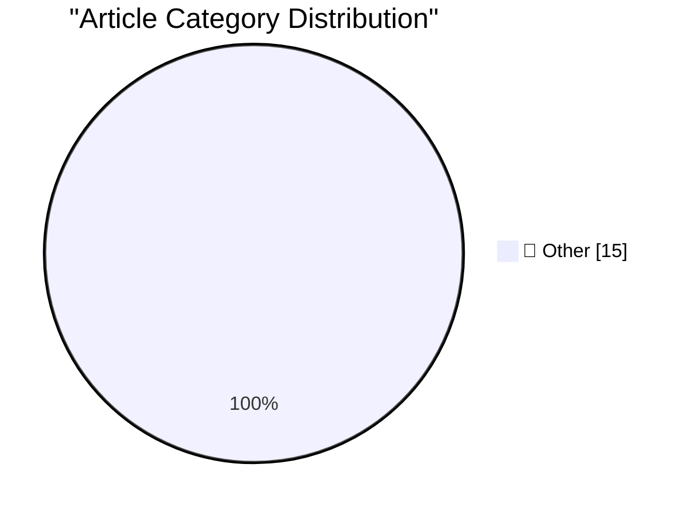

# 📰 AI Blog Daily Digest — 2026-07-12

> ⚠️ **Degraded run.** AI scoring failed for every batch — rankings and categories below are placeholder defaults, not AI-judged.

> From 92 top tech blogs (curated by Karpathy), AI-selected Top 15

## 🏆 Must Read

🥇 **In defense of not understanding your codebase**

seangoedecke.com · 22h ago · 📝 Other

> As a software engineer, how well do you have to understand your own codebase? My guess is that people who work on small codebases with low-turnover teams (say, Redis or games like The Witness ) would 

🥈 **OpenAI Help Center Describes What Is Wrong With the New ChatGPT**

daringfireball.net · 6m ago · 📝 Other

> OpenAI Help Center, “Where Work and Codex are available”: Work is available on ChatGPT web and mobile for eligible paid plans. Work is also available in the ChatGPT desktop app when included for your 

🥉 **Benedict Evans on the New ‘Super App’ ChatGPT**

daringfireball.net · 14m ago · 📝 Other

> Benedict Evans with a succinct review on Threads: Wow, what a total mess. What is the difference between a project, a task and a chat? Why did chats get a crappy floating window but tasks and projects

---

## 📊 Data Overview

| Scanned | Articles | Range | Selected |
|:---:|:---:|:---:|:---:|
| 88/92 | 2591 → 34 | 48h | **15** |

### Category Distribution

---

## 📝 Other

### 1. In defense of not understanding your codebase

[Link](https://seangoedecke.com/in-defense-of-not-understanding-your-codebase/) — **seangoedecke.com** · 22h ago · ⭐ 15/30

> As a software engineer, how well do you have to understand your own codebase? My guess is that people who work on small codebases with low-turnover teams (say, Redis or games like The Witness ) would 

---

### 2. OpenAI Help Center Describes What Is Wrong With the New ChatGPT

[Link](https://help.openai.com/en/articles/20001275-chatgpt-work-and-codex) — **daringfireball.net** · 6m ago · ⭐ 15/30

> OpenAI Help Center, “Where Work and Codex are available”: Work is available on ChatGPT web and mobile for eligible paid plans. Work is also available in the ChatGPT desktop app when included for your 

---

### 3. Benedict Evans on the New ‘Super App’ ChatGPT

[Link](https://www.threads.com/@benedictevans/post/Dano_uvDr8F) — **daringfireball.net** · 14m ago · ⭐ 15/30

> Benedict Evans with a succinct review on Threads: Wow, what a total mess. What is the difference between a project, a task and a chat? Why did chats get a crappy floating window but tasks and projects

---

### 4. ★ Exactly Like Om Malik

[Link](https://daringfireball.net/2026/07/exactly_like_om_malik) — **daringfireball.net** · 2h ago · ⭐ 15/30

> Remembrances, tributes, and stories.

---

### 5. Gurman on Tang Tan and Paul Meade

[Link](https://www.bloomberg.com/news/articles/2026-07-11/openai-engineer-s-lol-moment-set-stage-for-legal-fight-with-apple) — **daringfireball.net** · 4h ago · ⭐ 15/30

> Mark Gurman, reporting for Bloomberg (paywalled, alas): Apple was quickly alarmed by OpenAI’s recruiting drive, which included poaching senior hardware and design leaders and ravaging several teams ac

---

### 6. John Ternus Calls Sam Altman

[Link](https://www.youtube.com/watch?v=ClASuxd8jQY) — **daringfireball.net** · 18h ago · ⭐ 15/30

> “Yeah, who’s this?” “You know who this is.” “Yes I do, yes I do. I sent a guy to deliver the package ... he didn’t call. Is everything alright?” “Tell you what. Forget the money.” ★

---

### 7. ‘No Interest’

[Link](https://x.com/drewpusateri/status/2075708238650089981) — **daringfireball.net** · 18h ago · ⭐ 15/30

> Drew Pusateri, director of communications at OpenAI, on Twitter/X (or XCancel ): Our statement in response to this suit: We have no interest in other companies’ trade secrets. We remain focused on bui

---

### 8. Ice Cold

[Link](https://www.threads.com/@alexheath/post/DaoI2jaEioX) — **daringfireball.net** · 19h ago · ⭐ 15/30

> Alex Heath, on Threads: At WWDC, Apple execs I met with were ice-cold when I asked about their OpenAI partnership. Now we know why: Apple just sued OpenAI for allegedly stealing trade secrets related 

---

### 9. Ryanair Literally Sucks

[Link](https://apnews.com/article/greece-germany-ryanair-passenger-457c424f541152af1becdb387c90cfdd) — **daringfireball.net** · 19h ago · ⭐ 15/30

> The AP: Fellow passengers pulled back a man who was partially sucked out of a dislodged airplane window on Friday, a few minutes after takeoff on a flight from northern Greece to Germany. The plane su

---

### 10. Newly Renamed Trump Airport in Palm Beach Has an AI Slop Logo

[Link](https://futurism.com/artificial-intelligence/trump-airport-logo-ai) — **daringfireball.net** · 19h ago · ⭐ 15/30

> Frank Landymore, writing for Futurism: Look past its gaudiness, though, and you’ll notice some things that’re a little off in the finer details. The talons are horribly deformed and shaped differently

---

### 11. Mac OS 9’s Finder Had a ‘View as Buttons’ Mode

[Link](https://www.cryan.com/blog/20240502.jsp) — **daringfireball.net** · 20h ago · ⭐ 15/30

> Cryan.com: The “View as Buttons” option was a distinctive feature of the Macintosh OS 9 Finder. It allowed users to view the contents of a folder as clickable buttons, each representing a file or appl

---

### 12. Pluralistic: Workplace "flexibility" isn't (11 Jul 2026)

[Link](https://pluralistic.net/2026/07/11/your-risk/) — **pluralistic.net** · 13h ago · ⭐ 15/30

> Today's links Workplace "flexibility" isn't: What the gig economy calls flexibility is just risk-shifting. Hey look at this: Delights to delectate. Object permanence: "Alanya to Alanya"; ToS are the i

---

### 13. Progress on Gilbreath’s conjecture

[Link](https://www.johndcook.com/blog/2026/07/11/progress-on-gilbreaths-conjecture/) — **johndcook.com** · 1h ago · ⭐ 15/30

> Years ago I wrote about Gilbreath’s conjecture. It’s a simple conjecture; you could explain it to anyone who understands what prime numbers are. See the linked post for a description of the problem. G

---

### 14. Prefer STRICT tables in SQLite

[Link](https://evanhahn.com/prefer-strict-tables-in-sqlite/) — **evanhahn.com** · 22h ago · ⭐ 15/30

> In short: I prefer strict tables in SQLite because they avoid some datatype problems, such as putting text in number columns. SQLite has a feature that I think is underrated: strict tables . Strict ta

---

### 15. This Week in Package Management: 11 July 2026

[Link](https://nesbitt.io/2026/07/11/this-week-in-package-management.html) — **nesbitt.io** · 12h ago · ⭐ 15/30

> Releases, advisories, and articles from across the package management world

---

*Generated on 2026-07-12 | Scanned 88 sources → Found 2591 articles → Selected 15 articles*
*Based on [Hacker News Popularity Contest 2025](https://refactoringenglish.com/tools/hn-popularity/) RSS feeds list, curated by [Andrej Karpathy](https://x.com/karpathy).*
*Created by "Understand AI".*
