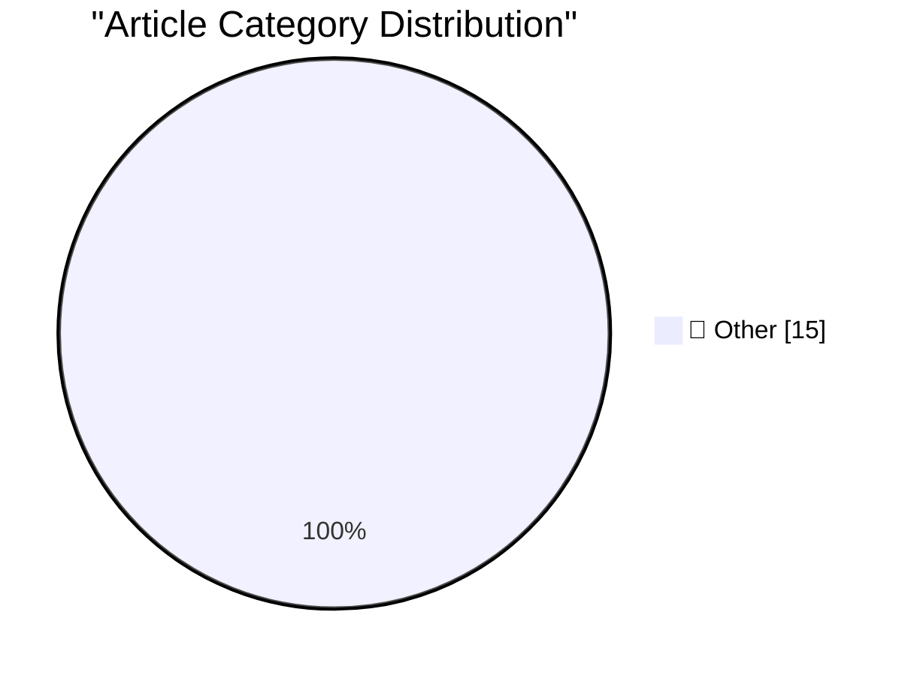

# 📰 AI Blog Daily Digest — 2026-07-14

> ⚠️ **Degraded run.** AI scoring failed for every batch — rankings and categories below are placeholder defaults, not AI-judged.

> From 92 top tech blogs (curated by Karpathy), AI-selected Top 15

## 🏆 Must Read

🥇 **datasette code-frequency chart on GitHub**

simonwillison.net · 45m ago · 📝 Other

> datasette code-frequency chart on GitHub Out of curiosity I decided to see if I could find a useful illustration of the impact of coding agents and Opus 4.5 class models on my own output. The best I'v

🥈 **Directly Responsible Individuals (DRI)**

simonwillison.net · 22h ago · 📝 Other

> Directly Responsible Individuals (DRI) I went looking for a definition of "Directly Responsible Individuals" and the best I found was in the GitLab handbook. Apparently the term originated at Apple, w

🥉 **shot-scraper 1.11**

simonwillison.net · 22h ago · 📝 Other

> Release: shot-scraper 1.11 Some minor improvements, mainly around command option consistency and making the server: mechanism used by both shot-scraper video and shot-scraper multi work if the server 

---

## 📊 Data Overview

| Scanned | Articles | Range | Selected |
|:---:|:---:|:---:|:---:|
| 88/92 | 2593 → 31 | 48h | **15** |

### Category Distribution

---

## 📝 Other

### 1. datasette code-frequency chart on GitHub

[Link](https://simonwillison.net/2026/Jul/13/datasette-code-frequency/#atom-everything) — **simonwillison.net** · 45m ago · ⭐ 15/30

> datasette code-frequency chart on GitHub Out of curiosity I decided to see if I could find a useful illustration of the impact of coding agents and Opus 4.5 class models on my own output. The best I'v

---

### 2. Directly Responsible Individuals (DRI)

[Link](https://simonwillison.net/2026/Jul/12/directly-responsible-individuals/#atom-everything) — **simonwillison.net** · 22h ago · ⭐ 15/30

> Directly Responsible Individuals (DRI) I went looking for a definition of "Directly Responsible Individuals" and the best I found was in the GitLab handbook. Apparently the term originated at Apple, w

---

### 3. shot-scraper 1.11

[Link](https://simonwillison.net/2026/Jul/12/shot-scraper/#atom-everything) — **simonwillison.net** · 22h ago · ⭐ 15/30

> Release: shot-scraper 1.11 Some minor improvements, mainly around command option consistency and making the server: mechanism used by both shot-scraper video and shot-scraper multi work if the server 

---

### 4. sqlite-utils 4.1.1

[Link](https://simonwillison.net/2026/Jul/12/sqlite-utils/#atom-everything) — **simonwillison.net** · 1 days ago · ⭐ 15/30

> Release: sqlite-utils 4.1.1 Mainly a fix for an edge case that regular Claude chat spotted while experimenting with the 4.1 release to answer a question about ON DELETE. table.transform() now raises a

---

### 5. Lessons Learned from CISA’s Recent GitHub Leak

[Link](https://krebsonsecurity.com/2026/07/lessons-learned-from-cisas-recent-github-leak/) — **krebsonsecurity.com** · 7h ago · ⭐ 15/30

> The Cybersecurity and Infrastructure Security Agency (CISA) has issued a postmortem on a data leak in which a contractor published dozens of internal CISA credentials -- including AWS Govcloud keys --

---

### 6. Remember Musk’s Suit Alleging a Conspiracy Between Apple and OpenAI?

[Link](https://arstechnica.com/tech-policy/2025/08/elon-musk-sues-apple-openai-to-block-exclusive-iphone-chatgpt-integration/) — **daringfireball.net** · 7h ago · ⭐ 15/30

> Ashley Belanger, reporting for Ars Technica back in August 2025: After a public outburst over Grok’s App Store rankings , on Monday, Elon Musk followed through on his threat to sue Apple and OpenAI. A

---

### 7. Control the ideas, not the code

[Link](http://antirez.com/news/169) — **antirez.com** · 10h ago · ⭐ 15/30

> Look at the past history of this blog. There are many blog posts about programming with AI, a few of them date back to January 2024 (like this: https://antirez.com/news/140). I’m a relatively well reg

---

### 8. Pluralistic: Why aren't AI companies competing directly with their customers? (13 Jul 2026)

[Link](https://pluralistic.net/2026/07/13/go-meta-meta/) — **pluralistic.net** · 14h ago · ⭐ 15/30

> Today's links Why aren't AI companies competing directly with their customers? Why sell picks and shovels if you've already struck gold? Hey look at this: Delights to delectate. Object permanence: Pro

---

### 9. [RSS Club] Half a million steps is about 10 marathons

[Link](https://shkspr.mobi/blog/2026/07/rss-club-half-a-million-steps-is-about-10-marathons/) — **shkspr.mobi** · 10h ago · ⭐ 15/30

> Shhh! RSS Club posts are only available to feed subscribers. Keep the secret! I'm not a big fan of the "Quantified Self" movement, but since buying a ridiculously cheap smartwatch, I've been intereste

---

### 10. Why don’t we just make the entire stack out of guard pages?

[Link](https://devblogs.microsoft.com/oldnewthing/20260713-00/?p=112528) — **devblogs.microsoft.com/oldnewthing** · 8h ago · ⭐ 15/30

> Guard pages all the way down? The post Why don’t we just make the entire stack out of guard pages? appeared first on The Old New Thing .

---

### 11. Posterior mean

[Link](https://www.johndcook.com/blog/2026/07/12/posterior-mean/) — **johndcook.com** · 1 days ago · ⭐ 15/30

> Common sense says that what you believe after seeing new data should be some sort of compromise between what you believed before and what the new data says. You don’t want to ignore previous informati

---

### 12. Mandatory Update: A Short Story

[Link](https://micahflee.com/mandatory-update-a-short-story/) — **micahflee.com** · 6h ago · ⭐ 15/30

> Guess what? Lately I&apos;ve been nerding out on creative writing. I even joined a local fiction writers group where we meet up at coffee shops. Like, in person! Anyway, I submitted a short story to t

---

### 13. I love LLMs, I hate hype

[Link](https://geohot.github.io//blog/jekyll/update/2026/07/12/i-love-llms.html) — **geohot.github.io** · 1 days ago · ⭐ 15/30

> I think from this blog you may misunderestimate how absolutely giddy I am about AI. I did hacking from 2007-2014, after that my whole career has been devoted to AI. I love the progress. I’m so excited

---

### 14. What’s an Icon in 2026?

[Link](https://blog.jim-nielsen.com/2026/icons-as-software/) — **blog.jim-nielsen.com** · 1 days ago · ⭐ 15/30

> As icons continue to change across Apple’s platforms, I have thoughts. They mainly revolve around two perspectives: What I think of icons as a long-time user of Apple’s platforms. What I think of icon

---

### 15. Code Red worm, July 13, 2001

[Link](https://dfarq.homeip.net/code-red-worm-july-13-2001/?utm_source=rss&#038;utm_medium=rss&#038;utm_campaign=code-red-worm-july-13-2001) — **dfarq.homeip.net** · 11h ago · ⭐ 15/30

> Code Red was a computer worm that exploited one of the earliest notorious Microsoft vulnerabilities, a buffer overflow in Microsoft IIS. It is credited as the first large scale mixed threat attack aga

---

*Generated on 2026-07-14 | Scanned 88 sources → Found 2593 articles → Selected 15 articles*
*Based on [Hacker News Popularity Contest 2025](https://refactoringenglish.com/tools/hn-popularity/) RSS feeds list, curated by [Andrej Karpathy](https://x.com/karpathy).*
*Created by "Understand AI".*
