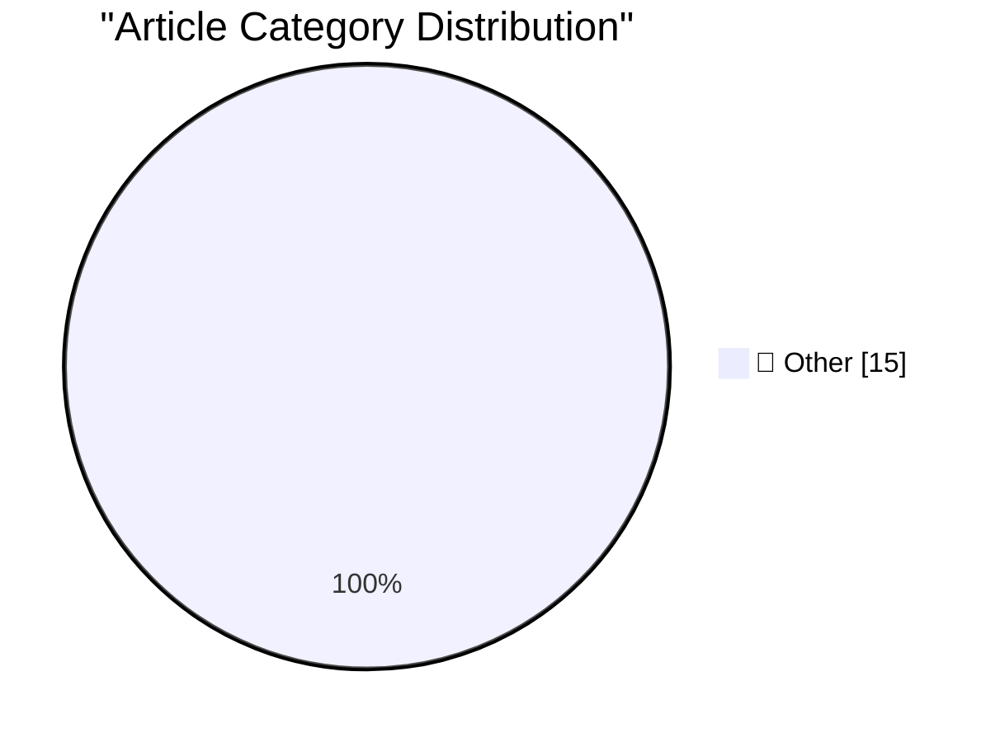

# 📰 AI Blog Daily Digest — 2026-07-15

> ⚠️ **Degraded run.** AI scoring failed for every batch — rankings and categories below are placeholder defaults, not AI-judged.

> From 92 top tech blogs (curated by Karpathy), AI-selected Top 15

## 🏆 Must Read

🥇 **simonw/pedalican-pet**

simonwillison.net · 1m ago · 📝 Other

> simonw/pedalican-pet Clearly I wasn't paying attention when these were first announced back in May, but today I accidentally activated a "pet" in Codex Desktop - a little animated robot, reminiscent o

🥈 **lobste.rs is now running on SQLite**

simonwillison.net · 2h ago · 📝 Other

> lobste.rs is now running on SQLite Community site Lobsters has been planning a migration away from MariaDB since August 2018 - originally targeting PostgreSQL, but last year they decided to investigat

🥉 **Quoting Armin Ronacher**

simonwillison.net · 4h ago · 📝 Other

> The shared language of a software project is not English or Python but it is the common understanding of what its concepts mean, where the boundaries are, which invariants matter, who owns what, and w

---

## 📊 Data Overview

| Scanned | Articles | Range | Selected |
|:---:|:---:|:---:|:---:|
| 88/92 | 2594 → 33 | 48h | **15** |

### Category Distribution

---

## 📝 Other

### 1. simonw/pedalican-pet

[Link](https://simonwillison.net/2026/Jul/14/pedalican/#atom-everything) — **simonwillison.net** · 1m ago · ⭐ 15/30

> simonw/pedalican-pet Clearly I wasn't paying attention when these were first announced back in May, but today I accidentally activated a "pet" in Codex Desktop - a little animated robot, reminiscent o

---

### 2. lobste.rs is now running on SQLite

[Link](https://simonwillison.net/2026/Jul/14/lobsters-sqlite/#atom-everything) — **simonwillison.net** · 2h ago · ⭐ 15/30

> lobste.rs is now running on SQLite Community site Lobsters has been planning a migration away from MariaDB since August 2018 - originally targeting PostgreSQL, but last year they decided to investigat

---

### 3. Quoting Armin Ronacher

[Link](https://simonwillison.net/2026/Jul/14/armin-ronacher/#atom-everything) — **simonwillison.net** · 4h ago · ⭐ 15/30

> The shared language of a software project is not English or Python but it is the common understanding of what its concepts mean, where the boundaries are, which invariants matter, who owns what, and w

---

### 4. datasette 1.0a37

[Link](https://simonwillison.net/2026/Jul/14/datasette/#atom-everything) — **simonwillison.net** · 5h ago · ⭐ 15/30

> Release: datasette 1.0a37 A minor release. Performance and documentation improvements to the permissions system, plus I reverted a cosmetic API change which caused almost every existing plugin test su

---

### 5. Using uvx in GitHub Actions in a cache-friendly way

[Link](https://simonwillison.net/2026/Jul/14/uvx-github-actions-cache/#atom-everything) — **simonwillison.net** · 21h ago · ⭐ 15/30

> TIL: Using uvx in GitHub Actions in a cache-friendly way I finally found a cache-friendly recipe for using uvx tool-name in GitHub Actions workflows that I like. The trick is setting a UV_EXCLUDE_NEWE

---

### 6. DOOMQL

[Link](https://simonwillison.net/2026/Jul/13/doomql/#atom-everything) — **simonwillison.net** · 23h ago · ⭐ 15/30

> DOOMQL Peter Gostev built this using GPT-5.6 Sol. This is a lot of fun: DOOMQL started with a deliberately unreasonable question: what if SQLite were the game engine, not merely the place where a game

---

### 7. What does "playing politics" mean for software engineers?

[Link](https://seangoedecke.com/playing-politics/) — **seangoedecke.com** · 22h ago · ⭐ 15/30

> Software engineers are often told to “start playing politics”, but most engineers have no idea what that means. Their reference point for “playing politics” comes from fiction like Game of Thrones. Ar

---

### 8. Microsoft Patches a Record 570 Security Flaws

[Link](https://krebsonsecurity.com/2026/07/microsoft-patches-a-record-570-security-flaws/) — **krebsonsecurity.com** · 3h ago · ⭐ 15/30

> Microsoft Corp. today released software updates to plug at least 570 security holes in its Windows operating systems and other software, almost triple the number of vulnerabilities the software giant 

---

### 9. [Sponsor] Paper

[Link](https://paper.design/?utm_source=df) — **daringfireball.net** · 17h ago · ⭐ 15/30

> Paper is a professional design tool where every layer is real HTML and CSS. Your design is already code, which means fewer handoffs and fewer translations between what you design and what ships. Paper

---

### 10. Pluralistic: Gerontocracy's failure mode (14 Jul 2026)

[Link](https://pluralistic.net/2026/07/14/designated-survivor/) — **pluralistic.net** · 11h ago · ⭐ 15/30

> Today's links Gerontocracy's failure mode: Where are the designated survivors? Hey look at this: Delights to delectate. Object permanence: MSFT v MP3; UK industry v schoolkids; Gary Larson v comics sh

---

### 11. I'm a USB-C Maximalist

[Link](https://shkspr.mobi/blog/2026/07/im-a-usb-c-maximalist/) — **shkspr.mobi** · 10h ago · ⭐ 15/30

> My wife and I recently went on a 7 week holiday around Europe. Although we each took a massive backpack, we wanted to travel fairly lightly. I took a single universal power brick. This little unit was

---

### 12. Pseudpocalypse

[Link](https://dynomight.net/pseudpocalypse/) — **dynomight.net** · 22h ago · ⭐ 15/30

> Here’s a conjecture: If you put any significant amount of text on the internet under different names, those identities can be linked using only the text itself.

---

### 13. Presigned URLs are technically a security vuln

[Link](https://www.tigrisdata.com/blog/presigned-urls-security-vuln/) — **xeiaso.net** · 22h ago · ⭐ 15/30

> A presigned URL is a replay attack you did on purpose. Replayable auth tokens are the textbook way to create vulnerable systems, but Tigris ships them as a first-class feature with presigned URLs and 

---

### 14. You should probably check on your smart appliances

[Link](https://xeiaso.net/notes/2026/check-your-smart-tv/) — **xeiaso.net** · 22h ago · ⭐ 15/30

> TL;DR: is your refrigerator running malware? If so, you better catch it!

---

### 15. Microspeak: Double-click and drill down

[Link](https://devblogs.microsoft.com/oldnewthing/20260714-00/?p=112532) — **devblogs.microsoft.com/oldnewthing** · 8h ago · ⭐ 15/30

> Please, tell me more. The post Microspeak: Double-click and drill down appeared first on The Old New Thing .

---

*Generated on 2026-07-15 | Scanned 88 sources → Found 2594 articles → Selected 15 articles*
*Based on [Hacker News Popularity Contest 2025](https://refactoringenglish.com/tools/hn-popularity/) RSS feeds list, curated by [Andrej Karpathy](https://x.com/karpathy).*
*Created by "Understand AI".*
