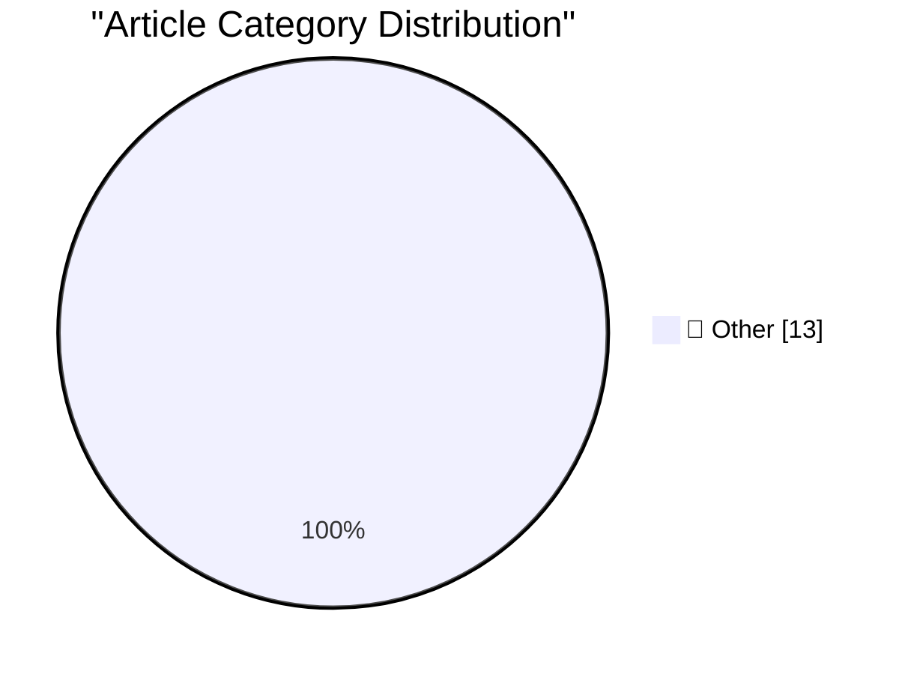

# 📰 AI Blog Daily Digest — 2026-07-16

> ⚠️ **Degraded run.** AI scoring failed for every batch — rankings and categories below are placeholder defaults, not AI-judged.

> From 92 top tech blogs (curated by Karpathy), AI-selected Top 13

## 🏆 Must Read

🥇 **How I tricked Claude into leaking your deepest, darkest secrets**

simonwillison.net · 8h ago · 📝 Other

> How I tricked Claude into leaking your deepest, darkest secrets I've been impressed by the way the Claude web_fetch tool is designed to avoid data exfiltration attacks. Ayush Paul found a hole in that

🥈 **Quoting GitHub Changelog**

simonwillison.net · 23h ago · 📝 Other

> Dependabot now waits until a new release has been available on its registry for at least three days before opening a version update pull request. This cooldown is now the default and requires no confi

🥉 **They Prefer the App**

idiallo.com · 23h ago · 📝 Other

> I like building websites. But in some circles, I might as well say that I like to drive to the forest before sunrise, chop down a tree, load it in my trunk, and gather some dry wood as well, then driv

---

## 📊 Data Overview

| Scanned | Articles | Range | Selected |
|:---:|:---:|:---:|:---:|
| 87/92 | 2570 → 28 | 48h | **13** |

### Category Distribution

---

## 📝 Other

### 1. How I tricked Claude into leaking your deepest, darkest secrets

[Link](https://simonwillison.net/2026/Jul/15/claude-web-fetch-exfiltration/#atom-everything) — **simonwillison.net** · 8h ago · ⭐ 15/30

> How I tricked Claude into leaking your deepest, darkest secrets I've been impressed by the way the Claude web_fetch tool is designed to avoid data exfiltration attacks. Ayush Paul found a hole in that

---

### 2. Quoting GitHub Changelog

[Link](https://simonwillison.net/2026/Jul/14/github-changeling/#atom-everything) — **simonwillison.net** · 23h ago · ⭐ 15/30

> Dependabot now waits until a new release has been available on its registry for at least three days before opening a version update pull request. This cooldown is now the default and requires no confi

---

### 3. They Prefer the App

[Link](https://idiallo.com/blog/they-prefer-the-app) — **idiallo.com** · 23h ago · ⭐ 15/30

> I like building websites. But in some circles, I might as well say that I like to drive to the forest before sunrise, chop down a tree, load it in my trunk, and gather some dry wood as well, then driv

---

### 4. The case of the invalid function pointer when shutting down the display control panel

[Link](https://devblogs.microsoft.com/oldnewthing/20260715-00/?p=112535) — **devblogs.microsoft.com/oldnewthing** · 8h ago · ⭐ 15/30

> Watching the bits disappear. The post The case of the invalid function pointer when shutting down the display control panel appeared first on The Old New Thing .

---

### 5. Breaking: Demis Hassabis endorses preflight safety testing for AI

[Link](https://garymarcus.substack.com/p/breaking-demis-hassabis-endorses) — **garymarcus.substack.com** · 1 days ago · ⭐ 15/30

> Good news, for once.

---

### 6. ICD-10 chapters and code letters

[Link](https://www.johndcook.com/blog/2026/07/14/icd-10-chapters-letters/) — **johndcook.com** · 1 days ago · ⭐ 15/30

> I’ve been thinking about ICD-10 codes; they come up a lot in my work. The ICD-10-CM standard is divided into 21 chapters, which generally correspond to the first letter of a code. However, a chapter m

---

### 7. I'm still alive

[Link](https://buttondown.com/hillelwayne/archive/im-still-alive/) — **buttondown.com/hillelwayne** · 1 days ago · ⭐ 15/30

> 

---

### 8. The OpenAI Bubble

[Link](https://www.wheresyoured.at/the-openai-bubble/) — **wheresyoured.at** · 5h ago · ⭐ 15/30

> Thanks for reading this week&#x2019;s free Where&#x2019;s Your Ed At newsletter. As I said last week, I&#x2019;m taking the rest of this week off, so there won&#x2019;t be a premium on Friday. That sa

---

### 9. Reasons for Escom’s bankruptcy

[Link](https://dfarq.homeip.net/reasons-for-escoms-bankruptcy/?utm_source=rss&#038;utm_medium=rss&#038;utm_campaign=reasons-for-escoms-bankruptcy) — **dfarq.homeip.net** · 11h ago · ⭐ 15/30

> On July 15, 1996, German PC manufacturer Escom declared bankruptcy. But Escom wasn’t necessarily just an ordinary PC manufacturer. Escom went bankrupt less than 2 years after acquiring the Commodore a

---

### 10. Nintendo Famicom and the secret of Nintendo’s success

[Link](https://dfarq.homeip.net/nintendo-famicom-and-the-secret-of-nintendos-success/?utm_source=rss&#038;utm_medium=rss&#038;utm_campaign=nintendo-famicom-and-the-secret-of-nintendos-success) — **dfarq.homeip.net** · 1 days ago · ⭐ 15/30

> On July 15, 1983, the Famicom, or Family Computer, launched in Japan. Despite the name, the Family Computer was a game console, and it went on to shatter the Atari 2600’s record for the most sales wor

---

### 11. Notes on the Fourier Transform

[Link](https://eli.thegreenplace.net/2026/notes-on-the-fourier-transform/) — **eli.thegreenplace.net** · 19h ago · ⭐ 15/30

> The Fourier series is a great tool for analyzing periodic functions. But what about functions that don’t repeat? We’ve seen that we can compute Fourier series for a non-periodic function defined on a 

---

### 12. Ben je van de IT of niet?

[Link](https://berthub.eu/articles/posts/ben-je-van-de-it-of-niet/) — **berthub.eu** · 12h ago · ⭐ 15/30

> Gedonder op kantoor, de WC blijft maar lopen. En erger nog, hij trekt niet meer door. Strontvervelend! In een beetje grote organisatie gaat er nu druk gebeld worden, maar met wat pech loopt dat niet s

---

### 13. Weekly Update 512: IoT Lockout Fail

[Link](https://www.troyhunt.com/weekly-update-512/) — **troyhunt.com** · 21h ago · ⭐ 15/30

> "Build a smart home", they said. "It&apos;ll make life so much better", they said. Well, life wasn&apos;t very bloody good at 23:00 the other night after travelling 33 hours from Paris only to find th

---

*Generated on 2026-07-16 | Scanned 87 sources → Found 2570 articles → Selected 13 articles*
*Based on [Hacker News Popularity Contest 2025](https://refactoringenglish.com/tools/hn-popularity/) RSS feeds list, curated by [Andrej Karpathy](https://x.com/karpathy).*
*Created by "Understand AI".*
