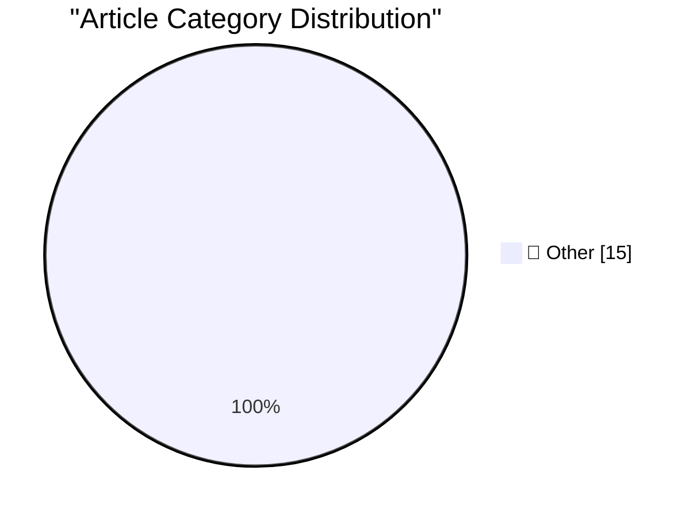

# 📰 AI Blog Daily Digest — 2026-07-20

> ⚠️ **Degraded run.** AI scoring failed for every batch — rankings and categories below are placeholder defaults, not AI-judged.

> From 92 top tech blogs (curated by Karpathy), AI-selected Top 15

## 🏆 Must Read

🥇 **AI Mania Is Eviscerating Global Decision-Making**

simonwillison.net · 17h ago · 📝 Other

> AI Mania Is Eviscerating Global Decision-Making Here's an entertaining perspective from Nik Suresh on the AI mania that is overwhelming the large companies that he consults with. It's crammed with spi

🥈 **Claude Code uses Bun written in Rust now**

simonwillison.net · 18h ago · 📝 Other

> In Rewriting Bun in Rust Jarred Sumner made the following claim: Claude Code v2.1.181 (released June 17th) and later use the Rust port of Bun. Startup got 10% faster on Linux but otherwise, barely any

🥉 **SQLite Query Explainer**

simonwillison.net · 1 days ago · 📝 Other

> Tool: SQLite Query Explainer Julia Evan's, in Learning a few things about running SQLite : Maybe one day I’ll learn to read a query plan. Big same.... which inspired me to have Fable build this intera

---

## 📊 Data Overview

| Scanned | Articles | Range | Selected |
|:---:|:---:|:---:|:---:|
| 88/92 | 2596 → 20 | 48h | **15** |

### Category Distribution

---

## 📝 Other

### 1. AI Mania Is Eviscerating Global Decision-Making

[Link](https://simonwillison.net/2026/Jul/19/ai-mania/#atom-everything) — **simonwillison.net** · 17h ago · ⭐ 15/30

> AI Mania Is Eviscerating Global Decision-Making Here's an entertaining perspective from Nik Suresh on the AI mania that is overwhelming the large companies that he consults with. It's crammed with spi

---

### 2. Claude Code uses Bun written in Rust now

[Link](https://simonwillison.net/2026/Jul/19/claude-code-in-bun-in-rust/#atom-everything) — **simonwillison.net** · 18h ago · ⭐ 15/30

> In Rewriting Bun in Rust Jarred Sumner made the following claim: Claude Code v2.1.181 (released June 17th) and later use the Rust port of Bun. Startup got 10% faster on Linux but otherwise, barely any

---

### 3. SQLite Query Explainer

[Link](https://simonwillison.net/2026/Jul/18/sqlite-query-explainer/#atom-everything) — **simonwillison.net** · 1 days ago · ⭐ 15/30

> Tool: SQLite Query Explainer Julia Evan's, in Learning a few things about running SQLite : Maybe one day I’ll learn to read a query plan. Big same.... which inspired me to have Fable build this intera

---

### 4. Claude make Fable 5 permanent

[Link](https://simonwillison.net/2026/Jul/18/claude-make-fable-5-permanent/#atom-everything) — **simonwillison.net** · 1 days ago · ⭐ 15/30

> Claude make Fable 5 permanent An update from the @claudeai account on Twitter: Beginning July 20, Claude Fable 5 will be included in all Max and Team Premium plans, at 50% of limits. Pro and Team Stan

---

### 5. nascheme/quixote

[Link](https://simonwillison.net/2026/Jul/18/quixote/#atom-everything) — **simonwillison.net** · 1 days ago · ⭐ 15/30

> nascheme/quixote A certain vintage if Python web nerd might be delighted to learn that the most recent commit to the Quixote web framework was six hours ago . The oldest commit in that repo is from 21

---

### 6. Impro is a handbook for running a cult

[Link](https://seangoedecke.com/impro/) — **seangoedecke.com** · 22h ago · ⭐ 15/30

> Here’s the big idea in Keith Johnstone’s book Impro : Children are naturally creative, but are violently formed into repressed adults by Western culture and education The process of becoming more crea

---

### 7. Overtraining as the path to human-like AI

[Link](https://seangoedecke.com/overtraining-as-the-path-to-human-like-ai/) — **seangoedecke.com** · 1 days ago · ⭐ 15/30

> The anonymous blogger Gwern recently completed a thirteen thousand word post called Human-like Neural Nets by Catapulting , in which he offers a theory about why LLMs don’t possess truly flexible huma

---

### 8. 9to5Mac Uncovers Dozens of Disguised Gambling Apps on the App Store in Brazil

[Link](https://9to5mac.com/2026/07/17/investigation-reveals-dozens-of-disguised-gambling-apps-on-the-app-store-in-brazil/) — **daringfireball.net** · 5h ago · ⭐ 15/30

> 9to5Mac: Brazilian users browsing the App Store rankings in categories such as Navigation, Travel, and Weather have noticed a growing number of poorly made games appearing among the top results, many 

---

### 9. ★ Mornings in Cupertino Have the Aroma of Napalm Once Again

[Link](https://daringfireball.net/2026/07/mornings_in_cupertino_have_the_aroma_of_napalm_once_again) — **daringfireball.net** · 21h ago · ⭐ 15/30

> I think maybe John Ternus is more of a “*Hey, what* would *Steve have done here?*” kind of guy. What would Steve Jobs do with this OpenAI situation? He’d go to war.

---

### 10. Apple Sends Letters to Dozens of Former Employees Now at OpenAI

[Link](https://www.ft.com/content/1b8c9d52-88a9-426b-ba47-f1811f859166?syn-25a6b1a6=1) — **daringfireball.net** · 23h ago · ⭐ 15/30

> Michael Acton, reporting for the Financial Times from San Francisco: About 40 former employees now working at OpenAI have been sent letters directing them to preserve documents and communications and 

---

### 11. Apple Books and Amazon Are Lousy With AI-Generated Books Ripping Off Legitimate Authors

[Link](https://thenewthings.com/p/apple-big-ai-book-slop-problem) — **daringfireball.net** · 1 days ago · ⭐ 15/30

> Joanna Stern at New Things, last month : Last month, just days after my book went on sale, AI knockoffs of the ebook version flooded Apple Books. There was Joanna Stern On I Am Not A Robot by Sophie M

---

### 12. Google Runs Out of Appeals, Must Pay Record $4.7 Billion EU Antitrust Fine

[Link](https://www.cnbc.com/2026/07/02/alphabet-google-android-eu-antitrust-fine-4-1-billion-euro-appeal.html) — **daringfireball.net** · 1 days ago · ⭐ 15/30

> Arjun Kharpal, reporting for CNBC, back on July 2: Europe’s top court on Thursday upheld Google’s fine of around 4.1 billion euros ($4.67 billion) over alleged anti-competitive practices. In 2018, the

---

### 13. Book Review: A City on Mars - by Dr. Kelly Weinersmith and Zach Weinersmith ★★★★⯪

[Link](https://shkspr.mobi/blog/2026/07/book-review-a-city-on-mars-by-dr-kelly-weinersmith-and-zach-weinersmith/) — **shkspr.mobi** · 1 days ago · ⭐ 15/30

> I'm pretty sure this book is a psyop designed to demoralise a generation of starry-eyed dreamers. It is obviously written by the same people who told us not to land on Europa. A malignant energy desig

---

### 14. Fitting a regular expression to a list of words

[Link](https://www.johndcook.com/blog/2026/07/19/fitting-a-regex/) — **johndcook.com** · 3h ago · ⭐ 15/30

> Suppose you want to search for a list of words. If you’re using grep, you can add the -f flag provide a file of regular expressions, and you can add the -F to tell it that the regular expressions are 

---

### 15. Sum of low squares

[Link](https://www.johndcook.com/blog/2026/07/19/sum-of-low-squares/) — **johndcook.com** · 5h ago · ⭐ 15/30

> Squares, high and low Let p be an odd prime number. Then half the numbers from 1 through p − 1 are squares and half are not. That is, for half of numbers 1 ≤ k < p, the equation x² = k mod p has a sol

---

*Generated on 2026-07-20 | Scanned 88 sources → Found 2596 articles → Selected 15 articles*
*Based on [Hacker News Popularity Contest 2025](https://refactoringenglish.com/tools/hn-popularity/) RSS feeds list, curated by [Andrej Karpathy](https://x.com/karpathy).*
*Created by "Understand AI".*
