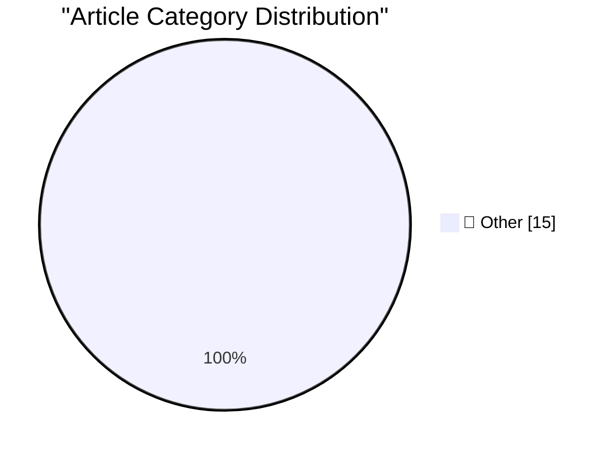

# 📰 AI Blog Daily Digest — 2026-07-21

> ⚠️ **Degraded run.** AI scoring failed for every batch — rankings and categories below are placeholder defaults, not AI-judged.

> From 92 top tech blogs (curated by Karpathy), AI-selected Top 15

## 🏆 Must Read

🥇 **Reverse-engineering is cheap now**

simonwillison.net · 3h ago · 📝 Other

> I keep hearing anecdotes from people who used coding agents to reverse-engineer and automate devices in their homes. I think this is an interesting illustration of the impact of the reduced cost of wr

🥈 **Who’s Afraid of Chinese Models?**

simonwillison.net · 5h ago · 📝 Other

> Who’s Afraid of Chinese Models? Interesting proposal from Ben Thompson that both addresses the hypocrisy of labs outlawing distillation against their models despite training on unlicensed data, and co

🥉 **Quoting Sam Altman**

simonwillison.net · 18h ago · 📝 Other

> We have been having extensive discussions around open source strategy. We will discuss it more at our next board meeting, but one thing we’d like to do soon is to create a language model with the appr

---

## 📊 Data Overview

| Scanned | Articles | Range | Selected |
|:---:|:---:|:---:|:---:|
| 88/92 | 2598 → 25 | 48h | **15** |

### Category Distribution

---

## 📝 Other

### 1. Reverse-engineering is cheap now

[Link](https://simonwillison.net/2026/Jul/20/cheap-reverse-engineering/#atom-everything) — **simonwillison.net** · 3h ago · ⭐ 15/30

> I keep hearing anecdotes from people who used coding agents to reverse-engineer and automate devices in their homes. I think this is an interesting illustration of the impact of the reduced cost of wr

---

### 2. Who’s Afraid of Chinese Models?

[Link](https://simonwillison.net/2026/Jul/20/afraid-of-chinese-models/#atom-everything) — **simonwillison.net** · 5h ago · ⭐ 15/30

> Who’s Afraid of Chinese Models? Interesting proposal from Ben Thompson that both addresses the hypocrisy of labs outlawing distillation against their models despite training on unlicensed data, and co

---

### 3. Quoting Sam Altman

[Link](https://simonwillison.net/2026/Jul/20/sam-altman/#atom-everything) — **simonwillison.net** · 18h ago · ⭐ 15/30

> We have been having extensive discussions around open source strategy. We will discuss it more at our next board meeting, but one thing we’d like to do soon is to create a language model with the appr

---

### 4. ‘Who’s Afraid of Chinese Models?’

[Link](https://stratechery.com/2026/whos-afraid-of-chinese-models/) — **daringfireball.net** · 6h ago · ⭐ 15/30

> Ben Thompson, on the hype regarding Kimi K3, at Stratechery: This is a point that bears repeating: because U.S. open weight model makers must follow the frontier labs’ terms of service, they (1) are w

---

### 5. Public Transport - Don't Make Me Think!

[Link](https://shkspr.mobi/blog/2026/07/public-transport-dont-make-me-think/) — **shkspr.mobi** · 10h ago · ⭐ 15/30

> In the last year, I've been through over a dozen cities and used public transport in all of them. It is wild just how confusing and complex buying a ticket can be. While some cities obviously take a u

---

### 6. My falling-out with the rationalist community

[Link](https://lcamtuf.substack.com/p/my-falling-out-with-the-rationalist) — **lcamtuf.substack.com** · 1h ago · ⭐ 15/30

> This is an article I resisted writing for a long time.

---

### 7. Making an agile version of a Windows Runtime delegate in C++/WinRT, part 1

[Link](https://devblogs.microsoft.com/oldnewthing/20260720-00/?p=112545) — **devblogs.microsoft.com/oldnewthing** · 8h ago · ⭐ 15/30

> The easy case is easy. The post Making an agile version of a Windows Runtime delegate in C++/WinRT, part 1 appeared first on The Old New Thing .

---

### 8. China has all but caught up. The US is not going to “win” the AI war. Here’s what we should do instead.

[Link](https://garymarcus.substack.com/p/china-has-all-but-caught-up-the-us) — **garymarcus.substack.com** · 5h ago · ⭐ 15/30

> Seven options, considered

---

### 9. Volume to Area ratio for Regular Solids

[Link](https://www.johndcook.com/blog/2026/07/20/volume-area-regular-solids/) — **johndcook.com** · 7h ago · ⭐ 15/30

> The volume of a sphere of radius r is V = 4πr³ / 3 and the surface area is A = 4πr² and so the ratio of volume to area is V / A = r / 3. Surprisingly, the same ratio holds for all regular solids if r 

---

### 10. Solving a chess puzzle with Grok 4.5

[Link](https://www.johndcook.com/blog/2026/07/20/grok-chess/) — **johndcook.com** · 7h ago · ⭐ 15/30

> I’ve written several posts about using Claude or ChatGPT to generate Prolog or Lean code to solve a chess puzzle. I didn’t think Grok would be up to the task, though I didn’t try it. I’ve heard good t

---

### 11. Memory Safety's Hardest Problem

[Link](https://matklad.github.io/2026/07/20/memory-safety-hardest-problem.html) — **matklad.github.io** · 22h ago · ⭐ 15/30

> Uplifting a lobsters comment for easier reference.

---

### 12. The MCI Worldcom merger, bankruptcy, and scandal

[Link](https://dfarq.homeip.net/the-mci-worldcom-merger-bankruptcy-and-scandal/?utm_source=rss&#038;utm_medium=rss&#038;utm_campaign=the-mci-worldcom-merger-bankruptcy-and-scandal) — **dfarq.homeip.net** · 11h ago · ⭐ 15/30

> On November 4th, 1997, MCI and Worldcom merged in a deal worth $37 billion. This was an attempt by two large telecommunications companies to to combine and rival AT&T, but instead it turned into one o

---

### 13. OpenTK: nu ook met Internetconsultaties & notificaties

[Link](https://berthub.eu/articles/posts/opentk-internetconsultaties/) — **berthub.eu** · 10h ago · ⭐ 15/30

> Sinds 2024 run ik OpenTK, met als doel zo goed mogelijk te laten zien wat er in de Tweede Kamer allemaal gebeurt. En, om daar ook nuttige email-notificaties over te versturen. OpenTK is begonnen omdat

---

### 14. I added a blogroll

[Link](https://matduggan.com/i-added-a-blogroll/) — **matduggan.com** · 11h ago · ⭐ 15/30

> I realized that it might be nice if you happen to stumble on this website if I had a way to recommend other websites you might enjoy. As it turns out this is a "blogroll", a concept I have never heard

---

### 15. Why I Stopped "Creating Content"

[Link](https://refactoringenglish.com/blog/why-i-stopped-creating-content/) — **refactoringenglish.com** · 22h ago · ⭐ 15/30

> The first time I saw Michelangelo&rsquo;s David in person, I wept. Never in my life have I witnessed a more beautiful piece of content. I wasn&rsquo;t the only one who felt that way. Museum patrons al

---

*Generated on 2026-07-21 | Scanned 88 sources → Found 2598 articles → Selected 15 articles*
*Based on [Hacker News Popularity Contest 2025](https://refactoringenglish.com/tools/hn-popularity/) RSS feeds list, curated by [Andrej Karpathy](https://x.com/karpathy).*
*Created by "Understand AI".*
