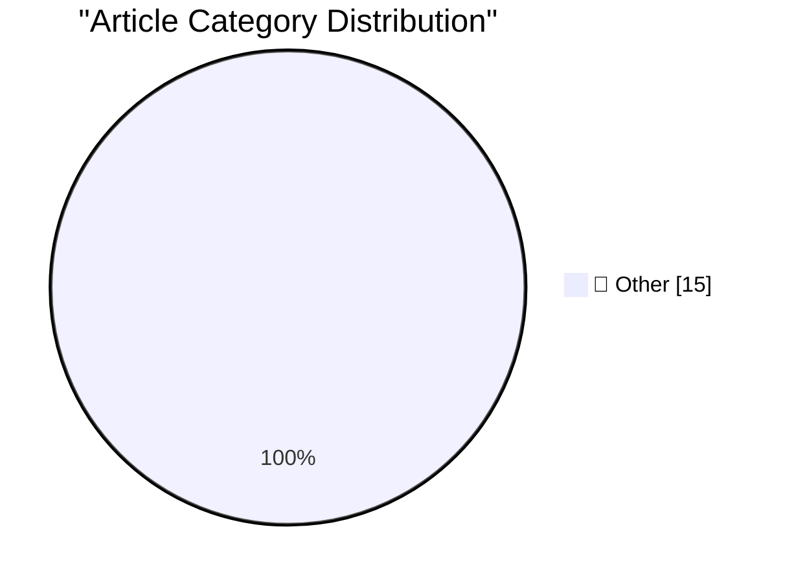

# 📰 AI Blog Daily Digest — 2026-07-22

> ⚠️ **Degraded run.** AI scoring failed for every batch — rankings and categories below are placeholder defaults, not AI-judged.

> From 92 top tech blogs (curated by Karpathy), AI-selected Top 15

## 🏆 Must Read

🥇 **Nativ: Run AI models locally on your Mac**

simonwillison.net · 8h ago · 📝 Other

> Nativ: Run AI models locally on your Mac Prince Canuma is the developer behind the excellent MLX-VLM Python library for running vision-LLMs using MLX on a Mac. I'm really excited about his new project

🥈 **A Fireside Chat with Cat and Thariq from the Claude Code team**

simonwillison.net · 9h ago · 📝 Other

> Earlier this month I hosted a fireside chat session at the AI Engineer World's Fair with Cat Wu and Thariq Shihipar from Anthropic's Claude Code team. We talked about Claude Code, Claude Tag, Fable, c

🥉 **[Sponsor] WorkOS MCP: Manage Your Auth Platform From Any AI Agent**

daringfireball.net · 23h ago · 📝 Other

> Debugging SSO, managing users, adjusting auth policies, configuring branding: every configuration task has lived behind a UI that only a human can drive. The WorkOS MCP server gives agents the same ac

---

## 📊 Data Overview

| Scanned | Articles | Range | Selected |
|:---:|:---:|:---:|:---:|
| 88/92 | 2600 → 31 | 48h | **15** |

### Category Distribution

---

## 📝 Other

### 1. Nativ: Run AI models locally on your Mac

[Link](https://simonwillison.net/2026/Jul/21/nativ/#atom-everything) — **simonwillison.net** · 8h ago · ⭐ 15/30

> Nativ: Run AI models locally on your Mac Prince Canuma is the developer behind the excellent MLX-VLM Python library for running vision-LLMs using MLX on a Mac. I'm really excited about his new project

---

### 2. A Fireside Chat with Cat and Thariq from the Claude Code team

[Link](https://simonwillison.net/2026/Jul/21/cat-and-thariq/#atom-everything) — **simonwillison.net** · 9h ago · ⭐ 15/30

> Earlier this month I hosted a fireside chat session at the AI Engineer World's Fair with Cat Wu and Thariq Shihipar from Anthropic's Claude Code team. We talked about Claude Code, Claude Tag, Fable, c

---

### 3. [Sponsor] WorkOS MCP: Manage Your Auth Platform From Any AI Agent

[Link](https://workos.com/blog/management-mcp-server?utm_source=daringfireball&amp;utm_medium=newsletter&amp;utm_campaign=q32026) — **daringfireball.net** · 23h ago · ⭐ 15/30

> Debugging SSO, managing users, adjusting auth policies, configuring branding: every configuration task has lived behind a UI that only a human can drive. The WorkOS MCP server gives agents the same ac

---

### 4. Expensive Is Just a Brand Now

[Link](https://idiallo.com/blog/expensive-is-just-branding) — **idiallo.com** · 23h ago · ⭐ 15/30

> You've probably heard this one before. It might have come from a parent, a teacher, or a friend who bought an expensive item and wanted to justify it. It goes something like this: A poor man buys a ch

---

### 5. Pluralistic: Dealing with dickovers (21 Jul 2026) dickovers

[Link](https://pluralistic.net/2026/07/21/dickovers/) — **pluralistic.net** · 13h ago · ⭐ 15/30

> Today's links Dealing with dickovers: The web is an open platform, and that matters. Hey look at this: Delights to delectate. Object permanence: Broadcast's bad week; Congress v wifi; EFF v DRM law; S

---

### 6. Making an agile version of a Windows Runtime delegate in C++/WinRT, part 2

[Link](https://devblogs.microsoft.com/oldnewthing/20260721-00/?p=112550) — **devblogs.microsoft.com/oldnewthing** · 8h ago · ⭐ 15/30

> Short-circuiting the easiest case. The post Making an agile version of a Windows Runtime delegate in C++/WinRT, part 2 appeared first on The Old New Thing .

---

### 7. Forensic accounting in Python

[Link](https://www.johndcook.com/blog/2026/07/21/forensic-accounting-in-python/) — **johndcook.com** · 7h ago · ⭐ 15/30

> I recently had a project in which I had to reverse engineer a data analysis. There was some ambiguity regarding which of several possibilities someone chose for several of the variables, something ana

---

### 8. Locally everywhere does not imply everywhere

[Link](https://www.johndcook.com/blog/2026/07/21/jacobian-conjecture/) — **johndcook.com** · 10h ago · ⭐ 15/30

> A couple days ago, Levent Alpöge, a mathematician working at Anthropic, discovered a counterexample to the Jacobian conjecture using Claude Fable 5. I was curious whether most mathematicians were tryi

---

### 9. –end-of-options

[Link](https://nesbitt.io/2026/07/21/end-of-options.html) — **nesbitt.io** · 12h ago · ⭐ 15/30

> The git flag I assumed was an LLM hallucination

---

### 10. Kuiper Q-Q plot: are these the same?

[Link](https://entropicthoughts.com/kuiper-q-q-plot) — **entropicthoughts.com** · 1 days ago · ⭐ 15/30

> When we tried to get an intuition for the differences in distribution functions, we learned that children subjected to a treatment had greater variation in their score than the reference group. (Conti

---

### 11. The First Microsoft Product

[Link](https://dfarq.homeip.net/the-first-microsoft-product/?utm_source=rss&#038;utm_medium=rss&#038;utm_campaign=the-first-microsoft-product) — **dfarq.homeip.net** · 11h ago · ⭐ 15/30

> On January 2, 1975, Microsoft announced Altair Basic, their first product. It was a programming language for the MITS Altair 8800 computer, a product that let people write their own software for the n

---

### 12. Kan een Amerikaans bedrijf met encryptie de Amerikaanse overheid buiten de deur houden?

[Link](https://berthub.eu/articles/posts/kan-een-amerikaans-bedrijf-zo-versleutelen-dat-amerikanen-er-niet-bijkunnen/) — **berthub.eu** · 9h ago · ⭐ 15/30

> Het is inmiddels duidelijk dat zelfs maar deels Amerikaanse bedrijven met allerhande middelen gedwongen kunnen worden om onze data te overhandigen aan de Amerikaanse overheid. Ook kan de dienstverleni

---

### 13. For a Business, Should Making (Extra) Money Be Incidental?

[Link](https://simone.org/business-money-incidental/) — **simone.org** · 9h ago · ⭐ 15/30

> Humans are desire-driven machines: a business should help dissipate desires by satisfying them without exploiting you.

---

### 14. 10 REM"_(C2SLFF4

[Link](http://beej.us/blog/data/mystery-comment/) — **beej.us** · 22h ago · ⭐ 15/30

> Wherein we chase down a BASIC retrocomputing question that&#x27;s bugged me for far too long.

---

### 15. Weekly Update 513: Clauding The Home Network

[Link](https://www.troyhunt.com/weekly-update-513/) — **troyhunt.com** · 15h ago · ⭐ 15/30

> I reckon this week&apos;s video on how Claude is tying together info from UniFi, Home Assistant and the Pi-Hole is an absolute ripper. Or at least the concept is - if ever there was an actual value pr

---

*Generated on 2026-07-22 | Scanned 88 sources → Found 2600 articles → Selected 15 articles*
*Based on [Hacker News Popularity Contest 2025](https://refactoringenglish.com/tools/hn-popularity/) RSS feeds list, curated by [Andrej Karpathy](https://x.com/karpathy).*
*Created by "Understand AI".*
