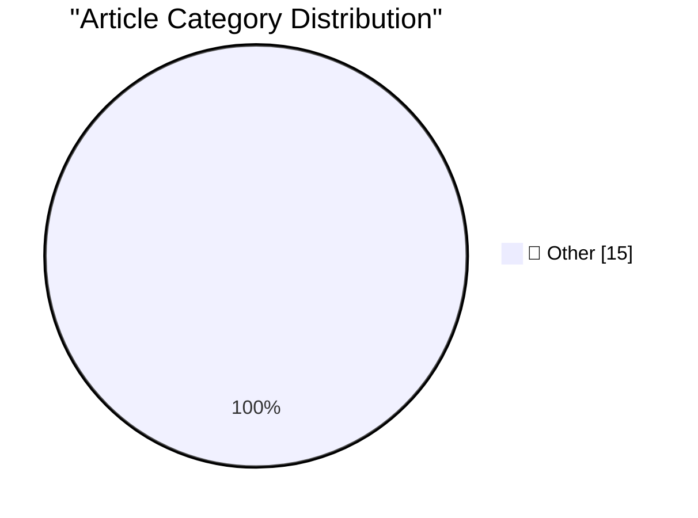

# 📰 AI Blog Daily Digest — 2026-07-28

> ⚠️ **Degraded run.** AI scoring failed for every batch — rankings and categories below are placeholder defaults, not AI-judged.

> From 92 top tech blogs (curated by Karpathy), AI-selected Top 15

## 🏆 Must Read

🥇 **An opinionated guide to which AI to use to do stuff**

simonwillison.net · 35m ago · 📝 Other

> An opinionated guide to which AI to use to do stuff It's interesting watching the evolution of Ethan Mollick's guide over time. A year ago it was still all about chat - ChatGPT, Claude, Gemini - with 

🥈 **An Inside Look at the Relay Market Powering Token Resellers and Fraud**

simonwillison.net · 1 days ago · 📝 Other

> An Inside Look at the Relay Market Powering Token Resellers and Fraud Fascinating investigation by Matt Lenhard into the market that has grown up around reselling LLM tokens at a discount by pooling A

🥉 **Ruff v0.16.0**

simonwillison.net · 1 days ago · 📝 Other

> Ruff v0.16.0 Astral shipped a significant new version of their Ruff Python linting tool a few days ago on July 23rd. I noticed today because my various CI jobs all started failing thanks to new defaul

---

## 📊 Data Overview

| Scanned | Articles | Range | Selected |
|:---:|:---:|:---:|:---:|
| 88/92 | 2607 → 20 | 48h | **15** |

### Category Distribution

---

## 📝 Other

### 1. An opinionated guide to which AI to use to do stuff

[Link](https://simonwillison.net/2026/Jul/27/an-opinionated-guide-to-which-ai-to-use-to-do-stuff/#atom-everything) — **simonwillison.net** · 35m ago · ⭐ 15/30

> An opinionated guide to which AI to use to do stuff It's interesting watching the evolution of Ethan Mollick's guide over time. A year ago it was still all about chat - ChatGPT, Claude, Gemini - with 

---

### 2. An Inside Look at the Relay Market Powering Token Resellers and Fraud

[Link](https://simonwillison.net/2026/Jul/26/relay-market/#atom-everything) — **simonwillison.net** · 1 days ago · ⭐ 15/30

> An Inside Look at the Relay Market Powering Token Resellers and Fraud Fascinating investigation by Matt Lenhard into the market that has grown up around reselling LLM tokens at a discount by pooling A

---

### 3. Ruff v0.16.0

[Link](https://simonwillison.net/2026/Jul/25/ruff/#atom-everything) — **simonwillison.net** · 1 days ago · ⭐ 15/30

> Ruff v0.16.0 Astral shipped a significant new version of their Ruff Python linting tool a few days ago on July 23rd. I noticed today because my various CI jobs all started failing thanks to new defaul

---

### 4. ★ Ads in Software Are Like Stickers on Laptops

[Link](https://daringfireball.net/2026/07/ads_in_software_are_like_stickers_on_laptops) — **daringfireball.net** · 5h ago · ⭐ 15/30

> Putting themselves in customers’ shoes today, how many ads do Apple’s executives want stuck in the results when they search for an app in the App Store?

---

### 5. Why $550 Million Medical Debt only Cost $5.5 Million

[Link](https://idiallo.com/byte-size/550-million-only-cost-5-million) — **idiallo.com** · 1 days ago · ⭐ 15/30

> A couple weeks ago, the CEO of Snap was all over the news in the US because he and his wife made a large donation. The weird part about it was that every news outlet that covered it had an acrobatic t

---

### 6. Pluralistic: How the EU can punish Google (despite Trump) (27 Jul 2026)

[Link](https://pluralistic.net/2026/07/27/eucd-6/) — **pluralistic.net** · 11h ago · ⭐ 15/30

> Today's links How the EU can punish Google (despite Trump): Grant me the courage to change the things I can. Hey look at this: Delights to delectate. Object permanence: Chilling Effects; Billy Bragg v

---

### 7. Book Review: Dungeon Crawler Carl by Matt Dinniman ★★⯪☆☆

[Link](https://shkspr.mobi/blog/2026/07/book-review-dungeon-crawler-carl-by-matt-dinniman/) — **shkspr.mobi** · 1 days ago · ⭐ 15/30

> To call this derivative is an understatement. But that's what this genre demands; rehash all your favourite media properties into something new. It's the literary equivalent of having your Transformer

---

### 8. Making an agile version of a Windows Runtime delegate in C++/WinRT, part 6

[Link](https://devblogs.microsoft.com/oldnewthing/20260727-00/?p=112566) — **devblogs.microsoft.com/oldnewthing** · 8h ago · ⭐ 15/30

> Exception-safety, the invisible bug. The post Making an agile version of a Windows Runtime delegate in C++/WinRT, part 6 appeared first on The Old New Thing .

---

### 9. Circular financing ain’t what it used to be

[Link](https://garymarcus.substack.com/p/circular-financing-aint-what-it-used) — **garymarcus.substack.com** · 7h ago · ⭐ 15/30

> Nvidia is falling. The mood has changed.

---

### 10. Counting permutations with roots

[Link](https://www.johndcook.com/blog/2026/07/27/counting-permutations-with-roots/) — **johndcook.com** · 6h ago · ⭐ 15/30

> My post from yesterday on permutation roots ends with a Mathematica code for finding the probability that a permutation of n elements has a kth root. This is done by finding the coefficient of xn in t

---

### 11. Printing floating point numbers in binary

[Link](https://www.johndcook.com/blog/2026/07/27/float-binary/) — **johndcook.com** · 6h ago · ⭐ 15/30

> It’s well known that you can convert the base 16 (hex) representation of an integer to the base 2 (binary) representation by simply converting each digit from hex to binary. For example, CAFEhex = 110

---

### 12. Permutation roots

[Link](https://www.johndcook.com/blog/2026/07/26/permutation-roots/) — **johndcook.com** · 1 days ago · ⭐ 15/30

> Let σ be a permutation on n elements. If there is a permutation τ such that applying τ twice has the same effect on the list of elements as applying σ once, we say σ = τ² and τ is a square root of σ. 

---

### 13. exp_q

[Link](https://www.johndcook.com/blog/2026/07/26/exp-q/) — **johndcook.com** · 1 days ago · ⭐ 15/30

> The function expq(x) is defined by taking the power series for exp(x) and keeping only the terms whose index is a multiple of q. For example, exp2(x) keeps only the even-numbered terms in the exponent

---

### 14. Fa Fa

[Link](https://feed.tedium.co/link/15204/17388904/facebook-home-row-keyboard-trick) — **tedium.co** · 4h ago · ⭐ 15/30

> My brain-breaking trick for weaning off of Facebook involved creating a fake URL for Google News. Blame the home row.

---

### 15. Digital circuit simulator in Haskell (SICP 3.3)

[Link](https://entropicthoughts.com/sicp-3-3-digital-circuit-simulator-in-haskell) — **entropicthoughts.com** · 1 days ago · ⭐ 15/30

> I have a copy of SICP, or as it is also known, The Wizard Book . This book is widely praised, but I can&rsquo;t take the time to work my way through all of it. Instead, I&rsquo;m going to occasionally

---

*Generated on 2026-07-28 | Scanned 88 sources → Found 2607 articles → Selected 15 articles*
*Based on [Hacker News Popularity Contest 2025](https://refactoringenglish.com/tools/hn-popularity/) RSS feeds list, curated by [Andrej Karpathy](https://x.com/karpathy).*
*Created by "Understand AI".*
