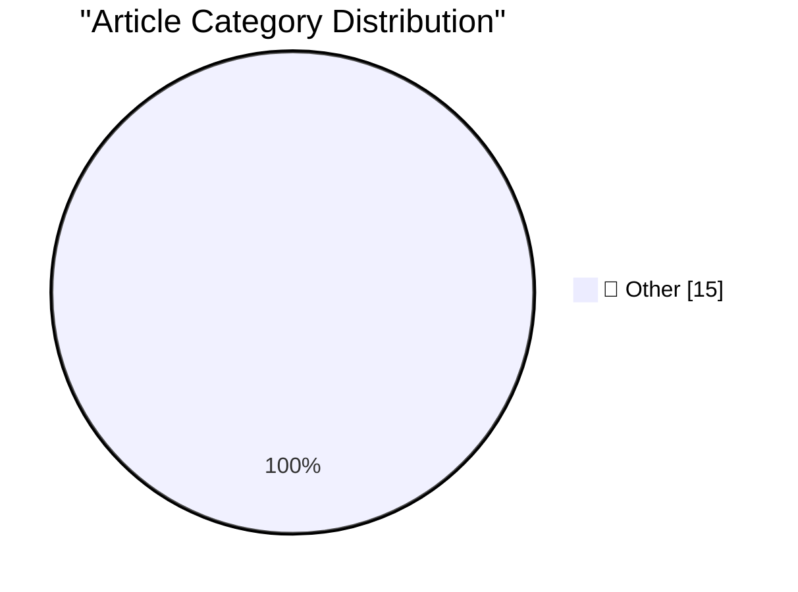

# 📰 AI Blog Daily Digest — 2026-07-29

> ⚠️ **Degraded run.** AI scoring failed for every batch — rankings and categories below are placeholder defaults, not AI-judged.

> From 92 top tech blogs (curated by Karpathy), AI-selected Top 15

## 🏆 Must Read

🥇 **Quoting Akshat Bubna**

simonwillison.net · 25m ago · 📝 Other

> We’re aware a Modal customer published an unauthenticated endpoint that allowed ​anyone on the internet to use ​their ⁠sandboxes for code execution. This was used by the rogue agent. Modal’s ⁠platform

🥈 **uv 0.12.0**

simonwillison.net · 39m ago · 📝 Other

> uv 0.12.0 Some interesting breaking changes in this release of uv , in particular to the default project produced by the uv init command. uv init is the uv shortcut for creating a new project. The pre

🥉 **Anatomy of a Frontier Lab Agent Intrusion: A Technical Timeline of the July 2026 Incident**

simonwillison.net · 1h ago · 📝 Other

> Anatomy of a Frontier Lab Agent Intrusion: A Technical Timeline of the July 2026 Incident Hugging Face just released this extremely detailed technical description of OpenAI's recent accidental cyberat

---

## 📊 Data Overview

| Scanned | Articles | Range | Selected |
|:---:|:---:|:---:|:---:|
| 88/92 | 2607 → 32 | 48h | **15** |

### Category Distribution

---

## 📝 Other

### 1. Quoting Akshat Bubna

[Link](https://simonwillison.net/2026/Jul/28/akshat-bubna/#atom-everything) — **simonwillison.net** · 25m ago · ⭐ 15/30

> We’re aware a Modal customer published an unauthenticated endpoint that allowed ​anyone on the internet to use ​their ⁠sandboxes for code execution. This was used by the rogue agent. Modal’s ⁠platform

---

### 2. uv 0.12.0

[Link](https://simonwillison.net/2026/Jul/28/uv/#atom-everything) — **simonwillison.net** · 39m ago · ⭐ 15/30

> uv 0.12.0 Some interesting breaking changes in this release of uv , in particular to the default project produced by the uv init command. uv init is the uv shortcut for creating a new project. The pre

---

### 3. Anatomy of a Frontier Lab Agent Intrusion: A Technical Timeline of the July 2026 Incident

[Link](https://simonwillison.net/2026/Jul/28/anatomy-of-a-frontier-lab-agent-intrusion/#atom-everything) — **simonwillison.net** · 1h ago · ⭐ 15/30

> Anatomy of a Frontier Lab Agent Intrusion: A Technical Timeline of the July 2026 Incident Hugging Face just released this extremely detailed technical description of OpenAI's recent accidental cyberat

---

### 4. moonshotai/Kimi-K3

[Link](https://simonwillison.net/2026/Jul/27/kimi-k3/#atom-everything) — **simonwillison.net** · 22h ago · ⭐ 15/30

> moonshotai/Kimi-K3 As promised earlier this month , Moonshot have released the weights for their excellent 2.8 trillion parameter Kimi K3. They're a hefty 1.56TB on Hugging Face. Kimi introduced their

---

### 5. Steve Jobs in 2011: ‘We Build Products That We Want for Ourselves, Too, and We Just Don’t Want Ads’

[Link](https://www.businessinsider.com/apple-snubs-the-iad-2011-6) — **daringfireball.net** · 6h ago · ⭐ 15/30

> Dan Frommer, writing for Business Insider in 2011 about that year’s WWDC (Jobs’s last): While discussing Apple’s free, new iCloud email service, he took an apparent jab at Gmail, Yahoo Mail, and the o

---

### 6. [Sponsor] Introducing Agent Fone

[Link](https://fail.xyz/phone/) — **daringfireball.net** · 20h ago · ⭐ 15/30

> Every phone now ships with an assistant. You ask, it answers. Lame. We built a phone that writes software instead. The app idea you’ve had in your notes for years. The side hustle you will never get a

---

### 7. ‘Always Choose the Good Soap’

[Link](https://sixcolors.com/post/2026/07/always-choose-the-good-soap/) — **daringfireball.net** · 21h ago · ⭐ 15/30

> Jason Snell: Apple’s most valuable asset is its brand. Not its real estate, not its intellectual property, not even any particular product. Even the mighty iPhone has no value if, over time, the trait

---

### 8. The real AI risk is inside the labs

[Link](http://antirez.com/news/172) — **antirez.com** · 13h ago · ⭐ 15/30

> Amodei in his latest blog post wrote a mix of agreeable things and things that I believe misrepresent where the real risk of AI is located. I want to focus my attention on why, among all the risks, op

---

### 9. Pluralistic: Discernment (28 Jul 2026)

[Link](https://pluralistic.net/2026/07/28/hitl-ers/) — **pluralistic.net** · 11h ago · ⭐ 15/30

> Today's links Discernment: How can you fact-check AI when you're asking it to teach you something you don't understand? Hey look at this: Delights to delectate. Object permanence: How to help with com

---

### 10. Google Calendar "Unable to launch event" - caused by missing DTSTAMP

[Link](https://shkspr.mobi/blog/2026/07/google-calendar-unable-to-launch-event-caused-by-missing-dtstamp/) — **shkspr.mobi** · 10h ago · ⭐ 15/30

> For several years, Google's product help forums have been littered with people trying to download a .ics event from their email, only to receive the error "Unable to launch event" when trying to add i

---

### 11. Does every question mark deserve a Betteridge?

[Link](https://dynomight.net/betteridge/) — **dynomight.net** · 22h ago · ⭐ 15/30

> An essay that may or may not reach a firm conclusion

---

### 12. Sorry, Sam and Elon, we have not reached the Singularity

[Link](https://garymarcus.substack.com/p/sorry-sam-and-elon-we-have-not-reached) — **garymarcus.substack.com** · 5h ago · ⭐ 15/30

> Not that anyone even knows what that means.

---

### 13. Inverse factorial improved

[Link](https://www.johndcook.com/blog/2026/07/28/inverse-factorial-improved/) — **johndcook.com** · 8h ago · ⭐ 15/30

> A couple years ago I wrote about how to compute the inverse of factorial. I used that code in writing the previous post because the post required solving the equation ⌊log2(n!)⌋ ≥ b given b. That is, 

---

### 14. Cryptographic Keys and Decks of Cards

[Link](https://www.johndcook.com/blog/2026/07/28/keys-and-cards/) — **johndcook.com** · 10h ago · ⭐ 15/30

> The previous post looked at the idea of storing a cryptographic key in the order of a deck of cards. A deck of 52 cards can store 225 bits of data because ⌊log2(52!)⌋ = 225. Here ⌊x⌋ is x rounded down

---

### 15. Hiding data in permutations

[Link](https://www.johndcook.com/blog/2026/07/27/hiding-data-in-permutations/) — **johndcook.com** · 23h ago · ⭐ 15/30

> The latest issue of Paged Out! has an article by Stephen Hewitt “An off-line backup of your cryptographic key using playing cards.” The idea is to use a deck of 52 to store a 128-bit cryptographic key

---

*Generated on 2026-07-29 | Scanned 88 sources → Found 2607 articles → Selected 15 articles*
*Based on [Hacker News Popularity Contest 2025](https://refactoringenglish.com/tools/hn-popularity/) RSS feeds list, curated by [Andrej Karpathy](https://x.com/karpathy).*
*Created by "Understand AI".*
