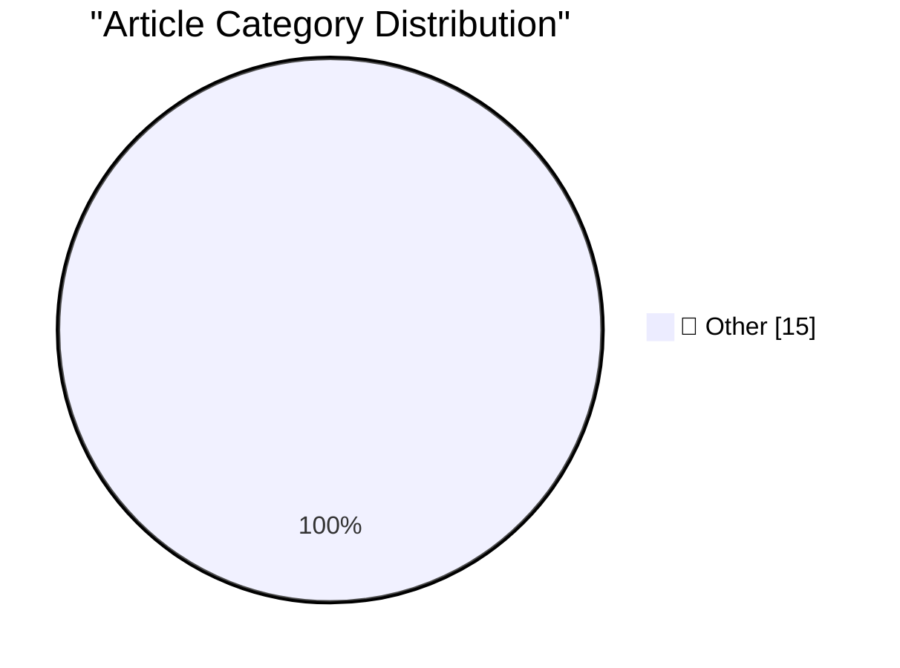

# 📰 AI Blog Daily Digest — 2026-07-30

> ⚠️ **Degraded run.** AI scoring failed for every batch — rankings and categories below are placeholder defaults, not AI-judged.

> From 92 top tech blogs (curated by Karpathy), AI-selected Top 15

## 🏆 Must Read

🥇 **Quoting D. Richard Hipp**

simonwillison.net · 1h ago · 📝 Other

> Years ago, we didn’t have SQL. There were people whose job was to generate software that would query large data sets. Their job title was COBOL programmer. Then SQL comes along—I’m simplifying this on

🥈 **AI Worming through Word**

simonwillison.net · 3h ago · 📝 Other

> AI Worming through Word Neat new prompt injection variant by Håkon Måløy, who found a way to upgrade prompt injection attacks against Microsoft Word to full self-replicating worms: An attacker places 

🥉 **Quoting Matthew Green**

simonwillison.net · 4h ago · 📝 Other

> Right now we’re in the midst of a historic transition from traditional public-key algorithms based on EC-based cryptography and RSA, moving over to new post-quantum algorithms based on novel problems.

---

## 📊 Data Overview

| Scanned | Articles | Range | Selected |
|:---:|:---:|:---:|:---:|
| 88/92 | 2609 → 42 | 48h | **15** |

### Category Distribution

---

## 📝 Other

### 1. Quoting D. Richard Hipp

[Link](https://simonwillison.net/2026/Jul/29/d-richard-hipp/#atom-everything) — **simonwillison.net** · 1h ago · ⭐ 15/30

> Years ago, we didn’t have SQL. There were people whose job was to generate software that would query large data sets. Their job title was COBOL programmer. Then SQL comes along—I’m simplifying this on

---

### 2. AI Worming through Word

[Link](https://simonwillison.net/2026/Jul/29/ai-worming-through-word/#atom-everything) — **simonwillison.net** · 3h ago · ⭐ 15/30

> AI Worming through Word Neat new prompt injection variant by Håkon Måløy, who found a way to upgrade prompt injection attacks against Microsoft Word to full self-replicating worms: An attacker places 

---

### 3. Quoting Matthew Green

[Link](https://simonwillison.net/2026/Jul/29/matthew-green/#atom-everything) — **simonwillison.net** · 4h ago · ⭐ 15/30

> Right now we’re in the midst of a historic transition from traditional public-key algorithms based on EC-based cryptography and RSA, moving over to new post-quantum algorithms based on novel problems.

---

### 4. Adding a custom MCP server to Claude and ChatGPT

[Link](https://simonwillison.net/2026/Jul/29/mcp-in-claude-and-chatgpt/#atom-everything) — **simonwillison.net** · 22h ago · ⭐ 15/30

> TIL: Adding a custom MCP server to Claude and ChatGPT Connecting a custom MCP server to Claude and ChatGPT's standard chat interfaces is possible, but can take quite a few steps. Tags: ai , generative

---

### 5. Discovering cryptographic weaknesses with Claude

[Link](https://simonwillison.net/2026/Jul/28/discovering-cryptographic-weaknesses-with-claude/#atom-everything) — **simonwillison.net** · 23h ago · ⭐ 15/30

> Discovering cryptographic weaknesses with Claude The best part of this article (here's the repo ) about how Anthropic researchers used Claude Mythos to find mathematical flaws in both HAWK and a weake

---

### 6. You don't have to be smart if you can think clearly

[Link](https://seangoedecke.com/you-dont-have-to-be-smart-if-you-think-clearly/) — **seangoedecke.com** · 22h ago · ⭐ 15/30

> When you’re on fire, problems are transparent: they’re solved simply by the act of looking at them. Even complicated layers of multiple problems can simply be glanced through like stacked panes of gla

---

### 7. Apple Says iOS 27 ‘Restricted Mode’ Isn’t for Users Who Miss Payments in New Apple Upgrade Program

[Link](https://9to5mac.com/2026/07/28/apple-says-ios-27-restricted-mode-isnt-for-new-upgrade-program-leases/) — **daringfireball.net** · 1h ago · ⭐ 15/30

> Last week 9to5Mac reported on code in the latest iOS 27 developer beta seemingly meant to restrict leased devices after the user had missed one or more payments. When engaged, Restricted Mode limits t

---

### 8. Apple Upgrade — New Program With Klarna for Leasing iPhones, Macs, iPads, and More for Near-Zero Interest

[Link](https://www.apple.com/newsroom/2026/07/apple-upgrade-launches-in-the-united-states/) — **daringfireball.net** · 5h ago · ⭐ 15/30

> Apple Newsroom: Apple today announced Apple Upgrade , a new product leasing program provided by Klarna for iPhone, Apple Watch, Mac, and iPad available on the Apple Store online, in the Apple Store ap

---

### 9. Pastebot 3

[Link](https://tapbots.com/pastebot/) — **daringfireball.net** · 6h ago · ⭐ 15/30

> New from Tapbots: version 3 of their excellent clipboard manager for Mac. There are so many clipboard managers for the Mac. I run two other apps — Keyboard Maestro and LaunchBar — that offer good clip

---

### 10. Count Those Underscores

[Link](https://arstechnica.com/tech-policy/2026/07/police-missed-one-underscore-and-sent-the-wrong-man-to-prison/) — **daringfireball.net** · 7h ago · ⭐ 15/30

> Nate Anderson , reporting for Ars Technica under the headline “A Missing Underscore Sent Innocent Man to Prison for 18 Months”: Police were looking for a man using the Kik messaging service under the 

---

### 11. ‘eBay’s Bizarre Cyberstalking Saga Ends With a $56 Million Settlement’

[Link](https://www.theverge.com/tech/972209/ebay-cyberstalking-harassment-settlement) — **daringfireball.net** · 7h ago · ⭐ 15/30

> Emma Roth, The Verge: eBay and three former executives will pay $55.7 million as part of a settlement with a Massachusetts couple targeted with a bizarre harassment and cyberstalking campaign in 2019,

---

### 12. Pluralistic: Enshittification and Reverse Centaurs go global (29 Jul 2026)

[Link](https://pluralistic.net/2026/07/29/la-la-la-la-la/) — **pluralistic.net** · 14h ago · ⭐ 15/30

> Today's links Enshittification and Reverse Centaurs go global: The good globalism. Hey look at this: Delights to delectate. Object permanence: Fonz thumps x Linux; CBC v DRM; Aussie mall v photos; Eng

---

### 13. Superlogical

[Link](https://mitchellh.com/writing/superlogical) — **mitchellh.com** · 22h ago · ⭐ 15/30

> 

---

### 14. Making an agile version of a Windows Runtime delegate in C++/WinRT, part 8

[Link](https://devblogs.microsoft.com/oldnewthing/20260729-00/?p=112570) — **devblogs.microsoft.com/oldnewthing** · 8h ago · ⭐ 15/30

> Exceptions hiding in lambda captures. The post Making an agile version of a Windows Runtime delegate in C++/WinRT, part 8 appeared first on The Old New Thing .

---

### 15. Making an agile version of a Windows Runtime delegate in C++/WinRT, part 7

[Link](https://devblogs.microsoft.com/oldnewthing/20260728-00/?p=112568) — **devblogs.microsoft.com/oldnewthing** · 1 days ago · ⭐ 15/30

> Further explorations into exception safety. The post Making an agile version of a Windows Runtime delegate in C++/WinRT, part 7 appeared first on The Old New Thing .

---

*Generated on 2026-07-30 | Scanned 88 sources → Found 2609 articles → Selected 15 articles*
*Based on [Hacker News Popularity Contest 2025](https://refactoringenglish.com/tools/hn-popularity/) RSS feeds list, curated by [Andrej Karpathy](https://x.com/karpathy).*
*Created by "Understand AI".*
