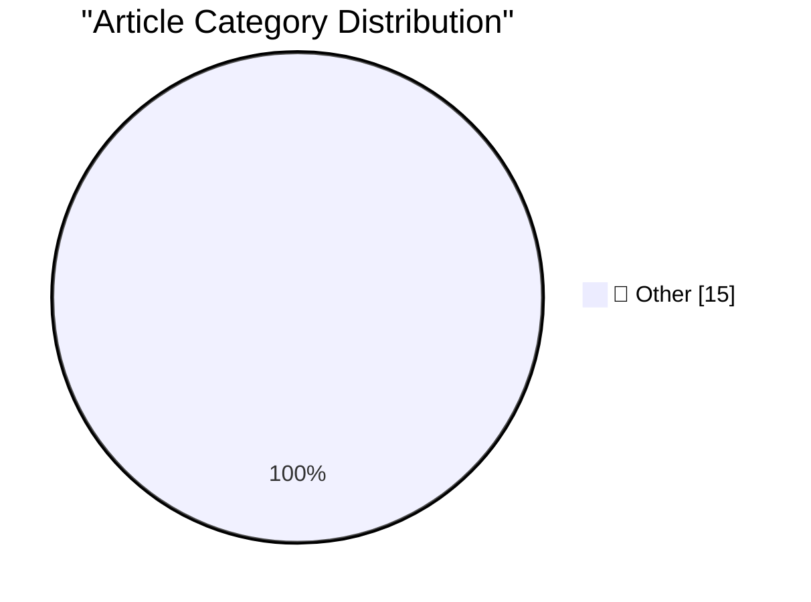

# 📰 AI Blog Daily Digest — 2026-07-31

> ⚠️ **Degraded run.** AI scoring failed for every batch — rankings and categories below are placeholder defaults, not AI-judged.

> From 92 top tech blogs (curated by Karpathy), AI-selected Top 15

## 🏆 Must Read

🥇 **Quoting Bruce Schneier**

simonwillison.net · 4h ago · 📝 Other

> The writing assignments I give my students are gym tasks, not work tasks. I ask them to write policy memos not because the world needs more policy memos. I assign them because the very act of writing,

🥈 **Read This Before You Buy That TV Streaming Stick**

krebsonsecurity.com · 6h ago · 📝 Other

> Security experts have been sounding the alarm for years about the risks of using generic TV boxes that promise unlimited content streaming for a one-time fee, warning that they secretly rent the user'

🥉 **Mark Zuckerberg: ‘The AI Future Is for Everyone’**

daringfireball.net · 1h ago · 📝 Other

> Mark Zuckerberg, in an op-ed Tuesday for The Wall Street Journal (gift link; and irony isn’t lost that “everyone” needs a paid WSJ subscription to read this): We are fortunate to live at an incredible

---

## 📊 Data Overview

| Scanned | Articles | Range | Selected |
|:---:|:---:|:---:|:---:|
| 88/92 | 2609 → 35 | 48h | **15** |

### Category Distribution

---

## 📝 Other

### 1. Quoting Bruce Schneier

[Link](https://simonwillison.net/2026/Jul/30/bruce-schneier/#atom-everything) — **simonwillison.net** · 4h ago · ⭐ 15/30

> The writing assignments I give my students are gym tasks, not work tasks. I ask them to write policy memos not because the world needs more policy memos. I assign them because the very act of writing,

---

### 2. Read This Before You Buy That TV Streaming Stick

[Link](https://krebsonsecurity.com/2026/07/read-this-before-you-buy-that-tv-streaming-stick/) — **krebsonsecurity.com** · 6h ago · ⭐ 15/30

> Security experts have been sounding the alarm for years about the risks of using generic TV boxes that promise unlimited content streaming for a one-time fee, warning that they secretly rent the user'

---

### 3. Mark Zuckerberg: ‘The AI Future Is for Everyone’

[Link](https://www.wsj.com/opinion/the-ai-future-is-for-everyone-a0c24e20?st=T6AAwM) — **daringfireball.net** · 1h ago · ⭐ 15/30

> Mark Zuckerberg, in an op-ed Tuesday for The Wall Street Journal (gift link; and irony isn’t lost that “everyone” needs a paid WSJ subscription to read this): We are fortunate to live at an incredible

---

### 4. Apple Releases iOS and MacOS 26.6, MacOS 15.7.8, and More

[Link](https://arstechnica.com/gadgets/2026/07/ios-and-macos-26-6-arrive-today-paving-the-way-for-ios-and-macos-27/) — **daringfireball.net** · 2h ago · ⭐ 15/30

> Samuel Axon, Ars Technica: Apple has released iOS, iPadOS, macOS, watchOS, and tvOS 26.6. Apart from potential security hotfixes, these are likely the last updates before the arrival of iOS 27, macOS 

---

### 5. Rogue Amoeba: Unobtrusive Update Notifications

[Link](https://weblog.rogueamoeba.com/2026/04/28/unobtrusive-update-notifications/) — **daringfireball.net** · 2h ago · ⭐ 15/30

> Paul Kafasis, on the Rogue Amoeba blog back in April: Though Sparkle serves us very well, it has one notable downside. Update announcements are most likely to appear at the least convenient time: righ

---

### 6. Looking for the Catch in Apple Upgrade

[Link](https://www.theatlantic.com/technology/2026/07/apple-lease-upgrade-program/688106/) — **daringfireball.net** · 5h ago · ⭐ 15/30

> Damon Beres, writing for The Atlantic under the hed/subhed: “The New iPhone Underclass: Apple’s rental program is a trap”: The Klarna plan — “Apple Upgrade,” which replaces the iPhone Upgrade Program 

---

### 7. The Differences Between the New ‘Apple Upgrade’ and the Old ‘iPhone Upgrade Program’

[Link](https://9to5mac.com/2026/07/30/apple-upgrade-vs-iphone-upgrade-program-here-are-the-key-differences/) — **daringfireball.net** · 6h ago · ⭐ 15/30

> Ryan Christoffel, writing for 9to5Mac: Apple Upgrade launched this week, and the iPhone Upgrade Program is being discontinued as a result. But despite some similarities, the two offerings are not the 

---

### 8. You have been mislead about lightbulbs

[Link](https://maurycyz.com/misc/tungsten/) — **maurycyz.com** · 22h ago · ⭐ 15/30

> There's a story that goes something like this: In 1925, lightbulb manufactures secretly colluded to standardized lifespans at 1,000 hours. They would test each other's products to ensure compliance. T

---

### 9. Pluralistic: The stupidest imaginable excuses for surveillance pricing (30 Jul 2026)

[Link](https://pluralistic.net/2026/07/30/pay-for-privacy/) — **pluralistic.net** · 10h ago · ⭐ 15/30

> Today's links The stupidest imaginable excuses for surveillance pricing: Since 1850, San Francisco's Chamber of Commerce has been pissing in our mouths and calling it rain. Hey look at this: Delights 

---

### 10. Are political journalists always wrong?

[Link](https://shkspr.mobi/blog/2026/07/are-political-journalists-always-wrong/) — **shkspr.mobi** · 11h ago · ⭐ 15/30

> I've mostly tuned out of reading the news. But, once in a while, a headline will be shared on social media and I'll momentarily stare into the abyss. There has recently been a change in UK Prime Minis

---

### 11. So you want to use plants to reduce indoor CO₂

[Link](https://dynomight.net/plants/) — **dynomight.net** · 22h ago · ⭐ 15/30

> You face certain challenges

---

### 12. Dario takes it on the chin

[Link](https://garymarcus.substack.com/p/dario-takes-it-on-the-chin) — **garymarcus.substack.com** · 1 days ago · ⭐ 15/30

> His reputation is crashing

---

### 13. Why do OpenAI's GPT-2 weights beat mine?

[Link](https://www.gilesthomas.com/2026/07/why-do-openai-gpt2-weights-beat-mine-1-intro) — **gilesthomas.com** · 1 days ago · ⭐ 15/30

> When I finished my project training an LLM from scratch , I was left with a minor mystery. Why were my models worse at instruction-following than the original OpenAI GPT-2 small weights? I had an eval

---

### 14. Why do OpenAI's GPT-2 weights beat mine? Part two: the bugfix

[Link](https://www.gilesthomas.com/2026/07/why-do-openai-gpt2-weights-beat-mine-2-the-bugfix) — **gilesthomas.com** · 3h ago · ⭐ 15/30

> I'm digging into why my GPT-2 style models score worse on an instruction-following eval than OpenAI's original weights; I gave the details in this post . While I was writing up the results of my first

---

### 15. Wheels, Bottles and Images

[Link](https://nesbitt.io/2026/07/30/wheels-bottles-images.html) — **nesbitt.io** · 12h ago · ⭐ 15/30

> Any sufficiently advanced package manager is indistinguishable from a container registry.

---

*Generated on 2026-07-31 | Scanned 88 sources → Found 2609 articles → Selected 15 articles*
*Based on [Hacker News Popularity Contest 2025](https://refactoringenglish.com/tools/hn-popularity/) RSS feeds list, curated by [Andrej Karpathy](https://x.com/karpathy).*
*Created by "Understand AI".*
