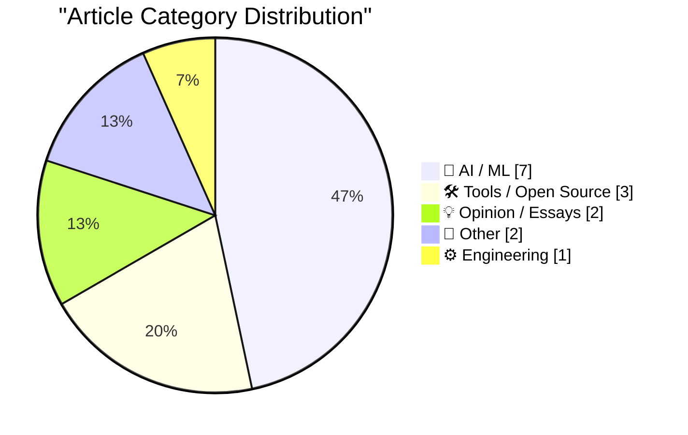
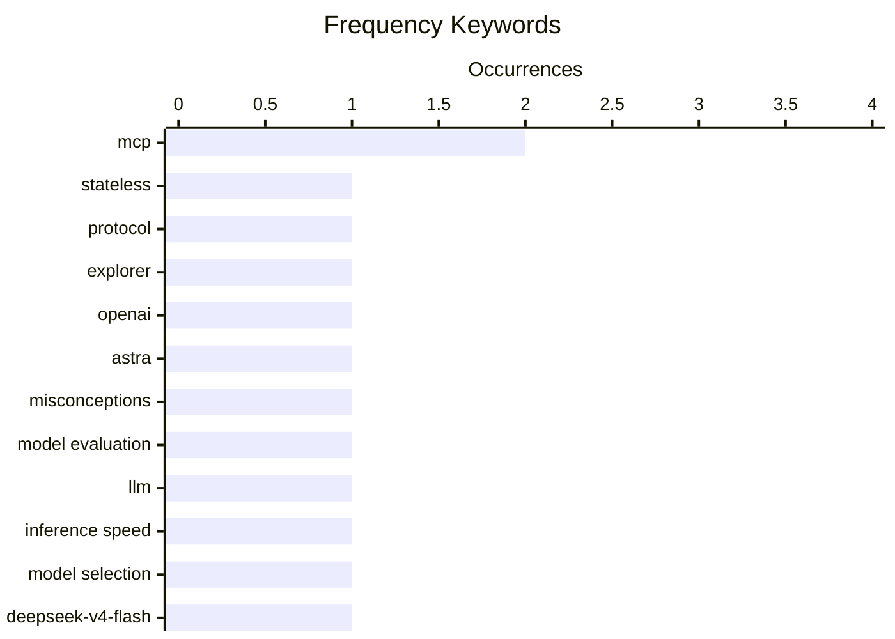

# 📰 AI Blog Daily Digest — 2026-08-03

> From 92 top tech blogs (curated by Karpathy), AI-selected Top 15

## 📝 Today's Highlights

Today’s tech discourse is dominated by a pragmatic recalibration of AI, where speed and efficiency are increasingly trumping raw intelligence in model selection, even as new releases like DeepSeek-V4-Flash push performance boundaries. Meanwhile, the ecosystem is grappling with a credibility crisis, as critics and commentators like Gary Marcus and Cory Doctorow challenge the industry’s oversold claims and the systemic incentives driving corporate AI hype. Amidst this, infrastructure evolution continues apace, with the MCP 2.0 specification rekindling developer interest in stateless protocols, while major earnings reports signal that AI-driven hardware and services remain the primary engines of commercial growth.

---

## 🏆 Must Read

🥇 **Stateless MCP has recaptured my interest (and inspired mcp-explorer and datasette-mcp)**

simonwillison.net · 1 days ago · ⚙️ Engineering

> The rollout of MCP 2.0 (2026-07-28 Model Context Protocol specification) marks the most significant change to the protocol since its launch, reigniting interest in stateless MCP. This update simplifies tool exposure for LLM agents by removing stateful session requirements, making integration more scalable and robust. The author was inspired to build mcp-explorer and datasette-mcp, tools that leverage the new stateless design. The core point is that stateless MCP reduces complexity and improves reliability, making it a pivotal advancement for agentic AI development.

💡 **Why it matters**: Essential reading for developers working with MCP or building AI agent tools, as it highlights a major protocol shift and practical new tools.

🏷️ MCP, stateless, protocol, explorer

🥈 **OpenAI’s amazing — but vastly oversold — new model Astra**

garymarcus.substack.com · 1h ago · 🤖 AI / ML

> Gary Marcus critiques OpenAI's new model Astra, acknowledging its technical achievements but arguing that it is vastly oversold by the company and media. He identifies eight or nine misconceptions, including overblown claims about reasoning, safety, and general intelligence, and points out the biggest fallacy: conflating impressive demos with true understanding. Marcus concludes that Astra, while remarkable, does not represent the transformative leap that OpenAI suggests, and warns against uncritical acceptance of marketing narratives.

💡 **Why it matters**: Provides a critical counterbalance to AI hype, helping readers evaluate model claims with a skeptical eye.

🏷️ OpenAI, Astra, misconceptions, model evaluation

🥉 **I'm (mostly) picking models on speed now, not intelligence**

martinalderson.com · 22h ago · 🤖 AI / ML

> The author explains a shift in model selection criteria from raw intelligence to tokens per second (speed), arguing that ~100 tok/s is becoming the new benchmark for daily driver models, akin to the '100ms' latency standard in UI design. They note that beyond a certain speed threshold, gains matter less, and predict an upcoming price war as providers compete on cost per token. The conclusion is that for many practical applications, speed and cost efficiency now outweigh marginal intelligence differences.

💡 **Why it matters**: Offers a practical, contrarian perspective on model selection that can save time and money for developers and power users.

🏷️ LLM, inference speed, model selection

---

## 📊 Data Overview

| Scanned | Articles | Range | Selected |
|:---:|:---:|:---:|:---:|
| 88/92 | 2611 → 28 | 48h | **15** |

### Category Distribution



### High-Frequency Keywords



<details>
<summary>📈 ASCII Keyword Chart (Terminal Friendly)</summary>

```
mcp              │ ████████████████████ 2
stateless        │ ██████████░░░░░░░░░░ 1
protocol         │ ██████████░░░░░░░░░░ 1
explorer         │ ██████████░░░░░░░░░░ 1
openai           │ ██████████░░░░░░░░░░ 1
astra            │ ██████████░░░░░░░░░░ 1
misconceptions   │ ██████████░░░░░░░░░░ 1
model evaluation │ ██████████░░░░░░░░░░ 1
llm              │ ██████████░░░░░░░░░░ 1
inference speed  │ ██████████░░░░░░░░░░ 1
```

</details>

### 🏷️ Topic Tags

**mcp**(2) · **stateless**(1) · **protocol**(1) · explorer(1) · openai(1) · astra(1) · misconceptions(1) · model evaluation(1) · llm(1) · inference speed(1) · model selection(1) · deepseek-v4-flash(1) · agentic(1) · model release(1) · ai(1) · business(1) · hype(1) · bankruptcy(1) · open letters(1) · ai policy(1)

---

## 🤖 AI / ML

### 1. OpenAI’s amazing — but vastly oversold — new model Astra

[Link](https://garymarcus.substack.com/p/openais-amazing-but-vastly-oversold) — **garymarcus.substack.com** · 1h ago · ⭐ 26/30

> Gary Marcus critiques OpenAI's new model Astra, acknowledging its technical achievements but arguing that it is vastly oversold by the company and media. He identifies eight or nine misconceptions, including overblown claims about reasoning, safety, and general intelligence, and points out the biggest fallacy: conflating impressive demos with true understanding. Marcus concludes that Astra, while remarkable, does not represent the transformative leap that OpenAI suggests, and warns against uncritical acceptance of marketing narratives.

🏷️ OpenAI, Astra, misconceptions, model evaluation

---

### 2. I'm (mostly) picking models on speed now, not intelligence

[Link](https://martinalderson.com/posts/speed-vs-intelligence/?utm_source=rss&amp;utm_medium=rss&amp;utm_campaign=feed) — **martinalderson.com** · 22h ago · ⭐ 26/30

> The author explains a shift in model selection criteria from raw intelligence to tokens per second (speed), arguing that ~100 tok/s is becoming the new benchmark for daily driver models, akin to the '100ms' latency standard in UI design. They note that beyond a certain speed threshold, gains matter less, and predict an upcoming price war as providers compete on cost per token. The conclusion is that for many practical applications, speed and cost efficiency now outweigh marginal intelligence differences.

🏷️ LLM, inference speed, model selection

---

### 3. deepseek-ai/DeepSeek-V4-Flash-0731

[Link](https://simonwillison.net/2026/Jul/31/deepseek-v4-flash-0731/#atom-everything) — **simonwillison.net** · 1 days ago · ⭐ 25/30

> DeepSeek-V4-Flash-0731, a 304B parameter model (167GB on Hugging Face), delivers substantially enhanced agentic capabilities and outperforms MiniMax M3 (428B) on the Artificial Analysis Intelligence Index. Priced at $0.14/million input and $0.27/million output, it may currently be the best value-per-intelligence model available. The author suggests it punches above its weight, making it a strong contender for cost-sensitive AI applications.

🏷️ DeepSeek-V4-Flash, agentic, model release

---

### 4. Open letters about AI development

[Link](https://simonwillison.net/2026/Aug/2/open-letters/#atom-everything) — **simonwillison.net** · 18h ago · ⭐ 22/30

> Simon Willison summarizes recent open letters about AI development, including 'Open Weights and American AI Leadership' (July 24, signed by 235 companies like NVIDIA, Amazon, and OpenAI) which argues against restrictive regulations on open-weight models. He notes the political and strategic motivations behind these letters, particularly in countering potential government action. The core point is that these letters reveal a coordinated industry push to shape AI policy in favor of open development.

🏷️ open letters, AI policy, open weights

---

### 5. Boris Cherny on Trying to Get Claude Code to Rewrite the Claude App

[Link](https://www.ycrootaccess.com/p/boris-cherny-building-claude-code) — **daringfireball.net** · 1h ago · ⭐ 22/30

> Boris Cherny, head of Claude Code at Anthropic, shares insights on directing AI to perform difficult tasks, emphasizing that the skill is less about prompt engineering and more about designing tasks that are 'a little bit too hard' and enabling verification. He suggests that breaking down complex tasks and building in checkpoints for Claude to verify its work is key to success. The core point is that effective AI collaboration requires a shift from crafting prompts to orchestrating verifiable workflows.

🏷️ Claude Code, prompt engineering, agentic coding

---

### 6. July 2026 newsletter

[Link](https://simonwillison.net/2026/Aug/2/july-newsletter/#atom-everything) — **simonwillison.net** · 18h ago · ⭐ 21/30

> The July 2026 newsletter from Simon Willison covers a range of AI topics, including accidental cyberattacks by OpenAI and Anthropic models, new model releases (GPT-5.6, Sol, Terra, Luna, Claude Opus 5, Kimi K3, DeepSeek-V4-Flash-0731), and open letters about AI development. It also includes a fireside chat, a podcast, and updates on his MCP-related projects. The newsletter serves as a comprehensive monthly roundup for AI enthusiasts.

🏷️ newsletter, AI models, GPT-5.6, Claude Opus 5

---

### 7. Ten advances in mathematics and theoretical computer science

[Link](https://simonwillison.net/2026/Aug/1/ten-advances-in-mathematics/#atom-everything) — **simonwillison.net** · 1 days ago · ⭐ 20/30

> Ten advances in mathematics and theoretical computer science A few days ago it was Anthropic discovering cryptographic weaknesses with Claude using Mythos Preview, spending $100,000 on tokens and with

🏷️ mathematics, theoretical CS, Anthropic, cryptography

---

## 🛠 Tools / Open Source

### 8. This Week in Package Management: 1 August 2026

[Link](https://nesbitt.io/2026/08/01/this-week-in-package-management.html) — **nesbitt.io** · 1 days ago · ⭐ 21/30

> This weekly roundup covers releases, advisories, and articles from the package management ecosystem, providing a snapshot of updates across various tools and languages. It aggregates key changes and security alerts, making it a one-stop resource for package managers. The core value is in its comprehensiveness and timeliness for developers.

🏷️ package management, releases, security

---

### 9. datasette-apps 0.2a0

[Link](https://simonwillison.net/2026/Aug/1/datasette-apps/#atom-everything) — **simonwillison.net** · 1 days ago · ⭐ 19/30

> Release: datasette-apps 0.2a0 Changes that improve Datasette Apps when created and edited using Datasette Agent : New app_debug() tool allowing agent to open an app (invisibly) and test it using JavaS

🏷️ datasette-apps, Datasette Agent, debugging

---

### 10. llm-mcp-client 0.1a0

[Link](https://simonwillison.net/2026/Jul/31/llm-mcp-client/#atom-everything) — **simonwillison.net** · 1 days ago · ⭐ 18/30

> Release: llm-mcp-client 0.1a0 See this blog entry . Tags: llm , model-context-protocol

🏷️ llm-mcp-client, MCP, release

---

## 💡 Opinion / Essays

### 11. Pluralistic: Why businesses lie about AI (01 Aug 2026)

[Link](https://pluralistic.net/2026/08/01/dare-snot/) — **pluralistic.net** · 1 days ago · ⭐ 24/30

> Cory Doctorow argues that businesses lie about AI capabilities to appease bosses and investors, leading to poor decision-making and eventual bankruptcy. He uses examples of companies overhyping AI features to satisfy executives, even when the technology fails to deliver. The article concludes that this 'humoring the boss' culture is a dangerous trend that prioritizes short-term optics over long-term viability.

🏷️ AI, business, hype, bankruptcy

---

### 12. Giving and taking credit in big tech companies

[Link](https://seangoedecke.com/giving-and-taking-credit/) — **seangoedecke.com** · 22h ago · ⭐ 20/30

> Engineers often complain that visibility should be their manager’s job. In other words, they think engineers should be able to focus on the code, while their manager figures out who’s doing well and r

🏷️ credit, visibility, career, big tech

---

## 📝 Other

### 13. Apple Q3 2026 Results

[Link](https://sixcolors.com/post/2026/07/apple-announces-record-q3-results/) — **daringfireball.net** · 1 days ago · ⭐ 22/30

> Apple reported record Q3 2026 earnings with total revenue of $109.4B (up 16% YoY), driven by iPhone (up 22%), Mac (up 10.4%), Services (up 12%), and Wearables (up 6%), while iPad declined 6%. This was Tim Cook's 90th and final analyst call, marking the end of his 15-year CEO tenure. The results highlight Apple's continued growth under Cook, with a retrospective on his leadership from MacRumors.

🏷️ Apple, earnings, revenue, financial results

---

### 14. Reading List 08/01/26

[Link](https://www.construction-physics.com/p/reading-list-080126) — **construction-physics.com** · 1 days ago · ⭐ 18/30

> Pepper-spray drones, China’s chip Manhattan Project, Commonwealth Fusion’s fundraise, and a proposed Dulles Airport renovation.

🏷️ drones, semiconductors, fusion, infrastructure

---

## ⚙️ Engineering

### 15. Stateless MCP has recaptured my interest (and inspired mcp-explorer and datasette-mcp)

[Link](https://simonwillison.net/2026/Jul/31/stateless-mcp/#atom-everything) — **simonwillison.net** · 1 days ago · ⭐ 26/30

> The rollout of MCP 2.0 (2026-07-28 Model Context Protocol specification) marks the most significant change to the protocol since its launch, reigniting interest in stateless MCP. This update simplifies tool exposure for LLM agents by removing stateful session requirements, making integration more scalable and robust. The author was inspired to build mcp-explorer and datasette-mcp, tools that leverage the new stateless design. The core point is that stateless MCP reduces complexity and improves reliability, making it a pivotal advancement for agentic AI development.

🏷️ MCP, stateless, protocol, explorer

---

*Generated on 2026-08-03 | Scanned 88 sources → Found 2611 articles → Selected 15 articles*
*Based on [Hacker News Popularity Contest 2025](https://refactoringenglish.com/tools/hn-popularity/) RSS feeds list, curated by [Andrej Karpathy](https://x.com/karpathy).*
*Created by "Understand AI".*
