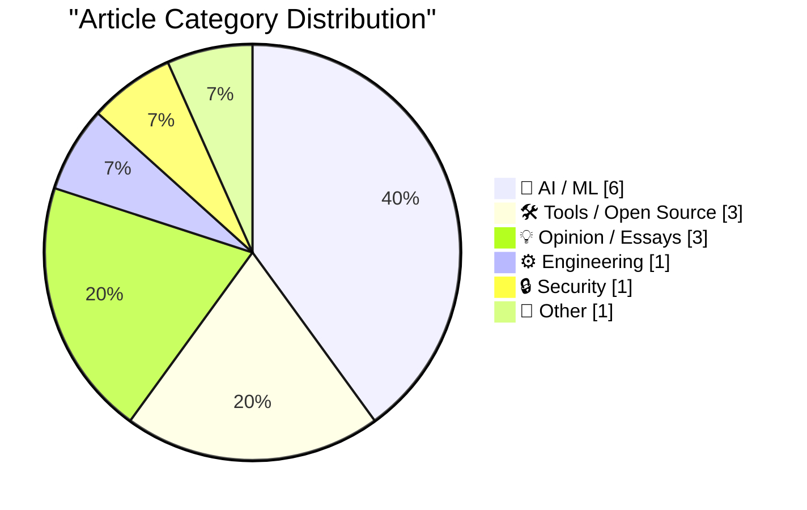
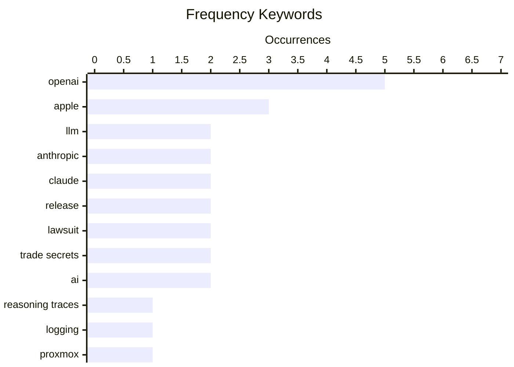

# 📰 AI Blog Daily Digest — 2026-08-06

> From 92 top tech blogs (curated by Karpathy), AI-selected Top 15

## 📝 Today's Highlights

Today’s tech landscape is dominated by two forces: the rapid maturation of AI tooling and infrastructure, marked by major releases like LLM 0.32 and expanded hardware support, and an escalating legal and financial showdown between tech giants over AI’s commercial future. OpenAI and Apple are locked in a high-stakes trade secrets battle, while Microsoft’s disclosures reveal OpenAI’s outsized role in its revenue, underscoring the immense financial stakes. Meanwhile, critical voices are questioning the sustainability of the AI boom, with analysts warning of a potential demand bubble and the risks of blindly trusting AI-generated output.

---

## 🏆 Must Read

🥇 **New release of LLM adds support for reasoning traces, OpenAI Responses, server-side tools, and smarter logging**

simonwillison.net · 23h ago · 🛠 Tools / Open Source

> LLM 0.32, the most significant release since the project's launch, adds visible reasoning traces, server-side provider tools, redesigned content-addressable SQLite logs, and new features enabled by the OpenAI Responses API. The update also includes new models and a new version of the llm-anthropic plugin with substantial updates. For CLI users, running reasoning models now displays reasoning traces, and server-side tools are accessible via the -T interface. The release streamlines tool handling and logging, making it a major upgrade for LLM users.

💡 **Why it matters**: This release introduces foundational features like reasoning traces and server-side tools that will shape how users interact with LLM and its plugins.

🏷️ LLM, OpenAI, reasoning traces, logging

🥈 **Proxmox officially supports Arm, with some caveats**

jeffgeerling.com · 6h ago · ⚙️ Engineering

> Proxmox Virtual Environment now officially supports 64-bit ARM, as announced today. The author tested it on an Ampere Altra Dev Platform, which uses UEFI/ACPI, making installation straightforward without platform-specific ISO tailoring. However, caveats exist for devices like Raspberry Pis and most SBCs that rely on Device Tree, which may require additional configuration. The test confirms ARM support is viable for servers but not yet plug-and-play for all ARM hardware.

💡 **Why it matters**: This is a key milestone for ARM server adoption, offering practical insights into installation and compatibility for both datacenter and SBC users.

🏷️ Proxmox, ARM, virtualization

🥉 **News: Microsoft Disclosures Suggest OpenAI Sales Account For Around 70% Of FY26 AI Revenue, more than 7% of FY26 Revenue**

wheresyoured.at · 4h ago · 🤖 AI / ML

> Microsoft disclosures and Bloomberg analyses reveal that OpenAI's compute spend and revenue share account for roughly 70% of Microsoft's FY26 AI revenues, and more than 7% of Microsoft's overall FY2026 revenues. Microsoft has spent $261.3 billion in capital expenditures since the partnership began, highlighting the massive financial interdependence. This concentration raises questions about revenue sustainability and the risks of over-reliance on a single customer.

💡 **Why it matters**: This analysis quantifies the financial entanglement between Microsoft and OpenAI, critical for understanding AI market dynamics and investment risks.

🏷️ OpenAI, Microsoft, AI revenue, capital expenditure

---

## 📊 Data Overview

| Scanned | Articles | Range | Selected |
|:---:|:---:|:---:|:---:|
| 82/92 | 2492 → 38 | 48h | **15** |

### Category Distribution



### High-Frequency Keywords



<details>
<summary>📈 ASCII Keyword Chart (Terminal Friendly)</summary>

```
openai           │ ████████████████████ 5
apple            │ ████████████░░░░░░░░ 3
llm              │ ████████░░░░░░░░░░░░ 2
anthropic        │ ████████░░░░░░░░░░░░ 2
claude           │ ████████░░░░░░░░░░░░ 2
release          │ ████████░░░░░░░░░░░░ 2
lawsuit          │ ████████░░░░░░░░░░░░ 2
trade secrets    │ ████████░░░░░░░░░░░░ 2
ai               │ ████████░░░░░░░░░░░░ 2
reasoning traces │ ████░░░░░░░░░░░░░░░░ 1
```

</details>

### 🏷️ Topic Tags

**openai**(5) · **apple**(3) · **llm**(2) · anthropic(2) · claude(2) · release(2) · lawsuit(2) · trade secrets(2) · ai(2) · reasoning traces(1) · logging(1) · proxmox(1) · arm(1) · virtualization(1) · microsoft(1) · ai revenue(1) · capital expenditure(1) · server-side tools(1) · injunction(1) · minimax-h3(1)

---

## 🤖 AI / ML

### 1. News: Microsoft Disclosures Suggest OpenAI Sales Account For Around 70% Of FY26 AI Revenue, more than 7% of FY26 Revenue

[Link](https://www.wheresyoured.at/news-microsoft-disclosures-suggest-openai-sales-account-for-around-70-of-fy26-ai-revenue-more-than-7-of-fy26-revenue/) — **wheresyoured.at** · 4h ago · ⭐ 25/30

> Microsoft disclosures and Bloomberg analyses reveal that OpenAI's compute spend and revenue share account for roughly 70% of Microsoft's FY26 AI revenues, and more than 7% of Microsoft's overall FY2026 revenues. Microsoft has spent $261.3 billion in capital expenditures since the partnership began, highlighting the massive financial interdependence. This concentration raises questions about revenue sustainability and the risks of over-reliance on a single customer.

🏷️ OpenAI, Microsoft, AI revenue, capital expenditure

---

### 2. ★ OpenAI Responds to Apple’s Lawsuit and Motion for Preliminary Injunction: ‘Apple Is Getting This Wrong’

[Link](https://daringfireball.net/2026/08/openai_apple_is_getting_this_wrong) — **daringfireball.net** · 1 days ago · ⭐ 24/30

> OpenAI responded to Apple's lawsuit and motion for preliminary injunction with a blog post titled 'Apple Is Getting This Wrong,' an unusual move for a legal dispute. The post argues that Apple's claims are misguided, but the author provides commentary without taking a definitive side. The response highlights the escalating legal battle between the two tech giants over trade secrets and employee conduct.

🏷️ OpenAI, Apple, lawsuit, trade secrets

---

### 3. PipeNetwork/minimax-h3-mlx

[Link](https://simonwillison.net/2026/Aug/4/minimax-h3-mlx/#atom-everything) — **simonwillison.net** · 1 days ago · ⭐ 23/30

> MiniMax-H3, described as a 'general-purpose, omni-modal generative system,' accepts text, images, audio, and video to generate up to 15-second video clips with audio. A Python package ports it to MLX for Apple Silicon, and the author successfully ran it on an M5 Max MacBook Pro. The setup involves downloading models via huggingface_hub and running the model locally, demonstrating feasibility on high-end consumer hardware.

🏷️ MiniMax-H3, multimodal, video generation

---

### 4. One-shotting a Raccoon Heist game using Claude Fable 5

[Link](https://simonwillison.net/2026/Aug/5/raccoon-heist/#atom-everything) — **simonwillison.net** · 3h ago · ⭐ 22/30

> Simon Willison tests whether Claude Fable 5, running in Claude Code for web, can build a complete game from a 2022 tweet that originally showcased a GPT-3-generated concept and DALL-E art. The AI successfully created a playable 'Raccoon Heist' game, with the full source code available on GitHub and a video demo provided. The experiment demonstrates the rapid advancement in AI code generation, as the entire game was 'one-shotted' from a single prompt based on the tweet's content. The author concludes that current AI models can now turn simple text prompts into fully functional, interactive applications.

🏷️ Claude, game generation, AI coding

---

### 5. Elon Musk’s preposterous and possibly harmful prediction about robotic surgery

[Link](https://garymarcus.substack.com/p/elon-musks-preposterous-and-possibly) — **garymarcus.substack.com** · 43m ago · ⭐ 22/30

> Gary Marcus critiques Elon Musk's prediction about robotic surgery, calling it 'preposterous and possibly harmful.' The article argues that Musk's claim, which likely overstates the near-term capabilities of AI-driven surgical robots, ignores fundamental technical and regulatory hurdles, such as the need for real-time reliability, safety validation, and clinical trials. Marcus points out that such overhyped predictions can mislead the public and policymakers, potentially diverting resources from realistic medical innovations. The author concludes that Musk's forecast is not just inaccurate but dangerous because it sets unrealistic expectations for a field where errors have life-or-death consequences.

🏷️ robotic surgery, Elon Musk, prediction, AI

---

### 6. Hacker News Thread on OpenAI’s ‘Apple Is Getting This Wrong’ Post

[Link](https://news.ycombinator.com/item?id=49164649) — **daringfireball.net** · 8h ago · ⭐ 21/30

> John Gruber analyzes a Hacker News thread reacting to OpenAI's public response to Apple's competitive moves, which he describes as 'bringing a box of chocolates to a gunfight.' The thread criticizes OpenAI's statement for lacking context, as it fails to explain the underlying conflict with Apple, assuming readers are already up to date. Gruber highlights that OpenAI's conciliatory tone ('We love you guys, can't we just be friends?') is ineffective against Apple's aggressive push to replace OpenAI's technology. The core point is that OpenAI's response is strategically weak and poorly communicated, missing the opportunity to address the competitive threat directly.

🏷️ OpenAI, Apple, lawsuit, Siri

---

## 🛠 Tools / Open Source

### 7. New release of LLM adds support for reasoning traces, OpenAI Responses, server-side tools, and smarter logging

[Link](https://simonwillison.net/2026/Aug/4/new-release-of-llm/#atom-everything) — **simonwillison.net** · 23h ago · ⭐ 26/30

> LLM 0.32, the most significant release since the project's launch, adds visible reasoning traces, server-side provider tools, redesigned content-addressable SQLite logs, and new features enabled by the OpenAI Responses API. The update also includes new models and a new version of the llm-anthropic plugin with substantial updates. For CLI users, running reasoning models now displays reasoning traces, and server-side tools are accessible via the -T interface. The release streamlines tool handling and logging, making it a major upgrade for LLM users.

🏷️ LLM, OpenAI, reasoning traces, logging

---

### 8. llm-anthropic 0.26

[Link](https://simonwillison.net/2026/Aug/4/llm-anthropic/#atom-everything) — **simonwillison.net** · 1 days ago · ⭐ 24/30

> llm-anthropic 0.26, built on LLM 0.32, adds support for new models: claude-fable-5, claude-sonnet-5, and claude-opus-5. It introduces server-side tools for WebSearch, WebFetch, CodeExecution, and AnthropicMCP, accessible via the -T interface or Python tools= parameter, replacing the previous -o web_search* options. Reasoning, tool calls, tool results, and server-side tool results now stream as typed events, improving real-time interaction and logging.

🏷️ Anthropic, Claude, server-side tools, release

---

### 9. llm 0.32

[Link](https://simonwillison.net/2026/Aug/4/llm/#atom-everything) — **simonwillison.net** · 1 days ago · ⭐ 23/30

> LLM 0.32 is released, with details covered in a separate blog post. The release includes new features and improvements, but the summary here is minimal, directing readers to the main post for specifics. This entry serves as a release note rather than a detailed analysis.

🏷️ LLM, release, CLI

---

## 💡 Opinion / Essays

### 10. Don't be a meat proxy

[Link](https://simonwillison.net/2026/Aug/3/dont-be-a-meat-proxy/#atom-everything) — **simonwillison.net** · 1 days ago · ⭐ 23/30

> Niklas Gruhn coins the term 'meat proxy' for people who blindly copy and paste AI output to peers without understanding or validating it. The author advises prompting AI but not relaying output verbatim; instead, read, understand, validate, and rewrite in your own words. This effort adds value and ensures accuracy, serving as a certificate of comprehension.

🏷️ AI, critical thinking, productivity

---

### 11. The AI Demand Bubble

[Link](https://www.wheresyoured.at/the-ai-demand-bubble/) — **wheresyoured.at** · 1 days ago · ⭐ 23/30

> The article argues that the AI industry is experiencing a demand bubble, suggesting that current demand for AI products may be unsustainable. The author promotes a premium newsletter for deeper analysis, priced at $70/year or $7/month, offering weekly insights on NVIDIA, Anthropic, and other topics. The piece likely explores market dynamics and potential corrections.

🏷️ AI bubble, NVIDIA, Anthropic, market analysis

---

### 12. Pluralistic: Google is a scammer's paradise (05 Aug 2026)

[Link](https://pluralistic.net/2026/08/05/absentee-landlord/) — **pluralistic.net** · 12h ago · ⭐ 22/30

> Cory Doctorow argues that Google has become a 'scammer's paradise' due to its role as an 'absentee landlord' of the internet, failing to police its search and ad ecosystems effectively. The article highlights how Google's algorithms and policies enable fraudulent activities, including scam ads, fake reviews, and malicious sites, while the company prioritizes revenue over user protection. Doctorow criticizes Google's hands-off approach, which allows bad actors to thrive at the expense of ordinary users. The core point is that Google's neglect of its platform responsibilities has turned it into a haven for scammers, undermining trust in the web.

🏷️ Google, scams, search, privacy

---

## ⚙️ Engineering

### 13. Proxmox officially supports Arm, with some caveats

[Link](https://www.jeffgeerling.com/blog/2026/proxmox-ve-arm-official/) — **jeffgeerling.com** · 6h ago · ⭐ 25/30

> Proxmox Virtual Environment now officially supports 64-bit ARM, as announced today. The author tested it on an Ampere Altra Dev Platform, which uses UEFI/ACPI, making installation straightforward without platform-specific ISO tailoring. However, caveats exist for devices like Raspberry Pis and most SBCs that rely on Device Tree, which may require additional configuration. The test confirms ARM support is viable for servers but not yet plug-and-play for all ARM hardware.

🏷️ Proxmox, ARM, virtualization

---

## 🔒 Security

### 14. Apple Seeks Preliminary Injunction Against OpenAI in Trade Secrets Case

[Link](https://www.reuters.com/legal/litigation/apple-seeks-preliminary-injunction-against-openai-trade-secrets-case-2026-08-04/) — **daringfireball.net** · 1 days ago · ⭐ 24/30

> Apple has filed for a preliminary injunction against OpenAI and two former employees, seeking to bar them from accessing, acquiring, using, or disclosing alleged confidential information in a trade secrets case. Apple also filed a concurrent motion for expedited discovery, including production of documents related to the defendants' alleged access to proprietary information. The legal action underscores the high stakes of employee mobility and IP protection in the AI sector.

🏷️ Apple, OpenAI, trade secrets, injunction

---

## 📝 Other

### 15. Bending Spoons to Buy Airtable for $1.3 Billion

[Link](https://techcrunch.com/2026/08/04/bending-spoons-to-buy-airtable-for-1-28b/) — **daringfireball.net** · 1 days ago · ⭐ 21/30

> Bending Spoons, in its first acquisition since going public, has agreed to buy Airtable for $1.28 billion in cash, as reported by TechCrunch. Airtable, founded in 2013, had raised over $1.4 billion and was valued at over $11 billion in 2021, but its valuation had fallen to around $4 billion in secondary markets earlier this year. The deal represents a significant discount from its peak, reflecting the broader downturn in tech valuations. The acquisition signals Bending Spoons' strategy of acquiring established software companies at lower valuations and integrating them into its portfolio.

🏷️ Airtable, acquisition, Bending Spoons, spreadsheet

---

*Generated on 2026-08-06 | Scanned 82 sources → Found 2492 articles → Selected 15 articles*
*Based on [Hacker News Popularity Contest 2025](https://refactoringenglish.com/tools/hn-popularity/) RSS feeds list, curated by [Andrej Karpathy](https://x.com/karpathy).*
*Created by "Understand AI".*
