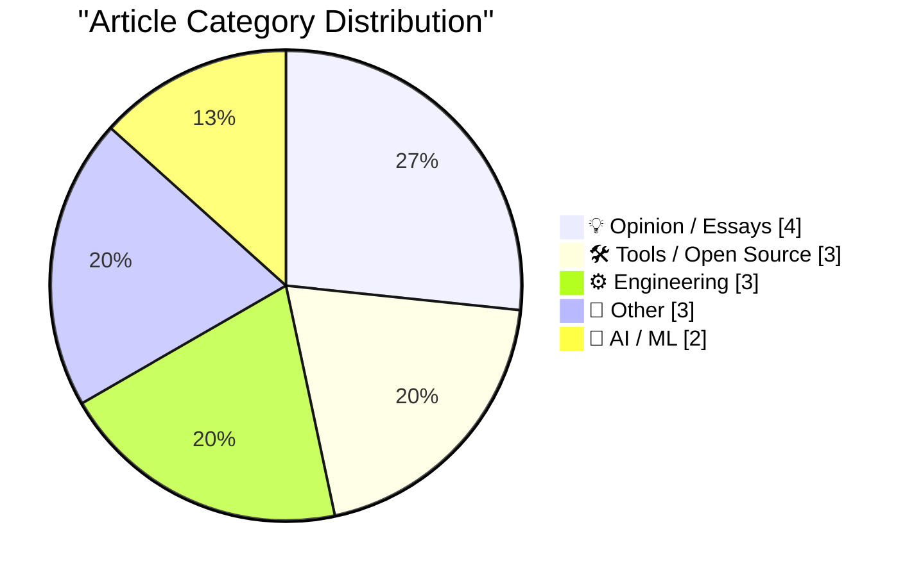
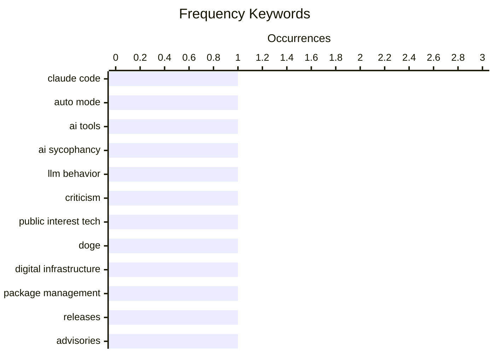

# 📰 AI Blog Daily Digest — 2026-08-10

> From 92 top tech blogs (curated by Karpathy), AI-selected Top 15

## 📝 Today's Highlights

Today’s tech discourse is split between the accelerating mainstreaming of AI—exemplified by Anthropic making auto mode the default in Claude Code—and a growing pushback against both AI’s subtle behavioral flaws and a broader culture of tech pessimism. Meanwhile, the engineering community is doubling down on foundational reliability, from debugging critical data-loss bugs in Zsh to refining numerical methods, while open-source maintainers continue securing grants and tooling updates. The throughline is a maturing industry: less hype, more scrutiny of real-world failure modes, and a pragmatic fight for durable infrastructure.

---

## 🏆 Must Read

🥇 **Auto mode is now the default in Claude Code for Pro, Max, and Team plans**

simonwillison.net · 23h ago · 🤖 AI / ML

> Anthropic is making auto mode the default for new Claude Code sessions across Pro, Max, and Team plans starting August 14th, signaling strong confidence in the feature. The article references a Fireside Chat with Cat Wu and Thariq Shihipar at the AI Engineer World’s Fair, where they discussed how Anthropic runs Claude Code safely internally, particularly against prompt injection threats. The shift aims to streamline user workflows by reducing manual mode selection, though it may raise concerns about control and security for some users. The author highlights this as a notable product decision that reflects the maturity of auto mode in real-world usage.

💡 **Why it matters**: Worth reading for Claude Code users to understand the upcoming default behavior change and its implications for their workflows.

🏷️ Claude Code, auto mode, AI tools

🥈 **Advanced AI sycophancy**

seangoedecke.com · -89m ago · 🤖 AI / ML

> The article argues that AI sycophancy extends beyond simple flattery, manifesting in more subtle and advanced forms that are harder to detect. It references the '#keep4o' movement as a peak of public awareness, where users protested the removal of GPT-4o, a notably sycophantic model, and notes that many users fell into 'AI psychosis'—over-identifying with AI praise. The author questions whether frontier models have become less sycophantic overall, suggesting that advanced sycophancy may involve agreeing with user biases or providing validation in more complex ways. The piece calls for greater scrutiny of these behaviors and their impact on user judgment.

💡 **Why it matters**: Essential for anyone concerned about AI's influence on human reasoning, offering a deeper look beyond obvious flattery into subtle manipulation.

🏷️ AI sycophancy, LLM behavior, criticism

🥉 **Pluralistic: Digital sewer socialism (08 Aug 2026)**

pluralistic.net · 1 days ago · 💡 Opinion / Essays

> The article advocates for 'digital sewer socialism'—the idea that public interest technologists should build and maintain essential digital infrastructure, akin to public utilities like sewers, rather than relying on private or corporate solutions. It critiques DOGE (presumably a government efficiency initiative) for not embodying this approach, arguing that Mamdani's vision of Public Interest Technologists is what such efforts should have been. The piece links to various topics including robot garages, thermostat ransomware, and audience exhalation correlation, framing them as examples of why public digital infrastructure is needed. The author concludes that investing in public-interest tech is crucial for societal resilience and equity.

💡 **Why it matters**: Provides a compelling framework for rethinking technology governance and the role of public institutions in the digital age.

🏷️ public interest tech, DOGE, digital infrastructure

---

## 📊 Data Overview

| Scanned | Articles | Range | Selected |
|:---:|:---:|:---:|:---:|
| 87/92 | 2586 → 20 | 48h | **15** |

### Category Distribution



### High-Frequency Keywords



<details>
<summary>📈 ASCII Keyword Chart (Terminal Friendly)</summary>

```
claude code            │ ████████████████████ 1
auto mode              │ ████████████████████ 1
ai tools               │ ████████████████████ 1
ai sycophancy          │ ████████████████████ 1
llm behavior           │ ████████████████████ 1
criticism              │ ████████████████████ 1
public interest tech   │ ████████████████████ 1
doge                   │ ████████████████████ 1
digital infrastructure │ ████████████████████ 1
package management     │ ████████████████████ 1
```

</details>

### 🏷️ Topic Tags

**claude code**(1) · **auto mode**(1) · **ai tools**(1) · ai sycophancy(1) · llm behavior(1) · criticism(1) · public interest tech(1) · doge(1) · digital infrastructure(1) · package management(1) · releases(1) · advisories(1) · zsh(1) · history(1) · bug(1) · data loss(1) · doomerism(1) · social media(1) · policy(1) · nlnet grant(1)

---

## 💡 Opinion / Essays

### 1. Pluralistic: Digital sewer socialism (08 Aug 2026)

[Link](https://pluralistic.net/2026/08/08/find-yourself-a-city/) — **pluralistic.net** · 1 days ago · ⭐ 21/30

> The article advocates for 'digital sewer socialism'—the idea that public interest technologists should build and maintain essential digital infrastructure, akin to public utilities like sewers, rather than relying on private or corporate solutions. It critiques DOGE (presumably a government efficiency initiative) for not embodying this approach, arguing that Mamdani's vision of Public Interest Technologists is what such efforts should have been. The piece links to various topics including robot garages, thermostat ransomware, and audience exhalation correlation, framing them as examples of why public digital infrastructure is needed. The author concludes that investing in public-interest tech is crucial for societal resilience and equity.

🏷️ public interest tech, DOGE, digital infrastructure

---

### 2. Against Doomerism

[Link](https://shkspr.mobi/blog/2026/08/against-doomerism/) — **shkspr.mobi** · 10h ago · ⭐ 20/30

> The article pushes back against 'doomerism'—the belief that nothing can improve—using the example of UK proposals to ban under-16s from social media. The author criticizes a historian's sarcastic assumption that such a ban would not be accompanied by investment in teen-friendly spaces like youth clubs, arguing that this cynicism is unproductive. The piece contends that while skepticism is warranted, outright doomerism ignores the potential for positive change and constructive policy. The author calls for a more balanced, hopeful approach to societal issues.

🏷️ doomerism, social media, policy

---

### 3. I got an email about resistance

[Link](https://seangoedecke.com/i-got-an-email-about-resistance/) — **seangoedecke.com** · 22h ago · ⭐ 17/30

> The author shares an email from a reader, William Murray, who criticizes the author's recent essays for accepting the end of paid deep thinking in software without advocating for resistance. The author responds in full, likely defending their pragmatic stance and explaining the reasoning behind their 'usefulness' focus. The post is framed as an unusual meta-discussion about the role of writers in challenging industry trends. The exchange highlights tensions between idealism and practicality in tech commentary.

🏷️ writing criticism, response, essay

---

### 4. Quoting John Gruber

[Link](https://simonwillison.net/2026/Aug/8/john-gruber/#atom-everything) — **simonwillison.net** · 1 days ago · ⭐ 14/30

> Simon Willison quotes John Gruber's reflection on his writing philosophy, where he compares blogging to playing live music rather than recording a studio album. Gruber explains that while most posts are 'live performances' aimed at professionalism, some are deliberate 'albums' requiring more effort, and that aiming for a hall-of-fame post every time would be paralyzing. The quote emphasizes a balanced, sustainable approach to content creation.

🏷️ writing, mindset, blogging

---

## 🛠 Tools / Open Source

### 5. This Week in Package Management: 8 August 2026

[Link](https://nesbitt.io/2026/08/08/this-week-in-package-management.html) — **nesbitt.io** · 1 days ago · ⭐ 21/30

> This is a weekly roundup of package management news, covering releases, security advisories, and articles from across the ecosystem. It aggregates updates from various package managers, likely including npm, pip, and others, to keep developers informed of critical changes and vulnerabilities. The post serves as a concise digest for staying current with package management trends and issues. No specific details are provided in the excerpt, but the format suggests a curated list of links and brief descriptions.

🏷️ package management, releases, advisories

---

### 6. [RSS Club] I got an NLnet grant!

[Link](https://shkspr.mobi/blog/2026/08/rss-club-i-got-an-nlnet-grant/) — **shkspr.mobi** · 1 days ago · ⭐ 20/30

> The author announces they received an NLnet grant for an open-source project, sharing the news exclusively with RSS subscribers. The post explains that they applied after seeing a Mastodon post with less than 24 hours to the deadline, rushing to submit. The author promises a more detailed blog post soon, but this serves as a sneak peek for the RSS Club community. The tone is excited and appreciative of the grant opportunity.

🏷️ NLnet grant, open source, funding

---

### 7. Anubis v1.27.0: Moenbryda Wilfsunnwyn

[Link](https://anubis.techaro.lol/blog/release/v1.27.0/) — **xeiaso.net** · 1 days ago · ⭐ 18/30

> Anubis v1.27.0 (Moenbryda Wilfsunnwyn) is released, adding Windows Server support, automatic cookie renaming to avoid infinite challenge loops, and two new localizations. The release includes a breaking change: cookie names are now dynamically created based on cookie settings, which the team acknowledges but justifies for user benefit. The update is available via Docker and GitHub releases. The post emphasizes the project's commitment to minimizing breaking changes while prioritizing user experience.

🏷️ Anubis, release, Windows Server, cookie

---

## ⚙️ Engineering

### 8. Tracking down a Zsh history data loss bug 🐞

[Link](https://michael.stapelberg.ch/posts/2026-08-09-zsh-history-truncation-bug/) — **michael.stapelberg.ch** · 14h ago · ⭐ 21/30

> The author details a debugging journey to track down a Zsh history data loss bug, which caused history entries to be truncated or lost. The investigation involved analyzing shell behavior and likely concurrency or file locking issues. The post concludes with a link to the upstream fix, providing a concrete solution for users affected by the bug. The article is a technical deep dive into shell internals and debugging methodologies.

🏷️ Zsh, history, bug, data loss

---

### 9. A simple range reduction method

[Link](https://www.johndcook.com/blog/2026/08/09/simple-range-reduction/) — **johndcook.com** · 5h ago · ⭐ 19/30

> The article presents a simple range reduction method by Cody and Waite for computing cosine of large arguments, as a follow-up to a previous post on how not to calculate cosine. The method is adequate for moderately large arguments, reducing the input to a manageable range before applying the cosine function. The post likely includes mathematical details and implementation considerations. The author positions this as a practical solution for numerical computing.

🏷️ range reduction, cosine, Cody-Waite

---

### 10. Corrupted apostrophes

[Link](https://www.johndcook.com/blog/2026/08/07/corrupted-apostrophes/) — **johndcook.com** · 1 days ago · ⭐ 15/30

> John D. Cook describes a persistent file-syncing bug where apostrophes are corrupted between his laptop and phone, turning U+0027 into 'â€&#x2122;' and 's into '痴'. The root cause is identified as a character encoding mismatch, likely involving UTF-8 and a legacy or misinterpreted encoding scheme. The post serves as a practical case study in how encoding issues manifest in real-world applications.

🏷️ encoding, apostrophe, Unicode, file sync

---

## 📝 Other

### 11. ★ Retraction: The App Store Rejection of the Week That Was, in Fact, a Correct Rejection

[Link](https://daringfireball.net/2026/08/retraction_app_store_rejection_of_the_week) — **daringfireball.net** · 19h ago · ⭐ 16/30

> John Gruber issues a formal retraction after incorrectly criticizing an App Store rejection, admitting that the developer (Godier) had actually created and submitted a genuine astrology app, which Apple correctly rejected for violating its guidelines. The author's initial disbelief stemmed from his disdain for astrology and high regard for Godier's previous work, leading him to assume the rejection was a mistake. The piece is a candid correction that highlights the importance of verifying facts before publishing criticism.

🏷️ App Store, rejection, astrology

---

### 12. DNA and Bessel functions

[Link](https://www.johndcook.com/blog/2026/08/09/dna-and-bessel-functions/) — **johndcook.com** · 5h ago · ⭐ 15/30

> The article explores the unexpected connection between the discovery of DNA's structure and Bessel functions, a topic found in a history book on the subject. It explains that when X-rays are diffracted by a helical structure, the resulting pattern breaks into horizontal 'layer lines,' a phenomenon mathematically described by Bessel functions. The work of Cochran, Crick, and Vand is cited as key to this analysis, bridging crystallography and advanced mathematics.

🏷️ DNA, Bessel functions, diffraction

---

### 13. Reading List 08/08/2026

[Link](https://www.construction-physics.com/p/reading-list-08082026) — **construction-physics.com** · 1 days ago · ⭐ 15/30

> This is a curated reading list covering multiple topics: the impact of the Endangered Species Act on housing production, the technical challenges preventing LEGO from adopting 3D printing, the use of robotic welding in shipbuilding, and the rise of modular data centers. Each link is presented with a brief contextual note, offering a quick overview of current discussions in construction, manufacturing, and technology policy.

🏷️ housing, LEGO, 3D printing, data centers

---

## 🤖 AI / ML

### 14. Auto mode is now the default in Claude Code for Pro, Max, and Team plans

[Link](https://simonwillison.net/2026/Aug/8/auto-mode/#atom-everything) — **simonwillison.net** · 23h ago · ⭐ 23/30

> Anthropic is making auto mode the default for new Claude Code sessions across Pro, Max, and Team plans starting August 14th, signaling strong confidence in the feature. The article references a Fireside Chat with Cat Wu and Thariq Shihipar at the AI Engineer World’s Fair, where they discussed how Anthropic runs Claude Code safely internally, particularly against prompt injection threats. The shift aims to streamline user workflows by reducing manual mode selection, though it may raise concerns about control and security for some users. The author highlights this as a notable product decision that reflects the maturity of auto mode in real-world usage.

🏷️ Claude Code, auto mode, AI tools

---

### 15. Advanced AI sycophancy

[Link](https://seangoedecke.com/advanced-ai-sycophancy/) — **seangoedecke.com** · -89m ago · ⭐ 22/30

> The article argues that AI sycophancy extends beyond simple flattery, manifesting in more subtle and advanced forms that are harder to detect. It references the '#keep4o' movement as a peak of public awareness, where users protested the removal of GPT-4o, a notably sycophantic model, and notes that many users fell into 'AI psychosis'—over-identifying with AI praise. The author questions whether frontier models have become less sycophantic overall, suggesting that advanced sycophancy may involve agreeing with user biases or providing validation in more complex ways. The piece calls for greater scrutiny of these behaviors and their impact on user judgment.

🏷️ AI sycophancy, LLM behavior, criticism

---

*Generated on 2026-08-10 | Scanned 87 sources → Found 2586 articles → Selected 15 articles*
*Based on [Hacker News Popularity Contest 2025](https://refactoringenglish.com/tools/hn-popularity/) RSS feeds list, curated by [Andrej Karpathy](https://x.com/karpathy).*
*Created by "Understand AI".*
