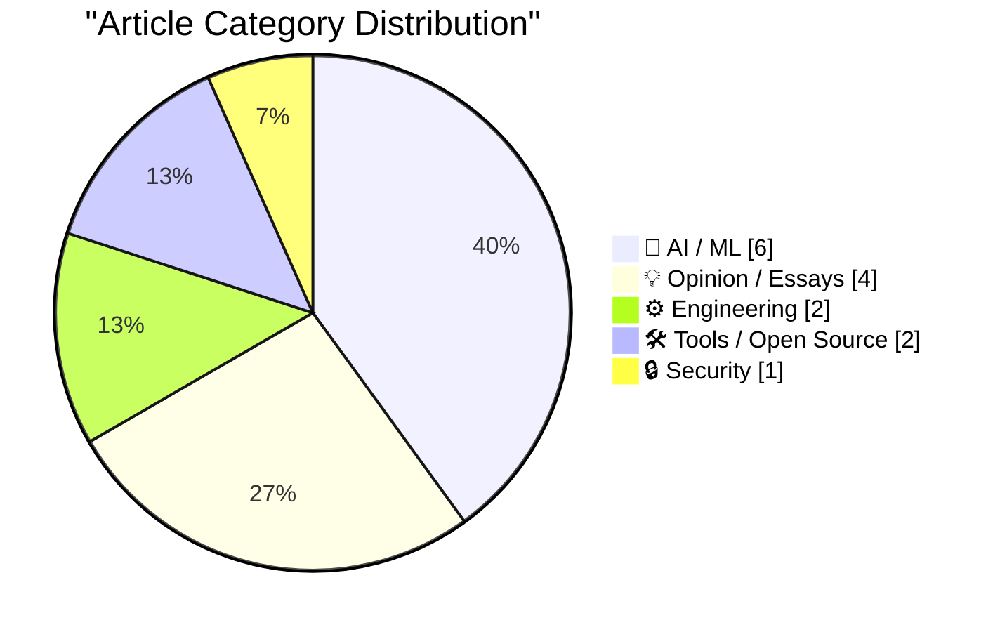
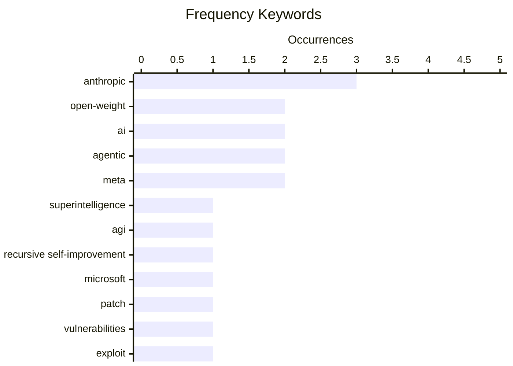

# 📰 AI Blog Daily Digest — 2026-08-12

> From 92 top tech blogs (curated by Karpathy), AI-selected Top 15

## 📝 Today's Highlights

Today’s tech landscape is dominated by an accelerating AI arms race, with debates over the timeline for runaway superintelligence, the rising costs of long agentic sessions, and major open-weight releases like Meta’s Muse Glimmer challenging assumptions about local versus cloud inference. Meanwhile, security remains a critical front, as Microsoft’s massive Patch Tuesday—addressing nearly 400 vulnerabilities—underscores the relentless pressure on enterprise defenses. Finally, the industry is grappling with structural constraints, from Apple’s lobbying for memory chip access amid a RAM crisis to deeper questions about AI transparency, licensing semantics, and the hidden infrastructure costs that will shape the next wave of deployment.

---

## 🏆 Must Read

🥇 **Ryan Greenblatt – Human level AIs might build runaway superintelligences by 2032**

dwarkesh.com · 6h ago · 🤖 AI / ML

> Ryan Greenblatt debates the timeline and feasibility of recursive self-improvement leading to runaway superintelligence, arguing that human-level AIs could potentially build such systems by 2032. The discussion covers the technical pathways, safety concerns, and the likelihood of rapid capability gains once AI reaches human parity. Greenblatt emphasizes the unpredictability of recursive improvement loops and the need for proactive safety measures. The core conclusion is that the 2032 timeline is plausible but highly uncertain, requiring urgent preparation.

💡 **Why it matters**: This is a must-read for anyone tracking AI timelines and existential risk, offering a concrete, expert-backed scenario for superintelligence that challenges complacent forecasts.

🏷️ superintelligence, AGI, recursive self-improvement

🥈 **Microsoft Plugs Nearly 400 Security Holes**

krebsonsecurity.com · 1h ago · 🔒 Security

> Microsoft's August 2026 Patch Tuesday addresses at least 398 security vulnerabilities across Windows and supported software, including one actively exploited zero-day and two publicly disclosed flaws. The update covers critical remote code execution, privilege escalation, and denial-of-service issues. Users are urged to apply patches immediately, especially for the exploited vulnerability. This release underscores the ongoing scale of Microsoft's security maintenance and the importance of timely patching.

💡 **Why it matters**: Essential reading for IT administrators and security professionals to prioritize patching and understand the current threat landscape affecting Microsoft products.

🏷️ Microsoft, patch, vulnerabilities, exploit

🥉 **The NYT and WSJ on Apple, China, and the RAM Crisis**

daringfireball.net · 1 days ago · ⚙️ Engineering

> Apple and other consumer electronics companies are lobbying for permission to buy memory chips from Chinese manufacturer YMTC, citing the global memory chip shortage and rising prices. Apple's earlier 2022 talks with YMTC stalled under political pressure, but the current crisis is pushing renewed efforts. The article highlights the tension between geopolitical restrictions and industry needs. The outcome could reshape the memory supply chain and affect consumer electronics pricing.

💡 **Why it matters**: This piece is vital for understanding the intersection of geopolitics and tech supply chains, with direct implications for device costs and industry strategy.

🏷️ Apple, China, memory chips, supply chain

---

## 📊 Data Overview

| Scanned | Articles | Range | Selected |
|:---:|:---:|:---:|:---:|
| 88/92 | 2612 → 57 | 48h | **15** |

### Category Distribution



### High-Frequency Keywords



<details>
<summary>📈 ASCII Keyword Chart (Terminal Friendly)</summary>

```
anthropic                  │ ████████████████████ 3
open-weight                │ █████████████░░░░░░░ 2
ai                         │ █████████████░░░░░░░ 2
agentic                    │ █████████████░░░░░░░ 2
meta                       │ █████████████░░░░░░░ 2
superintelligence          │ ███████░░░░░░░░░░░░░ 1
agi                        │ ███████░░░░░░░░░░░░░ 1
recursive self-improvement │ ███████░░░░░░░░░░░░░ 1
microsoft                  │ ███████░░░░░░░░░░░░░ 1
patch                      │ ███████░░░░░░░░░░░░░ 1
```

</details>

### 🏷️ Topic Tags

**anthropic**(3) · **open-weight**(2) · **ai**(2) · agentic(2) · meta(2) · superintelligence(1) · agi(1) · recursive self-improvement(1) · microsoft(1) · patch(1) · vulnerabilities(1) · exploit(1) · apple(1) · china(1) · memory chips(1) · supply chain(1) · open-source(1) · nyt(1) · cache(1) · cost(1)

---

## 🤖 AI / ML

### 1. Ryan Greenblatt – Human level AIs might build runaway superintelligences by 2032

[Link](https://www.dwarkesh.com/p/ryan-greenblatt) — **dwarkesh.com** · 6h ago · ⭐ 27/30

> Ryan Greenblatt debates the timeline and feasibility of recursive self-improvement leading to runaway superintelligence, arguing that human-level AIs could potentially build such systems by 2032. The discussion covers the technical pathways, safety concerns, and the likelihood of rapid capability gains once AI reaches human parity. Greenblatt emphasizes the unpredictability of recursive improvement loops and the need for proactive safety measures. The core conclusion is that the 2032 timeline is plausible but highly uncertain, requiring urgent preparation.

🏷️ superintelligence, AGI, recursive self-improvement

---

### 2. Open-source is NOT the same as open-weight

[Link](https://garymarcus.substack.com/p/open-source-is-not-the-same-as-open) — **garymarcus.substack.com** · 1 days ago · ⭐ 25/30

> Gary Marcus criticizes The New York Times for conflating open-source with open-weight AI models, arguing that open-weight models (like those from Meta) do not provide full transparency or modification rights. He explains that true open-source requires access to training data, code, and the ability to fully understand and alter the model. Marcus warns that this confusion could lead to misguided policy and public trust issues. The core point is that the distinction matters immensely for accountability and safety.

🏷️ open-source, open-weight, AI, NYT

---

### 3. Watch out for cache read costs

[Link](https://martinalderson.com/posts/watch-out-for-cache-read-costs/?utm_source=rss&amp;utm_medium=rss&amp;utm_campaign=feed) — **martinalderson.com** · 1 days ago · ⭐ 25/30

> Martin Alderson analyzes the cost structure of long agentic AI sessions, revealing that cache reads dominate the bill, not input or output tokens. While KV cache sizes have shrunk dramatically, cache read pricing has remained high, making it the primary cost driver. The article provides specific pricing comparisons and suggests strategies to optimize cache usage. The conclusion is that developers must rethink their cost models for agentic workloads.

🏷️ cache, cost, agentic, KV cache

---

### 4. Introducing Muse Glimmer

[Link](https://simonwillison.net/2026/Aug/10/introducing-muse-glimmer/#atom-everything) — **simonwillison.net** · 22h ago · ⭐ 23/30

> Meta releases Muse Glimmer, a 30B parameter open-weight model under the Apache 2.0 license, marking a return to open weights with a cleaner license than previous Llama models. The model is optimized for end-to-end agentic task completion, achieving strong success rates on benchmarks like DeepSearch QA, MCP-Atlas, τ-Bench, and SWE-Bench. It is designed to work within scaffolds and tools, making it suitable for local deployment. This release signals Meta's renewed commitment to open-weight AI with a focus on agentic capabilities.

🏷️ open-weights, Meta, 30B, agentic

---

### 5. Anthropic Posts ‘How Claude Marks AI-Generated Content’ Without Explaining How Claude Marks AI-Generated Content

[Link](https://support.claude.com/en/articles/16266773-how-claude-marks-ai-generated-content) — **daringfireball.net** · 4h ago · ⭐ 23/30

> Anthropic publishes a support page explaining its compliance with the EU AI Act's Article 50(2) Code of Practice on transparency of AI-generated content, but the page lacks specific details on how Claude actually marks such content. It mentions that supported Claude models will mark generated plain text, but does not disclose the method or technical implementation. The article is a placeholder for future detailed guidance. This vagueness raises questions about the practical enforcement of AI content transparency.

🏷️ AI-generated content, transparency, EU AI Act, Anthropic

---

### 6. Quoting Claude Opus 5 system prompt

[Link](https://simonwillison.net/2026/Aug/9/claude-opus-5-system-prompt/#atom-everything) — **simonwillison.net** · 1 days ago · ⭐ 21/30

> This article quotes the system prompt for Claude Opus 5, revealing that two models, 'Claude Fable 5' and 'Claude Mythos 5', were released on June 9, 2026, but suspended on June 12 due to U.S. Department of Commerce export controls. Access was restored on July 1, 2026, after the controls were lifted on June 30. The system prompt includes a notice about these events because they occurred after the model's training-data cutoff, ensuring the model is aware of its own temporary unavailability.

🏷️ Claude, system prompt, export controls, Anthropic

---

## 💡 Opinion / Essays

### 7. No, local models will not win

[Link](https://seangoedecke.com/local-models-will-not-win/) — **seangoedecke.com** · 22h ago · ⭐ 23/30

> Sean Goedecke argues that local AI models will never dominate inference, despite the release of stronger open-weight models. He contends that local models are inherently less powerful than datacenter-based ones, and the gap will persist due to hardware and data constraints. The article also points out that most users prefer the convenience and capability of cloud-based AI. The conclusion is that datacenter inference will remain the norm for the foreseeable future.

🏷️ local models, open-weight, datacenter, AI infrastructure

---

### 8. Don't Look Up

[Link](https://www.wheresyoured.at/dont-look-up/) — **wheresyoured.at** · 3h ago · ⭐ 22/30

> This is a promotional pitch for a premium newsletter subscription, not a technical article. It advertises a weekly newsletter costing $70/year or $7/month, which typically contains 5,000 to 18,000 words of in-depth analysis. The content focuses on detailed examinations of major tech companies like NVIDIA and Anthropic. The core value proposition is access to extensive, high-quality industry analysis.

🏷️ NVIDIA, Anthropic, AI industry, analysis

---

### 9. Mark Zuckerberg Posts 6,500-Word AI Essay

[Link](https://www.meta.com/thefutureisforeveryone/) — **daringfireball.net** · 2h ago · ⭐ 21/30

> Mark Zuckerberg published a 6,500-word expanded version of his earlier 1,000-word essay 'The AI Future Is for Everyone', but the author notes it 'almost says nothing more' than the original. The only notable new tidbit is a claim about Meta's data center in Richland Parish, Louisiana, where increased tax revenue funded $50,000 bonuses for local teachers. The author highlights this as a concrete example of local economic impact, but criticizes the essay's overall lack of new substance.

🏷️ Zuckerberg, AI essay, Meta, AI future

---

### 10. ‘The Problem With Vibe-Coded Flattery’

[Link](https://tedium.co/2026/08/09/vibe-coding-insincerity/) — **daringfireball.net** · 1 days ago · ⭐ 21/30

> Ernie Smith at Tedium criticizes the trend of 'vibe-coded' apps, where users send pitches that are clearly written by AI chatbots. He notes that while he receives more emails about new apps, a significant portion are obviously AI-generated and are immediately discarded. The core problem is the insincerity of these pitches, which undermines trust in the passion and authenticity of the builders. Smith argues that if the passion behind a product isn't real, the product itself is in trouble.

🏷️ vibe coding, AI, authenticity, developer culture

---

## ⚙️ Engineering

### 11. The NYT and WSJ on Apple, China, and the RAM Crisis

[Link](https://www.nytimes.com/2026/08/10/technology/memory-chip-shortage-ai.html?unlocked_article_code=1.4VA.49f7.Qj8S541DkkOz) — **daringfireball.net** · 1 days ago · ⭐ 25/30

> Apple and other consumer electronics companies are lobbying for permission to buy memory chips from Chinese manufacturer YMTC, citing the global memory chip shortage and rising prices. Apple's earlier 2022 talks with YMTC stalled under political pressure, but the current crisis is pushing renewed efforts. The article highlights the tension between geopolitical restrictions and industry needs. The outcome could reshape the memory supply chain and affect consumer electronics pricing.

🏷️ Apple, China, memory chips, supply chain

---

### 12. Extending immutability: deletion without losing data

[Link](https://www.tigrisdata.com/blog/soft-delete-deep-dive/) — **xeiaso.net** · 22h ago · ⭐ 23/30

> Tigris discusses the challenges of deletion in geo-replicated active-active databases, proposing a soft-delete approach using a Recycle Bin for objects. The article explains how tombstones are used to mark deleted data, but the Recycle Bin allows users to undo accidental deletions. This design balances data durability with user control, addressing the complexity of distributed deletion. The core point is that soft deletion is essential for user trust and data recovery in distributed systems.

🏷️ distributed systems, deletion, tombstones, geo-replication

---

## 🛠 Tools / Open Source

### 13. Shared Code Between Package Managers

[Link](https://nesbitt.io/2026/08/11/package-manager-library-reuse.html) — **nesbitt.io** · 12h ago · ⭐ 23/30

> Nesbitt.io analyzes the shared code reuse among twenty package managers, revealing which libraries are commonly borrowed from each other. The article identifies specific dependencies and patterns, showing how package managers build on existing infrastructure. It highlights the benefits and risks of such reuse, including security and maintenance implications. The conclusion is that understanding these dependencies is crucial for improving package manager robustness.

🏷️ package managers, code reuse, libraries

---

### 14. GitHub Models is now retired

[Link](https://simonwillison.net/2026/Aug/9/github-models-is-now-retired/#atom-everything) — **simonwillison.net** · 1 days ago · ⭐ 22/30

> GitHub Models, a unified API and playground for multiple LLM providers, has been fully retired, with a scheduled brownout period now complete. The retirement was first noticed when GitHub Actions runs began failing with a 'temporarily unavailable' error message that is now stale. The service was described as an 'odd-shaped duck' because its main value was providing a single API across various providers, but it has been discontinued. Users who relied on this unified API for their code will need to migrate to direct provider APIs or alternative solutions.

🏷️ GitHub Models, retirement, API, brownout

---

## 🔒 Security

### 15. Microsoft Plugs Nearly 400 Security Holes

[Link](https://krebsonsecurity.com/2026/08/microsoft-plugs-nearly-400-security-holes/) — **krebsonsecurity.com** · 1h ago · ⭐ 25/30

> Microsoft's August 2026 Patch Tuesday addresses at least 398 security vulnerabilities across Windows and supported software, including one actively exploited zero-day and two publicly disclosed flaws. The update covers critical remote code execution, privilege escalation, and denial-of-service issues. Users are urged to apply patches immediately, especially for the exploited vulnerability. This release underscores the ongoing scale of Microsoft's security maintenance and the importance of timely patching.

🏷️ Microsoft, patch, vulnerabilities, exploit

---

*Generated on 2026-08-12 | Scanned 88 sources → Found 2612 articles → Selected 15 articles*
*Based on [Hacker News Popularity Contest 2025](https://refactoringenglish.com/tools/hn-popularity/) RSS feeds list, curated by [Andrej Karpathy](https://x.com/karpathy).*
*Created by "Understand AI".*
