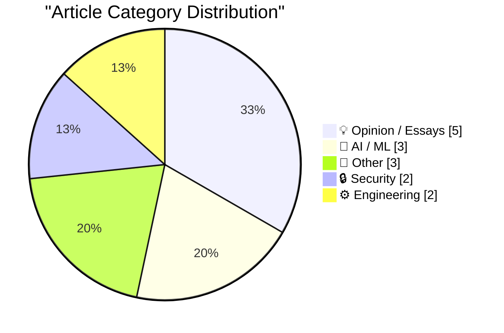
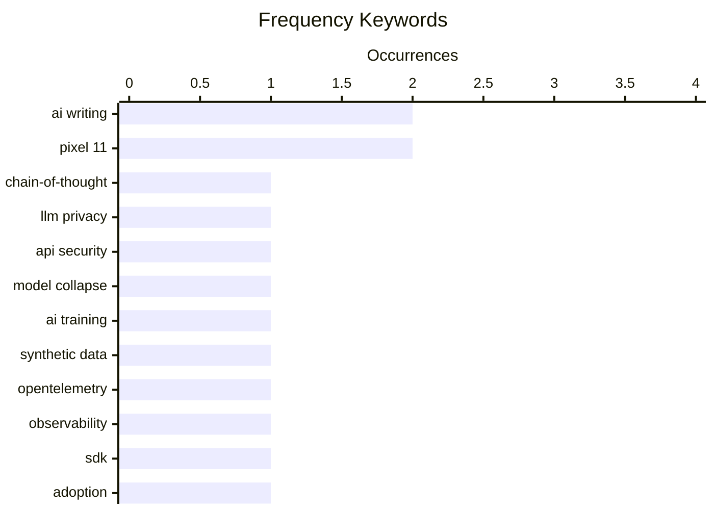

# 📰 AI Blog Daily Digest — 2026-08-13

> From 92 top tech blogs (curated by Karpathy), AI-selected Top 15

## 📝 Today's Highlights

Today’s tech discourse is dominated by a deepening skepticism of AI’s reliability and provenance, from new attacks that extract reasoning traces from proprietary models to growing concerns about model collapse and the detectable hallmarks of machine-generated text. Simultaneously, the engineering community is questioning foundational tools and productivity narratives, with OpenTelemetry’s promise under fire and a broader reckoning over where efficiency gains have actually gone. Underpinning these debates is a sharpened focus on systemic fragility—whether through surveillance capitalism’s tensions, circular financing schemes, or the limits of cryptographic security—signaling a day where trust, transparency, and sustainability in tech took center stage.

---

## 🏆 Must Read

🥇 **Stealing Reasoning Traces from Proprietary LLM APIs**

simonwillison.net · 23h ago · 🔒 Security

> A new paper demonstrates a practical attack on proprietary LLM APIs (Anthropic, OpenAI, Google) by exploiting encrypted chain-of-thought (CoT) blocks that can be replayed across sessions, users, and models. The researchers take a trace from a frontier model, replay it into a weaker sibling model, jailbreak the weaker model, and recover the stronger model's hidden reasoning in plaintext. This reveals that encrypted CoT blocks are not secure against replay attacks, undermining the promise of hidden reasoning. The attack is demonstrated with a simple curl command, showing the vulnerability is easily accessible. The core issue is that encryption alone does not protect reasoning traces from being extracted via model-to-model transfer.

💡 **Why it matters**: This is a critical security finding that exposes a fundamental flaw in how leading AI vendors protect their models' reasoning, with direct implications for API security and trust in proprietary LLMs.

🏷️ chain-of-thought, LLM privacy, API security

🥈 **Pluralistic: Model collapse (12 Aug 2026)**

pluralistic.net · 13h ago · 🤖 AI / ML

> Cory Doctorow's 'Model collapse' discusses the phenomenon where AI models trained on data generated by other AI models degrade over time, leading to a loss of diversity and quality. He argues that this 'training on your own output' creates a feedback loop that amplifies biases and errors, ultimately making models less useful and more homogenized. Doctorow connects this to broader issues of monoculture and the 'insurance value of biodiversity' in AI ecosystems. He suggests that maintaining diverse, human-generated data sources is essential to prevent model collapse. The post also includes links to other delights and updates on his appearances and books.

💡 **Why it matters**: This is a timely and accessible explanation of a critical AI risk (model collapse) that is often overlooked, with implications for anyone relying on AI-generated content or models.

🏷️ model collapse, AI training, synthetic data

🥉 **OTel Isn't Going Well (And I Made A Spreadsheet About It)**

matduggan.com · 11h ago · ⚙️ Engineering

> Mat Duggan argues that OpenTelemetry (OTel) is not living up to its promise, and he has created a spreadsheet to track its shortcomings. The core complaint from teams is that OTel 'isn't done yet,' and Duggan's analysis reveals gaps in maturity, documentation, and vendor support compared to proprietary SDKs. He provides a detailed comparison of OTel's features against vendor-specific solutions, highlighting areas where OTel lags. The spreadsheet serves as a practical tool for teams evaluating OTel adoption. Duggan concludes that while OTel has potential, it is not yet a drop-in replacement for many observability needs.

💡 **Why it matters**: This is a must-read for any engineering team considering OpenTelemetry, as it provides a data-driven, honest assessment of its current limitations and helps set realistic expectations.

🏷️ OpenTelemetry, observability, SDK, adoption

---

## 📊 Data Overview

| Scanned | Articles | Range | Selected |
|:---:|:---:|:---:|:---:|
| 87/92 | 2587 → 54 | 48h | **15** |

### Category Distribution



### High-Frequency Keywords



<details>
<summary>📈 ASCII Keyword Chart (Terminal Friendly)</summary>

```
ai writing       │ ████████████████████ 2
pixel 11         │ ████████████████████ 2
chain-of-thought │ ██████████░░░░░░░░░░ 1
llm privacy      │ ██████████░░░░░░░░░░ 1
api security     │ ██████████░░░░░░░░░░ 1
model collapse   │ ██████████░░░░░░░░░░ 1
ai training      │ ██████████░░░░░░░░░░ 1
synthetic data   │ ██████████░░░░░░░░░░ 1
opentelemetry    │ ██████████░░░░░░░░░░ 1
observability    │ ██████████░░░░░░░░░░ 1
```

</details>

### 🏷️ Topic Tags

**ai writing**(2) · **pixel 11**(2) · **chain-of-thought**(1) · llm privacy(1) · api security(1) · model collapse(1) · ai training(1) · synthetic data(1) · opentelemetry(1) · observability(1) · sdk(1) · adoption(1) · detection(1) · style(1) · surveillance(1) · privacy(1) · politics(1) · technology(1) · llm(1) · engineering culture(1)

---

## 💡 Opinion / Essays

### 1. Pluralistic: Surveillance vs guillotines (11 Aug 2026)

[Link](https://pluralistic.net/2026/08/11/tragedy-of-the-commoners/) — **pluralistic.net** · 1 days ago · ⭐ 23/30

> Cory Doctorow's 'Surveillance vs guillotines' explores the tension between surveillance capitalism and public backlash, arguing that the 'tragedy of the commoners' is that surveillance systems often lead to exploitation and resistance. He discusses how companies and governments use surveillance to extract value from users, but this can backfire when it becomes too oppressive. Doctorow draws parallels to historical uprisings, suggesting that extreme surveillance can provoke drastic responses. He also links to other stories about DeCSS, the Warhol Worm, and more. The post concludes that the 'fleece the rubes' mentality is unsustainable and may lead to systemic change.

🏷️ surveillance, privacy, politics, technology

---

### 2. There are no lossless transformations of natural-language text

[Link](https://simonwillison.net/2026/Aug/11/there-are-no-lossless-transformations-of-natural-language-text/) — **simonwillison.net** · 22h ago · ⭐ 22/30

> Sophie Alpert shares her 'internal policy on acceptable use of AI writing by engineers,' arguing that there are no lossless transformations of natural-language text. She emphasizes that engineers must stand behind every idea and sentence in their docs, ensuring the document represents their own thoughts before sharing. The policy allows LLM assistance for editing but not for generating new ideas or content. Alpert's rule is that AI can help massage writing but not replace the author's intent. The post is a short, practical guide for teams navigating AI use in technical writing.

🏷️ AI writing, LLM, engineering culture

---

### 3. Where Did the Productivity Gains Go?

[Link](https://idiallo.com/blog/where-did-the-productivity-gains-go) — **idiallo.com** · 10h ago · ⭐ 21/30

> Ibrahim Diallo reflects on his first data entry job at a non-profit, using it as a metaphor for the disconnect between productivity gains and worker experience. He describes a 'Productivity' machine with a knob and a reset button, where increasing productivity often leads to burnout and reset. His job involved manually entering donation data from various email formats into a database, a task that was tedious and error-prone. He contrasts this with the promise of automation, noting that productivity gains often don't benefit the workers. The post concludes that the pursuit of productivity can be dehumanizing, and the 'reset' button is a reminder of the cyclical nature of work.

🏷️ productivity, data entry, automation, work

---

### 4. Netflix Has Peaked

[Link](https://sharptext.net/2026/is-netflix-washed-now/) — **daringfireball.net** · 1 days ago · ⭐ 19/30

> Andrew Sharp analyzes Netflix's market position after its latest earnings, arguing that despite reaching 85% of American viewers and 325 million global subscribers, growth is naturally slowing due to the law of large numbers. He explicitly states he is not predicting imminent doom, but rather contextualizing the company's current anxiety-inducing slowdown as an inevitable consequence of near-total market saturation. The piece examines whether Netflix's dominance has peaked in terms of subscriber acquisition, not necessarily in revenue or content quality.

🏷️ Netflix, streaming, peak, earnings

---

### 5. The Fruits of AI

[Link](https://blog.jim-nielsen.com/2026/fruit-of-ai/) — **blog.jim-nielsen.com** · 1 days ago · ⭐ 19/30

> Jim Nielsen critiques Terry Godier's 'Mea culpa' post, highlighting Godier's admission of being 'careless in relying on AI' without understanding the underlying work. Nielsen argues that carelessness is the inherent 'grain' of AI tools—they encourage and default to shallow engagement. He concludes that maintaining quality requires constant vigilance and deliberate, active participation to counteract this default behavior.

🏷️ AI, reliability, criticism

---

## 🤖 AI / ML

### 6. Pluralistic: Model collapse (12 Aug 2026)

[Link](https://pluralistic.net/2026/08/12/insurance-value-of-biodiversity/) — **pluralistic.net** · 13h ago · ⭐ 25/30

> Cory Doctorow's 'Model collapse' discusses the phenomenon where AI models trained on data generated by other AI models degrade over time, leading to a loss of diversity and quality. He argues that this 'training on your own output' creates a feedback loop that amplifies biases and errors, ultimately making models less useful and more homogenized. Doctorow connects this to broader issues of monoculture and the 'insurance value of biodiversity' in AI ecosystems. He suggests that maintaining diverse, human-generated data sources is essential to prevent model collapse. The post also includes links to other delights and updates on his appearances and books.

🏷️ model collapse, AI training, synthetic data

---

### 7. The Economist: ‘How to Spot AI Writing’

[Link](https://www.economist.com/culture/2026/07/30/how-to-spot-ai-writing?giftId=NzBlNTc2OGItMDgxNS00N2EzLWE4NmUtZDgzZmE4Y2FkM2Mw) — **daringfireball.net** · 1 days ago · ⭐ 23/30

> The Economist conducted a study to identify hallmarks of AI writing by comparing its own human-written prose with output from top LLMs (ChatGPT, Claude, Gemini, Grok). The study found that AI writing tends to be more formulaic, with predictable sentence structures and a lack of distinctive voice. Specific markers include overuse of certain transitional phrases and a tendency toward generic, 'safe' language. The article provides concrete examples and analysis to help readers spot AI-generated text. The conclusion is that while AI writing is improving, it still lacks the nuance and originality of human journalism.

🏷️ AI writing, detection, style

---

### 8. TechCrunch on Google’s Pixel 11 Lineup

[Link](https://techcrunch.com/2026/08/12/pixel-11-has-few-hardware-changes-and-more-gemini/) — **daringfireball.net** · 2h ago · ⭐ 21/30

> TechCrunch reports on Google's Pixel 11 lineup, which focuses on agentic AI to complete tasks for users. With Gemini, U.S. users can order groceries, book rides, get coffee, and make reservations via AI calls to businesses. Users can take over or stop tasks at any time and review transcripts of AI-operated calls. The hardware changes are minimal, with the emphasis on AI capabilities. A new slate of connected apps will be rolled out over the next few weeks.

🏷️ Gemini, agentic AI, Pixel 11

---

## 📝 Other

### 9. BREAKING: Circular financing reaches new heights

[Link](https://garymarcus.substack.com/p/breaking-circular-financing-reaches) — **garymarcus.substack.com** · 1 days ago · ⭐ 20/30

> Gary Marcus reports on 'circular financing' reaching new heights, where companies fund each other in a loop, creating a fragile financial ecosystem. He warns that 'things could get bad if this all falls apart,' highlighting the risks of interconnected debt and valuation inflation. The post suggests that this practice is unsustainable and could lead to a systemic crisis. Marcus's analysis is brief but points to a growing concern in the tech and finance sectors.

🏷️ financing, economy, risk

---

### 10. The Talk Show: ‘Getting the Snack Right’

[Link](https://daringfireball.net/thetalkshow/2026/08/10/ep-454) — **daringfireball.net** · 1 days ago · ⭐ 19/30

> The Talk Show episode 454 features Chance Miller discussing iOS 27's summer development progress, live baseball streaming in Vision Pro, the current RAM crisis, Apple's trade secret lawsuit against OpenAI and io, and the EU/DMA regulatory situation. The episode is sponsored by Squarespace (10% off with code TALKSHOW), Factor (50% off plus free breakfast item per box for a year with code talkshow50off), and Notion. The conversation covers Apple's legal and regulatory battles alongside product updates.

🏷️ iOS, Vision Pro, Apple, lawsuit

---

### 11. Joanna Stern on the Pixel 11 ‘HiLight’ Notification Light

[Link](https://thenewthings.com/p/the-new-pixel-feature-i-want-on-my-iphone?gift_content=e9bf3ebd-db33-4ee5-91b0-84d7acac3263) — **daringfireball.net** · 1h ago · ⭐ 18/30

> Joanna Stern praises Google's Pixel 11 'HiLight' notification light, which revives the classic BlackBerry-style blinking LED but enhances it by allowing custom colors for VIP contacts. This lets users identify who is messaging them without picking up the phone, even when it's face down. Stern fondly recalls her BlackBerry and Droid 2's customizable notification lights, calling the new feature a 'rainbow dream' and expressing a desire to have it on her iPhone.

🏷️ Pixel 11, notification light, smartphone

---

## 🔒 Security

### 12. Stealing Reasoning Traces from Proprietary LLM APIs

[Link](https://simonwillison.net/2026/Aug/11/stealing-reasoning-traces/) — **simonwillison.net** · 23h ago · ⭐ 25/30

> A new paper demonstrates a practical attack on proprietary LLM APIs (Anthropic, OpenAI, Google) by exploiting encrypted chain-of-thought (CoT) blocks that can be replayed across sessions, users, and models. The researchers take a trace from a frontier model, replay it into a weaker sibling model, jailbreak the weaker model, and recover the stronger model's hidden reasoning in plaintext. This reveals that encrypted CoT blocks are not secure against replay attacks, undermining the promise of hidden reasoning. The attack is demonstrated with a simple curl command, showing the vulnerability is easily accessible. The core issue is that encryption alone does not protect reasoning traces from being extracted via model-to-model transfer.

🏷️ chain-of-thought, LLM privacy, API security

---

### 13. Manually unbreakable cryptography

[Link](https://www.johndcook.com/blog/2026/08/11/manually-unbreakable-cryptography/) — **johndcook.com** · 1 days ago · ⭐ 20/30

> John D. Cook explores the challenge of 'manually unbreakable cryptography' in a pre-computer era. He notes that while modern encryption like RSA would be unbreakable for attackers without computers, users also lack computers, making encryption impractical. He discusses the need for manual cryptography that is both secure and usable by hand. Cook suggests that historical ciphers, like the Vigenère cipher, were breakable with enough effort, but a well-designed manual system could be secure for practical purposes. The post concludes that the key is balancing security with usability in a manual context.

🏷️ cryptography, manual, encryption

---

## ⚙️ Engineering

### 14. OTel Isn't Going Well (And I Made A Spreadsheet About It)

[Link](https://matduggan.com/otel-isnt-going-well-and-i-made-a-spreadsheet-about-it/) — **matduggan.com** · 11h ago · ⭐ 24/30

> Mat Duggan argues that OpenTelemetry (OTel) is not living up to its promise, and he has created a spreadsheet to track its shortcomings. The core complaint from teams is that OTel 'isn't done yet,' and Duggan's analysis reveals gaps in maturity, documentation, and vendor support compared to proprietary SDKs. He provides a detailed comparison of OTel's features against vendor-specific solutions, highlighting areas where OTel lags. The spreadsheet serves as a practical tool for teams evaluating OTel adoption. Duggan concludes that while OTel has potential, it is not yet a drop-in replacement for many observability needs.

🏷️ OpenTelemetry, observability, SDK, adoption

---

### 15. Quoting Florian Herrengt

[Link](https://simonwillison.net/2026/Aug/12/florian-herrengt/) — **simonwillison.net** · 7h ago · ⭐ 18/30

> Simon Willison quotes Florian Herrengt's scenario depicting a team's fourth failed attempt to fix a bug using AI, where even 'Fable' cannot solve it. The team discovers the original feature developer doesn't know where the data comes from, having relied on Claude during development. They watch an endless wall of AI-generated text, with no one able to verify its truthfulness, yet Claude appears very confident—illustrating the dangers of AI-generated code without human verification.

🏷️ AI debugging, software bugs, LLM limitations

---

*Generated on 2026-08-13 | Scanned 87 sources → Found 2587 articles → Selected 15 articles*
*Based on [Hacker News Popularity Contest 2025](https://refactoringenglish.com/tools/hn-popularity/) RSS feeds list, curated by [Andrej Karpathy](https://x.com/karpathy).*
*Created by "Understand AI".*
